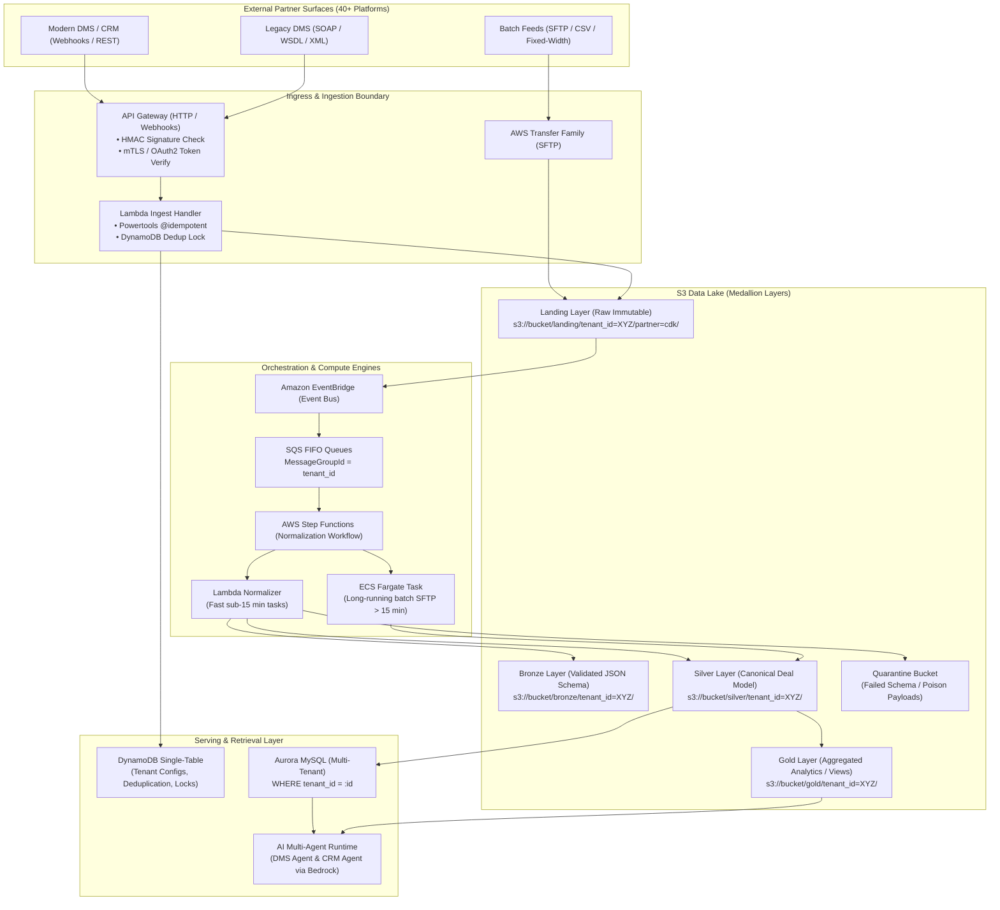

# 02. System Design: Multi-Tenant Automotive Partner Data Platform
**Domain**: Multi-Tenant Automotive SaaS (5,000+ Dealer Groups, 40+ Partner Integrations)  
**Stack**: Native AWS (API Gateway, Lambda, ECS Fargate, EventBridge, Step Functions, DynamoDB, S3 Medallion, Aurora MySQL, Bedrock)

---

## 🏛️ End-to-End Architecture Diagram

---

## ⚖️ Key Architectural Decisions & Trade-Offs

### 1. Compute Sizing: AWS Lambda vs. ECS Fargate
| Workload Type | Choice | Technical Rationale |
| :--- | :--- | :--- |
| **Partner Webhook Intake** | **AWS Lambda** | Event-driven, sub-second execution, zero idle cost, scales instantly with incoming webhook spikes. |
| **REST API Polling** | **AWS Lambda** | Small, periodic pagination tasks triggered via EventBridge cron rules (every 5–15 mins). |
| **Overnight DMS File Ingestion** | **ECS Fargate** | Large partner flat files (100MB+ pipe-delimited DMS dumps) taking 20–45 minutes to parse, process, and reconcile exceed Lambda's 15-minute hard limit. |

### 2. S3 Medallion Layering (Why 4 Layers?)
1. **Landing (Raw)**: Exact replica of the HTTP body or SFTP file with partner headers. **Immutable and read-only**. If normalization logic has bugs or a partner's format silently changes, we can replay data from Landing without re-requesting from the vendor.
2. **Bronze**: Raw records parsed into JSON, validated against structural schema, with ingestion metadata (`tenant_id`, `received_at`, `payload_hash`).
3. **Silver**: Clean, normalized canonical model (e.g., standard `Deal`, `Vehicle`, `Customer`). Deduplicated, normalized fields (VIN formatted, timestamps to UTC, phone numbers to E.164).
4. **Gold**: High-performance read models, daily dealership metrics, and data ready for Bedrock agent retrieval.

### 3. DynamoDB Single-Table Design
* **Partition Key (`PK`)**: `TENANT#<dealer_id>`
* **Sort Key (`SK`)**: 
  - `CONFIG#PARTNER#<partner_id>` (Store partner credentials, polling cursor, rate-limit settings)
  - `IDEMPOTENCY#<event_hash>` (Deduplication lock with 24-hr TTL)
  - `DEAL#<deal_id>` (Fast transactional lookup for dealer workflows)
* **GSI 1**: `GSI1PK = STATUS#<status>`, `GSI1SK = TIMESTAMP#<iso8601>` (for processing queues and dead-letter triage).

### 4. Noisy Neighbor Protection (5,000+ Dealers)
* **The Problem**: A 50-store dealer conglomerate dumps 200,000 inventory updates at 9:00 AM, exhausting Lambda concurrency and choking API quotas for single-store dealerships.
* **The Solution**:
  - Ingestion buffer uses **SQS FIFO Queues** where `MessageGroupId = tenant_id`.
  - Set reserved concurrency on worker Lambdas and token-bucket rate limiters per `tenant_id`.
  - Guarantees fair scheduling across dealer tenants.

### 5. Multi-Tenant Data Isolation Strategy
1. **Storage Isolation**: S3 paths strictly prefix-partitioned (`s3://bucket/layer/tenant_id=<id>/`).
2. **IAM ABAC Enforcement**: IAM roles attach policy conditions matching `${aws:PrincipalTag/TenantId}`.
3. **Query-Level Enforcement**: Relational queries on Aurora MySQL always append parameterized `WHERE tenant_id = :tenant_id`.
4. **Agent Memory Isolation**: Bedrock AgentCore memory spaces are keyed by `tenant_id` and `user_id`. No cross-tenant context bleeding.
