# BRK Interview Preparation Master Plan (`PLAN_AG.MD`)
**Role**: Python Engineer (Data Platform Engineering)  
**Domain**: Multi-Tenant Automotive SaaS Platform (5,000+ Dealer Groups, 40+ Partner Integrations)  
**Candidate**: Nishant Saxena (17+ Years Experience — Python, Cloud Distributed Systems, AWS Serverless, AI Platforms)

---

## 📋 Table of Contents
1. [Target Role & Experience Alignment Matrix](#1-target-role--experience-alignment-matrix)
2. [Core Technical Pillars (The 6 Must-Nail Topics)](#2-core-technical-pillars)
   - [Pillar 1: Third-Party Partner Integrations & Boundary Engineering](#pillar-1-third-party-partner-integrations--boundary-engineering)
   - [Pillar 2: Resilient Event-Driven Ingestion & Idempotency](#pillar-2-resilient-event-driven-ingestion--idempotency)
   - [Pillar 3: AWS S3 Medallion Data Lake & Storage Architecture](#pillar-3-aws-s3-medallion-data-lake--storage-architecture)
   - [Pillar 4: Multi-Tenant Isolation & Integration Security](#pillar-4-multi-tenant-isolation--integration-security)
   - [Pillar 5: Schema Normalization & Contract Testing](#pillar-5-schema-normalization--contract-testing)
   - [Pillar 6: AI-Augmented Engineering & Multi-Agent Architecture](#pillar-6-ai-augmented-engineering--multi-agent-architecture)
3. [STAR Stories Runbook (Real Production Grounding)](#3-star-stories-runbook)
4. [System Design Scenarios (Automotive SaaS Focus)](#4-system-design-scenarios)
5. [5-Day Preparation & Drill Schedule](#5-5-day-preparation--drill-schedule)
6. [High-Probability Q&A Cheat Sheet](#6-high-probability-qa-cheat-sheet)
7. [Smart Questions to Ask the Interviewers](#7-smart-questions-to-ask-the-interviewers)

---

## 1. Target Role & Experience Alignment Matrix

| JD Requirement / Architecture Need | Nishant's Proven Production Experience | Primary STAR Anchor |
| :--- | :--- | :--- |
| **End-to-End Partner Integrations** (40+ DMS/CRM/F&I partners, REST, SOAP, Webhooks, SFTP) | Integrated Softheon (REST), OneSource (GraphQL), NiFi external enterprise feeds, WebMethods/Kafka, and flat-file partner feeds | Centene, Charter, Mind Master |
| **Resilience Under Partner SLA** (Idempotency, backoff, rate limits, replay, dead-lettering) | AWS Lambda Powertools, DynamoDB deduplication locks, SQS DLQs, Step Functions retries, Kafka event re-sequencing | Centene, CapitalOne |
| **Medallion Data Lake on AWS** (Landing -> Bronze -> Silver -> Gold, DynamoDB, S3) | S3 staging/audit buckets, Lambda downstream pipelines, DuckDB high-speed validation, PostgreSQL/Aurora | Centene Recon Engine, KKR |
| **Multi-Tenant Row-Level Isolation** (5,000+ dealer groups, per-tenant configs & auth) | Multi-tenant SaaS portals, tenant-scoped database isolation, RBAC/OAuth2, IAM/Cognito, CloudWatch tenant log groups | Centene, KKR, Cover Letter |
| **Boundary Contract Validation** (JSON Schema, Pydantic, catching breaking changes) | Strict Pydantic models at Kafka/REST ingress, two-phase schema validation (`compare_manager.py`), TDD with pytest | Centene Recon & Kafka pipelines |
| **Partner Technical Ownership** (Spec reviews, sandbox certification, pushing back on bad contracts) | Led cross-team technical alignment between legacy Novasys platform teams, Salesforce migration teams, and third-party vendors | Centene, KKR |
| **AI Tooling & Multi-Agent Systems** (AWS Bedrock, Claude Code, AgentCore, Guardrails) | Production AWS Bedrock data extraction, RAG with Elasticsearch dense vectors, LangChain/LlamaIndex agents, daily Claude/Windsurf user | KKR, Mind Master, Centene |

---

## 2. Core Technical Pillars

### Pillar 1: Third-Party Partner Integrations & Boundary Engineering
* **Context**: Automotive ecosystem is fragmented: DMS (CDK, Reynolds & Reynolds, Tekion, DealerTrack), CRMs, digital retail, F&I providers. Over 40 partners with disparate protocols (REST, SOAP/XML, webhooks, SFTP CSV/JSON).
* **The Engineering Reality**:
  - Partner documentation is often outdated or incomplete.
  - Rate limits change without notice; sandboxes differ from production.
  - Silent schema drift occurs when partners add, rename, or drop fields.
* **Key Talking Points**:
  - *"The integration surface is the product."* If data lands corrupted or delayed, downstream desking tools and AI agents fail.
  - **Pragmatic Partner Relationship**: Get on the call with their integration engineers early, clarify undocumented error codes, verify rate-limit response headers (`Retry-After`, `X-RateLimit-*`), and write contract tests against their sandbox.
  - **SOAP/XML Handling**: Parse WSDLs into structured Pydantic schemas; serialize cleanly; isolate XML parsing exceptions at the boundary.

---

### Pillar 2: Resilient Event-Driven Ingestion & Idempotency
* **Core Pattern**: API Gateway / EventBridge -> Lambda (Powertools) -> DynamoDB Lock -> SQS -> Medallion S3.
* **Idempotency Mechanism**:
  1. Extract idempotent key: Partner Webhook ID (`X-Webhook-ID`), event transaction ID, or SHA-256 hash of `(tenant_id, event_type, entity_id, timestamp)`.
  2. Perform a conditional `PutItem` in DynamoDB:
     ```python
     # Conditional check to ensure item does not already exist
     table.put_item(
         Item={"pk": f"EVENT#{event_id}", "status": "PROCESSING", "ttl": int(time.time()) + 86400},
         ConditionExpression="attribute_not_exists(pk)"
     )
     ```
  3. If duplicate (`ConditionalCheckFailedException`): Return `200 OK` immediately (prevent partner from re-sending in a storm loop).
  4. If new: Write raw payload to S3 Landing, dispatch downstream event, update status to `PROCESSED`.
* **Failure Handling & Replay**:
  - Exponential backoff with jitter on outgoing calls.
  - SQS Dead Letter Queue (DLQ) with CloudWatch alarm for unparseable payloads.
  - Event replay tool: Ability to re-drive events from S3 Landing without re-requesting from partner.

---

### Pillar 3: AWS S3 Medallion Data Lake & Storage Architecture
* **Layering Model**:
  - **Landing Layer** (`s3://data-lake/landing/tenant_id=XYZ/partner=cdk/YYYY/MM/DD/raw_event.json`): Raw, untouched payload exactly as received from partner (with HTTP headers and metadata). Read-only for compliance and replay.
  - **Bronze Layer**: Validated JSON Schema/Pydantic records with added ingestion metadata (`ingested_at`, `payload_hash`, `tenant_id`, `source_system`).
  - **Silver Layer**: Normalized canonical data model (e.g., standard `Deal`, `Customer`, `VehicleInventory` schemas). Deduplicated, enriched, and reconciled.
  - **Gold Layer**: Aggregated business metrics, reporting views, and high-performance read models for agent retrieval (Aurora MySQL / DynamoDB).
* **DynamoDB Single-Table Design**:
  - Partition Key (`PK`): `TENANT#<dealer_id>`
  - Sort Key (`SK`): `PARTNER#<partner_name>#CONFIG` or `DEAL#<deal_id>`
  - GSI1: Indexing across statuses (`STATUS#PENDING`, `STATUS#PROCESSED`) for polling clients.

---

### Pillar 4: Multi-Tenant Isolation & Integration Security
* **Tenant Isolation**:
  - **Storage**: S3 object prefixing (`tenant_id=<id>/`) combined with IAM ABAC (Attribute-Based Access Control) using `${aws:PrincipalTag/TenantId}`.
  - **Database**: Row-level filtering enforced at the query layer (`WHERE tenant_id = :tenant_id`). Zero hardcoded tenant IDs.
  - **Logging**: Tenant ID in structured log context via AWS Lambda Powertools Logger, but PII (names, SSNs, credit info) masked via regex filters before CloudWatch ingestion.
* **Security & Secret Management**:
  - **Webhook Security**: Validate HMAC-SHA256 signatures (`X-Hub-Signature-256`) using partner secret.
  - **Credentials**: Zero credentials in code or environment variables. All OAuth2 client secrets, mTLS certificates, and API keys stored in AWS Secrets Manager with automated KMS rotation.
  - **IAM Least Privilege**: Lambda execution roles scoped strictly to specific S3 prefixes and DynamoDB tables.

---

### Pillar 5: Schema Normalization & Contract Testing
* **Boundary Validation**:
  - Use Pydantic v2 or JSON Schema at the immediate entry point.
  - Distinguish between **breaking changes** (missing required field, changed data type) vs **non-breaking extensions** (new optional fields).
* **Defensive Mapping Strategy**:
  - Never allow an invalid external payload to crash downstream services.
  - Capture validation failures in a quarantine bucket (`s3://data-lake/quarantine/`) with full failure context for rapid triage.
  - Continuous contract tests running daily against partner sandboxes to catch unannounced breaking API shifts before dealers notice.

---

### Pillar 6: AI-Augmented Engineering & Multi-Agent Architecture
* **Using Claude / AI in Daily Workflow**:
  - Ingesting vendor WSDL / OpenAPI specs and generating typed Pydantic models.
  - Writing JSON Schema contracts and test suites with edge-case variations.
  - Diffing partner API spec v1 vs v2 to highlight subtle breaking changes in seconds.
  - Rapidly debugging CloudWatch structured logs during integration failures.
* **Multi-Agent Architecture (A2Z / BRK Phase 1 Scope)**:
  - **Strands Scaffolding & AgentCore Runtime**: Standardized agent interface.
  - **Orchestration**: Intent discovery router dispatching between specialized agents (e.g., **DMS Agent** for inventory/deals and **CRM Agent** for customer records).
  - **Bedrock Guardrails**: Strict policy enforcement for PII masking, cross-tenant boundary protection, and out-of-scope refusal.
  - **AgentCore Memory**: Namespaced by `tenant_id` and `user_id` so dealership memories never cross boundaries.
  - **Observability**: OpenTelemetry tracing every agent invocation into CloudWatch, tracking latency, token usage, cost per answer, and record-level data lineage.

---

## 3. STAR Stories Runbook

### 🌟 Story 1: Centene Salesforce Data Reconciliation Engine (`cent_poc`)
* **Context**: Migration from legacy Novasys Django portal to Salesforce across 20M+ member plans. 100K+ policy records had to be verified across complex relational databases without causing out-of-memory (OOM) crashes.
* **Task**: Design and implement a high-speed, memory-safe data reconciliation engine in Python.
* **Action**:
  - Engineered a two-phase chunking execution engine (`compare_manager.py`) streaming data in chunks of 10,000 records.
  - Implemented dynamic schema normalization in `configuration.py` (stripping `.0` decimal artifacts, standardizing date strings, handling null variations).
  - Minimized database overhead by batching DB queries to a single indexed lookup per chunk and flushing memory immediately after exporting JSON audit artifacts to S3.
  - Built zero-dependency HTML5/JS analytics dashboards allowing business analysts to isolate discrepancies by policy ranges (`start_policy` to `end_policy`).
* **Result**: Zero OOM errors, 100% memory safety, high-throughput verification, and immediate executive visibility into migration discrepancies.

---

### 🌟 Story 2: Centene Kafka Event Re-Sequencing & Commission Integrity
* **Context**: Legacy Django platform with Kafka consumer pipelines was receiving out-of-order policy change and renewal events due to network latency and partition rebalancing.
* **Task**: Stop incorrect enrollment span recalculations that were creating erroneous broker commission payouts and monetary leakage.
* **Action**:
  - Built Python asyncio event consumers with strict Pydantic model validation.
  - Implemented an event re-sequencing and buffering layer that validated event timestamps and sequence numbers before committing state changes.
  - Recomputed enrollment spans idempotently against PostgreSQL historical timelines.
* **Result**: Eliminated false commission payouts and protected millions of dollars in at-risk broker commission records during platform transition.

---

### 🌟 Story 3: Centene Policy Simulation & Dry-Run Deployment Guard
* **Context**: High technical debt in legacy code (logic in stored procedures and database triggers). Any deployment risked silently breaking policy calculations for live brokers.
* **Task**: Provide a bulletproof mechanism to de-risk releases before promoting code to production.
* **Action**:
  - Built a parallel dry-run simulation engine capable of running code changes against 100,000+ live policy records in a staging sandbox.
  - Compared output calculations against baseline production outputs to flag unintended delta variations.
* **Result**: Stopped hundreds of incorrect policy corrections per deployment, giving both engineering and leadership confidence to ship updates safely.

---

### 🌟 Story 4: CapitalOne Step Functions & Lambda Transaction Orchestration
* **Context**: Microservice ecosystem managing high-volume client transactions required consistent state transitions and failure recovery.
* **Task**: Build resilient serverless transaction orchestration with end-to-end auditability.
* **Action**:
  - Designed AWS Step Functions workflows coordinating Python Lambda handlers with exponential backoff and retry rules.
  - Used DynamoDB for transaction state locking and lifecycle metadata tracking.
  - Leveraged LocalStack and pytest for offline integration testing of Step Functions, Lambdas, and DynamoDB.
* **Result**: Achieved highly resilient transaction processing with automated retries and zero lost transaction states.

---

### 🌟 Story 5: KKR AWS Bedrock & Vector Search Anomaly Engine
* **Context**: LP investor reporting platform where unstructured financial reports, spreadsheets, and partner filings contained subtle valuation discrepancies.
* **Task**: Automate data extraction and anomaly detection across complex financial documents.
* **Action**:
  - Implemented AWS Bedrock pipelines to parse unstructured documents into canonical JSON schemas.
  - Built a semantic search and RAG service over Elasticsearch dense vectors to compare valuation figures against historic baseline filings.
* **Result**: Replaced error-prone manual Excel verification with automated anomaly detection, catching reporting discrepancies before publication to investors.

---

### 🌟 Story 6: The "Partner Integration Ownership" Story (Handling Bad Specs & Sandbox Outages)
* **Context**: External partner API documentation claimed an endpoint accepted JSON webhooks with specific payload fields; in practice, the sandbox intermittently sent empty payloads, undocumented error codes, and strict undisclosed rate limits.
* **Task**: Unblock the integration, guarantee data accuracy, and prevent production breakage.
* **Action**:
  - Captured raw HTTP payloads and response headers; documented exact mismatches between spec and live traffic.
  - Scheduled a direct technical call with the partner's engineering lead; calmly presented payload traces and negotiated an agreed contract update.
  - Implemented defensive JSON Schema validation with a quarantine S3 path and added client-side rate throttling with jitter.
* **Result**: Certified the integration ahead of schedule and established a reusable partner onboarding runbook adopted across the team.

---

## 4. System Design Scenarios

### Scenario A: Multi-Tenant Automotive Partner Ingestion Pipeline
```
[Partner: CDK / Reynolds / Tekion]
        | (REST / Webhook / SFTP)
        v
[API Gateway / SFTP Transfer Family]
        |
        v
[AWS Lambda: Webhook Receiver]
   ├── HMAC Signature Check
   ├── DynamoDB Deduplication Lock (Conditional PutItem)
   └── Write to S3 Landing Bucket (Raw JSON / XML)
        |
        v
[EventBridge]
        |
        v
[AWS Step Functions: Ingestion & Normalization]
   ├── Step 1: Lambda JSON Schema / Pydantic Boundary Validation
   │           └── [Invalid] -> S3 Quarantine + CloudWatch Alarm
   ├── Step 2: Schema Normalization (Map Partner -> Canonical Deal Model)
   ├── Step 3: Write to S3 Bronze / Silver Layers
   └── Step 4: Publish Normalized Event -> SQS / EventBridge
        |
        v
[Downstream Consumers: Aurora MySQL / Bedrock AI Agents / Dealer Desking]
```

### Key Architectural Decisions to Defend:
1. **Why S3 Landing first before processing?**  
   *Raw immutability.* If normalization logic has a bug or the partner schema drifts, you can re-run the pipeline from raw S3 files without asking the partner to replay events.
2. **Why DynamoDB for deduplication instead of relational DB?**  
   Single-digit millisecond latency, atomic conditional operations (`attribute_not_exists`), and native TTL for automatic record expiration after 24–48 hours.
3. **How is multi-tenancy enforced?**  
   Every event carries `tenant_id`. S3 objects are stored under `tenant_id=<id>/`. Aurora queries use parameterized `WHERE tenant_id = :id`. Bedrock agent memory is namespaced by `tenant_id`.

---

## 5. 5-Day Preparation & Drill Schedule

```mermaid
gantt
    title 5-Day Interview Preparation Roadmap
    dateFormat  X
    axisFormat Day %d
    section Alignment
    Day 1: Pitch & Story Articulation        :active, 1, 2
    section Technical
    Day 2: System Design & AWS Serverless    : 2, 3
    Day 3: Python Deep-Dive & Contracts      : 3, 4
    section Behavioral & Scenarios
    Day 4: Partner Engineering Scenarios     : 4, 5
    Day 5: Mock Interviews & Final Polish   : 5, 6
```



### Day 1: Narrative & Story Mastery
- [ ] Practice 2-minute elevator pitch focusing on senior data platform engineering, partner integrations, and resilience under scale.
- [ ] Rehearse **Story 1 (`cent_poc`)** and **Story 2 (Kafka re-sequencing)** aloud using the STAR method.
- [ ] Review `resume/cover_letter_devin.txt` to ensure alignment across all shared talking points.

### Day 2: System Design & AWS Architecture Drills
- [ ] Diagram the end-to-end partner ingestion pipeline on a whiteboard or paper.
- [ ] Master the DynamoDB single-table pattern and conditional write syntax.
- [ ] Review S3 Medallion architecture: Landing (raw), Bronze (validated), Silver (canonical), Gold (aggregated/views).
- [ ] Practice explaining how to isolate tenant data using S3 prefixing and IAM ABAC.

### Day 3: Modern Python & Boundary Contracts
- [ ] Review Pydantic v2 core features (`model_validator`, `field_validator`, discriminated unions, strict mode).
- [ ] Review AWS Lambda Powertools for Python (`@logger.inject_lambda_context`, `@tracer.capture_lambda_handler`, `@idempotent`).
- [ ] Review Python `asyncio`, generator streaming for large files (Pandas/DuckDB chunking).
- [ ] Drill error handling: distinguishing between transient errors (503, 429 -> retry) and permanent errors (400, 422 -> quarantine).

### Day 4: Partner Engineering & Tough Scenarios
- [ ] Rehearse answers for: "A partner's API changes silently at 2 AM and breaks 500 dealers. Walk me through your triage."
- [ ] Rehearse: "How do you handle a partner whose sandbox is down or whose engineers are unresponsive?"
- [ ] Rehearse: "Explain how you use Claude / AI tools to accelerate integration delivery without creating unmaintainable code."
- [ ] Review Multi-Agent concepts from `jd/about.txt`: AgentCore Runtime, DMS/CRM agents, Bedrock Guardrails, OpenTelemetry lineage.

### Day 5: Mock Interview & Strategic Q&A
- [ ] Conduct a full 60-minute mock technical interview covering both architecture and behavioral questions.
- [ ] Refine the list of 5 high-impact questions to ask the interviewer.
- [ ] Rest, hydrate, and maintain calm confidence.

---

## 6. High-Probability Q&A Cheat Sheet

#### Q1: "How do you handle a third-party partner who has strict, unpredictable rate limits?"
> **Answer**:  
> "I implement a three-layer defense:  
> 1. **Client-side rate throttling**: Use Token Bucket or Leaky Bucket algorithms via Redis or DynamoDB to pace requests below the known threshold.  
> 2. **Adaptive backoff**: When receiving HTTP 429, honor the `Retry-After` header if present; otherwise, apply exponential backoff with full jitter to avoid the thundering herd problem.  
> 3. **Queue buffering**: Decouple partner calls via SQS with controlled concurrency on consumer Lambdas, ensuring burst traffic is smoothed out over time."

#### Q2: "How do you ensure data integrity when mapping 40+ different DMS schemas into a single canonical model?"
> **Answer**:  
> "We treat external boundaries with zero trust.  
> 1. Ingest raw payloads to S3 Landing untouched for immutability and replay.  
> 2. Validate at the boundary using strict Pydantic v2 / JSON Schema models. Valid data moves to Bronze; malformed data is quarantined with full error telemetry.  
> 3. Use modular, test-driven adapter mappings per partner that translate raw partner schemas into our internal canonical `Deal` or `Inventory` entity.  
> 4. Run automated daily contract tests against partner sandboxes to detect silent schema drift before it hits production."

#### Q3: "How do you guarantee idempotency in an at-least-once AWS serverless pipeline?"
> **Answer**:  
> "I use a DynamoDB-backed idempotency lock pattern:  
> 1. Derive an idempotency key from a unique event identifier or a SHA-256 hash of the core business attributes.  
> 2. Execute a conditional `PutItem` with `attribute_not_exists(pk)` and a TTL of 24 to 48 hours.  
> 3. If the write succeeds, process the event and update the status to `PROCESSED`.  
> 4. If `ConditionalCheckFailedException` is raised, acknowledge with `200 OK` and skip processing, preventing duplicate side-effects."

#### Q4: "How do you enforce multi-tenant isolation across 5,000+ dealerships?"
> **Answer**:  
> "Isolation is enforced at storage, application, and observability levels:  
> - **Storage**: S3 objects are strictly partitioned by `tenant_id` prefixes; DynamoDB items use `TENANT#<id>` composite keys; SQL queries enforce `WHERE tenant_id = :id`.  
> - **Runtime & Agent**: Auth0 OAuth2 tokens inject `tenant_id` into the execution context; Bedrock AgentCore Memory is isolated by tenant namespace to prevent cross-dealer prompt leakage.  
> - **Observability**: Tenant ID is injected into structured CloudWatch logs and OpenTelemetry spans, while all PII is scrubbed before emission."

---

## 7. Smart Questions to Ask the Interviewers

1. *"With over 40 partner integrations across legacy DMS and modern CRMs, what proportion of integration issues in production stem from silent partner schema drift versus authentication/rate-limit failures?"*
2. *"How does the team currently manage partner sandbox differences — where a partner's sandbox passes certification but their production endpoint behaves differently?"*
3. *"In the Phase 1 multi-agent architecture with DMS and CRM agents, what has been the biggest challenge in managing intent discovery and state handoff between agents?"*
4. *"When an onboarding backlog builds up for new dealer groups, where is the primary bottleneck today — partner responsiveness, data normalization edge cases, or deployment certification?"*
5. *"What does success look like for this engineer in their first 90 days — is it completing a specific partner certification, refactoring a legacy pipeline, or establishing the contract testing standard?"*

---

*Document prepared for Nishant Saxena — BRK Data Platform Engineering Interview.*
