# Chapter 02 — Amazon S3 (Simple Storage Service)

---

## Prerequisite Chapters
- Chapter 01 — AWS IAM (users, roles, policies, bucket policies)

## Used In Production Practicals
- Practical 01 — Static Website on S3
- Practical 02 — S3 + CloudFront CDN
- Practical 05 — Backup (EC2/RDS/EFS)
- Practical 15 — Flagship Production Architecture
- Practical 31 — CodeBuild CI (artifact storage)
- Practical 37 — AWS Backup + DR

---

## 1. Learning Objectives

By the end of this chapter, you will be able to:

1. **Explain** S3 storage classes, durability vs availability, and when to use each.
2. **Create** buckets with proper configuration (encryption, versioning, public access block).
3. **Write** S3 bucket policies and understand how they interact with IAM policies.
4. **Configure** lifecycle rules, versioning, and replication for cost and DR.
5. **Host** a static website on S3 and integrate with CloudFront.
6. **Implement** event notifications to trigger Lambda, SQS, or SNS.
7. **Troubleshoot** access denied errors, replication failures, and cost spikes.
8. **Answer** interview questions about S3 in production environments.

---

## 2. What is Amazon S3?

Amazon S3 is an **object storage** service offering virtually unlimited storage at high durability (99.999999999% — 11 nines). It stores data as objects in buckets.

### Key Characteristics
- **Object storage** — stores files (objects) in flat namespaces (buckets), not a file system
- **Virtually unlimited** — no maximum bucket size, objects up to 5 TB each
- **11 nines durability** — designed to sustain loss of 2 facilities simultaneously
- **HTTP/HTTPS access** — REST API, not a mounted volume
- **Pay for what you use** — per GB stored + per request + data transfer

### S3 Terminology

| Term | Definition | Example |
|------|-----------|---------|
| **Bucket** | Container for objects (globally unique name) | `my-company-prod-data` |
| **Object** | A file + metadata stored in a bucket | `uploads/photo.jpg` (max 5 TB) |
| **Key** | The full path/name of an object in a bucket | `logs/2026/09/18/access.log` |
| **Prefix** | Simulated "folder" path (S3 has no real folders) | `logs/2026/09/` |
| **Object Metadata** | Key-value pairs about the object | Content-Type, Cache-Control |
| **Version ID** | Unique ID per object version (when versioning enabled) | `abc123def456` |

### S3 is NOT a File System
```
File System (EBS/EFS):           Object Storage (S3):
/home/user/photo.jpg             s3://bucket/home/user/photo.jpg
├── Directories are real         ├── "Directories" are just key prefixes
├── Can be mounted               ├── HTTP API access only
├── Random read/write            ├── Whole-object read/write
├── Low latency (ms)             ├── Higher latency (API calls)
└── Limited size                 └── Unlimited size
```

---

## 3. Why Do We Need It?

### Without S3
```
Store files on EC2 EBS volumes:
  - Limited to one instance
  - Manual backup management
  - Fixed size (pay for provisioned, not used)
  - Instance failure = data at risk
  - Can't serve files directly via HTTP
```

### With S3
```
Store files in S3:
  - Accessible from anywhere (API/HTTP)
  - 11 nines durability (automatic)
  - Unlimited size (grows dynamically)
  - Built-in versioning, encryption, lifecycle
  - Can serve static websites directly
  - Integrates with every AWS service
  - Pay only for what you store
```

---

## 4. Real-World Production Use Cases

### 1. Static Website Hosting
Host a React/Angular SPA on S3 + CloudFront. No servers to manage. Cost: pennies per month.

### 2. Application Data Lake
Store raw data (JSON, CSV, Parquet) in S3. Query directly with Athena. Process with EMR/Glue. Train ML models with SageMaker.

### 3. Backup and Archive
Nightly RDS snapshots exported to S3. EC2 AMIs stored in S3. Move to Glacier after 90 days for compliance retention.

### 4. CI/CD Artifact Storage
CodeBuild outputs build artifacts to S3. CodeDeploy pulls deployment packages from S3. Container images layers stored in S3 (via ECR).

### 5. Log Storage
CloudTrail logs, VPC Flow Logs, ALB access logs, CloudFront logs — all stored in S3. Query with Athena for analysis.

### 6. Media Storage
User-uploaded images, videos, documents stored in S3. Served via CloudFront CDN for global low-latency delivery.

---

## 5. Core Concepts

### Storage Classes

| Class | Durability | Availability | Min Duration | Use Case | Cost (per GB/mo) |
|-------|-----------|-------------|-------------|----------|-----------------|
| **S3 Standard** | 11 nines | 99.99% | None | Frequently accessed data | ~$0.023 |
| **S3 Standard-IA** | 11 nines | 99.9% | 30 days | Infrequent access (>30 days) | ~$0.0125 |
| **S3 One Zone-IA** | 11 nines (single AZ) | 99.5% | 30 days | Non-critical infrequent | ~$0.01 |
| **S3 Intelligent-Tiering** | 11 nines | 99.9% | None | Unknown access patterns | ~$0.023 + monitoring fee |
| **S3 Glacier Instant Retrieval** | 11 nines | 99.9% | 90 days | Archive with instant access | ~$0.004 |
| **S3 Glacier Flexible Retrieval** | 11 nines | 99.99%* | 90 days | Archive (minutes to hours) | ~$0.0036 |
| **S3 Glacier Deep Archive** | 11 nines | 99.99%* | 180 days | Long-term archive (12+ hrs) | ~$0.00099 |

### Durability vs Availability
```
Durability = will my data survive? (99.999999999% = 11 nines)
  → Lose 1 object out of 10 billion objects over 10,000 years
  
Availability = can I access my data right now? (99.99% = 52 min downtime/year)
  → S3 might be briefly unavailable during maintenance
  
Key Point: S3 data almost never disappears, but may be temporarily inaccessible
```

### Versioning
```
Without Versioning:
  PUT photo.jpg → stored
  PUT photo.jpg → OVERWRITES original (old version lost)
  DELETE photo.jpg → permanently gone

With Versioning:
  PUT photo.jpg → Version 1 (stored)
  PUT photo.jpg → Version 2 (stored, Version 1 kept)
  DELETE photo.jpg → Delete Marker added (both versions preserved)
  
  Restore: Remove delete marker or GET specific version
```

### Encryption

| Type | Key Management | Use Case |
|------|---------------|----------|
| **SSE-S3** | AWS manages keys | Default, simplest |
| **SSE-KMS** | You manage keys via KMS | Audit key usage, fine-grained control |
| **SSE-C** | You provide keys per request | Customer requirement |
| **Client-Side** | You encrypt before upload | Highest security |

### S3 Access Control (3 Layers)

```
Layer 1: Block Public Access (Account/Bucket level)
  → Master switch: ON = no public access regardless of policies
  
Layer 2: Bucket Policy (Resource-based)
  → JSON policy attached to bucket (who can access this bucket?)
  
Layer 3: IAM Policies (Identity-based)
  → JSON policy attached to user/role (what can this identity do?)
  
Access = Block Public Access allows + Bucket Policy allows + IAM allows
         (ALL must agree for cross-account; ONE sufficient for same account)
```

### Bucket Naming Rules
```
- Globally unique across ALL AWS accounts
- 3-63 characters
- Lowercase letters, numbers, hyphens
- Must start with letter or number
- No periods in names (breaks SSL)
- Cannot look like an IP address

Good: my-company-prod-data-2026
Bad:  my.Company.Data (uppercase, periods)
Bad:  192.168.1.1 (looks like IP)
```

---

## 6. Architecture

### S3 in Production Architecture

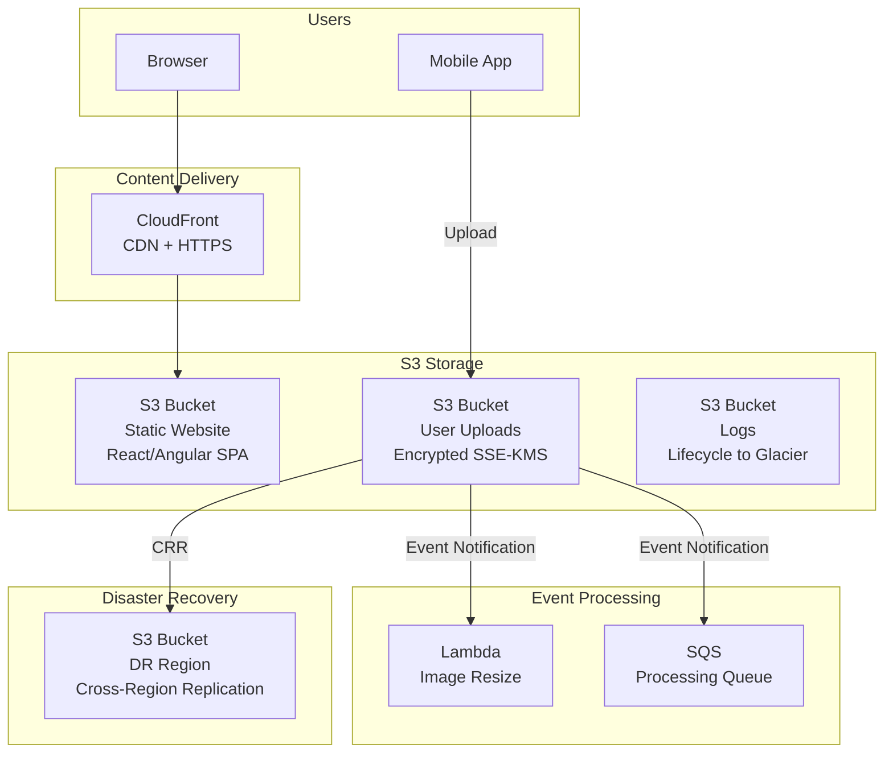

### Data Flow: Static Website
```
1. Developer builds React app → npm run build
2. Upload build/ folder to S3 bucket (static website hosting enabled)
3. CloudFront distribution points to S3 as origin
4. Route 53 maps domain to CloudFront
5. User requests example.com → Route 53 → CloudFront → S3
6. CloudFront caches files at edge locations globally
7. Result: fast, scalable, serverless website for ~$1/month
```

---

## 7. Important Components

### 1. Bucket Policy Example (Production)
```json
{
    "Version": "2012-10-17",
    "Statement": [
        {
            "Sid": "AllowCloudFrontAccess",
            "Effect": "Allow",
            "Principal": {
                "Service": "cloudfront.amazonaws.com"
            },
            "Action": "s3:GetObject",
            "Resource": "arn:aws:s3:::my-website-bucket/*",
            "Condition": {
                "StringEquals": {
                    "AWS:SourceArn": "arn:aws:cloudfront::123456789012:distribution/E1EXAMPLE"
                }
            }
        },
        {
            "Sid": "DenyUnencryptedUploads",
            "Effect": "Deny",
            "Principal": "*",
            "Action": "s3:PutObject",
            "Resource": "arn:aws:s3:::my-data-bucket/*",
            "Condition": {
                "StringNotEquals": {
                    "s3:x-amz-server-side-encryption": "aws:kms"
                }
            }
        },
        {
            "Sid": "EnforceHTTPS",
            "Effect": "Deny",
            "Principal": "*",
            "Action": "s3:*",
            "Resource": [
                "arn:aws:s3:::my-data-bucket",
                "arn:aws:s3:::my-data-bucket/*"
            ],
            "Condition": {
                "Bool": {
                    "aws:SecureTransport": "false"
                }
            }
        }
    ]
}
```

### 2. Lifecycle Rules
```
Rule 1: Transition current objects
  After 30 days → S3 Standard-IA (50% cheaper)
  After 90 days → S3 Glacier Instant Retrieval (85% cheaper)
  After 365 days → S3 Glacier Deep Archive (95% cheaper)
  
Rule 2: Delete non-current versions
  After 30 days → Delete non-current versions (versioning cleanup)
  
Rule 3: Clean up incomplete multipart uploads
  After 7 days → Abort incomplete multipart uploads
```

### 3. Event Notifications
```
S3 Events → Trigger:
  s3:ObjectCreated:*     → Lambda (resize image)
  s3:ObjectRemoved:*     → SQS (audit log)
  s3:Replication:*       → SNS (alert on replication failure)

Configuration:
  Bucket → Event notification → Lambda function ARN
  (Lambda must have resource-based policy allowing S3 invocation)
```

### 4. Presigned URLs
```
Allow temporary access to private objects without making them public:

Upload: Generate presigned PUT URL → give to frontend → frontend uploads directly to S3
Download: Generate presigned GET URL → give to user → user downloads directly from S3

Security: URL expires after configured time (default 1 hour, max 7 days)
```

### 5. S3 Transfer Acceleration
```
Normal upload: Client → (internet) → S3 endpoint (ap-south-1)
Transfer Acceleration: Client → nearest CloudFront edge → (AWS backbone) → S3

Use when: Uploading from distant locations (e.g., US user uploading to Mumbai bucket)
Endpoint: bucket-name.s3-accelerate.amazonaws.com
```

---

## 8. How It Works

### Object Upload Flow
```
1. Client calls PUT object API → HTTPS to S3 endpoint
2. S3 authenticates (SigV4) and authorizes (IAM + bucket policy)
3. S3 stores object across minimum 3 AZs (Standard class)
4. S3 returns 200 OK with ETag (MD5 hash)
5. Object is strongly consistent (read-after-write)
```

### Multipart Upload (for large files)
```
Files > 100 MB → use multipart upload

1. Initiate multipart upload → get Upload ID
2. Split file into parts (5 MB - 5 GB each)
3. Upload parts in parallel (faster)
4. Complete multipart upload → S3 assembles parts
5. If upload fails, abort → incomplete parts cleaned up

Max object size: 5 TB
Max parts: 10,000
```

### Strong Consistency (since Dec 2020)
```
S3 is now strongly consistent for all operations:
  - PUT new object → immediately readable
  - PUT overwrite → immediately returns new version
  - DELETE → immediately reflects deletion
  - LIST → immediately shows changes

No more "read-after-write" eventual consistency issues!
```

---

## 9. AWS Console Walkthrough

### Step 1 — Create a Bucket
1. Navigate to **S3 Console** → **Create bucket**
2. Configure:
   - **Name**: `my-company-prod-data` (globally unique)
   - **Region**: ap-south-1
   - **Block Public Access**: ✅ All blocked (default)
   - **Versioning**: ✅ Enable
   - **Encryption**: SSE-S3 or SSE-KMS
   - **Tags**: Environment=production, Owner=platform-team
3. Click **Create bucket**

### Step 2 — Upload Objects
1. Open your bucket → **Upload**
2. Drag and drop files
3. Set storage class (Standard)
4. Set encryption (SSE-KMS if required)
5. Click **Upload**

### Step 3 — Enable Static Website
1. Open bucket → **Properties** → **Static website hosting**
2. Enable → Index document: `index.html`, Error document: `error.html`
3. **Permissions** → Unblock public access (for public website only)
4. Add bucket policy allowing public read:
   ```json
   {
       "Version": "2012-10-17",
       "Statement": [{
           "Sid": "PublicRead",
           "Effect": "Allow",
           "Principal": "*",
           "Action": "s3:GetObject",
           "Resource": "arn:aws:s3:::my-website-bucket/*"
       }]
   }
   ```

---

## 10. AWS CLI Commands

### Bucket Operations
```bash
# Create bucket
aws s3 mb s3://my-company-prod-data --region ap-south-1

# List buckets
aws s3 ls

# Delete bucket (must be empty)
aws s3 rb s3://my-company-prod-data

# Delete bucket with all contents
aws s3 rb s3://my-company-prod-data --force
```

### Object Operations
```bash
# Upload file
aws s3 cp myfile.txt s3://my-bucket/

# Upload directory
aws s3 sync ./build/ s3://my-website-bucket/ --delete

# Download file
aws s3 cp s3://my-bucket/myfile.txt ./

# List objects
aws s3 ls s3://my-bucket/ --recursive --human-readable

# Delete object
aws s3 rm s3://my-bucket/myfile.txt

# Move object
aws s3 mv s3://my-bucket/old-key.txt s3://my-bucket/new-key.txt

# Copy between buckets
aws s3 cp s3://source-bucket/file.txt s3://dest-bucket/file.txt
```

### Bucket Configuration
```bash
# Enable versioning
aws s3api put-bucket-versioning \
    --bucket my-bucket \
    --versioning-configuration Status=Enabled

# Set default encryption (SSE-KMS)
aws s3api put-bucket-encryption \
    --bucket my-bucket \
    --server-side-encryption-configuration '{
        "Rules": [{
            "ApplyServerSideEncryptionByDefault": {
                "SSEAlgorithm": "aws:kms",
                "KMSMasterKeyID": "alias/aws/s3"
            },
            "BucketKeyEnabled": true
        }]
    }'

# Block all public access
aws s3api put-public-access-block \
    --bucket my-bucket \
    --public-access-block-configuration \
        BlockPublicAcls=true,IgnorePublicAcls=true,BlockPublicPolicy=true,RestrictPublicBuckets=true

# Set lifecycle rule
aws s3api put-bucket-lifecycle-configuration \
    --bucket my-bucket \
    --lifecycle-configuration '{
        "Rules": [{
            "ID": "transition-to-ia-and-glacier",
            "Status": "Enabled",
            "Filter": {"Prefix": "logs/"},
            "Transitions": [
                {"Days": 30, "StorageClass": "STANDARD_IA"},
                {"Days": 90, "StorageClass": "GLACIER"},
                {"Days": 365, "StorageClass": "DEEP_ARCHIVE"}
            ],
            "NoncurrentVersionExpiration": {"NoncurrentDays": 30},
            "AbortIncompleteMultipartUpload": {"DaysAfterInitiation": 7}
        }]
    }'
```

### Presigned URLs
```bash
# Generate presigned download URL (1 hour expiry)
aws s3 presign s3://my-bucket/private-file.pdf --expires-in 3600

# Generate presigned upload URL
aws s3 presign s3://my-bucket/uploads/new-file.pdf \
    --expires-in 3600
```

### Cross-Region Replication
```bash
# Enable replication
aws s3api put-bucket-replication \
    --bucket source-bucket \
    --replication-configuration '{
        "Role": "arn:aws:iam::123456789012:role/S3ReplicationRole",
        "Rules": [{
            "ID": "repl-to-dr",
            "Status": "Enabled",
            "Filter": {"Prefix": ""},
            "Destination": {
                "Bucket": "arn:aws:s3:::dr-bucket",
                "StorageClass": "STANDARD_IA",
                "EncryptionConfiguration": {
                    "ReplicaKmsKeyID": "arn:aws:kms:us-west-2:123:key/mrk-abc"
                }
            },
            "DeleteMarkerReplication": {"Status": "Enabled"}
        }]
    }'
```

---

## 11. Hands-On Practical

### Practical: Production S3 Setup with Lifecycle and Replication

#### Objective
Create a production S3 bucket with versioning, encryption, lifecycle rules, event notifications, and cross-region replication.

#### Architecture
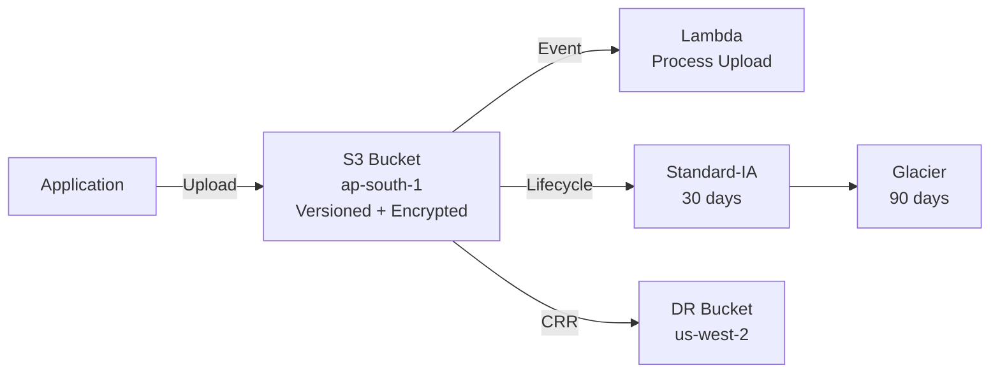

#### Step 1 — Create Production Bucket
```bash
# Create bucket with versioning and encryption
aws s3 mb s3://prod-app-data-$(date +%s)
BUCKET="prod-app-data-$(date +%s)"

aws s3api put-bucket-versioning --bucket $BUCKET \
    --versioning-configuration Status=Enabled

aws s3api put-bucket-encryption --bucket $BUCKET \
    --server-side-encryption-configuration '{
        "Rules": [{"ApplyServerSideEncryptionByDefault": {"SSEAlgorithm": "aws:kms"}, "BucketKeyEnabled": true}]
    }'

aws s3api put-public-access-block --bucket $BUCKET \
    --public-access-block-configuration \
        BlockPublicAcls=true,IgnorePublicAcls=true,BlockPublicPolicy=true,RestrictPublicBuckets=true
```

#### Step 2 — Add Lifecycle Rules
```bash
aws s3api put-bucket-lifecycle-configuration --bucket $BUCKET \
    --lifecycle-configuration '{
        "Rules": [{
            "ID": "production-lifecycle",
            "Status": "Enabled",
            "Filter": {},
            "Transitions": [
                {"Days": 30, "StorageClass": "STANDARD_IA"},
                {"Days": 90, "StorageClass": "GLACIER"}
            ],
            "NoncurrentVersionExpiration": {"NoncurrentDays": 30},
            "AbortIncompleteMultipartUpload": {"DaysAfterInitiation": 7}
        }]
    }'
```

#### Step 3 — Test Upload and Versioning
```bash
# Upload file
echo "Version 1" > test.txt
aws s3 cp test.txt s3://$BUCKET/

# Overwrite (creates version 2)
echo "Version 2" > test.txt
aws s3 cp test.txt s3://$BUCKET/

# List versions
aws s3api list-object-versions --bucket $BUCKET --prefix test.txt

# Download specific version
aws s3api get-object --bucket $BUCKET --key test.txt \
    --version-id "VERSION_ID_HERE" old-version.txt
```

#### Validation
- Verify versioning shows two versions of test.txt
- Verify encryption is applied (check object metadata)
- Verify public access is blocked
- Verify lifecycle configuration is set

---

## 12. Production Architecture

### Production S3 Configuration
```
Bucket Configuration:
  - Versioning: Enabled
  - Encryption: SSE-KMS (customer managed key)
  - Bucket Key: Enabled (reduces KMS costs)
  - Block Public Access: All enabled
  - Logging: Server access logging to log bucket
  - Object Lock: Enabled for compliance data (optional)

Lifecycle:
  - Standard → IA after 30 days
  - IA → Glacier after 90 days
  - Glacier → Deep Archive after 365 days
  - Delete non-current versions after 30 days
  - Abort incomplete multipart after 7 days

Replication:
  - Cross-Region Replication (CRR) to DR region
  - Same-Region Replication (SRR) to log archive account

Monitoring:
  - S3 Storage Lens for fleet-wide visibility
  - CloudWatch request metrics enabled
  - CloudTrail data events for object-level logging
```

---

## 13. Security Best Practices

1. **Block public access** — enable at account AND bucket level
2. **Enable default encryption** — SSE-KMS for production
3. **Enable versioning** — protect against accidental deletion/overwrite
4. **Use bucket policies to enforce encryption** — deny unencrypted uploads
5. **Enforce HTTPS** — deny `aws:SecureTransport: false`
6. **Enable server access logging** — audit who accessed what
7. **Enable CloudTrail S3 data events** — object-level audit trail
8. **Use VPC endpoints** — access S3 without internet (PrivateLink/Gateway)
9. **Presigned URLs** — temporary access instead of making objects public
10. **Object Lock** — WORM (Write Once Read Many) for compliance
11. **Cross-account access** — use bucket policies with specific account ARNs
12. **MFA Delete** — require MFA to delete versioned objects

---

## 14. High Availability

- **Multi-AZ by design** — S3 Standard stores data across minimum 3 AZs
- **99.99% availability** — S3 Standard SLA
- **11 nines durability** — designed to never lose data
- **Strong consistency** — all operations are immediately consistent
- **No capacity planning** — S3 scales automatically

---

## 15. Scalability

- **Unlimited storage** — no maximum bucket size
- **Unlimited objects** — no limit on number of objects
- **3,500 PUT/sec** and **5,500 GET/sec** per prefix (partition automatically)
- **Multipart upload** — parallel uploads for large files
- **S3 Transfer Acceleration** — faster uploads from distant locations

---

## 16. Monitoring & Observability

### Key CloudWatch Metrics
| Metric | Description | Alert When |
|--------|-------------|-----------|
| `BucketSizeBytes` | Total storage used | Unexpected growth |
| `NumberOfObjects` | Total objects in bucket | Unexpected growth |
| `AllRequests` | Total API requests | Spike (potential attack) |
| `4xxErrors` | Client error rate | > normal baseline |
| `5xxErrors` | Server error rate | Any 5xx errors |
| `FirstByteLatency` | Time to first byte | > 200ms |

### S3 Storage Lens
```bash
# Create S3 Storage Lens dashboard
aws s3control put-storage-lens-configuration \
    --account-id $ACCOUNT_ID \
    --config-id org-storage-lens \
    --storage-lens-configuration '{
        "Id": "org-storage-lens",
        "IsEnabled": true,
        "AccountLevel": {
            "BucketLevel": {
                "ActivityMetrics": {"IsEnabled": true},
                "DetailedStatusCodesMetrics": {"IsEnabled": true}
            }
        }
    }'
```

---

## 17. Cost Optimization

### S3 Cost Components
```
Storage:         $0.023/GB-month (Standard)
PUT requests:    $0.005 per 1,000
GET requests:    $0.0004 per 1,000
Data transfer:   $0.09/GB (out to internet, first 10TB)
                 $0.00/GB (in from internet — FREE)
                 $0.00/GB (to CloudFront — FREE)
```

### Top Cost Optimization Strategies
1. **Lifecycle rules** — transition to cheaper classes automatically (save 50-95%)
2. **S3 Intelligent-Tiering** — automatic class management for unknown patterns
3. **Delete old versions** — lifecycle rule to expire non-current versions
4. **Abort incomplete uploads** — lifecycle rule to clean up after 7 days
5. **Use S3 One Zone-IA** — 20% cheaper for non-critical data
6. **Bucket Key** — reduce KMS API costs by up to 99%
7. **CloudFront** — cache popular objects, reduce S3 GET requests
8. **S3 Storage Lens** — identify optimization opportunities

---

## 18. Disaster Recovery

### S3 DR Strategy

| Strategy | RPO | RTO | How |
|----------|-----|-----|-----|
| **Cross-Region Replication** | Minutes | Minutes | Auto-replicate to DR region |
| **S3 Versioning** | Zero | Minutes | Restore from previous version |
| **S3 Object Lock** | Zero | Minutes | Prevent deletion (compliance) |
| **AWS Backup** | Hours | Hours | Scheduled backups to vault |

### Cross-Region Replication
```
Source Bucket (ap-south-1) → Automatic → DR Bucket (us-west-2)

Requirements:
  - Versioning enabled on BOTH buckets
  - IAM role for S3 to replicate
  - Can replicate entire bucket or specific prefixes
  - Can change storage class in destination (cost savings)
```

---

## 19. Troubleshooting

### Problem 1: "Access Denied" When Accessing S3 Object

**Investigation**:
```bash
# 1. Check bucket policy
aws s3api get-bucket-policy --bucket my-bucket --output text | python -m json.tool

# 2. Check block public access
aws s3api get-public-access-block --bucket my-bucket

# 3. Check your IAM permissions
aws iam simulate-principal-policy \
    --policy-source-arn arn:aws:iam::123456789012:user/alice \
    --action-names s3:GetObject \
    --resource-arns arn:aws:s3:::my-bucket/file.txt

# 4. Check object ACL
aws s3api get-object-acl --bucket my-bucket --key file.txt
```

**Common Causes**:
1. Block Public Access enabled (blocks public bucket policy)
2. Bucket policy has explicit Deny
3. IAM policy doesn't include `s3:GetObject`
4. KMS key policy doesn't allow the user to decrypt
5. Cross-account: both bucket policy AND IAM policy must allow
6. Wrong bucket ARN (forgot `/*` for object-level actions)

### Problem 2: S3 Storage Costs Unexpectedly High

**Investigation**:
```bash
# Check storage by class
aws s3api list-objects-v2 --bucket my-bucket \
    --query 'Contents[?StorageClass==`STANDARD`].{Key:Key,Size:Size}' \
    --output table

# Check for non-current versions
aws s3api list-object-versions --bucket my-bucket \
    --query 'length(Versions[?IsLatest==`false`])'

# Check for incomplete multipart uploads
aws s3api list-multipart-uploads --bucket my-bucket
```

**Common Causes**:
1. No lifecycle policy (everything stays in Standard)
2. Versioning enabled but non-current versions never deleted
3. Incomplete multipart uploads accumulating
4. Log files growing without rotation
5. No lifecycle transition to IA/Glacier

### Problem 3: Replication Not Working

```bash
# Check replication status
aws s3api head-object --bucket source-bucket --key file.txt \
    --query 'ReplicationStatus'

# Check replication configuration
aws s3api get-bucket-replication --bucket source-bucket

# Common causes:
# - Versioning not enabled on source OR destination
# - IAM role missing permissions
# - KMS key in destination region not accessible
# - New objects only (existing objects need S3 Batch Replication)
```

---

## 20. Common Production Problems

| # | Problem | Root Cause | Prevention |
|---|---------|------------|------------|
| 1 | Public bucket exposure | Block Public Access disabled | Enable at account level |
| 2 | Cost spike from versions | No lifecycle for non-current versions | Add expiration rule |
| 3 | AccessDenied cross-account | Missing bucket policy OR IAM policy | Both must allow |
| 4 | Slow uploads | Large file, distant region | Multipart + Transfer Acceleration |
| 5 | 403 for CloudFront | OAI/OAC not configured | Use OAC for CloudFront access |
| 6 | Missing objects | Accidentally deleted, no versioning | Enable versioning + MFA Delete |
| 7 | KMS throttling | Too many encrypted operations | Enable Bucket Key |
| 8 | Replication lag | Large objects, cross-region | Monitor replication metrics |

---

## 21. Real-World Scenario

### Scenario: S3 Public Bucket Data Breach

**Event**: Security scanner detects a production S3 bucket is publicly accessible. The bucket contains customer PII (names, emails, phone numbers).

**Root Cause**: A developer added a bucket policy with `"Principal": "*"` to allow CloudFront access but forgot to restrict it with a condition. Block Public Access was disabled for the "static website" use case.

**Impact**: 50,000 customer records exposed for 48 hours before detection.

**Response**:
```bash
# 1. IMMEDIATELY block all public access
aws s3api put-public-access-block --bucket compromised-bucket \
    --public-access-block-configuration \
        BlockPublicAcls=true,IgnorePublicAcls=true,BlockPublicPolicy=true,RestrictPublicBuckets=true

# 2. Check CloudTrail for who accessed the data
aws cloudtrail lookup-events \
    --lookup-attributes AttributeKey=ResourceName,AttributeValue=compromised-bucket \
    --start-time "2026-09-01T00:00:00Z"

# 3. Fix bucket policy — use OAC for CloudFront
```

**Prevention**:
1. Enable Block Public Access at the **account** level
2. Use CloudFront OAC (not public bucket) for websites
3. AWS Config rule: `s3-bucket-public-read-prohibited`
4. GuardDuty: detects unusual S3 access patterns
5. Security Hub: continuous compliance monitoring

---

## 22. Interview Questions

### Basic Questions (10)

**Q1: What is Amazon S3?**
A: S3 is an object storage service that stores data as objects in buckets. It offers 11 nines durability, unlimited storage, and integrates with virtually every AWS service. Objects can be up to 5 TB.

**Q2: What is the difference between S3 and EBS?**
A: S3 is object storage accessed via HTTP API (shared, unlimited, serverless). EBS is block storage attached to EC2 instances (single-instance, fixed-size, low-latency). Use S3 for files/backups/static assets, EBS for databases/OS volumes.

**Q3: What are S3 storage classes?**
A: Standard (frequent access), Standard-IA (infrequent), One Zone-IA (non-critical infrequent), Intelligent-Tiering (auto-tiering), Glacier Instant Retrieval, Glacier Flexible Retrieval, and Glacier Deep Archive. Each trades access speed for lower cost.

**Q4: What is S3 versioning?**
A: Versioning keeps all versions of an object (every PUT creates a new version). Protects against accidental deletion (delete marker, not actual delete) and overwrites. Must be enabled explicitly on the bucket.

**Q5: How do you secure an S3 bucket?**
A: 1) Block Public Access enabled. 2) Default encryption (SSE-KMS). 3) Bucket policy enforcing HTTPS. 4) IAM policies for user access. 5) VPC endpoint for private access. 6) CloudTrail S3 data events for audit. 7) Versioning + MFA Delete for data protection.

**Q6: What is a lifecycle rule?**
A: An automated policy that transitions objects between storage classes (Standard → IA → Glacier) based on age, or expires/deletes objects after a specified period. Essential for cost optimization.

**Q7: What is S3 Cross-Region Replication?**
A: Automatic asynchronous replication of objects to a bucket in another AWS region. Requires versioning on both buckets. Used for disaster recovery and compliance (data residency).

**Q8: Can you host a website on S3?**
A: Yes. Enable static website hosting, upload HTML/CSS/JS files, and set index/error documents. For production, add CloudFront for HTTPS, caching, and custom domain support.

**Q9: What is a presigned URL?**
A: A URL with embedded authentication that grants temporary access to a private S3 object. The creator's permissions are used, and the URL expires after a configured time (default 1 hour).

**Q10: Is S3 data durable? What does 11 nines mean?**
A: 99.999999999% durability means if you store 10 million objects, you might lose 1 object every 10,000 years. S3 achieves this by storing data across at least 3 Availability Zones.

### Intermediate Questions (10)

**Q11: How does S3 handle concurrent writes to the same key?**
A: S3 supports strong consistency as of December 2020. The last PUT wins. With versioning enabled, both writes create separate versions. Without versioning, only the last write is stored.

**Q12: What is the difference between S3 bucket policy and IAM policy?**
A: Bucket policy is resource-based (attached to the bucket, specifies who can access). IAM policy is identity-based (attached to user/role, specifies what they can access). Same account: either can grant access. Cross-account: BOTH must allow.

**Q13: What is S3 Transfer Acceleration?**
A: Uses CloudFront edge locations to accelerate uploads. Client uploads to nearest edge location, then data travels over AWS backbone to the S3 bucket. Useful for large uploads from distant locations. Additional cost per GB.

**Q14: What is multipart upload? When should you use it?**
A: Splitting a large file into parts (5 MB - 5 GB each) and uploading them in parallel. Required for files > 5 GB. Recommended for files > 100 MB. Benefits: faster uploads, retry individual parts, pause/resume.

**Q15: Explain S3 event notifications.**
A: S3 can send notifications when objects are created, deleted, or restored. Targets: Lambda (process the object), SQS (queue for processing), SNS (fan-out notifications). Use case: resize images on upload, trigger ETL pipeline.

**Q16: What is S3 Object Lock?**
A: WORM (Write Once Read Many) protection. Prevents objects from being deleted or overwritten for a specified retention period. Two modes: Governance (admins can override) and Compliance (nobody can override, not even root).

**Q17: How do you optimize S3 costs for a data lake?**
A: 1) Lifecycle rules to transition to IA/Glacier. 2) S3 Intelligent-Tiering for unpredictable access. 3) Compress data (gzip, Parquet). 4) Delete old/unnecessary data. 5) Use S3 analytics to identify access patterns. 6) Abort incomplete multipart uploads.

**Q18: What is S3 Select and how does it save costs?**
A: S3 Select lets you query CSV/JSON/Parquet objects using SQL without downloading the entire object. You transfer only the filtered data, reducing data transfer costs and processing time by up to 400%.

**Q19: How do you monitor S3 bucket size and costs?**
A: CloudWatch metrics (BucketSizeBytes, NumberOfObjects), S3 Storage Lens (fleet-wide dashboard), Cost Explorer (filter by S3), S3 Analytics (storage class analysis). Set CloudWatch alarms for unexpected growth.

**Q20: What is the difference between SSE-S3, SSE-KMS, and SSE-C?**
A: SSE-S3: AWS manages all keys (simplest, default). SSE-KMS: you manage keys via KMS (audit key usage, key rotation control, separate permissions). SSE-C: you provide the key with each request (highest control, you manage keys entirely).

### Advanced Questions (10)

**Q21: Design an S3 architecture for a compliance-regulated data lake.**
A: Encryption: SSE-KMS with CMK (key rotation). Object Lock: Compliance mode for retention. Versioning: enabled. CRR: to DR region with encrypted destination. VPC endpoint: no internet access. CloudTrail S3 data events: full audit trail. S3 Access Points: per-team access control. Lifecycle: archive to Glacier after 1 year. Bucket policy: enforce HTTPS, deny unencrypted uploads.

**Q22: Your S3 GET requests are throttled at 5,500/sec per prefix. How do you handle 50,000 requests/sec?**
A: S3 automatically partitions by prefix. Distribute objects across multiple prefixes. Example: instead of `data/file1.txt`, use `data/a1/file1.txt`, `data/b2/file2.txt`. S3 can handle 3,500 PUT/5,500 GET per prefix, and thousands of prefixes. Also consider CloudFront caching for read-heavy workloads.

**Q23: How does S3 achieve 11 nines durability?**
A: S3 stores data across minimum 3 AZs within a region. Each AZ has multiple physical devices. Data is checksummed on storage and periodically verified. If a device fails or data corruption is detected, S3 automatically repairs from redundant copies.

**Q24: S3 replication is hours behind. How do you investigate?**
A: 1) Check S3 replication metrics (pending, failed). 2) Large objects take longer. 3) KMS throttling if encrypted. 4) Replication IAM role permissions. 5) Destination bucket versioning. 6) For existing objects: use S3 Batch Replication. 7) S3 Replication Time Control (RTC) guarantees 15-minute SLA.

**Q25: How do you prevent data exfiltration from S3?**
A: 1) VPC endpoint with policy restricting to specific buckets. 2) S3 Access Points with VPC restrictions. 3) GuardDuty S3 protection (detects unusual access patterns). 4) Macie (scans for PII). 5) CloudTrail data events for audit. 6) Bucket policies with condition keys (VPC, IP, region). 7) Deny s3:GetObject for non-VPC sources.

**Q26: Describe a zero-downtime migration from one S3 bucket to another.**
A: 1) Enable versioning on both. 2) Set up SRR (Same-Region Replication) or use S3 Batch Operations to copy. 3) Update application to read from new bucket. 4) Set up dual-write: application writes to both. 5) Verify new bucket has all objects. 6) Switch application to write only to new bucket. 7) Verify, then decommission old bucket.

**Q27: How do you handle S3 access for a multi-account organization?**
A: Use S3 Access Points — create per-account access points with specific policies. Or use bucket policies with account-specific principals. For shared data lake: central S3 in data account, bucket policy allowing specific roles from workload accounts. Use Lake Formation for fine-grained data lake permissions.

**Q28: What is S3 Object Lambda?**
A: S3 Object Lambda lets you add custom code (Lambda function) to process data returned by S3 GET requests. The Lambda transforms the data before it reaches the caller. Use cases: redact PII, convert formats, resize images on-the-fly, decompress data.

**Q29: Design a cost-optimized backup strategy using S3.**
A: Tier 1 (Active backups, <30 days): S3 Standard. Tier 2 (Monthly backups, 30-90 days): S3 Standard-IA. Tier 3 (Quarterly backups, 90-365 days): Glacier Instant Retrieval. Tier 4 (Annual backups, >365 days): Glacier Deep Archive. Use lifecycle rules for automatic transitions. Enable versioning for point-in-time recovery.

**Q30: How do you troubleshoot "SlowDown" (503) errors from S3?**
A: S3 returns 503 when request rate exceeds partition capacity. Solutions: 1) Add retries with exponential backoff (SDK handles this). 2) Distribute requests across prefixes. 3) Use CloudFront for read-heavy workloads. 4) Enable S3 request metrics to monitor request rates.

### Scenario-Based Questions (10)

**Q31: A developer made an S3 bucket public. 100,000 objects with PII are exposed. Incident response?**
A: 1) IMMEDIATELY: enable Block Public Access on the bucket. 2) Check CloudTrail for external access in the exposure window. 3) Assess impact: which objects were accessed? 4) Notify security/compliance team. 5) If PII: legal notification requirements. 6) Prevention: account-level Block Public Access, AWS Config rule, GuardDuty S3 protection.

**Q32: S3 storage costs went from $500 to $5,000 in one month. Investigation?**
A: 1) S3 Storage Lens: identify which bucket grew. 2) Check versioning: non-current versions accumulating. 3) Check for multipart uploads: `list-multipart-uploads`. 4) Check lifecycle rules: are they applied? 5) Check for misconfigured logging: access logs going to the same bucket (infinite loop). 6) Add lifecycle rules for cleanup.

**Q33: Your application needs to upload 10,000 files (each 100 MB) to S3 as fast as possible. How?**
A: 1) Use multipart upload for each file (parallel parts). 2) Upload files in parallel (multi-threaded). 3) Use S3 Transfer Acceleration if uploading from far. 4) Use `aws s3 sync` with `--parallel` or write custom code with concurrent uploads. 5) Ensure source has sufficient bandwidth. 6) Consider AWS DataSync for initial bulk transfer.

**Q34: You need to ensure S3 objects can never be deleted for 7 years (regulatory). How?**
A: Enable S3 Object Lock in Compliance mode with 7-year retention. Once set, even the root user cannot delete objects. Enable versioning (required for Object Lock). Document the retention policy. Note: Compliance mode cannot be shortened once set.

**Q35: CloudFront returns 403 when accessing S3 objects. What's wrong?**
A: 1) Check CloudFront Origin Access Control (OAC) configuration. 2) Bucket policy must allow the CloudFront distribution. 3) Block Public Access must allow OAC (it does by default). 4) Check if object exists (404 can appear as 403 with some configurations). 5) Check for cache behavior path pattern mismatch.

**Q36: Your S3 bucket receives 50,000 PUT requests/sec. Application gets 503 errors. Solution?**
A: 1) S3 supports 3,500 PUT/sec per prefix. 2) Distribute writes across multiple prefixes (e.g., hash-based prefix). 3) Use random prefixes: `HASH/data/file.txt`. 4) S3 automatically partitions but needs time (pre-partition by contacting AWS support for known high-traffic buckets). 5) Implement retries with exponential backoff.

**Q37: You accidentally deleted a critical file from S3. Versioning was enabled. How to recover?**
A: 1) Delete creates a "delete marker" (not actual deletion). 2) List versions: `aws s3api list-object-versions --bucket BUCKET --prefix KEY`. 3) Delete the delete marker: `aws s3api delete-object --bucket BUCKET --key KEY --version-id DELETE_MARKER_VERSION_ID`. 4) Object is restored to latest version. 5) Or GET a specific version ID to download it.

**Q38: How do you serve private S3 content to authenticated web users?**
A: 1) Keep bucket private (Block Public Access ON). 2) Application generates presigned URLs (time-limited). 3) Frontend uses presigned URL to download/upload directly to S3. 4) Alternative: CloudFront with signed URLs/cookies for streaming. 5) Never make the bucket public for this use case.

**Q39: Your data lake has 500 TB on S3 Standard. 80% is accessed less than once a month. Optimize?**
A: 1) Enable S3 Analytics to confirm access patterns (runs for 30 days). 2) Configure lifecycle: move to Standard-IA after 30 days. 3) For < 10% accessed data: Glacier Instant Retrieval after 90 days. 4) Or use Intelligent-Tiering (automatic). 5) Estimated savings: 400 TB × ($0.023 - $0.0125) = $4,200/month (50% savings on 80% of data).

**Q40: S3 replication from ap-south-1 to us-west-2 works for new objects but not existing ones. Why?**
A: S3 replication only applies to NEW objects uploaded AFTER replication is enabled. Existing objects are NOT automatically replicated. Solution: Use S3 Batch Replication to replicate existing objects. Create a Batch Replication job specifying the source bucket and filters.

---

## 23. Common Mistakes

1. **Public bucket for "testing"** — attackers scan for open S3 buckets constantly
2. **No lifecycle rules** — paying full price for data accessed once a year
3. **No versioning** — one accidental delete and data is gone forever
4. **Forgetting `/*` in resource ARN** — `arn:aws:s3:::bucket` ≠ `arn:aws:s3:::bucket/*`
5. **Using bucket ACLs** — deprecated, use bucket policies instead
6. **No encryption** — enable default encryption (SSE-KMS for production)
7. **Logging to the same bucket** — creates infinite loop of log generation
8. **Not cleaning up multipart uploads** — they accumulate and cost money
9. **Cross-account access with only IAM policy** — bucket policy also needed
10. **Ignoring data transfer costs** — free in, paid out (use CloudFront)

---

## 24. Production Checklist

- [ ] Block Public Access enabled at account level
- [ ] Block Public Access enabled at bucket level
- [ ] Default encryption enabled (SSE-KMS for production)
- [ ] Bucket Key enabled (reduces KMS costs)
- [ ] Versioning enabled
- [ ] Lifecycle rules configured (IA, Glacier transitions)
- [ ] Non-current version expiration configured
- [ ] Incomplete multipart upload cleanup (7 days)
- [ ] Bucket policy enforces HTTPS (deny `SecureTransport: false`)
- [ ] Server access logging to separate log bucket
- [ ] CloudTrail S3 data events enabled (for sensitive buckets)
- [ ] Cross-Region Replication for DR
- [ ] S3 Storage Lens dashboard configured
- [ ] CloudWatch alarms for BucketSizeBytes growth
- [ ] VPC endpoint for private access (no internet)
- [ ] Tags: Environment, Owner, CostCenter

---

## 25. Chapter Summary

Amazon S3 is the most used AWS service — virtually every architecture includes it. Key takeaways:

1. **Object storage, not a file system** — HTTP API access, unlimited scale
2. **11 nines durability** — your data is safer in S3 than anywhere else
3. **Block Public Access at account level** — prevent bucket exposure incidents
4. **Always enable versioning** — protection against accidental deletion
5. **Always enable encryption** — SSE-KMS for production, SSE-S3 for general use
6. **Lifecycle rules are mandatory** — Standard → IA → Glacier saves 50-95%
7. **Use presigned URLs** — temporary access without making buckets public
8. **S3 + CloudFront for websites** — serverless, global, sub-$1/month
9. **Cross-Region Replication for DR** — automatic, asynchronous
10. **Bucket policies + IAM policies** — both must allow for cross-account access

S3 is the foundation of data storage on AWS. Master it, and you can build data lakes, websites, backup systems, and application storage for any scale.

---
# 🔬 Practical Lab 23 — Secure S3 Bucket

## Lab Overview
| Item | Detail |
|------|--------|
| **Difficulty** | Beginner |
| **Duration** | 25 minutes |
| **Cost** | Free tier eligible |
| **Prerequisites** | Practical 01 (IAM) |
| **Lab Environment** | Environment 7 — Storage & Security |

## Business Scenario
> Your team needs a secure S3 bucket for application assets. It must have versioning, encryption, blocked public access, and a bucket policy restricting access to specific IAM roles only.

### Step 1 — Create Secure Bucket
1. **S3** → **Create bucket**
   - **Name**: `prod-assets-{account-id}`
   - ✅ Block all public access
   - ✅ Versioning enabled
   - **Encryption**: SSE-S3 (default) or SSE-KMS

📸 **Screenshot 01** — Secure Bucket Created
> **Verify**: Block Public Access ON, Versioning ON, Encryption ON

### Step 2 — Upload and Test Versioning
```bash
echo "v1" > app-config.json && aws s3 cp app-config.json s3://prod-assets-xxx/
echo "v2" > app-config.json && aws s3 cp app-config.json s3://prod-assets-xxx/
aws s3api list-object-versions --bucket prod-assets-xxx --prefix app-config.json
```

📸 **Screenshot 02** — Multiple Versions Visible
> **Verify**: Two version IDs shown for same object

### Step 3 — Add Bucket Policy
```json
{
    "Version": "2012-10-17",
    "Statement": [{
        "Sid": "AllowOnlyFromEC2Role",
        "Effect": "Deny",
        "Principal": "*",
        "Action": "s3:*",
        "Resource": ["arn:aws:s3:::prod-assets-xxx/*"],
        "Condition": {
            "StringNotLike": {
                "aws:PrincipalArn": "arn:aws:iam::*:role/prod-ec2-web-role"
            }
        }
    }]
}
```

📸 **Screenshot 03** — Bucket Policy Applied
> **Verify**: Only EC2 role can access objects

🎯 **Interview Insight**: "How do you secure an S3 bucket?"
> **Strong answer**: "Block Public Access (account + bucket level), encryption at rest (SSE-S3 or SSE-KMS), versioning, bucket policy restricting to specific principals, VPC endpoint for private access, access logging, lifecycle rules for cost, and MFA Delete for compliance."

---
---

# 🔬 Practical Lab 24 — S3 Lifecycle Rules

## Lab Overview
| Item | Detail |
|------|--------|
| **Difficulty** | Beginner |
| **Duration** | 15 minutes |
| **Cost** | Free |
| **Prerequisites** | Practical 23 |

### Step 1 — Create Lifecycle Rule
1. Open your S3 Bucket and navigate to the **Management** tab.
2. Under the *Lifecycle rules* section, click the **Create lifecycle rule** button.
3. **Lifecycle rule name**: Enter `archive-old-data`.
4. **Choose a rule scope**: Select **Apply to all objects in the bucket** (and tick the acknowledgment box that appears).
5. **Lifecycle rule actions**: Check the following two boxes:
   - *Move current versions of objects between storage classes*
   - *Expire current versions of objects*
6. **Transition current versions of objects**:
   - Under *Storage class transitions*, select **Standard-IA**.
   - **Days after object creation**: Enter `30`.
   - Click **Add transition**.
   - In the new row, select **Glacier Flexible Retrieval**.
   - **Days after object creation**: Enter `90`.
7. **Expire current versions of objects**:
   - Under *Days after object creation*, enter `365`.
8. Review the timeline summary at the bottom and click **Create rule**.

📸 **Screenshot 01** — Lifecycle Rule Created
> **Verify**: Three transitions configured with correct days

🎯 **Interview Insight**: "How do you optimize S3 costs?"
> **Strong answer**: "Lifecycle rules to transition to cheaper tiers (IA, Glacier). S3 Intelligent-Tiering for unknown access patterns. Delete incomplete multipart uploads. Use S3 Storage Lens for analysis. Compress before uploading."

### Step 2 — Verify Lifecycle Rule
1. Go to the bucket's **Management** tab.
2. Under **Lifecycle rules**, verify the `archive-old-data` rule exists.
3. Review the timeline to confirm the transitions (30 days Standard-IA, 90 days Glacier).

📸 **Screenshot 02** — Lifecycle Rule Timeline

### Step 3 — Clean Up
1. Select the `archive-old-data` lifecycle rule.
2. Click **Delete** and confirm.
> **Note**: This prevents unexpected transitions and deletions if you continue to use this bucket.

---
---

# 🔬 Practical Lab 25 — Secure Static Website (S3 + CloudFront + ACM + Route 53)

## Lab Overview
| Item | Detail |
|------|--------|
| **Difficulty** | Intermediate |
| **Duration** | 30 minutes |
| **Cost** | A few cents (CloudFront traffic, Route 53 hosted zone) |
| **Prerequisites** | A registered domain name in Route 53 |

## Business Scenario
> Your company wants to host a highly available, blazingly fast frontend SPA (React/Angular) or a static marketing website. It must be served over HTTPS using a custom domain name, and the S3 bucket itself must remain completely private to the public internet to adhere to security best practices.

### Step 1 — Create a Route 53 Hosted Zone
1. Go to **Route 53** → **Hosted zones** → **Create hosted zone**.
2. **Domain name**: Enter your registered domain name (e.g., `example.com`).
3. **Type**: Select **Public hosted zone**.
4. Click **Create hosted zone**.
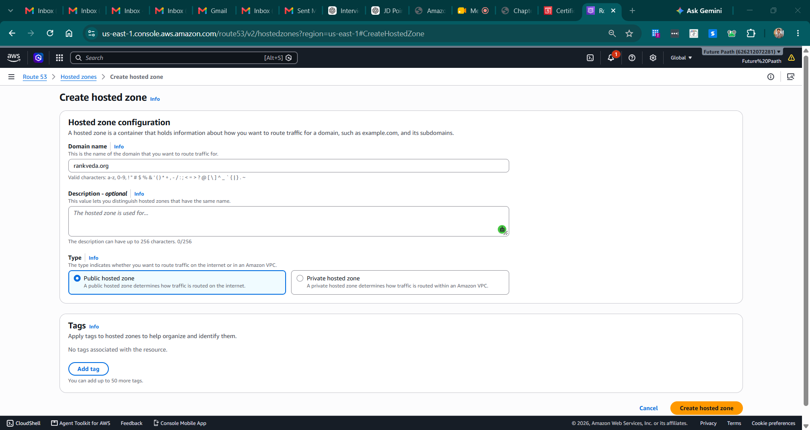

### Step 2 — Request an SSL/TLS Certificate (ACM)
> **CRITICAL**: CloudFront requires the certificate to be requested in the **us-east-1 (N. Virginia)** region, regardless of where your S3 bucket is located.

1. Switch your AWS Console region to **N. Virginia (us-east-1)**.
2. Go to **AWS Certificate Manager (ACM)** → **Request a certificate**.
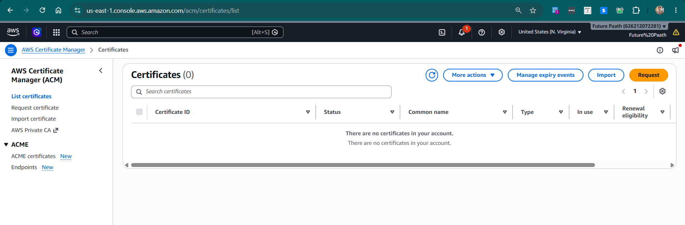
3. Select **Request a public certificate**.
4. **Fully qualified domain name**: Enter your domain (e.g., `example.com`) and click **Add another name to this certificate** to add `*.example.com`.
5. **Validation method**: Choose **DNS validation**.
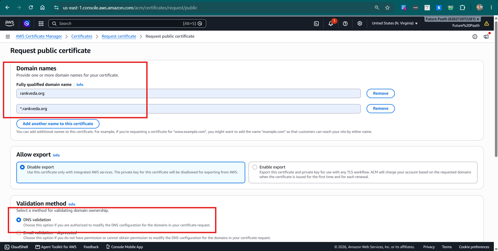
6. Click **Request**.
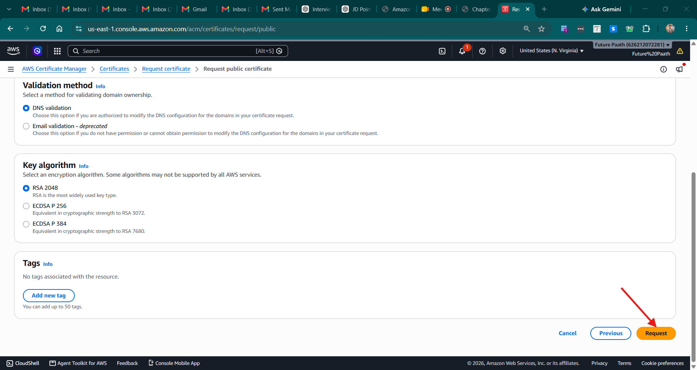
7. Once requested, click into the certificate and click **Create records in Route 53**. This automatically creates the CNAME records to prove you own the domain.
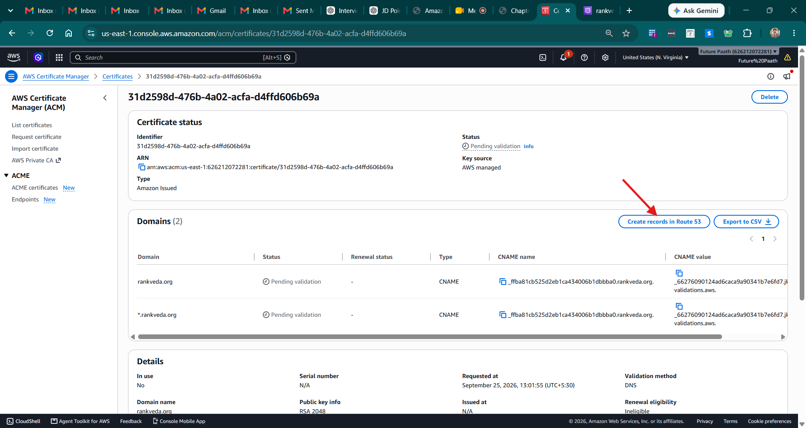
8. Wait for the status to change to **Issued** (usually takes a few minutes).
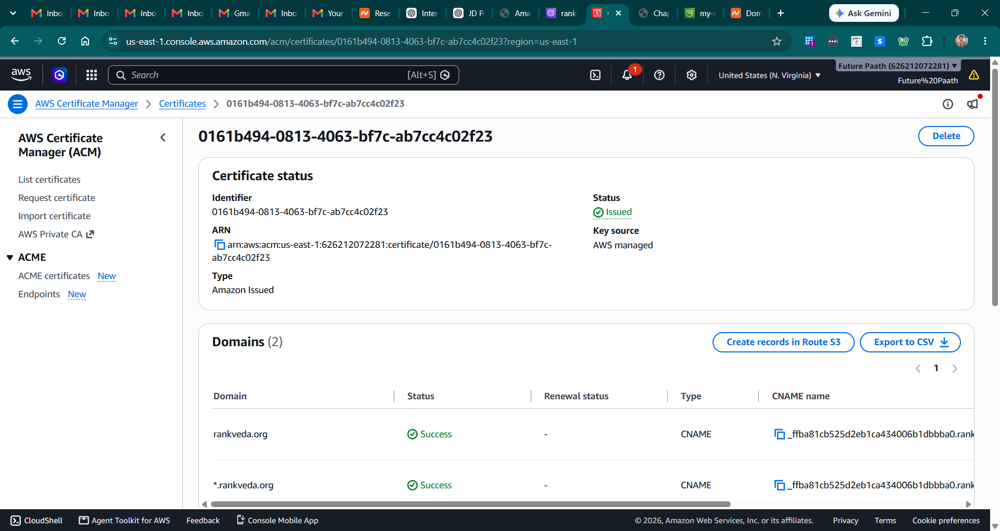

### Step 3 — Create a Private S3 Bucket
1. Go to **S3** → **Create bucket**.
2. **Bucket name**: e.g., `my-secure-frontend-bucket` (can be any region).
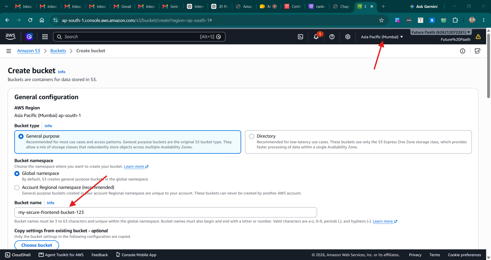
3. **Block Public Access settings**: Leave this **ON** (Block all public access). We want to keep the bucket private.
4. **Bucket Versioning**: Enable (best practice for websites).
5. Click **Create bucket**.
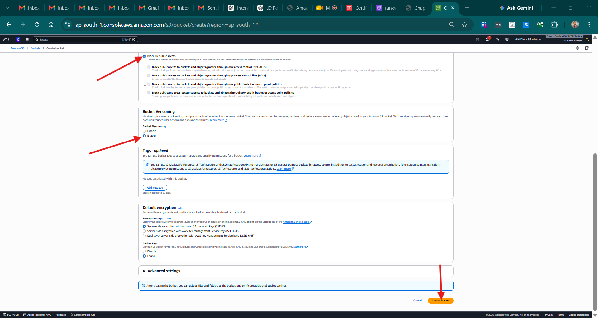

### Step 4 — Upload Website Files
1. Open your bucket and click **Upload**.
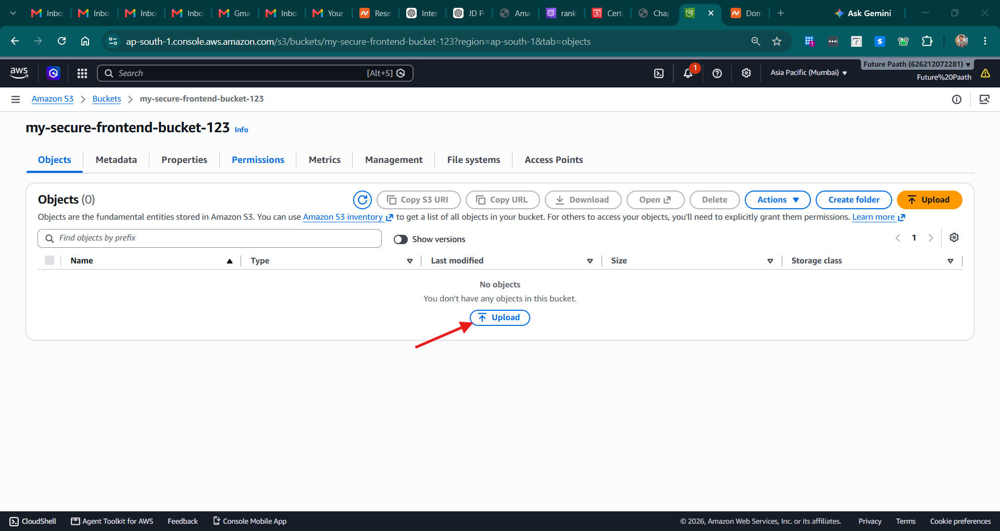
2. Upload a simple `index.html` (and optionally an `error.html`).
   ```html
   <!-- index.html -->
   <h1>Welcome to my secure CloudFront website!</h1>
   ```
   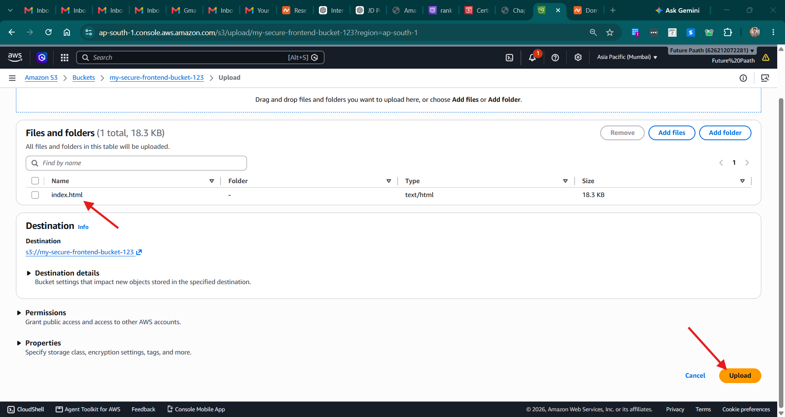
3. Click **Upload**.
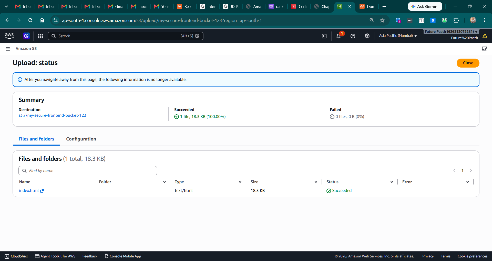

### Step 5 — Create a CloudFront Distribution
1. Go to **CloudFront** → **Create Distribution**.
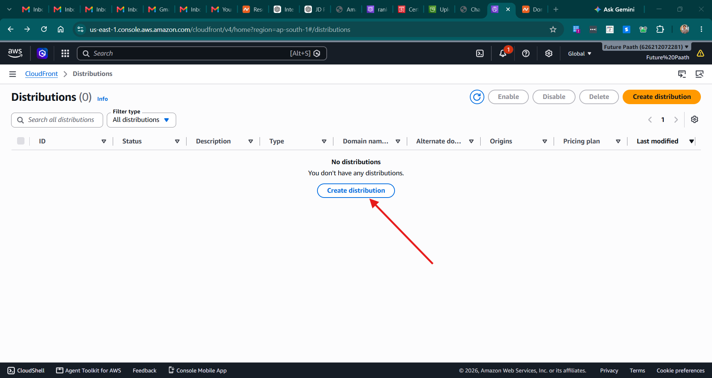
2. **Origin domain**: Select your S3 bucket from the dropdown.

3. **Origin access**: Select **Origin access control settings (recommended)**.
   - Click **Create control setting** and save the default configuration.
4. **Viewer protocol policy**: Select **Redirect HTTP to HTTPS**.
5. **Web Application Firewall (WAF)**: Select **Do not enable security protections** (to save costs for this lab).
6. **Alternate domain name (CNAME)**: Enter your custom domain (e.g., `www.example.com`).
7. **Custom SSL certificate**: Select the certificate you created in Step 2.
8. **Default root object**: Type `index.html`.
9. Click **Create distribution**.
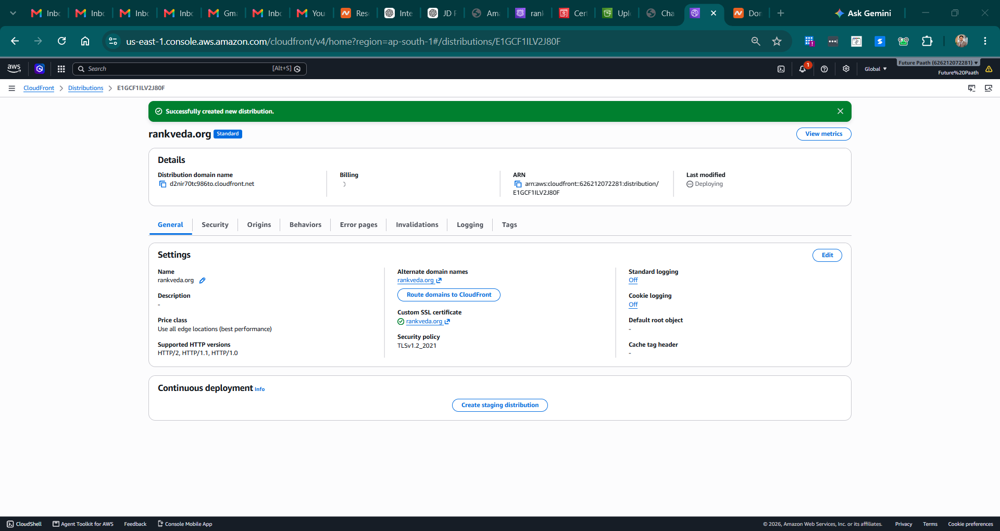
10. **IMPORTANT**: At the top of the screen, you will see a banner saying you must update the S3 bucket policy. Click **Copy policy**.

### Step 6 — Update S3 Bucket Policy
1. Go back to your **S3 Bucket** → **Permissions** tab.
2. Scroll to **Bucket policy** and click **Edit**.
3. Paste the policy copied from CloudFront. It allows CloudFront (using the Origin Access Control) to read the bucket, while keeping it blocked from the public internet.

4. Click **Save changes**.

### Step 7 — Point Route 53 to CloudFront
1. Go to **Route 53** → **Hosted zones** → Click your domain.
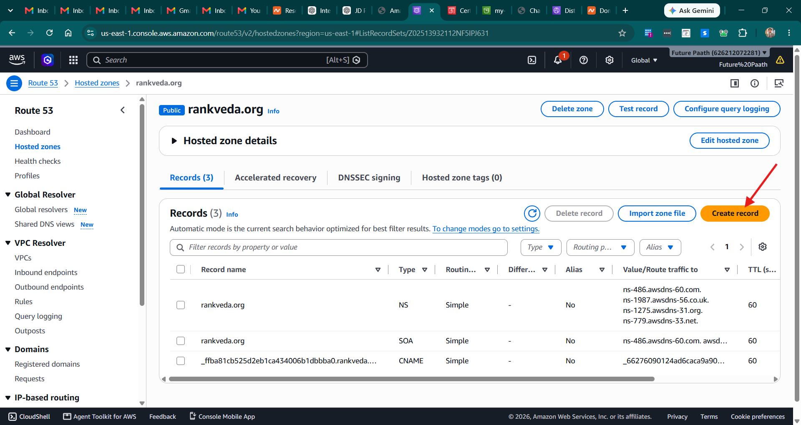
2. Click **Create record**.
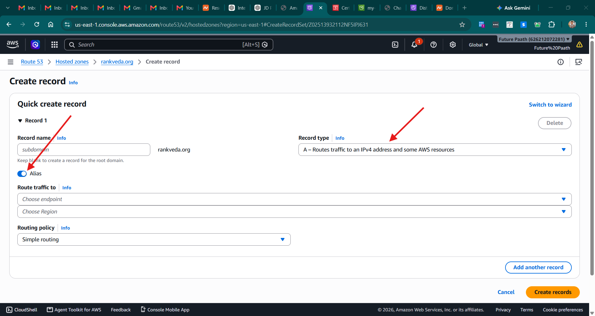
3. **Record name**: Enter the subdomain (e.g., `www`) or leave blank for the root domain.
4. **Record type**: `A - Routes traffic to an IPv4 address and some AWS resources`.
5. Turn on the **Alias** toggle.
6. **Route traffic to**: 
   - Select **Alias to CloudFront distribution**.
   - Paste the CloudFront Distribution domain name (e.g., `d111111abcdef8.cloudfront.net`).
7. Click **Create records**.
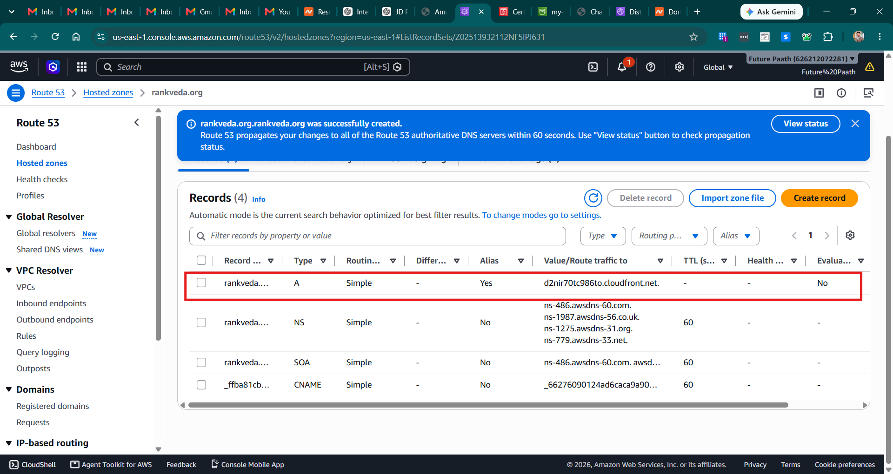

### Step 8 — Verify the Setup
1. Wait for the CloudFront distribution status to show as **Deployed** (can take 5-10 minutes).
2. Open your browser and navigate to `https://www.example.com` (your custom domain).
3. You should see your `index.html` file loaded securely with a padlock icon!
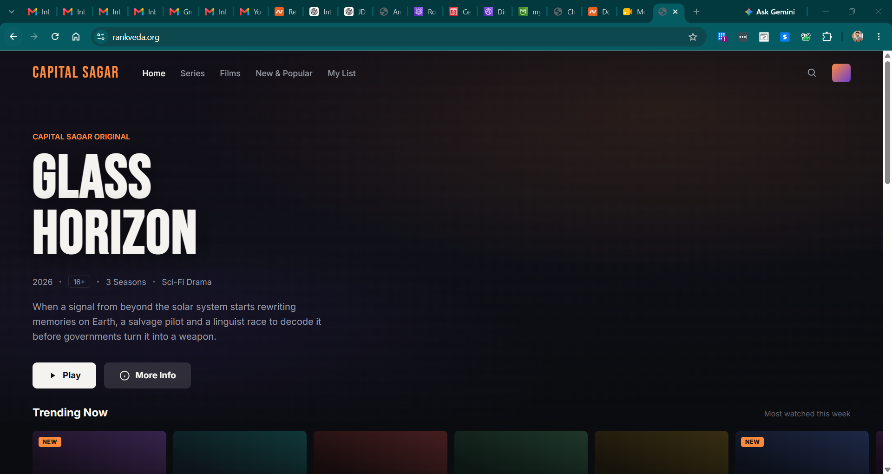
🎯 **Interview Insight**: "Why use CloudFront with S3 instead of just S3 Static Website Hosting?"
> **Strong answer**: "Using CloudFront allows you to attach a custom SSL certificate (HTTPS), caches content at edge locations for faster global load times, and allows you to keep the S3 bucket entirely private via Origin Access Control (OAC), satisfying strict security and compliance requirements."

---
---

# 🔬 Practical Lab 26 — S3 Cross-Region Replication (CRR)

## Lab Overview
| Item | Detail |
|------|--------|
| **Difficulty** | Intermediate |
| **Duration** | 25 minutes |
| **Cost** | A few cents (storage in second region, replication data transfer) |
| **Prerequisites** | Practical 23 (Secure S3 Bucket) |
| **Lab Environment** | Two AWS Regions (e.g., ap-south-1 → us-east-1) |

## Business Scenario
> Your company stores critical application data in an S3 bucket in **ap-south-1 (Mumbai)**. For disaster recovery compliance, all data must be automatically replicated to a secondary bucket in **us-east-1 (N. Virginia)**. If the primary region experiences an outage, the team must be able to failover to the DR bucket within minutes.

### Step 1 — Create the Source Bucket (ap-south-1)
1. Ensure your AWS Console region is set to **Asia Pacific (Mumbai) ap-south-1**.
2. Go to **S3** → **Create bucket**.
3. **Bucket name**: Enter `crr-source-{your-account-id}` (e.g., `crr-source-123456789012`).
4. **AWS Region**: Confirm **ap-south-1**.
5. **Block Public Access settings**: Leave **ON** (Block all public access).
6. **Bucket Versioning**: Click **Enable**.
   > ⚠️ **CRITICAL**: Versioning is **required** on **both** source and destination buckets for replication to work.
7. **Default encryption**: Select **SSE-S3** (or SSE-KMS if preferred).
8. Click **Create bucket**.

📸 **Screenshot 01** — Source Bucket Created
> **Verify**: Region = ap-south-1, Versioning = Enabled

### Step 2 — Create the Destination Bucket (us-east-1)
1. Switch your AWS Console region to **US East (N. Virginia) us-east-1**.
2. Go to **S3** → **Create bucket**.
3. **Bucket name**: Enter `crr-destination-{your-account-id}` (e.g., `crr-destination-123456789012`).
4. **AWS Region**: Confirm **us-east-1**.
5. **Block Public Access settings**: Leave **ON**.
6. **Bucket Versioning**: Click **Enable**.
7. **Default encryption**: Select **SSE-S3** (match source bucket).
8. Click **Create bucket**.

📸 **Screenshot 02** — Destination Bucket Created
> **Verify**: Region = us-east-1, Versioning = Enabled

### Step 3 — Create the IAM Replication Role
1. Go to **IAM** → **Roles** → **Create role**.
2. **Trusted entity type**: Select **AWS service**.
3. **Use case**: Under the service dropdown, select **S3**.
4. Click **Next**.
5. **Permissions**: Attach the policy **AmazonS3FullAccess** (for this lab; in production, use a scoped-down custom policy).
6. Click **Next**.
7. **Role name**: Enter `S3-CRR-Role`.
8. **Description**: `Allows S3 to replicate objects from source to destination bucket`.
9. Click **Create role**.

📸 **Screenshot 03** — IAM Replication Role Created
> **Verify**: Role name = S3-CRR-Role, Trusted entity = s3.amazonaws.com

> 💡 **Production Note**: In production, replace `AmazonS3FullAccess` with a custom policy that grants only `s3:GetReplicationConfiguration`, `s3:ListBucket`, `s3:GetObjectVersionForReplication`, `s3:GetObjectVersionAcl`, `s3:GetObjectVersionTagging` on the source bucket and `s3:ReplicateObject`, `s3:ReplicateDelete`, `s3:ReplicateTags` on the destination bucket.

### Step 4 — Enable Replication on the Source Bucket
1. Switch your AWS Console region back to **ap-south-1**.
2. Open the **source bucket** (`crr-source-{your-account-id}`).
3. Go to the **Management** tab.
4. Scroll to the **Replication rules** section and click **Create replication rule**.
5. **Replication rule name**: Enter `replicate-all-to-us-east-1`.
6. **Status**: Ensure it is set to **Enabled**.
7. **Source bucket**:
   - **Choose a rule scope**: Select **Apply to all objects in the bucket**.
8. **Destination**:
   - Select **Choose a bucket in this account**.
   - Click **Browse S3** and select your destination bucket (`crr-destination-{your-account-id}`) in us-east-1.
9. **IAM role**:
   - Select **Choose from existing IAM roles**.
   - Select the `S3-CRR-Role` you created in Step 3.
10. **Encryption** (if using SSE-KMS):
    - Check **Replicate objects encrypted with AWS KMS** if both buckets use KMS encryption.
    - Select the KMS key in the destination region.
11. **Additional replication options** (optional):
    - ✅ **Replication Time Control (RTC)** — Guarantees 99.99% of objects replicated within 15 minutes (additional cost).
    - ✅ **Replication metrics and notifications** — Enables CloudWatch metrics for monitoring.
    - ✅ **Delete marker replication** — Replicates delete markers to the destination.
12. Click **Save**.
13. A prompt will ask: **"Do you want to replicate existing objects?"**
    - For this lab, select **No, do not replicate existing objects** (existing object replication requires S3 Batch Replication).
    - Click **Submit**.

📸 **Screenshot 04** — Replication Rule Created
> **Verify**: Rule status = Enabled, Destination = crr-destination bucket in us-east-1

### Step 5 — Upload Test Objects to the Source Bucket
1. Open the **source bucket** in ap-south-1.
2. Click **Upload**.
3. Create and upload 3 test files:
   - `test-file-1.txt` (with content: `This is test file 1 for CRR`)
   - `test-file-2.txt` (with content: `This is test file 2 for CRR`)
   - `test-file-3.txt` (with content: `This is test file 3 for CRR`)
4. Click **Upload**.

Alternatively, use the AWS CLI:
```bash
echo "This is test file 1 for CRR" > test-file-1.txt
echo "This is test file 2 for CRR" > test-file-2.txt
echo "This is test file 3 for CRR" > test-file-3.txt

aws s3 cp test-file-1.txt s3://crr-source-{your-account-id}/
aws s3 cp test-file-2.txt s3://crr-source-{your-account-id}/
aws s3 cp test-file-3.txt s3://crr-source-{your-account-id}/
```

📸 **Screenshot 05** — Test Files Uploaded to Source
> **Verify**: 3 files visible in the source bucket

### Step 6 — Verify Replication in the Destination Bucket
1. Switch your AWS Console region to **us-east-1**.
2. Open the **destination bucket** (`crr-destination-{your-account-id}`).
3. Wait 1–5 minutes (replication is asynchronous).
4. Refresh the page — you should see all 3 test files replicated.
5. Click on any replicated file → **Properties** tab → Scroll to **Object management overview**.
6. Confirm the **Replication status** shows **REPLICA**.

📸 **Screenshot 06** — Files Replicated to Destination
> **Verify**: All 3 files present in destination bucket, Replication status = REPLICA

### Step 7 — Check Replication Status via CLI
```bash
# Check replication status of a specific object in the SOURCE bucket
aws s3api head-object \
    --bucket crr-source-{your-account-id} \
    --key test-file-1.txt \
    --query 'ReplicationStatus'
# Expected output: "COMPLETED"

# List objects in destination bucket to confirm replication
aws s3 ls s3://crr-destination-{your-account-id}/
# Expected: all 3 test files listed

# Check the replication configuration
aws s3api get-bucket-replication \
    --bucket crr-source-{your-account-id}
```

📸 **Screenshot 07** — CLI Replication Status = COMPLETED

### Step 8 — Test Delete Marker Replication (Optional)
1. In the **source bucket**, select `test-file-3.txt` and click **Delete**.
2. Type `delete` to confirm.
3. Switch to the **destination bucket** in us-east-1.
4. Click **Show versions** toggle to view all versions.
5. Verify that a **Delete marker** has been replicated for `test-file-3.txt`.

> 💡 **Note**: Delete marker replication only works if you enabled it in Step 4. The actual object versions are **not** deleted — only the delete marker is replicated. This is a safety feature.

📸 **Screenshot 08** — Delete Marker Replicated
> **Verify**: Delete marker visible in destination bucket for test-file-3.txt

### Step 9 — Clean Up
1. **Delete destination bucket contents**:
   - Open `crr-destination-{your-account-id}` → Select all objects → **Delete**.
   - Toggle **Show versions** and delete all versions and delete markers.
   - Delete the bucket.
2. **Delete source bucket contents**:
   - Open `crr-source-{your-account-id}` → Select all objects → **Delete**.
   - Toggle **Show versions** and delete all versions and delete markers.
   - Delete the bucket.
3. **Delete IAM role**:
   - Go to **IAM** → **Roles** → Search `S3-CRR-Role` → **Delete**.

> **Note**: Always clean up both buckets and the IAM role to avoid unexpected storage charges.

🎯 **Interview Insight**: "How does S3 Cross-Region Replication work and what are the requirements?"
> **Strong answer**: "CRR automatically replicates every new object from a source bucket to a destination bucket in a different AWS region. Both buckets must have versioning enabled. It requires an IAM role granting S3 permission to replicate. Replication is asynchronous — typically seconds to minutes. It only applies to new objects; existing objects require S3 Batch Replication. Key use cases are disaster recovery, compliance (data residency), and latency reduction. For SLA-guaranteed replication, enable Replication Time Control (RTC) which ensures 99.99% of objects are replicated within 15 minutes."

---

