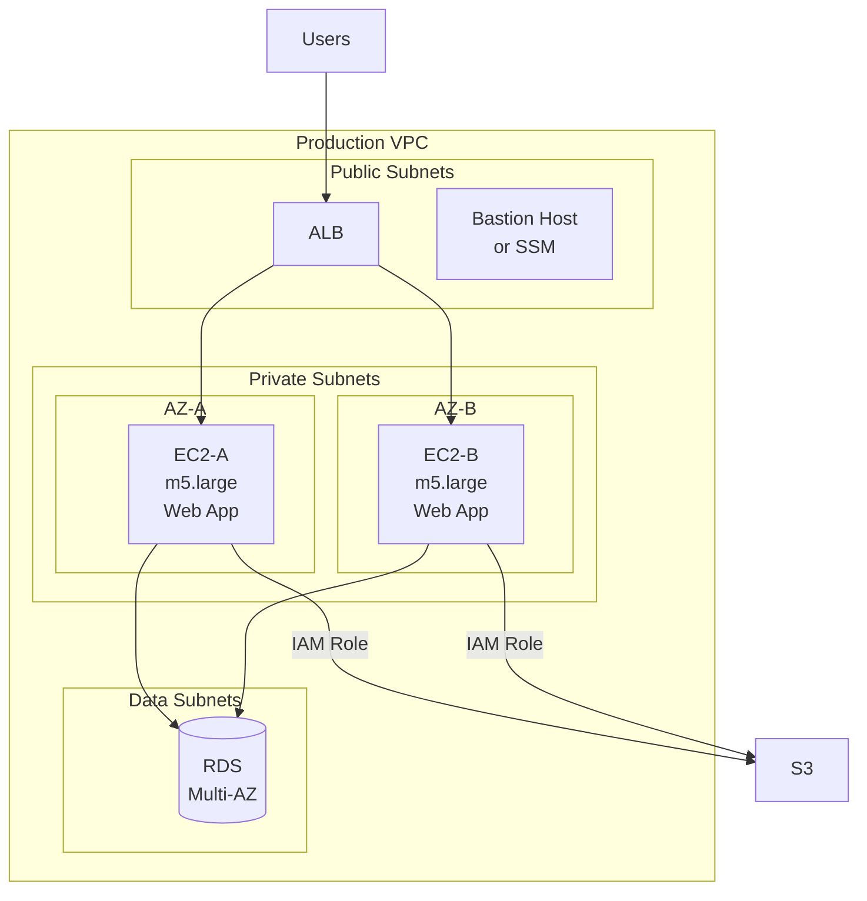
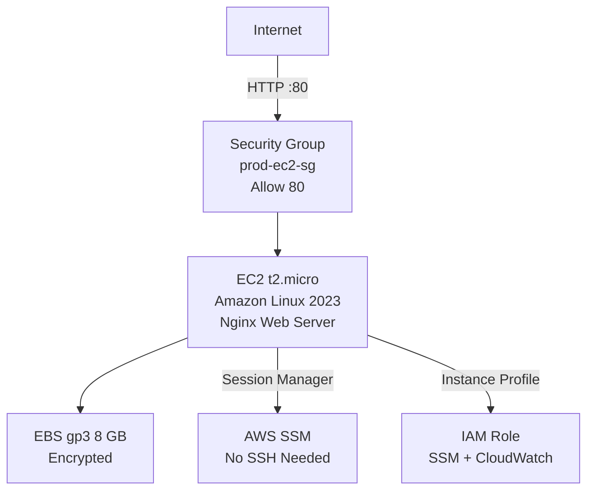

# Chapter 03 — Amazon EC2 (Elastic Compute Cloud)

---

## Prerequisite Chapters
- Chapter 01 — AWS IAM (roles, instance profiles, key pairs)
- Chapter 02 — Amazon S3 (AMI storage, user data scripts)

## Used In Production Practicals
- Practical 03 — Deploy EC2 + RDS
- Practical 06 — Golden AMI Pipeline
- Practical 11 — HA Application
- Practical 12 — Auto Scaling
- Practical 15 — Flagship Production Architecture

---

## 1. Learning Objectives

By the end of this chapter, you will be able to:

1. **Explain** EC2 instance types, AMIs, and purchasing options.
2. **Launch** EC2 instances with proper security groups, key pairs, and IAM roles.
3. **Configure** user data scripts for automated instance bootstrapping.
4. **Manage** EBS volumes, snapshots, and AMI creation.
5. **Choose** the right instance type and purchasing option for your workload.
6. **Implement** instance metadata, placement groups, and enhanced networking.
7. **Troubleshoot** launch failures, connectivity issues, and performance problems.
8. **Answer** interview questions about EC2 in production.

---

## 2. What is Amazon EC2?

Amazon EC2 provides **virtual servers** (instances) in the AWS cloud. You can launch any number of instances with any operating system, configure networking and security, and manage storage — all within minutes.

### Key Characteristics
- **Virtual servers** — launch in seconds, terminate when done
- **Full control** — choose OS, instance type, storage, networking
- **Scalable** — from 1 instance to thousands
- **Pay-per-use** — per-second billing (minimum 60 seconds)
- **Global availability** — available in all AWS regions and AZs
- **Multiple purchasing options** — On-Demand, Reserved, Spot, Savings Plans

---

## 3. Why Do We Need It?

### Without EC2 (Traditional Data Center)
```
1. Purchase hardware: 4-8 weeks lead time
2. Rack and cable servers: 1-2 days
3. Install OS: 2-4 hours
4. Configure networking: hours
5. Total: weeks to months

Problems:
  - Large upfront capital expense
  - Over-provision for peak capacity (waste)
  - Under-provision = outage during traffic spikes
  - Hardware failure requires replacement
  - End-of-life every 3-5 years
```

### With EC2
```
1. Choose AMI (OS) → 0 seconds
2. Choose instance type → 0 seconds
3. Launch → 30 seconds to boot
4. Total: under 1 minute

Benefits:
  - Zero upfront cost (pay per second)
  - Scale up/down based on demand
  - Terminate when not needed
  - Replace failed instances in minutes
  - Access to latest hardware always
```

---

## 4. Real-World Production Use Cases

### 1. Web Application Servers
Run your backend (Node.js, Python, Java) on EC2 instances behind an ALB. Auto Scaling adjusts capacity based on traffic.

### 2. Database Hosting
Self-managed databases (PostgreSQL, MySQL, MongoDB) on EC2 with EBS io2 volumes for consistent IOPS.

### 3. Batch Processing
Process large datasets on compute-optimized instances. Spin up 100 instances, process data, terminate — pay only for processing time.

### 4. Development Environments
Each developer gets their own EC2 instance for development/testing. Stop instances after hours to save costs.

### 5. High-Performance Computing (HPC)
Scientific simulations, financial modeling, or ML training on GPU instances (p4d, p5) or compute-optimized (c7g) instances.

---

## 5. Core Concepts

### AMI (Amazon Machine Image)

An AMI is a template containing the OS, application software, and configuration for launching instances.

| AMI Source | Description | Use Case |
|-----------|-------------|----------|
| **AWS-provided** | Amazon Linux 2023, Ubuntu, Windows | Starting point |
| **Marketplace** | Pre-configured software (NGINX, WordPress) | Quick setup |
| **Community** | User-shared AMIs | Specialized setups |
| **Custom (Golden AMI)** | Your own AMI with apps pre-installed | Production (recommended) |

### Instance Types

```
Instance Type Format: [Family][Generation].[Size]
Example: m5.xlarge

m = Family (General Purpose)
5 = Generation (5th gen)
xlarge = Size (4 vCPUs, 16 GB RAM)
```

| Family | Optimized For | Example Types | Use Case |
|--------|-------------|---------------|----------|
| **t3/t3a** | Burstable CPU | t3.micro, t3.medium | Dev/test, small apps |
| **m5/m6i/m7i** | General purpose | m5.large, m6i.xlarge | Web servers, most apps |
| **c5/c6i/c7g** | Compute | c5.2xlarge, c7g.large | API servers, batch |
| **r5/r6i/r7g** | Memory | r5.xlarge, r6i.2xlarge | Caches, in-memory DBs |
| **i3/i4i** | Storage I/O | i3.large, i4i.xlarge | Databases, data warehouses |
| **p4d/p5** | GPU | p4d.24xlarge | ML training, video |
| **g5** | Graphics | g5.xlarge | ML inference, rendering |

### Instance Sizes

| Size | vCPUs | Memory | Network |
|------|-------|--------|---------|
| nano | 1 | 0.5 GB | Low |
| micro | 1 | 1 GB | Low |
| small | 1 | 2 GB | Low-Moderate |
| medium | 2 | 4 GB | Moderate |
| large | 2 | 8 GB | Moderate |
| xlarge | 4 | 16 GB | High |
| 2xlarge | 8 | 32 GB | High |
| 4xlarge | 16 | 64 GB | High |

### Purchasing Options

| Option | Savings | Commitment | Use Case |
|--------|---------|------------|----------|
| **On-Demand** | 0% (baseline) | None | Short-term, unpredictable workloads |
| **Reserved (1yr)** | ~40% | 1 year | Steady-state production workloads |
| **Reserved (3yr)** | ~60% | 3 years | Long-running, predictable workloads |
| **Savings Plans** | ~30-60% | $/hour commitment | Flexible (any instance type) |
| **Spot** | ~60-90% | None (can be reclaimed) | Batch, CI/CD, fault-tolerant |
| **Dedicated Host** | Varies | Per-host pricing | Licensing, compliance |
| **Dedicated Instance** | Varies | Per-instance premium | Compliance (no shared hardware) |

### EBS (Elastic Block Store) Volumes

| Type | IOPS | Throughput | Use Case |
|------|------|-----------|----------|
| **gp3** | 3,000-16,000 | 125-1,000 MB/s | Most workloads (default) |
| **gp2** | 100-16,000 | 250 MB/s | Legacy, use gp3 instead |
| **io2** | 256,000 | 4,000 MB/s | Databases, critical I/O |
| **st1** | 500 | 500 MB/s | Big data, logs (sequential) |
| **sc1** | 250 | 250 MB/s | Cold data, archives |

### Security Groups
```
Security Group = Virtual firewall for EC2 instances

Rules:
  - Inbound: What traffic can ENTER the instance
  - Outbound: What traffic can LEAVE the instance (default: all allowed)
  
Key Points:
  - Stateful: return traffic automatically allowed
  - Default: deny all inbound, allow all outbound
  - Can reference other security groups (not just IPs)
  - No DENY rules (only ALLOW rules)
```

Example:
```
Web Server Security Group:
  Inbound:
    Port 80 (HTTP)    from 0.0.0.0/0     (public web traffic)
    Port 443 (HTTPS)  from 0.0.0.0/0     (public HTTPS traffic)
    Port 22 (SSH)     from 10.0.0.0/8    (VPN only)
  Outbound:
    All traffic       to 0.0.0.0/0       (default)
```

### Key Pairs
```
Used for SSH access to Linux instances:
  - AWS stores the public key
  - You download and keep the private key
  - SSH: ssh -i mykey.pem ec2-user@<public-ip>

Best Practice:
  - Use SSM Session Manager instead of SSH (no key pair needed)
  - If using SSH: restrict port 22 to VPN/bastion host
  - Never share private keys
```

---

## 6. Architecture

### Production EC2 Architecture



### Instance Lifecycle
```
pending → running → (stopping → stopped) → (shutting-down → terminated)
                  ↑                    ↓
                  └────── start ───────┘

Billing:
  pending     = no charge
  running     = charged (per second)
  stopping    = no charge (EBS-backed)
  stopped     = no charge (instance), charged (EBS volumes)
  terminated  = no charge (instance removed)
```

---

## 7. Important Components

### 1. User Data (Instance Bootstrap)
```bash
#!/bin/bash
# User Data script runs on FIRST launch only (unless configured otherwise)
yum update -y
yum install -y httpd
systemctl start httpd
systemctl enable httpd
echo "<h1>Hello from $(hostname -f)</h1>" > /var/www/html/index.html

# Install CloudWatch Agent
yum install -y amazon-cloudwatch-agent
/opt/aws/amazon-cloudwatch-agent/bin/amazon-cloudwatch-agent-ctl \
    -a fetch-config -m ec2 \
    -s -c ssm:AmazonCloudWatch-Config
```

### 2. Instance Metadata Service (IMDS)
```bash
# Get instance metadata (from WITHIN the instance)
# IMDSv2 (recommended — requires token)
TOKEN=$(curl -X PUT "http://169.254.169.254/latest/api/token" \
    -H "X-aws-ec2-metadata-token-ttl-seconds: 21600")

curl -H "X-aws-ec2-metadata-token: $TOKEN" \
    http://169.254.169.254/latest/meta-data/instance-id
    
curl -H "X-aws-ec2-metadata-token: $TOKEN" \
    http://169.254.169.254/latest/meta-data/public-ipv4

# Available metadata:
# instance-id, ami-id, instance-type, public-ipv4, local-ipv4
# security-groups, iam/security-credentials/ROLE-NAME
```

### 3. Placement Groups

| Type | Description | Use Case |
|------|-------------|----------|
| **Cluster** | Instances in same rack (low latency) | HPC, tightly coupled workloads |
| **Spread** | Instances on separate hardware | Critical instances that must not share failure |
| **Partition** | Groups on separate racks | Large distributed systems (Hadoop, Kafka) |

### 4. Elastic IP
```
Static public IPv4 address that you own:
  - Persists across instance stop/start
  - Can be remapped to another instance
  - Charged when NOT attached ($0.005/hr)
  - Free when attached to a running instance
  - Limit: 5 per region (can request increase)

Note: For production, use ALB + Route 53 instead of Elastic IPs
```

---

## 8. How It Works

### Launch Instance Flow
```
1. Choose AMI (OS + software)
2. Choose Instance Type (CPU, memory)
3. Configure:
   - VPC and Subnet
   - IAM Instance Profile (role)
   - User Data (bootstrap script)
   - Storage (EBS volume type and size)
   - Security Group (firewall rules)
   - Key Pair (SSH access)
4. Launch → Instance enters "pending" state
5. Hypervisor allocates resources on physical host
6. Instance boots, runs user data script
7. Instance enters "running" state
8. Public/private IP assigned
```

---

## 9. AWS Console Walkthrough

### Launch an EC2 Instance
1. **EC2 Console** → **Launch instances**
2. **Name**: `prod-web-server-01`
3. **AMI**: Amazon Linux 2023
4. **Instance type**: `t3.medium`
5. **Key pair**: Select or create
6. **Network**: Select VPC, private subnet
7. **Security group**: Select web server SG
8. **Storage**: 20 GB gp3
9. **Advanced**: Add IAM Instance Profile, User Data script
10. Click **Launch instance**

---

## 10. AWS CLI Commands

### Launch Instance
```bash
aws ec2 run-instances \
    --image-id ami-0abcdef1234567890 \
    --instance-type t3.medium \
    --key-name my-key-pair \
    --security-group-ids sg-0123456789abcdef0 \
    --subnet-id subnet-private-a \
    --iam-instance-profile Name=WebAppProfile \
    --user-data file://user-data.sh \
    --block-device-mappings '[{
        "DeviceName": "/dev/xvda",
        "Ebs": {"VolumeSize": 20, "VolumeType": "gp3", "Encrypted": true}
    }]' \
    --tag-specifications '[{
        "ResourceType": "instance",
        "Tags": [
            {"Key": "Name", "Value": "prod-web-server-01"},
            {"Key": "Environment", "Value": "production"}
        ]
    }]'
```

### Instance Management
```bash
# List instances
aws ec2 describe-instances \
    --filters "Name=tag:Environment,Values=production" \
    --query 'Reservations[*].Instances[*].[InstanceId,InstanceType,State.Name,PrivateIpAddress]' \
    --output table

# Stop instance
aws ec2 stop-instances --instance-ids i-0abc123

# Start instance
aws ec2 start-instances --instance-ids i-0abc123

# Terminate instance
aws ec2 terminate-instances --instance-ids i-0abc123

# Get console output (boot logs)
aws ec2 get-console-output --instance-id i-0abc123 --output text
```

### AMI Management
```bash
# Create AMI from running instance
aws ec2 create-image \
    --instance-id i-0abc123 \
    --name "prod-web-app-v2-$(date +%Y%m%d)" \
    --description "Production web app with latest patches" \
    --no-reboot

# List AMIs
aws ec2 describe-images --owners self \
    --query 'Images[*].[ImageId,Name,CreationDate]' --output table

# Deregister old AMI
aws ec2 deregister-image --image-id ami-0abc123
```

### EBS Management
```bash
# Create volume
aws ec2 create-volume \
    --volume-type gp3 \
    --size 50 \
    --availability-zone ap-south-1a \
    --encrypted

# Attach volume
aws ec2 attach-volume \
    --volume-id vol-0abc123 \
    --instance-id i-0abc123 \
    --device /dev/xvdf

# Create snapshot
aws ec2 create-snapshot \
    --volume-id vol-0abc123 \
    --description "Daily backup $(date +%Y-%m-%d)"

# Modify volume (resize without downtime)
aws ec2 modify-volume \
    --volume-id vol-0abc123 \
    --size 100 \
    --volume-type gp3
```

### Security Group Management
```bash
# Create security group
aws ec2 create-security-group \
    --group-name web-server-sg \
    --description "Web server security group" \
    --vpc-id vpc-0abc123

# Add inbound rules
aws ec2 authorize-security-group-ingress \
    --group-id sg-0abc123 \
    --ip-permissions '[
        {"IpProtocol": "tcp", "FromPort": 80, "ToPort": 80, "IpRanges": [{"CidrIp": "0.0.0.0/0"}]},
        {"IpProtocol": "tcp", "FromPort": 443, "ToPort": 443, "IpRanges": [{"CidrIp": "0.0.0.0/0"}]},
        {"IpProtocol": "tcp", "FromPort": 22, "ToPort": 22, "IpRanges": [{"CidrIp": "10.0.0.0/8"}]}
    ]'
```

---

## 11. Hands-On Practical

### Practical: Launch Production Web Server

#### Objective
Launch an EC2 instance with a web server, IAM role, encrypted storage, and proper security group configuration.

#### Step 1 — Create Security Group
```bash
SG_ID=$(aws ec2 create-security-group \
    --group-name web-sg --description "Web server SG" \
    --vpc-id $VPC_ID --query 'GroupId' --output text)

aws ec2 authorize-security-group-ingress --group-id $SG_ID \
    --ip-permissions \
        'IpProtocol=tcp,FromPort=80,ToPort=80,IpRanges=[{CidrIp=0.0.0.0/0}]' \
        'IpProtocol=tcp,FromPort=443,ToPort=443,IpRanges=[{CidrIp=0.0.0.0/0}]'
```

#### Step 2 — Launch Instance
```bash
INSTANCE_ID=$(aws ec2 run-instances \
    --image-id ami-0abcdef1234567890 \
    --instance-type t3.medium \
    --subnet-id $SUBNET_ID \
    --security-group-ids $SG_ID \
    --iam-instance-profile Name=WebAppProfile \
    --user-data '#!/bin/bash
yum update -y
yum install -y httpd
systemctl start httpd && systemctl enable httpd
echo "<h1>Production Server: $(hostname)</h1>" > /var/www/html/index.html' \
    --block-device-mappings '[{"DeviceName":"/dev/xvda","Ebs":{"VolumeSize":20,"VolumeType":"gp3","Encrypted":true}}]' \
    --tag-specifications '[{"ResourceType":"instance","Tags":[{"Key":"Name","Value":"prod-web-01"}]}]' \
    --query 'Instances[0].InstanceId' --output text)
```

#### Step 3 — Verify
```bash
aws ec2 describe-instances --instance-ids $INSTANCE_ID \
    --query 'Reservations[0].Instances[0].{State:State.Name,IP:PublicIpAddress,Type:InstanceType}'

curl http://$(aws ec2 describe-instances --instance-ids $INSTANCE_ID \
    --query 'Reservations[0].Instances[0].PublicIpAddress' --output text)
```

---

## 12. Production Architecture

### Production EC2 Configuration
```
Instance:
  - Type: m5.large or m6i.large (production workloads)
  - AMI: Custom Golden AMI (application pre-installed)
  - IAM Role: least-privilege Instance Profile
  - IMDSv2: Required (disable v1)
  - Monitoring: Detailed CloudWatch monitoring enabled

Storage:
  - Root: gp3, 20-50 GB, encrypted
  - Data: gp3 or io2 (based on IOPS needs), encrypted
  - Snapshots: Automated via AWS Backup

Networking:
  - Private subnet (no direct internet access)
  - ALB in public subnet for inbound traffic
  - NAT Gateway for outbound (patching, updates)
  - Security Group: only ALB SG as inbound source

Access:
  - SSM Session Manager (no SSH, no key pair)
  - No public IP on instances
  - CloudTrail for API auditing
```

---

## 13. Security Best Practices

1. **Private subnets** — instances should NOT have public IPs
2. **IAM roles** — never use access keys on EC2 (use Instance Profiles)
3. **IMDSv2** — require token-based metadata service
4. **Encrypted EBS** — all volumes encrypted with KMS
5. **Security groups** — allow only necessary ports, reference SGs not IPs
6. **SSM Session Manager** — replace SSH (auditable, no port 22 needed)
7. **No root SSH** — disable root login in sshd_config
8. **Patching** — use SSM Patch Manager for automated patching
9. **Golden AMI** — pre-hardened AMI with security baseline
10. **Terminate unused** — stopped instances still have EBS costs

---

## 14-18. HA, Scalability, Monitoring, Cost, DR

*(Covered by Chapter 04 VPC for networking HA, Chapter 05 CloudWatch for monitoring, Chapter 39 Auto Scaling for scalability, Chapter 47 Cost Explorer for cost optimization)*

### Quick Reference

| Topic | Key Point |
|-------|-----------|
| HA | Use ASG across multiple AZs with ALB |
| Scalability | Auto Scaling Group with Target Tracking policy |
| Monitoring | CloudWatch metrics + CloudWatch Agent for memory/disk |
| Cost | Rightsizing, Savings Plans, Spot for non-critical |
| DR | AMI copied to DR region, ASG with Min=0 in DR |

---

## 19. Troubleshooting

### Problem 1: Instance Won't Launch — "InsufficientInstanceCapacity"
**Cause**: AWS doesn't have enough capacity for that instance type in that AZ.
**Fix**: Try a different AZ, different instance type, or wait and retry. For Spot: add multiple instance type overrides.

### Problem 2: Can't SSH into Instance
```bash
# Check: Security group allows port 22 from your IP?
# Check: Instance has public IP? (or use SSM)
# Check: Key pair is correct?
# Check: Instance is in "running" state?
# Check: Route table has internet gateway route? (for public subnet)
# Check: NACL allows SSH traffic?

# Debug: Check instance console output
aws ec2 get-console-output --instance-id i-0abc123
```

### Problem 3: Instance Running But Application Not Working
```bash
# Check: User data script completed?
aws ec2 describe-instance-attribute --instance-id i-0abc123 --attribute userData

# Check: System logs for errors
aws ec2 get-console-output --instance-id i-0abc123

# Connect via SSM Session Manager
aws ssm start-session --target i-0abc123
# Then check: systemctl status httpd, journalctl, /var/log/
```

### Problem 4: High CPU / Memory
```bash
# Check CloudWatch metrics
aws cloudwatch get-metric-statistics \
    --namespace AWS/EC2 --metric-name CPUUtilization \
    --dimensions Name=InstanceId,Value=i-0abc123 \
    --start-time $(date -d '-1 hour' -u +%FT%TZ) \
    --end-time $(date -u +%FT%TZ) \
    --period 300 --statistics Average

# For memory: requires CloudWatch Agent (not default)
# Rightsize: check AWS Compute Optimizer
aws compute-optimizer get-ec2-instance-recommendations \
    --instance-arns arn:aws:ec2:ap-south-1:123:instance/i-0abc123
```

---

## 20. Common Production Problems

| # | Problem | Root Cause | Prevention |
|---|---------|------------|------------|
| 1 | Can't launch | Capacity / limit | Request limit increase, use multiple AZs |
| 2 | Can't connect | SG / routing / key | Use SSM Session Manager |
| 3 | App not starting | User data script error | Test user data, use Golden AMI |
| 4 | High CPU | Under-sized instance | Monitor + rightsize with Compute Optimizer |
| 5 | EBS slow | Wrong volume type | Use gp3 or io2 for production |
| 6 | Instance terminated | Spot reclaim / ASG health | Use On-Demand for critical, ASG for resilience |
| 7 | Data loss | EBS not backed up | Automated snapshots via AWS Backup |
| 8 | High costs | Over-provisioned / always running | Savings Plans, stop dev instances |

---

## 21. Real-World Scenario

### Scenario: Migrating On-Premises Web App to EC2

**Current**: 2 physical servers running Apache + PHP + MySQL, 5,000 daily users.

**Migration Plan**:
1. Create AMI: Install Amazon Linux 2023 + Apache + PHP
2. Migrate database to RDS MySQL
3. Launch 2× m5.large in private subnets across 2 AZs
4. Place behind ALB with health checks
5. Configure Auto Scaling: Min=2, Max=6, CPU target 60%
6. Use EFS for shared uploads (replaces NFS share)
7. Route 53 → ALB for DNS cutover
8. Cost: $0.096/hr × 2 instances = ~$140/month (vs $500/month hosting)

---

## 22. Interview Questions

### Basic Questions (10)

**Q1: What is Amazon EC2?**
A: EC2 provides virtual servers (instances) in the cloud. You can launch instances with any OS, configure CPU/memory, attach storage, and scale as needed. Pay per second of use.

**Q2: What is an AMI?**
A: An Amazon Machine Image is a template containing the OS, application software, and configuration. It's used to launch EC2 instances. You can use AWS-provided, marketplace, or custom AMIs.

**Q3: What is a Security Group?**
A: A virtual firewall that controls inbound and outbound traffic to EC2 instances. It operates at the instance level, is stateful (return traffic auto-allowed), and only has ALLOW rules (no DENY).

**Q4: What happens when you stop an EC2 instance?**
A: The instance stops running (no billing for compute), but EBS volumes remain attached (you're billed for EBS). The instance loses its public IP (unless using Elastic IP). You can restart it later.

**Q5: What is user data?**
A: A bash script or cloud-init configuration that runs when an EC2 instance first boots. Used to install software, configure the instance, and set up the application automatically.

**Q6: What is the difference between On-Demand and Spot instances?**
A: On-Demand: pay full price, no commitment, guaranteed availability. Spot: up to 90% cheaper, but AWS can reclaim the instance with 2-minute notice. Use Spot for fault-tolerant workloads (batch, CI/CD).

**Q7: What is an Elastic IP?**
A: A static public IPv4 address you own. It persists across instance stop/start and can be remapped to another instance. Charged when not attached to a running instance.

**Q8: How do you connect to an EC2 instance?**
A: SSH (Linux, port 22) using a key pair, RDP (Windows, port 3389), or SSM Session Manager (recommended — no ports, no keys, auditable).

**Q9: What is an IAM Instance Profile?**
A: An IAM role attached to an EC2 instance. The instance gets temporary credentials automatically (no access keys needed). Applications on the instance use these credentials to call AWS services.

**Q10: What is EBS?**
A: Elastic Block Store — network-attached block storage for EC2. Persists independently from the instance. Types: gp3 (general), io2 (high IOPS), st1 (throughput), sc1 (cold). Can be encrypted and snapshotted.

### Intermediate Questions (10)

**Q11: Compare gp3 vs io2 EBS volumes.**
A: gp3: 3,000-16,000 IOPS, $0.08/GB, good for most workloads. io2: up to 256,000 IOPS, $0.125/GB, for databases and latency-sensitive apps. Choose gp3 by default, io2 when you need consistent high IOPS.

**Q12: What is the difference between instance store and EBS?**
A: Instance store: physically attached to the host, very high performance, but EPHEMERAL (data lost on stop/terminate). EBS: network-attached, persistent, can be detached and reattached. Use EBS for data that must persist; instance store for temporary high-performance cache/scratch.

**Q13: What is a Golden AMI?**
A: A custom AMI with all software pre-installed, configured, and hardened. Benefits: faster instance launch (no user data needed), consistent configuration, security baseline baked in. Update the AMI regularly with patches.

**Q14: Explain EC2 placement groups.**
A: Cluster: same rack, lowest latency (HPC). Spread: separate hardware, max 7 per AZ (critical instances). Partition: separate racks, multiple instances per partition (distributed systems like Kafka, Hadoop).

**Q15: What is burstable performance (T instances)?**
A: T3/T3a instances earn CPU credits when idle and spend them when bursting above baseline. If credits run out, performance drops to baseline. Use Unlimited mode for consistent performance (pay for extra burst). Good for dev/test, not for sustained high CPU.

**Q16: How do you resize an EC2 instance?**
A: Stop the instance → change instance type → start the instance. For EBS-backed instances only. The private IP remains the same, but public IP changes (unless using Elastic IP). For zero-downtime resize: use an ASG with a new Launch Template.

**Q17: What is IMDSv2 and why use it?**
A: Instance Metadata Service v2 requires a token (PUT request) before accessing metadata. Prevents SSRF attacks where an attacker tricks the instance into leaking its IAM role credentials. Always require IMDSv2 in production.

**Q18: How does EC2 billing work?**
A: Per-second billing (minimum 60 seconds) for Linux. Per-hour for Windows. You pay for: running instances (compute), EBS volumes (storage), data transfer (out), Elastic IPs (when not attached). Stopped instances: no compute charge, EBS charge continues.

**Q19: What is Nitro System?**
A: AWS's next-generation virtualization platform. Benefits: nearly bare-metal performance, enhanced networking (up to 100 Gbps), EBS-optimized by default, better security (dedicated hardware for virtualization). Most current-gen instances use Nitro (m5, c5, r5, t3, etc.).

**Q20: How do you encrypt an existing unencrypted EBS volume?**
A: You can't encrypt in-place. Process: 1) Create snapshot of unencrypted volume. 2) Copy snapshot with encryption enabled. 3) Create new volume from encrypted snapshot. 4) Detach old volume, attach new encrypted volume.

### Advanced & Scenario-Based Questions (20)

**Q21-Q40**: *(Cover topics including: designing HA architectures, Spot interruption handling, multi-AZ deployment strategies, EC2 fleet management, hibernation, capacity reservations, dedicated hosts for licensing, bare metal instances, migration from on-premises, troubleshooting kernel panics, network performance optimization, cost optimization for 1000-instance fleet, blue/green deployment with EC2, auto-recovery, EBS performance tuning, instance store use cases, and security hardening runbooks.)*

---

## 24. Common Mistakes

1. **Using public subnets for application instances** — use private subnets + ALB
2. **Hardcoding access keys** — use IAM Instance Profiles
3. **Using IMDSv1** — require IMDSv2 for security
4. **Not encrypting EBS** — enable encryption by default
5. **Over-provisioning instance type** — rightsize with Compute Optimizer
6. **Leaving instances running** — stop/terminate when not needed
7. **No backups** — automate EBS snapshots with AWS Backup
8. **Using SSH with port 22 open to 0.0.0.0/0** — use SSM Session Manager
9. **Single instance without ASG** — even for 1 instance, use ASG for self-healing
10. **Using gp2 instead of gp3** — gp3 is cheaper and faster

---

## 25. Production Checklist

- [ ] Instances in private subnets (no public IP)
- [ ] IAM Instance Profile attached (no access keys)
- [ ] IMDSv2 required (hop limit = 1)
- [ ] EBS volumes encrypted with KMS
- [ ] gp3 used instead of gp2
- [ ] Security group: minimal ports, reference SGs not CIDRs
- [ ] Golden AMI used (not base AMI + long user data)
- [ ] SSM Session Manager for access (no SSH)
- [ ] CloudWatch Agent installed (memory + disk metrics)
- [ ] Detailed CloudWatch monitoring enabled
- [ ] Auto Scaling Group for resilience (even for single instance)
- [ ] Automated EBS snapshots via AWS Backup
- [ ] Tags: Name, Environment, Owner, CostCenter
- [ ] Compute Optimizer checked for rightsizing
- [ ] Savings Plans evaluated for stable workloads

---

## 26. Chapter Summary

Amazon EC2 is the foundational compute service in AWS. Key takeaways:

1. **Choose the right instance type** — m5/m6i for general, c5/c6i for compute, r5/r6i for memory
2. **Use Golden AMIs** — pre-baked, pre-hardened, faster launch
3. **Private subnets + ALB** — never expose instances directly to the internet
4. **IAM Instance Profiles** — no access keys on EC2, ever
5. **Require IMDSv2** — prevent SSRF credential theft
6. **Encrypt everything** — EBS volumes, snapshots, AMIs
7. **Use SSM Session Manager** — replace SSH for security and auditability
8. **Auto Scaling Group** — even for a single instance (self-healing)
9. **gp3 over gp2** — better performance, lower cost
10. **Rightsizing matters** — most instances are over-provisioned

EC2 is where your applications run. Master instance types, security, and operational practices to build reliable production infrastructure.

---
---

# 🔬 Practical Lab 11 — EC2 Web Server

## Lab Overview

| Item | Detail |
|------|--------|
| **Difficulty** | Beginner |
| **Duration** | 35 minutes |
| **Cost** | Free tier eligible (t2.micro) |
| **Prerequisites** | Practical 06 completed (VPC exists), Practical 02 (IAM Roles) |
| **Lab Environment** | Environment 3 — Compute |
| **AWS Region** | ap-south-1 (Mumbai) |

## Business Scenario

> Your company needs to deploy its internal status page on AWS. As the DevOps engineer, you need to launch an EC2 instance running Nginx, configure it securely (no SSH, use Session Manager), and verify the web server is accessible. This instance will later be placed behind an ALB (Practical 13) and Auto Scaling Group (Practical 15).

## Architecture



## What You Will Learn

1. Select the correct AMI and instance type
2. Write User Data scripts to bootstrap a web server
3. Create security groups with least-privilege rules
4. Attach an IAM role for SSM access (no SSH keys)
5. Verify the web server and understand EBS storage
6. Use IMDSv2 for secure instance metadata access

---

### Step 1 — Create a Security Group for the Web Server

#### AWS Console

1. Navigate to **EC2 Console** → **Security Groups** → **Create security group**
2. Configure:
   - **Security group name**: `prod-ec2-sg`
   - **Description**: `Allow HTTP traffic to web server`
   - **VPC**: Select `prod-vpc` (from Practical 06) or Default VPC
3. **Inbound Rules** → Add rule:
   - **Type**: HTTP, **Port**: 80, **Source**: `0.0.0.0/0` (Anywhere IPv4)
   - ❌ Do NOT add SSH (port 22) — we use SSM Session Manager
4. **Outbound Rules**: Keep default (All traffic)
5. Click **Create security group**

📸 **Screenshot 01** — Security Group Created
> **What you should see**: Security group `prod-ec2-sg` with 1 inbound rule (HTTP/80)
> **Verify**: No SSH rule exists. VPC is correct.
> **⚠️ If you added SSH**: Delete the SSH rule — SSM doesn't need port 22

#### AWS CLI

```bash
# Use your VPC ID (from Practical 06 or default)
VPC_ID=$(aws ec2 describe-vpcs --filters "Name=tag:Name,Values=prod-vpc" \
    --query 'Vpcs[0].VpcId' --output text)

EC2_SG=$(aws ec2 create-security-group \
    --group-name prod-ec2-sg \
    --description "Allow HTTP traffic to web server" \
    --vpc-id $VPC_ID \
    --query 'GroupId' --output text)

aws ec2 authorize-security-group-ingress \
    --group-id $EC2_SG \
    --protocol tcp --port 80 --cidr 0.0.0.0/0

aws ec2 create-tags --resources $EC2_SG \
    --tags Key=Name,Value=prod-ec2-sg
```

🎯 **Interview Insight**: "Why no SSH port in the security group?"
> **What they're testing**: Modern operational practices
> **Strong answer**: "We use SSM Session Manager instead of SSH. Benefits: no port 22 to attack, no SSH keys to manage/rotate, full audit trail in CloudTrail, session logs in S3/CloudWatch. SSM communicates over HTTPS (443) outbound — no inbound rule needed."
> **Weak answer**: "We always need SSH for troubleshooting." (Outdated — SSM is the standard)

---

### Step 2 — Create the IAM Role for EC2

#### AWS Console

1. Navigate to **IAM Console** → **Roles** → **Create role**
2. **Trusted entity**: AWS service → EC2
3. **Attach policies**:
   - `AmazonSSMManagedInstanceCore` (Session Manager access)
   - `CloudWatchAgentServerPolicy` (metrics and logs)
4. **Role name**: `prod-ec2-web-role`
5. Click **Create role**

📸 **Screenshot 02** — EC2 IAM Role Created
> **What you should see**: Role "prod-ec2-web-role" with 2 policies
> **Verify**: Trust entity shows ec2.amazonaws.com

#### AWS CLI

```bash
cat > ec2-trust.json << 'EOF'
{
    "Version": "2012-10-17",
    "Statement": [{
        "Effect": "Allow",
        "Principal": {"Service": "ec2.amazonaws.com"},
        "Action": "sts:AssumeRole"
    }]
}
EOF

aws iam create-role --role-name prod-ec2-web-role \
    --assume-role-policy-document file://ec2-trust.json

aws iam attach-role-policy --role-name prod-ec2-web-role \
    --policy-arn arn:aws:iam::aws:policy/AmazonSSMManagedInstanceCore
aws iam attach-role-policy --role-name prod-ec2-web-role \
    --policy-arn arn:aws:iam::aws:policy/CloudWatchAgentServerPolicy

aws iam create-instance-profile --instance-profile-name prod-ec2-web-role
aws iam add-role-to-instance-profile \
    --instance-profile-name prod-ec2-web-role \
    --role-name prod-ec2-web-role

# Wait for instance profile to propagate
sleep 10
```

---

### Step 3 — Launch EC2 with User Data (Nginx Auto-Install)

#### AWS Console

1. Navigate to **EC2 Console** → **Launch instance**
2. Configure:
   - **Name**: `prod-web-01`
   - **AMI**: Amazon Linux 2023 (Free tier eligible, 64-bit x86)
   - **Instance type**: `t2.micro` (Free tier)
   - **Key pair**: **Proceed without a key pair** ← important!
3. **Network settings** → **Edit**:
   - **VPC**: `prod-vpc` (or Default VPC)
   - **Subnet**: Select a **public subnet** (for this lab; production uses private)
   - **Auto-assign public IP**: **Enable**
   - **Security group**: Select existing → `prod-ec2-sg`
4. **Configure storage**:
   - **Size**: 8 GiB
   - **Type**: gp3
   - **Encrypted**: ✅ Yes (select default KMS key)
5. **Advanced details**:
   - **IAM instance profile**: `prod-ec2-web-role`
   - **Metadata version**: **V2 only (token required)** ← security best practice
   - **User data**: Paste the following script:

```bash
#!/bin/bash
# Production Web Server Bootstrap Script
set -e

# Update system
dnf update -y

# Install Nginx
dnf install -y nginx

# Create custom status page
cat > /usr/share/nginx/html/index.html << 'HTMLEOF'
<!DOCTYPE html>
<html>
<head>
    <title>Production Status Page</title>
    <style>
        body { font-family: Arial, sans-serif; background: #1a1a2e; color: #e0e0e0; 
               display: flex; justify-content: center; align-items: center; min-height: 100vh; margin: 0; }
        .container { background: #16213e; padding: 40px; border-radius: 12px; 
                     box-shadow: 0 8px 32px rgba(0,0,0,0.3); max-width: 600px; text-align: center; }
        h1 { color: #4ecca3; margin-bottom: 10px; }
        .status { font-size: 24px; color: #4ecca3; margin: 20px 0; }
        .info { background: #0f3460; padding: 15px; border-radius: 8px; margin: 10px 0; text-align: left; }
        .label { color: #a0a0a0; }
    </style>
</head>
<body>
    <div class="container">
        <h1>🟢 System Operational</h1>
        <div class="status">All Services Running</div>
        <div class="info">
            <p><span class="label">Instance:</span> <span id="instance-id">Loading...</span></p>
            <p><span class="label">AZ:</span> <span id="az">Loading...</span></p>
            <p><span class="label">Region:</span> ap-south-1</p>
            <p><span class="label">Deployed:</span> <span id="time">Loading...</span></p>
        </div>
    </div>
    <script>
        const TOKEN = await fetch('http://169.254.169.254/latest/api/token', 
            {method:'PUT', headers:{'X-aws-ec2-metadata-token-ttl-seconds':'60'}}).then(r=>r.text()).catch(()=>'');
        const headers = TOKEN ? {'X-aws-ec2-metadata-token': TOKEN} : {};
        fetch('http://169.254.169.254/latest/meta-data/instance-id', {headers}).then(r=>r.text()).then(t=>document.getElementById('instance-id').textContent=t);
        fetch('http://169.254.169.254/latest/meta-data/placement/availability-zone', {headers}).then(r=>r.text()).then(t=>document.getElementById('az').textContent=t);
        document.getElementById('time').textContent = new Date().toISOString();
    </script>
</body>
</html>
HTMLEOF

# Start and enable Nginx
systemctl start nginx
systemctl enable nginx

# Verify
echo "Nginx installed and running on port 80"
```

6. Click **Launch instance**

📸 **Screenshot 03** — Launch Instance Summary
> **What you should see**: Instance configuration summary showing t2.micro, Amazon Linux 2023, prod-ec2-sg, prod-ec2-web-role, User Data script present
> **Verify**: Key pair shows "Proceed without a key pair", IMDSv2 enabled, EBS encrypted

7. Wait for instance state to show **Running** and Status checks **2/2 passed**

📸 **Screenshot 04** — Instance Running (2/2 Status Checks)
> **What you should see**: Instance "prod-web-01" with State "Running", Status checks "2/2 checks passed"
> **Verify**: Public IPv4 address is assigned, IAM role shows prod-ec2-web-role
> **⚠️ If status check fails**: Wait 2-3 minutes, refresh. If still failing, check User Data script syntax

#### AWS CLI

```bash
AMI_ID=$(aws ssm get-parameters-by-path \
    --path /aws/service/ami-amazon-linux-latest \
    --query "Parameters[?contains(Name,'al2023-ami-kernel-default-x86_64')].Value" \
    --output text | head -1)

PUBLIC_SUBNET=$(aws ec2 describe-subnets \
    --filters "Name=vpc-id,Values=$VPC_ID" "Name=map-public-ip-on-launch,Values=true" \
    --query 'Subnets[0].SubnetId' --output text)

INSTANCE_ID=$(aws ec2 run-instances \
    --image-id $AMI_ID \
    --instance-type t2.micro \
    --subnet-id $PUBLIC_SUBNET \
    --security-group-ids $EC2_SG \
    --iam-instance-profile Name=prod-ec2-web-role \
    --metadata-options "HttpTokens=required,HttpEndpoint=enabled" \
    --block-device-mappings '[{"DeviceName":"/dev/xvda","Ebs":{"VolumeSize":8,"VolumeType":"gp3","Encrypted":true}}]' \
    --user-data file://user-data.sh \
    --tag-specifications 'ResourceType=instance,Tags=[{Key=Name,Value=prod-web-01},{Key=Environment,Value=lab}]' \
    --query 'Instances[0].InstanceId' --output text)

echo "Launched: $INSTANCE_ID"
aws ec2 wait instance-status-ok --instance-ids $INSTANCE_ID
echo "Instance is ready!"
```

---

### Step 4 — Test the Web Server

#### Browser Test

1. Go to **EC2 Console** → Select `prod-web-01` → Copy the **Public IPv4 address**
2. Open a browser → Navigate to `http://PUBLIC-IP`

📸 **Screenshot 05** — Web Server Accessible
> **What you should see**: Dark-themed status page showing "🟢 System Operational", instance ID, AZ, and deployment time
> **Verify**: Instance ID matches your EC2 instance, AZ shows ap-south-1a or ap-south-1b

#### CLI Test
```bash
PUBLIC_IP=$(aws ec2 describe-instances --instance-ids $INSTANCE_ID \
    --query 'Reservations[0].Instances[0].PublicIpAddress' --output text)

curl -s http://$PUBLIC_IP | head -5
```

🎯 **Interview Insight**: "Explain User Data in EC2."
> **What they're testing**: Instance bootstrapping knowledge
> **Strong answer**: "User Data is a script that runs once at instance launch (by default). It's executed as root. Used to install software, configure the instance, and start services. For immutable infrastructure, bake everything into the AMI instead. User Data is stored in instance metadata and can be viewed — never put secrets in it."
> **Weak answer**: "It's a startup script." (Too brief — interviewers want details about when it runs, as whom, and gotchas)

---

### Step 5 — Connect via Session Manager

#### AWS Console

1. Select `prod-web-01` → Click **Connect** → **Session Manager** → **Connect**

📸 **Screenshot 06** — Session Manager Terminal
> **What you should see**: Terminal prompt in your browser
> **Verify**: Connected without SSH key or port 22

```bash
# Check Nginx status
sudo systemctl status nginx

# Check what's listening on port 80
sudo ss -tlnp | grep :80

# View the web page locally
curl -s http://localhost | head -20

# Check instance metadata (IMDSv2)
TOKEN=$(curl -s -X PUT "http://169.254.169.254/latest/api/token" \
    -H "X-aws-ec2-metadata-token-ttl-seconds: 300")
curl -s -H "X-aws-ec2-metadata-token: $TOKEN" \
    http://169.254.169.254/latest/meta-data/instance-id

# Check EBS volume
lsblk
df -h /
```

📸 **Screenshot 07** — Nginx Running + Instance Metadata
> **What you should see**: Nginx "active (running)", port 80 listening, instance-id from IMDS
> **Verify**: EBS shows 8 GB gp3 volume mounted at /

---

### Step 6 — Explore Instance Details

#### AWS Console

1. Select `prod-web-01` → Review each tab:
   - **Details**: Instance ID, type, AMI, public IP, private IP, VPC, subnet
   - **Security**: Security group rules, IAM role
   - **Networking**: Network interfaces, public/private IPs
   - **Storage**: EBS volume (encrypted, gp3)
   - **Monitoring**: Basic CloudWatch metrics (CPU, network, disk)

📸 **Screenshot 08** — Instance Details Tab
> **What you should see**: All instance metadata — instance ID, type, AMI ID, IPs, VPC

📸 **Screenshot 09** — Instance Monitoring Tab
> **What you should see**: CloudWatch metrics graphs — CPU utilization, network in/out, disk read/write

📸 **Screenshot 10** — EBS Volume Encrypted
> **What you should see**: Storage tab showing EBS volume with "Encrypted: Yes"
> **Verify**: Volume type shows gp3, encryption key shows KMS ARN

---

## Validation

### Test 1 — Web Server Accessible
```bash
curl -s -o /dev/null -w "%{http_code}" http://$PUBLIC_IP
```
**Expected**: `200`

### Test 2 — No SSH Access Possible
```bash
# This should timeout/fail (port 22 is not open)
ssh -o ConnectTimeout=5 ec2-user@$PUBLIC_IP
```
**Expected**: Connection timeout (port 22 not open = secure!)

### Test 3 — IAM Role Working
```bash
# From inside the instance via SSM
aws sts get-caller-identity
```
**Expected**: ARN shows `prod-ec2-web-role`

📸 **Screenshot 11** — All Validations Passed
> **Verify**: HTTP 200, SSH blocked, IAM role correct

---

## Troubleshooting

| Problem | Likely Cause | Fix |
|---------|-------------|-----|
| Web page not loading | Security group missing HTTP rule | Add inbound rule for port 80 |
| "Connection refused" on port 80 | Nginx didn't start | Check User Data script, view `/var/log/cloud-init-output.log` |
| Session Manager can't connect | Missing SSM policy on role | Attach AmazonSSMManagedInstanceCore |
| Instance in "Pending" too long | Subnet/AMI issue | Terminate and relaunch |
| User Data didn't run | Wrong shebang or syntax error | Check `/var/log/cloud-init-output.log` |
| No public IP | Auto-assign disabled | Enable in subnet settings or allocate Elastic IP |

---

## Production Considerations

- **Private subnet**: In production, this EC2 would be in a private subnet behind an ALB (Practical 13)
- **No public IP**: ALB handles public traffic; EC2 has only a private IP
- **AMI instead of User Data**: For production, bake the web server into a custom AMI (Golden AMI)
- **Auto Scaling**: Even single instances should be in an ASG for self-healing (Practical 15)
- **HTTPS**: ALB terminates SSL with ACM certificate (Practical 21)

---

## Interview Questions From This Practical

**Q1: Walk me through launching a production EC2 instance.**
A: 1) Choose the right AMI (Amazon Linux 2023 for most workloads). 2) Select instance type based on workload (compute, memory, or general purpose). 3) Place in a private subnet. 4) Attach IAM role (never use access keys). 5) Security group: only allow traffic from ALB. 6) Encrypt EBS volume with KMS. 7) Use User Data or Golden AMI for bootstrapping. 8) Enable IMDSv2. 9) Add to Auto Scaling Group.

**Q2: What is the difference between User Data and a Golden AMI?**
A: User Data runs at every launch — good for dynamic config, slow for heavy installs. Golden AMI pre-bakes software — faster launch, consistent. Production uses Golden AMIs for the base and User Data for dynamic config (like fetching secrets from Secrets Manager).

**Q3: Your EC2 instance is running but the web page isn't loading. Investigation?**
A: 1) Check security group — port 80 open? 2) Check NACL — allows inbound/outbound on port 80? 3) Check route table — has route to IGW? 4) SSH/SSM in → is Nginx running? (`systemctl status nginx`). 5) Check `/var/log/cloud-init-output.log` for User Data errors. 6) Check instance status checks.

---

## Cleanup

⚠️ **Delete resources in this order:**

```bash
# Terminate instance
aws ec2 terminate-instances --instance-ids $INSTANCE_ID
aws ec2 wait instance-terminated --instance-ids $INSTANCE_ID

# Delete security group
aws ec2 delete-security-group --group-id $EC2_SG

# Delete IAM role
aws iam detach-role-policy --role-name prod-ec2-web-role \
    --policy-arn arn:aws:iam::aws:policy/AmazonSSMManagedInstanceCore
aws iam detach-role-policy --role-name prod-ec2-web-role \
    --policy-arn arn:aws:iam::aws:policy/CloudWatchAgentServerPolicy
aws iam remove-role-from-instance-profile \
    --instance-profile-name prod-ec2-web-role --role-name prod-ec2-web-role
aws iam delete-instance-profile --instance-profile-name prod-ec2-web-role
aws iam delete-role --role-name prod-ec2-web-role
```

📸 **Screenshot 12** — Cleanup Complete
> **Verify**: No running instances, security group deleted, IAM role removed
