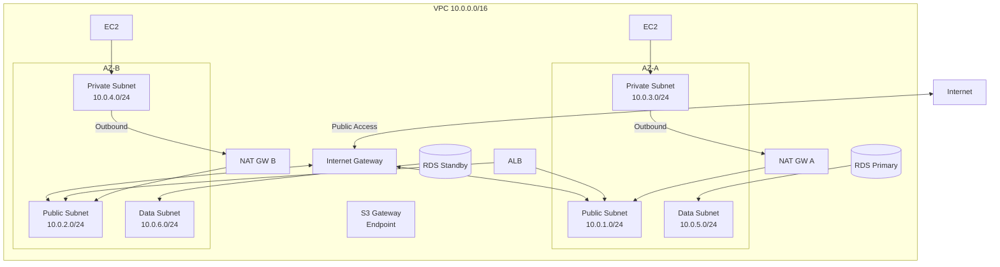
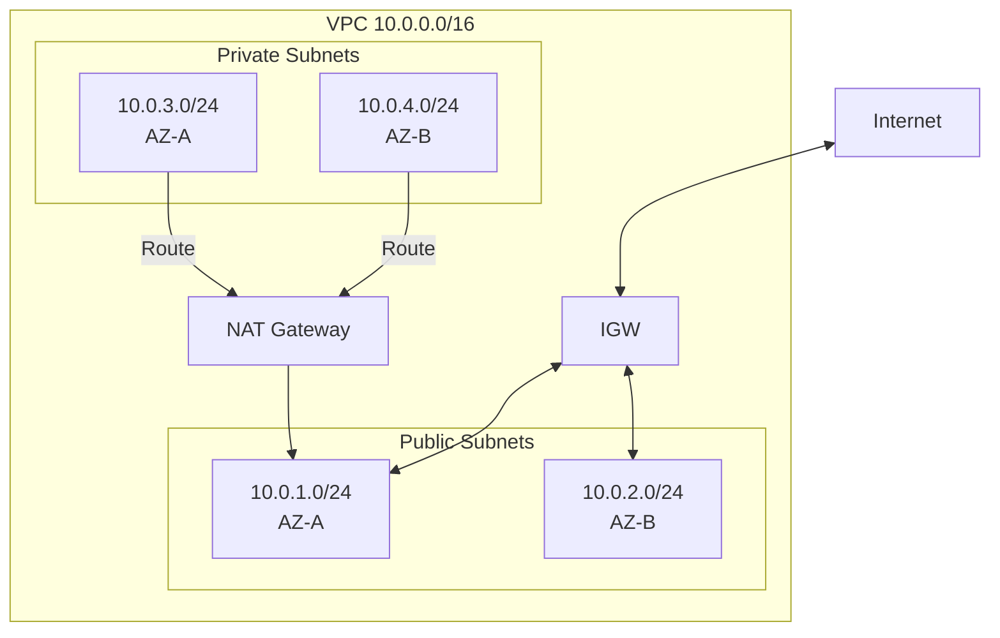
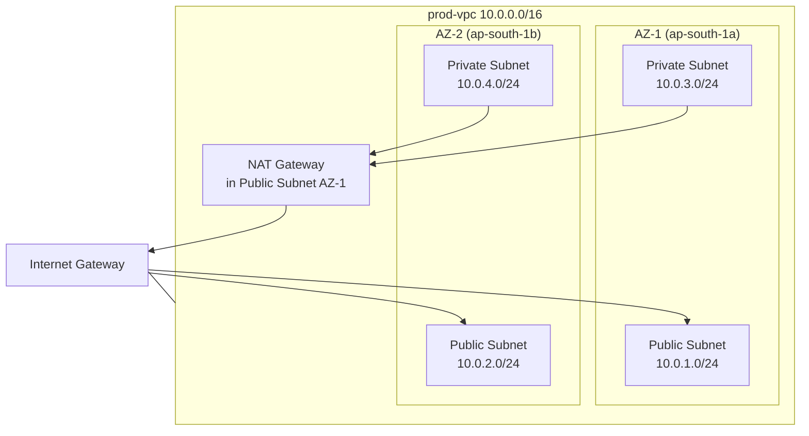
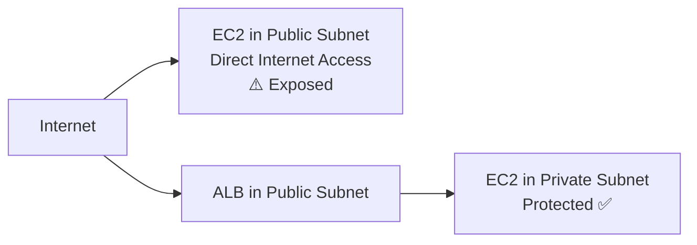
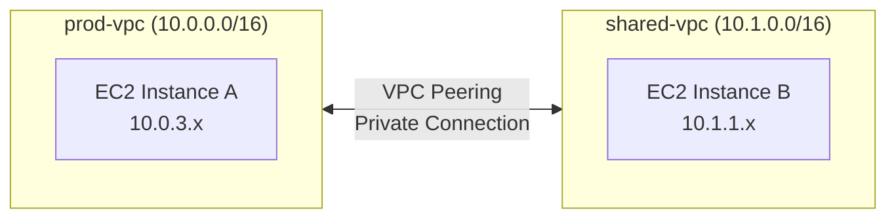

# Chapter 04 — Amazon VPC (Virtual Private Cloud)

---

## Prerequisite Chapters
- Chapter 01 — AWS IAM (security groups, NACLs, roles)
- Chapter 03 — Amazon EC2 (instances, ENIs)

## Used In Production Practicals
- Practical 07 — Multi-AZ Network
- Practical 08 — Private Connectivity (VPN, PrivateLink)
- Practical 15 — Flagship Production Architecture
- Every practical that uses EC2, RDS, ECS, Lambda in VPC

## Includes
This chapter covers **VPC + Internet Gateway + NAT Gateway + Route Tables + Subnets + Security Groups + NACLs** (all networking components in one place).

---

## 1. Learning Objectives

By the end of this chapter, you will be able to:

1. **Design** a production VPC architecture with public and private subnets across multiple AZs.
2. **Configure** Internet Gateways, NAT Gateways, and Route Tables.
3. **Implement** Security Groups and NACLs for defense in depth.
4. **Create** VPC endpoints for private access to AWS services.
5. **Set up** VPC peering, Transit Gateway, and VPN connectivity.
6. **Enable** VPC Flow Logs for network monitoring and troubleshooting.
7. **Troubleshoot** connectivity issues, routing problems, and security group misconfigurations.
8. **Answer** interview questions about AWS networking.

---

## 2. What is Amazon VPC?

Amazon VPC is your **private, isolated network** in the AWS cloud. It's like building your own data center network — you control the IP ranges, subnets, routing, and firewall rules.

### Key Characteristics
- **Logically isolated** — your VPC is completely separate from other customers
- **Full control** — you define CIDR blocks, subnets, route tables, gateways
- **Multi-AZ** — span across multiple Availability Zones for HA
- **Integration** — most AWS services run inside or connect to your VPC
- **Free** — the VPC itself costs nothing (NAT Gateway, VPN have costs)

### Networking Components (All in This Chapter)

| Component | Purpose | Analogy |
|-----------|---------|---------|
| **VPC** | Your isolated network | Your building |
| **Subnet** | Segment of VPC in one AZ | Floor of the building |
| **Internet Gateway (IGW)** | Connects VPC to the internet | Front door to the street |
| **NAT Gateway** | Private subnets → internet (outbound only) | Mail room (sends out, doesn't accept walk-ins) |
| **Route Table** | Directs traffic to the right destination | Building directory signs |
| **Security Group** | Instance-level firewall (stateful) | Room door lock (remembers who entered) |
| **NACL** | Subnet-level firewall (stateless) | Floor security checkpoint |
| **VPC Endpoint** | Private connection to AWS services | Internal elevator to AWS |
| **VPC Peering** | Connect two VPCs | Skybridge between buildings |
| **Transit Gateway** | Hub connecting multiple VPCs/VPNs | Central transit station |

---

## 3. Why Do We Need It?

### Without VPC
```
AWS resources on shared, flat network
  → No isolation between customers
  → No control over IP addressing
  → No private networking
  → Can't connect to on-premises
```

### With VPC
```
Your own isolated network
  → Complete control over IP ranges
  → Public and private subnets
  → Internet access only where you want it
  → Connect securely to on-premises (VPN/Direct Connect)
  → Firewall rules at instance AND subnet level
```

---

## 4. Real-World Production Use Cases

### 1. Standard Three-Tier Architecture
```
Public Subnets:  ALB, NAT Gateway
Private Subnets: EC2 application servers, ECS containers
Data Subnets:    RDS, ElastiCache (most isolated)
```

### 2. Multi-Account Shared VPC
Central networking account creates VPC + subnets. Application accounts deploy resources into shared subnets via RAM.

### 3. Hybrid Cloud
VPC connected to on-premises data center via Site-to-Site VPN or Direct Connect. Applications in VPC communicate with on-premises databases.

### 4. Microservices Isolation
Each microservice team gets their own VPC with VPC peering or Transit Gateway for inter-service communication.

---

## 5. Core Concepts

### CIDR Blocks (IP Address Ranges)
```
CIDR = Classless Inter-Domain Routing = "How many IP addresses do I get?"

VPC CIDR: 10.0.0.0/16 = 65,536 IP addresses
  ├── Subnet A: 10.0.1.0/24 = 256 IPs (251 usable — AWS reserves 5)
  ├── Subnet B: 10.0.2.0/24 = 256 IPs
  ├── Subnet C: 10.0.3.0/24 = 256 IPs
  └── Subnet D: 10.0.4.0/24 = 256 IPs

AWS Reserved IPs per subnet (5):
  .0 = Network address
  .1 = VPC router
  .2 = DNS server
  .3 = Reserved for future
  .255 = Broadcast (not supported but reserved)

Common CIDR sizes:
  /16 = 65,536 IPs (large VPC)
  /20 = 4,096 IPs (medium VPC)
  /24 = 256 IPs (typical subnet)
  /28 = 16 IPs (smallest subnet allowed)
```

### Subnets

| Type | Internet Access | Use For |
|------|----------------|---------|
| **Public Subnet** | Yes (via IGW) | ALB, NAT Gateway, Bastion Host |
| **Private Subnet** | Outbound only (via NAT GW) | EC2, ECS, Lambda |
| **Isolated Subnet** | No internet access | RDS, ElastiCache |

```
Key Rule: A subnet is public if its route table has a route to an IGW
          A subnet is private if it doesn't
```

### Internet Gateway (IGW)
```
IGW = The "front door" connecting your VPC to the internet

Properties:
  - One IGW per VPC
  - Horizontally scaled, redundant, HA (managed by AWS)
  - No bandwidth bottleneck
  - FREE (no charge for the IGW itself)

For a subnet to be "public":
  1. Attach IGW to VPC
  2. Subnet route table: 0.0.0.0/0 → IGW
  3. Instances must have a public IP or Elastic IP
```

### NAT Gateway
```
NAT Gateway = Allows private subnet instances to reach the internet
              (for updates, patches, API calls) without being reachable FROM the internet

Properties:
  - Lives in a PUBLIC subnet
  - Has an Elastic IP
  - Managed by AWS (HA within an AZ)
  - For multi-AZ HA: one NAT GW per AZ (recommended)
  - COSTS money (~$0.045/hour + $0.045/GB processed)

Traffic Flow:
  Private Instance → NAT Gateway (public subnet) → IGW → Internet
  Internet → ✗ Cannot reach private instance (one-way)
```

### Route Tables
```
Route Table = Directions for where network traffic should go

Public Subnet Route Table:
  Destination      Target
  10.0.0.0/16      local          (VPC internal traffic)
  0.0.0.0/0        igw-abc123     (all other traffic → Internet Gateway)

Private Subnet Route Table:
  Destination      Target
  10.0.0.0/16      local          (VPC internal traffic)
  0.0.0.0/0        nat-abc123     (all other traffic → NAT Gateway)

Isolated Subnet Route Table:
  Destination      Target
  10.0.0.0/16      local          (VPC internal traffic ONLY)
  (no 0.0.0.0/0 route — no internet access)

Rules:
  - Most specific route wins
  - "local" route cannot be removed
  - Each subnet is associated with exactly one route table
  - One route table can be associated with multiple subnets
```

### Security Groups vs NACLs

| Feature | Security Group | NACL |
|---------|---------------|------|
| **Level** | Instance (ENI) | Subnet |
| **State** | Stateful (return traffic auto-allowed) | Stateless (must allow return traffic explicitly) |
| **Rules** | ALLOW only | ALLOW and DENY |
| **Evaluation** | All rules evaluated together | Rules evaluated in order (number) |
| **Default** | Deny all inbound, allow all outbound | Allow all (default NACL) |
| **Best For** | Primary firewall | Additional layer (defense in depth) |

### Security Group Example
```
Web Server SG:
  Inbound:
    TCP 80  from ALB-SG         (HTTP from load balancer only)
    TCP 443 from ALB-SG         (HTTPS from load balancer only)
  Outbound:
    All     to 0.0.0.0/0        (allow all outbound)

Database SG:
  Inbound:
    TCP 5432 from WebServer-SG  (PostgreSQL from web servers only)
  Outbound:
    All     to 0.0.0.0/0

Key: Reference SGs, not IP addresses. If web server IPs change, 
     the SG reference still works.
```

### NACL Example
```
Private Subnet NACL:
  Inbound Rules (evaluated in order):
    Rule 100: ALLOW TCP 80 from 10.0.0.0/16
    Rule 110: ALLOW TCP 443 from 10.0.0.0/16
    Rule 120: ALLOW TCP 1024-65535 from 0.0.0.0/0  (return traffic from internet)
    Rule *:   DENY all                               (default deny)

  Outbound Rules:
    Rule 100: ALLOW TCP 80 to 0.0.0.0/0
    Rule 110: ALLOW TCP 443 to 0.0.0.0/0
    Rule 120: ALLOW TCP 1024-65535 to 10.0.0.0/16   (return traffic to VPC)
    Rule *:   DENY all
```

### VPC Endpoints

| Type | Protocol | For | Example |
|------|----------|-----|---------|
| **Gateway Endpoint** | Route table | S3, DynamoDB (free) | Access S3 without internet |
| **Interface Endpoint** | ENI (PrivateLink) | Most other services | Access SQS, KMS, CloudWatch |

```
Without VPC Endpoint:
  EC2 (private) → NAT Gateway → IGW → Internet → S3
  Cost: NAT Gateway data processing ($0.045/GB)

With Gateway Endpoint:
  EC2 (private) → VPC Endpoint → S3
  Cost: FREE (no data processing charge)
  
  Savings on S3-heavy workloads: potentially thousands $/month
```

---

## 6. Architecture

### Production VPC Architecture



### Subnet Strategy
```
VPC: 10.0.0.0/16 (65,536 IPs)

AZ-A:
  Public:  10.0.1.0/24  (ALB, NAT GW)
  Private: 10.0.3.0/24  (EC2, ECS, Lambda)
  Data:    10.0.5.0/24  (RDS, ElastiCache)

AZ-B:
  Public:  10.0.2.0/24  (ALB, NAT GW)
  Private: 10.0.4.0/24  (EC2, ECS, Lambda)
  Data:    10.0.6.0/24  (RDS, ElastiCache)

Future AZ-C (reserved):
  Public:  10.0.7.0/24
  Private: 10.0.8.0/24
  Data:    10.0.9.0/24
```

---

## 7. Important Components

### VPC Flow Logs
```bash
# Create VPC Flow Log → CloudWatch Logs
aws ec2 create-flow-logs \
    --resource-type VPC \
    --resource-ids vpc-0abc123 \
    --traffic-type ALL \
    --log-destination-type cloud-watch-logs \
    --log-group-name /vpc/flow-logs \
    --deliver-logs-permission-arn arn:aws:iam::123:role/VPCFlowLogRole

# Flow Log Format:
# <version> <account-id> <interface-id> <srcaddr> <dstaddr> <srcport> <dstport> <protocol> <packets> <bytes> <start> <end> <action> <log-status>
# 2 123456789012 eni-abc123 10.0.1.5 10.0.3.10 443 52000 6 20 4000 1630000000 1630000060 ACCEPT OK
```

### VPC Peering
```
VPC-A (10.0.0.0/16) ←→ VPC-B (172.16.0.0/16)

Properties:
  - Non-transitive (A↔B and B↔C does NOT mean A↔C)
  - Cross-account and cross-region supported
  - CIDR blocks must NOT overlap
  - Route tables in BOTH VPCs must be updated

Use When: Connecting 2-3 VPCs
Don't Use When: Connecting many VPCs (use Transit Gateway)
```

### Transit Gateway
```
Central hub connecting multiple VPCs and VPN/Direct Connect:

         VPC-A ──┐
         VPC-B ──┤
         VPC-C ──┼── Transit Gateway ── On-Premises (VPN)
         VPC-D ──┤
         VPC-E ──┘

Advantages:
  - Hub-and-spoke (not mesh)
  - Transitive routing (A can reach C through TGW)
  - Centralized control
  - Supports thousands of VPCs
```

---

## 8. How It Works

### Packet Flow: Public Instance Reaching Internet
```
1. EC2 instance (10.0.1.10) sends packet to 8.8.8.8 (Google DNS)
2. Route table lookup: 0.0.0.0/0 → igw-abc123
3. Security Group: outbound rule allows all → PASS
4. NACL: outbound rule allows → PASS
5. Packet reaches IGW
6. IGW translates private IP → public IP (NAT)
7. Packet goes to internet
8. Response comes back → IGW → NACL → SG → instance
```

### Packet Flow: Private Instance Reaching Internet
```
1. EC2 instance (10.0.3.10) sends packet to pypi.org
2. Route table lookup: 0.0.0.0/0 → nat-abc123
3. Security Group: outbound allows → PASS
4. NACL: outbound allows → PASS
5. Packet reaches NAT Gateway (in public subnet)
6. NAT Gateway translates: 10.0.3.10 → NAT GW's Elastic IP
7. NAT GW route table: 0.0.0.0/0 → igw-abc123
8. Packet goes through IGW to internet
9. Response comes back the same path (reverse)
```

---

## 9. AWS Console Walkthrough

### Step 1 — Create VPC
1. **VPC Console** → **Create VPC**
2. Choose **VPC and more** (creates subnets, route tables, IGW, NAT GW)
3. Configure:
   - VPC CIDR: `10.0.0.0/16`
   - 2 AZs
   - 2 public subnets, 2 private subnets
   - 1 NAT Gateway per AZ (for HA)
   - VPC endpoints: S3 Gateway
4. Click **Create VPC**

### Step 2 — Verify Configuration
1. Check route tables:
   - Public RT has `0.0.0.0/0 → igw`
   - Private RT has `0.0.0.0/0 → nat`
2. Check security groups
3. Check VPC Flow Logs enabled

---

## 10. AWS CLI Commands

### Create VPC
```bash
# Create VPC
VPC_ID=$(aws ec2 create-vpc \
    --cidr-block 10.0.0.0/16 \
    --tag-specifications '[{"ResourceType":"vpc","Tags":[{"Key":"Name","Value":"prod-vpc"}]}]' \
    --query 'Vpc.VpcId' --output text)

# Enable DNS resolution
aws ec2 modify-vpc-attribute --vpc-id $VPC_ID --enable-dns-support
aws ec2 modify-vpc-attribute --vpc-id $VPC_ID --enable-dns-hostnames
```

### Create Subnets
```bash
# Public Subnet AZ-A
PUB_A=$(aws ec2 create-subnet --vpc-id $VPC_ID \
    --cidr-block 10.0.1.0/24 --availability-zone ap-south-1a \
    --tag-specifications '[{"ResourceType":"subnet","Tags":[{"Key":"Name","Value":"pub-a"}]}]' \
    --query 'Subnet.SubnetId' --output text)

# Private Subnet AZ-A
PRIV_A=$(aws ec2 create-subnet --vpc-id $VPC_ID \
    --cidr-block 10.0.3.0/24 --availability-zone ap-south-1a \
    --tag-specifications '[{"ResourceType":"subnet","Tags":[{"Key":"Name","Value":"priv-a"}]}]' \
    --query 'Subnet.SubnetId' --output text)
```

### Create Internet Gateway
```bash
IGW_ID=$(aws ec2 create-internet-gateway \
    --tag-specifications '[{"ResourceType":"internet-gateway","Tags":[{"Key":"Name","Value":"prod-igw"}]}]' \
    --query 'InternetGateway.InternetGatewayId' --output text)

aws ec2 attach-internet-gateway --internet-gateway-id $IGW_ID --vpc-id $VPC_ID
```

### Create NAT Gateway
```bash
# Allocate Elastic IP for NAT Gateway
EIP_ID=$(aws ec2 allocate-address --domain vpc --query 'AllocationId' --output text)

# Create NAT Gateway in public subnet
NAT_ID=$(aws ec2 create-nat-gateway \
    --subnet-id $PUB_A --allocation-id $EIP_ID \
    --tag-specifications '[{"ResourceType":"natgateway","Tags":[{"Key":"Name","Value":"nat-a"}]}]' \
    --query 'NatGateway.NatGatewayId' --output text)
```

### Configure Route Tables
```bash
# Create public route table
PUB_RT=$(aws ec2 create-route-table --vpc-id $VPC_ID \
    --query 'RouteTable.RouteTableId' --output text)
aws ec2 create-route --route-table-id $PUB_RT \
    --destination-cidr-block 0.0.0.0/0 --gateway-id $IGW_ID
aws ec2 associate-route-table --route-table-id $PUB_RT --subnet-id $PUB_A

# Create private route table
PRIV_RT=$(aws ec2 create-route-table --vpc-id $VPC_ID \
    --query 'RouteTable.RouteTableId' --output text)
aws ec2 create-route --route-table-id $PRIV_RT \
    --destination-cidr-block 0.0.0.0/0 --nat-gateway-id $NAT_ID
aws ec2 associate-route-table --route-table-id $PRIV_RT --subnet-id $PRIV_A
```

### Create VPC Endpoint (S3 Gateway)
```bash
aws ec2 create-vpc-endpoint \
    --vpc-id $VPC_ID \
    --service-name com.amazonaws.ap-south-1.s3 \
    --route-table-ids $PRIV_RT
```

### Enable VPC Flow Logs
```bash
aws ec2 create-flow-logs \
    --resource-type VPC --resource-ids $VPC_ID \
    --traffic-type ALL \
    --log-destination-type cloud-watch-logs \
    --log-group-name /vpc/prod-flow-logs \
    --deliver-logs-permission-arn arn:aws:iam::123:role/FlowLogRole
```

---

## 11. Hands-On Practical

### Practical: Build Production VPC from Scratch

#### Objective
Create a complete production VPC with public/private subnets, IGW, NAT Gateway, route tables, and security groups.

#### Architecture


*(Full CLI commands provided in Section 10 above)*

#### Validation
```bash
# Verify VPC
aws ec2 describe-vpcs --vpc-ids $VPC_ID

# Verify subnets
aws ec2 describe-subnets --filters "Name=vpc-id,Values=$VPC_ID" \
    --query 'Subnets[*].[SubnetId,CidrBlock,AvailabilityZone]' --output table

# Test connectivity: launch instance in private subnet
# → should reach internet via NAT Gateway
# → should NOT be reachable from internet
```

---

## 12-18. Production Architecture through DR

### Production VPC Config
```
VPC:
  CIDR: 10.0.0.0/16
  DNS Resolution: Enabled
  DNS Hostnames: Enabled
  Flow Logs: ALL traffic → CloudWatch + S3

Subnets (per AZ, 2 AZs minimum):
  Public: /24 (ALB, NAT GW)
  Private: /24 (compute)
  Data: /24 (RDS, ElastiCache)

Gateways:
  1 IGW (free)
  1 NAT GW per AZ (HA, ~$33/mo each)

Endpoints:
  S3 Gateway (free)
  DynamoDB Gateway (free)
  Interface: SQS, SNS, KMS, CloudWatch, ECR (PrivateLink)

Security:
  SGs: reference other SGs, not CIDRs
  NACLs: default allow (additional restriction only if needed)
  Flow Logs: enabled for audit and troubleshooting
```

---

## 19. Troubleshooting

### Problem 1: Instance Can't Reach Internet (Private Subnet)
```bash
# Check route table
aws ec2 describe-route-tables --filters "Name=association.subnet-id,Values=$SUBNET_ID" \
    --query 'RouteTables[0].Routes'

# Check: Does route table have 0.0.0.0/0 → nat-gateway?
# Check: Is NAT Gateway in an "available" state?
# Check: Is NAT Gateway in a PUBLIC subnet with IGW route?
# Check: Security group allows outbound traffic?
# Check: NACL allows outbound traffic?
```

### Problem 2: Instance Can't Be Reached from Internet (Public Subnet)
```bash
# Check: Does instance have a public IP or Elastic IP?
# Check: Route table has 0.0.0.0/0 → igw?
# Check: Security group allows inbound on the required port?
# Check: NACL allows inbound?
# Check: Instance is in "running" state?
```

### Problem 3: Instances in Same VPC Can't Communicate
```bash
# Check: Security groups allow traffic between instances
# Check: NACLs allow traffic
# Check: Route table has "local" route for VPC CIDR
# Check: Instances are in subnets within the same VPC
```

### Problem 4: NAT Gateway Costs Are Too High
```bash
# Check data processing volume
# Top cause: EC2 instances downloading from S3 via NAT Gateway
# Fix: Add S3 Gateway VPC Endpoint (FREE, bypasses NAT)

aws ec2 create-vpc-endpoint \
    --vpc-id $VPC_ID \
    --service-name com.amazonaws.ap-south-1.s3 \
    --route-table-ids $PRIV_RT_A $PRIV_RT_B
```

---

## 20. Common Production Problems

| # | Problem | Root Cause | Prevention |
|---|---------|------------|------------|
| 1 | No internet from private subnet | Missing NAT GW or route | Verify route table + NAT GW |
| 2 | High NAT GW costs | S3/DynamoDB traffic via NAT | Use VPC Gateway Endpoints |
| 3 | Single-AZ failure | NAT GW in one AZ only | One NAT GW per AZ |
| 4 | IP address exhaustion | /24 subnet full | Plan larger subnets, monitor usage |
| 5 | Can't peer VPCs | CIDR overlap | Plan non-overlapping CIDRs upfront |
| 6 | SG allows too much | 0.0.0.0/0 on non-public ports | Reference SGs, not CIDRs |
| 7 | Flow Logs not enabled | Not configured | Enable on VPC creation |
| 8 | DNS resolution fails | DNS settings disabled | Enable DNS resolution + hostnames |

---

## 22. Interview Questions

### Basic Questions (10)

**Q1: What is a VPC?**
A: A Virtual Private Cloud is your logically isolated network in AWS. You define the IP range (CIDR), create subnets, configure routing, and control access with firewalls (security groups, NACLs).

**Q2: What is the difference between a public and private subnet?**
A: A public subnet has a route to an Internet Gateway (0.0.0.0/0 → IGW). A private subnet does NOT have a route to an IGW. Private subnets use a NAT Gateway for outbound internet access.

**Q3: What is an Internet Gateway?**
A: An IGW is a horizontally scaled, HA gateway that connects a VPC to the internet. It's free, one per VPC, and enables instances with public IPs to communicate with the internet.

**Q4: What is a NAT Gateway?**
A: A NAT Gateway enables instances in private subnets to access the internet (outbound) without being reachable from the internet (inbound). It's placed in a public subnet and translates private IPs to its Elastic IP.

**Q5: What is the difference between a Security Group and a NACL?**
A: Security Groups are stateful (return traffic auto-allowed), operate at the instance level, and have only ALLOW rules. NACLs are stateless (must explicitly allow return traffic), operate at the subnet level, and have both ALLOW and DENY rules evaluated in order.

**Q6: What is a route table?**
A: A route table contains rules (routes) that determine where network traffic is directed. Each subnet is associated with one route table. Routes specify destination CIDR and target (IGW, NAT GW, VPC peering, etc.).

**Q7: What is a VPC endpoint?**
A: A VPC endpoint enables private connectivity to AWS services without going through the internet. Gateway endpoints (S3, DynamoDB) are free. Interface endpoints (most other services) use PrivateLink and have hourly + data charges.

**Q8: What are VPC Flow Logs?**
A: Flow Logs capture IP traffic information (source, destination, port, protocol, action) for network interfaces in your VPC. Used for security monitoring, troubleshooting connectivity, and compliance.

**Q9: What is CIDR notation?**
A: CIDR defines IP address ranges. /16 = 65,536 IPs, /24 = 256 IPs, /32 = 1 IP. The number after / indicates how many bits are fixed. Smaller number = more IPs. Example: 10.0.0.0/16 covers 10.0.0.0 to 10.0.255.255.

**Q10: How many AZs should a production VPC span?**
A: Minimum 2 AZs for high availability. Each AZ has its own public, private, and data subnets. If one AZ fails, the other continues serving traffic.

### Intermediate Questions (10)

**Q11: Why use a NAT Gateway per AZ instead of one for the entire VPC?**
A: If a single NAT Gateway's AZ fails, all private subnet traffic across all AZs is disrupted. One NAT GW per AZ ensures that each AZ has independent outbound internet access — AZ isolation.

**Q12: What is VPC peering and what are its limitations?**
A: VPC peering connects two VPCs for direct communication. Limitations: non-transitive (A↔B, B↔C doesn't mean A↔C), CIDRs can't overlap, route tables in BOTH VPCs must be updated. For many VPCs, use Transit Gateway instead.

**Q13: How do VPC Gateway endpoints reduce costs?**
A: S3 and DynamoDB traffic from private subnets normally goes through NAT Gateway ($0.045/GB). A Gateway endpoint routes this traffic directly to S3/DynamoDB over AWS's private network — free of charge. Can save thousands per month.

**Q14: What is Transit Gateway?**
A: A central hub that connects multiple VPCs, VPN connections, and Direct Connect gateways. Unlike peering (point-to-point), Transit Gateway enables transitive routing. Supports thousands of VPCs. Used in enterprise multi-account architectures.

**Q15: How does DNS work in a VPC?**
A: VPC has a built-in DNS server at [VPC CIDR base + 2]. Enable DNS Resolution (resolves public DNS) and DNS Hostnames (assigns DNS names to instances). Route 53 Resolver enables hybrid DNS (VPC ↔ on-premises).

**Q16: Explain the "Security Group referencing" pattern.**
A: Instead of allowing traffic from IP 10.0.3.15, you allow traffic from Security Group "web-sg". If the web server's IP changes or new servers are added to web-sg, the rule still works. This is the recommended practice for production.

**Q17: What is an Elastic Network Interface (ENI)?**
A: A virtual network card attached to an EC2 instance. Each instance has at least one ENI (primary). You can attach additional ENIs for multi-homing. ENIs have: private IP, optional public IP, security groups, and MAC address.

**Q18: How do you connect a VPC to an on-premises network?**
A: Site-to-Site VPN (encrypted tunnel over internet, ~1-2 Gbps) or AWS Direct Connect (dedicated physical connection, 1-100 Gbps). For hybrid DNS, use Route 53 Resolver endpoints.

**Q19: What happens to the public IP when you stop an EC2 instance?**
A: The auto-assigned public IP is released. When you restart, a new public IP is assigned. To keep the same IP, use an Elastic IP (static, persists across stop/start).

**Q20: How many security groups can you attach to an instance?**
A: Up to 5 security groups per ENI (network interface). All rules from all attached SGs are evaluated together. The instance is allowed if ANY of the attached SGs has a matching ALLOW rule.

### Advanced & Scenario Questions (20)

**Q21-Q40**: *(Cover: CIDR planning for 50-account organization, Transit Gateway routing, VPN failover with Direct Connect, IPv6 dual-stack VPC, VPC sharing with RAM, PrivateLink service provider model, flow log analysis for security investigation, multi-region VPC architecture, network performance tuning with placement groups, troubleshooting asymmetric routing, NACL vs SG decision matrix, VPC endpoint policies, DNS forwarding hybrid scenarios, and network cost optimization)*

---

## 24. Common Mistakes

1. **Using default VPC for production** — create a custom VPC
2. **All subnets public** — use private subnets for compute/data
3. **One NAT Gateway for all AZs** — single point of failure
4. **Overlapping CIDRs** — can't peer VPCs with overlapping ranges
5. **SG with 0.0.0.0/0 on SSH (22)** — restrict to VPN/bastion
6. **No VPC Flow Logs** — can't troubleshoot or audit without them
7. **No S3 Gateway endpoint** — paying NAT costs for S3 traffic
8. **Tiny subnets (/28)** — IP addresses run out quickly
9. **Not planning for growth** — use /16 VPC, /24 subnets minimum
10. **Ignoring NAT Gateway costs** — can be the largest networking expense

---

## 25. Production Checklist

- [ ] Custom VPC created (not using default VPC)
- [ ] CIDR planned for growth (/16 VPC recommended)
- [ ] Minimum 2 AZs with public, private, and data subnets
- [ ] Internet Gateway attached
- [ ] NAT Gateway per AZ (HA)
- [ ] Route tables configured correctly (public → IGW, private → NAT)
- [ ] S3 Gateway endpoint created (free, saves NAT costs)
- [ ] DynamoDB Gateway endpoint created (free)
- [ ] Security groups use SG references (not CIDRs)
- [ ] No SSH (22) open to 0.0.0.0/0
- [ ] VPC Flow Logs enabled (ALL traffic)
- [ ] DNS Resolution and DNS Hostnames enabled
- [ ] CIDR blocks documented (non-overlapping with other VPCs)
- [ ] VPC endpoints for frequently accessed AWS services
- [ ] Tags: Name, Environment on all resources

---

## 26. Chapter Summary

VPC is the networking foundation of everything on AWS. Key takeaways:

1. **Custom VPC, not default** — design your network intentionally
2. **Public subnets for load balancers** — private subnets for compute and data
3. **One NAT Gateway per AZ** — HA for outbound internet access
4. **S3 Gateway endpoint is free** — saves significant NAT Gateway costs
5. **Security Groups reference other SGs** — not IP addresses
6. **Route tables define "public" vs "private"** — presence of IGW route
7. **VPC Flow Logs for everything** — essential for troubleshooting and security
8. **Plan CIDRs carefully** — can't change VPC CIDR easily, plan for growth
9. **Transit Gateway for enterprise** — hub-and-spoke for many VPCs
10. **NAT Gateway is expensive** — optimize with VPC endpoints

Every AWS resource you deploy lives in (or connects to) a VPC. Master networking, and you've mastered the infrastructure layer of AWS.

---
---

# 🔬 Practical Lab 06 — Build a Production VPC

## Lab Overview

| Item | Detail |
|------|--------|
| **Difficulty** | Intermediate |
| **Duration** | 45 minutes |
| **Cost** | ~$1.50/day (NAT Gateway) |
| **Prerequisites** | Practical 01 completed |
| **Lab Environment** | Environment 2 — Network |
| **AWS Region** | ap-south-1 (Mumbai) |

## Business Scenario

> Your company is migrating its web application to AWS. The network architect has designed a multi-AZ VPC with public subnets for load balancers and private subnets for application servers and databases. You need to build this network foundation that all future practicals will use.

## Architecture



## What You Will Learn

1. Create a VPC with a custom CIDR block
2. Create public and private subnets across 2 AZs
3. Configure Internet Gateway, NAT Gateway, and Route Tables
4. Set up Security Groups and NACLs
5. Understand the difference between public and private subnets

---

### Step 1 — Create the VPC

#### AWS Console

1. Navigate to **VPC Console** → **Your VPCs** → **Create VPC**
2. Select **VPC only** (not VPC and more)
3. Configure:
   - **Name tag**: `prod-vpc`
   - **IPv4 CIDR**: `10.0.0.0/16` (65,536 IPs)
   - **IPv6**: No
   - **Tenancy**: Default
4. Click **Create VPC**

📸 **Screenshot 01** — VPC Created
> **What you should see**: VPC "prod-vpc" with CIDR 10.0.0.0/16, State: available
> **Verify**: VPC ID assigned, DNS hostnames and DNS resolution are editable

5. Select the VPC → **Actions** → **Edit VPC settings**
   - ✅ Enable **DNS hostnames**
   - ✅ Enable **DNS resolution**
   - Click **Save**

📸 **Screenshot 02** — DNS Settings Enabled
> **What you should see**: Both DNS hostnames and DNS resolution show "Enabled"
> **Verify**: Both toggles are green/enabled

#### AWS CLI

```bash
VPC_ID=$(aws ec2 create-vpc --cidr-block 10.0.0.0/16 \
    --tag-specifications 'ResourceType=vpc,Tags=[{Key=Name,Value=prod-vpc}]' \
    --query 'Vpc.VpcId' --output text)

aws ec2 modify-vpc-attribute --vpc-id $VPC_ID --enable-dns-hostnames '{"Value":true}'
aws ec2 modify-vpc-attribute --vpc-id $VPC_ID --enable-dns-support '{"Value":true}'
echo "VPC: $VPC_ID"
```

🎯 **Interview Insight**: "Why 10.0.0.0/16?"
> **Strong answer**: "/16 gives 65,536 IPs — enough room for growth without wasting space. We use private RFC 1918 ranges. Plan CIDRs carefully because you can't change the primary CIDR later. Avoid 172.31.0.0/16 (default VPC) and ensure no overlap with on-premises or peered VPCs."

---

### Step 2 — Create Subnets (2 Public + 2 Private)

#### AWS Console

1. **VPC Console** → **Subnets** → **Create subnet**
2. **VPC**: Select `prod-vpc`
3. Create 4 subnets one by one:

| Subnet Name | AZ | CIDR |
|-------------|-------|------|
| `prod-public-subnet-a` | ap-south-1a | `10.0.1.0/24` |
| `prod-public-subnet-b` | ap-south-1b | `10.0.2.0/24` |
| `prod-private-subnet-a` | ap-south-1a | `10.0.3.0/24` |
| `prod-private-subnet-b` | ap-south-1b | `10.0.4.0/24` |

📸 **Screenshot 03** — All 4 Subnets Created
> **What you should see**: 4 subnets in prod-vpc, 2 per AZ, non-overlapping CIDRs
> **Verify**: Each subnet shows correct AZ and CIDR

4. Select each **public** subnet → **Actions** → **Edit subnet settings** → ✅ **Enable auto-assign public IPv4 address** → Save

📸 **Screenshot 04** — Auto-assign Public IP Enabled
> **What you should see**: Public subnets show "Auto-assign public IPv4: Yes"

#### AWS CLI

```bash
PUB_A=$(aws ec2 create-subnet --vpc-id $VPC_ID --cidr-block 10.0.1.0/24 \
    --availability-zone ap-south-1a \
    --tag-specifications 'ResourceType=subnet,Tags=[{Key=Name,Value=prod-public-subnet-a}]' \
    --query 'Subnet.SubnetId' --output text)

PUB_B=$(aws ec2 create-subnet --vpc-id $VPC_ID --cidr-block 10.0.2.0/24 \
    --availability-zone ap-south-1b \
    --tag-specifications 'ResourceType=subnet,Tags=[{Key=Name,Value=prod-public-subnet-b}]' \
    --query 'Subnet.SubnetId' --output text)

PRIV_A=$(aws ec2 create-subnet --vpc-id $VPC_ID --cidr-block 10.0.3.0/24 \
    --availability-zone ap-south-1a \
    --tag-specifications 'ResourceType=subnet,Tags=[{Key=Name,Value=prod-private-subnet-a}]' \
    --query 'Subnet.SubnetId' --output text)

PRIV_B=$(aws ec2 create-subnet --vpc-id $VPC_ID --cidr-block 10.0.4.0/24 \
    --availability-zone ap-south-1b \
    --tag-specifications 'ResourceType=subnet,Tags=[{Key=Name,Value=prod-private-subnet-b}]' \
    --query 'Subnet.SubnetId' --output text)

aws ec2 modify-subnet-attribute --subnet-id $PUB_A --map-public-ip-on-launch
aws ec2 modify-subnet-attribute --subnet-id $PUB_B --map-public-ip-on-launch
```

---

### Step 3 — Create Internet Gateway

#### AWS Console

1. **VPC Console** → **Internet Gateways** → **Create internet gateway**
   - **Name**: `prod-igw`
   - Click **Create**
2. Select `prod-igw` → **Actions** → **Attach to VPC** → Select `prod-vpc` → **Attach**

📸 **Screenshot 05** — IGW Attached to VPC
> **What you should see**: Internet gateway "prod-igw" with State: Attached, VPC: prod-vpc
> **Verify**: State shows "Attached" (not "Detached")

#### AWS CLI

```bash
IGW_ID=$(aws ec2 create-internet-gateway \
    --tag-specifications 'ResourceType=internet-gateway,Tags=[{Key=Name,Value=prod-igw}]' \
    --query 'InternetGateway.InternetGatewayId' --output text)
aws ec2 attach-internet-gateway --internet-gateway-id $IGW_ID --vpc-id $VPC_ID
```

---

### Step 4 — Create Route Tables

#### AWS Console — Public Route Table

1. **VPC Console** → **Route Tables** → **Create route table**
   - **Name**: `prod-public-rt`
   - **VPC**: `prod-vpc`
2. Select `prod-public-rt` → **Routes** tab → **Edit routes** → **Add route**:
   - **Destination**: `0.0.0.0/0`
   - **Target**: Internet Gateway → `prod-igw`
   - Click **Save changes**
3. **Subnet associations** tab → **Edit subnet associations**:
   - Select `prod-public-subnet-a` and `prod-public-subnet-b`
   - Click **Save associations**

📸 **Screenshot 06** — Public Route Table with IGW Route
> **What you should see**: Route table with 2 routes: local (10.0.0.0/16) + 0.0.0.0/0 → igw
> **Verify**: Both public subnets associated

#### AWS Console — Private Route Table

1. **Create route table**: Name `prod-private-rt`, VPC `prod-vpc`
2. Associate `prod-private-subnet-a` and `prod-private-subnet-b`
3. (NAT Gateway route added in Step 5)

📸 **Screenshot 07** — Private Route Table (no IGW route)
> **What you should see**: Only the local route (10.0.0.0/16) — no 0.0.0.0/0 route yet
> **Verify**: Private subnets associated, no internet route

#### AWS CLI

```bash
PUB_RT=$(aws ec2 create-route-table --vpc-id $VPC_ID \
    --tag-specifications 'ResourceType=route-table,Tags=[{Key=Name,Value=prod-public-rt}]' \
    --query 'RouteTable.RouteTableId' --output text)

aws ec2 create-route --route-table-id $PUB_RT \
    --destination-cidr-block 0.0.0.0/0 --gateway-id $IGW_ID

aws ec2 associate-route-table --route-table-id $PUB_RT --subnet-id $PUB_A
aws ec2 associate-route-table --route-table-id $PUB_RT --subnet-id $PUB_B

PRIV_RT=$(aws ec2 create-route-table --vpc-id $VPC_ID \
    --tag-specifications 'ResourceType=route-table,Tags=[{Key=Name,Value=prod-private-rt}]' \
    --query 'RouteTable.RouteTableId' --output text)

aws ec2 associate-route-table --route-table-id $PRIV_RT --subnet-id $PRIV_A
aws ec2 associate-route-table --route-table-id $PRIV_RT --subnet-id $PRIV_B
```

🎯 **Interview Insight**: "What makes a subnet public vs private?"
> **Strong answer**: "A public subnet has a route table entry pointing 0.0.0.0/0 to an Internet Gateway. A private subnet's route table either has no 0.0.0.0/0 route or points 0.0.0.0/0 to a NAT Gateway. It's the route table that determines public/private — not the subnet name."

---

### Step 5 — Create NAT Gateway

#### AWS Console

1. **VPC Console** → **NAT Gateways** → **Create NAT gateway**
   - **Name**: `prod-nat-gw`
   - **Subnet**: `prod-public-subnet-a` (NAT goes in a PUBLIC subnet)
   - **Connectivity type**: Public
   - **Elastic IP**: Click **Allocate Elastic IP** → it auto-fills
2. Click **Create NAT gateway**
3. Wait for status: **Available** (2-3 minutes)

📸 **Screenshot 08** — NAT Gateway Available
> **What you should see**: NAT gateway "prod-nat-gw" with State: Available, Elastic IP assigned
> **Verify**: Subnet shows a PUBLIC subnet, connectivity type is Public

4. Go to **Route Tables** → Select `prod-private-rt` → **Edit routes** → **Add route**:
   - **Destination**: `0.0.0.0/0`
   - **Target**: NAT Gateway → `prod-nat-gw`
   - Click **Save**

📸 **Screenshot 09** — Private Route Table with NAT Route
> **What you should see**: Private RT now has 0.0.0.0/0 → nat-xxx
> **Verify**: Private instances can reach internet (outbound only) via NAT

#### AWS CLI

```bash
EIP_ALLOC=$(aws ec2 allocate-address --query 'AllocationId' --output text)

NAT_ID=$(aws ec2 create-nat-gateway --subnet-id $PUB_A \
    --allocation-id $EIP_ALLOC \
    --tag-specifications 'ResourceType=natgateway,Tags=[{Key=Name,Value=prod-nat-gw}]' \
    --query 'NatGateway.NatGatewayId' --output text)

aws ec2 wait nat-gateway-available --nat-gateway-ids $NAT_ID

aws ec2 create-route --route-table-id $PRIV_RT \
    --destination-cidr-block 0.0.0.0/0 --nat-gateway-id $NAT_ID
```

---

### Step 6 — Create Security Groups

```bash
# ALB Security Group
ALB_SG=$(aws ec2 create-security-group --group-name prod-alb-sg \
    --description "ALB - allow HTTP/HTTPS from internet" --vpc-id $VPC_ID \
    --query 'GroupId' --output text)
aws ec2 authorize-security-group-ingress --group-id $ALB_SG \
    --protocol tcp --port 80 --cidr 0.0.0.0/0
aws ec2 authorize-security-group-ingress --group-id $ALB_SG \
    --protocol tcp --port 443 --cidr 0.0.0.0/0

# EC2 Security Group (only from ALB)
EC2_SG=$(aws ec2 create-security-group --group-name prod-ec2-sg \
    --description "EC2 - allow traffic from ALB only" --vpc-id $VPC_ID \
    --query 'GroupId' --output text)
aws ec2 authorize-security-group-ingress --group-id $EC2_SG \
    --protocol tcp --port 80 --source-group $ALB_SG

# RDS Security Group (only from EC2)
RDS_SG=$(aws ec2 create-security-group --group-name prod-rds-sg \
    --description "RDS - allow PostgreSQL from EC2 only" --vpc-id $VPC_ID \
    --query 'GroupId' --output text)
aws ec2 authorize-security-group-ingress --group-id $RDS_SG \
    --protocol tcp --port 5432 --source-group $EC2_SG
```

📸 **Screenshot 10** — Security Groups Chain
> **What you should see**: 3 security groups: ALB (80,443 from internet) → EC2 (80 from ALB SG) → RDS (5432 from EC2 SG)
> **Verify**: SG references use security group IDs, not IP addresses

🎯 **Interview Insight**: "Why reference security groups instead of IP addresses?"
> **Strong answer**: "SG references are dynamic — they automatically include any instance in the referenced SG. IPs change when instances are replaced. SG-to-SG references are the AWS best practice for layered security (ALB→EC2→RDS chain)."

---

### Step 7 — View the VPC Resource Map

#### AWS Console

1. **VPC Console** → **Your VPCs** → Select `prod-vpc` → **Resource map** tab

📸 **Screenshot 11** — VPC Resource Map
> **What you should see**: Visual map showing VPC → Subnets → Route Tables → IGW/NAT
> **Verify**: Public subnets connect to IGW, private subnets connect to NAT

---

## Validation

```bash
# Verify VPC
aws ec2 describe-vpcs --vpc-ids $VPC_ID --query 'Vpcs[0].{CIDR:CidrBlock,State:State}'

# Verify Subnets (should show 4)
aws ec2 describe-subnets --filters "Name=vpc-id,Values=$VPC_ID" \
    --query 'Subnets[*].{Name:Tags[?Key==`Name`].Value|[0],CIDR:CidrBlock,AZ:AvailabilityZone}' --output table

# Verify routes
aws ec2 describe-route-tables --filters "Name=vpc-id,Values=$VPC_ID" \
    --query 'RouteTables[*].{Name:Tags[?Key==`Name`].Value|[0],Routes:Routes[*].{Dest:DestinationCidrBlock,Target:GatewayId||NatGatewayId}}'
```

📸 **Screenshot 12** — Validation Output
> **Verify**: 4 subnets, 2 route tables, IGW route on public, NAT route on private

---

## Troubleshooting

| Problem | Likely Cause | Fix |
|---------|-------------|-----|
| NAT Gateway stuck in "Pending" | EIP not allocated | Allocate new EIP |
| Private instance can't reach internet | NAT route missing in private RT | Add 0.0.0.0/0 → NAT to private RT |
| Public instance has no public IP | Auto-assign not enabled | Enable on subnet or use EIP |
| Subnets show 0 available IPs | CIDR overlap or too small | Check CIDR doesn't overlap |

---

## Interview Questions From This Practical

**Q1: Draw a production VPC on a whiteboard.**
A: VPC (10.0.0.0/16) → 2 AZs → each AZ has public subnet (ALB) + private subnet (EC2, RDS). IGW attached. NAT Gateway in public subnet. Public RT → IGW. Private RT → NAT. Security groups chain: ALB→EC2→RDS.

**Q2: Why do we need 2 AZs minimum?**
A: High availability. If AZ-A fails, AZ-B continues serving traffic. ALB distributes across both. RDS Multi-AZ standby is in the other AZ. This is AWS's minimum HA standard.

**Q3: NAT Gateway costs $32/month. How do you reduce this?**
A: 1) Use VPC endpoints for AWS services (S3 Gateway endpoint is free). 2) Use a single NAT per region (not per AZ) for non-critical workloads. 3) Use NAT instance (t3.nano) for dev environments. 4) Minimize internet-bound traffic from private subnets.

---

## Cleanup

⚠️ **Only clean up if you're NOT continuing to the next practical!** This VPC is used by Practicals 07-56.

```bash
# Delete NAT Gateway first (takes 2-3 minutes)
aws ec2 delete-nat-gateway --nat-gateway-id $NAT_ID
sleep 120
aws ec2 release-address --allocation-id $EIP_ALLOC

# Delete route table associations and tables
# Delete security groups
# Delete subnets
# Detach and delete IGW
# Delete VPC
```

---
---

# 🔬 Practical Lab 07 — Public vs Private Subnet

## Lab Overview

| Item | Detail |
|------|--------|
| **Difficulty** | Beginner |
| **Duration** | 20 minutes |
| **Cost** | Free tier (t2.micro) |
| **Prerequisites** | Practical 06 completed (VPC exists) |
| **Lab Environment** | Environment 2 — Network |

## Business Scenario

> A junior engineer asks: "Why can't we just put everything in a public subnet?" You need to demonstrate the difference and explain why production apps use private subnets with ALB.

## Architecture



---

### Step 1 — Launch EC2 in Public Subnet

1. Launch `t2.micro` in `prod-public-subnet-a` with `prod-ec2-sg` (HTTP open)
2. Assign public IP → Access via browser → Works directly ✅

📸 **Screenshot 01** — Public EC2 Accessible
> **What you should see**: Web page loads directly via public IP
> **Verify**: Instance has public IP, directly accessible from internet

### Step 2 — Launch EC2 in Private Subnet

1. Launch `t2.micro` in `prod-private-subnet-a` with same security group
2. No public IP assigned → Cannot access from internet ❌

📸 **Screenshot 02** — Private EC2 Not Accessible
> **What you should see**: No public IP, browser can't connect
> **Verify**: Instance only has private IP (10.0.3.x)

### Step 3 — Verify Private Instance Has Outbound Internet

1. Connect via **Session Manager** to private instance
2. Run: `curl -s https://checkip.amazonaws.com` → Shows NAT Gateway's Elastic IP

📸 **Screenshot 03** — Private Outbound via NAT
> **What you should see**: NAT Gateway's EIP returned, confirming outbound works
> **Verify**: IP shown is the NAT Gateway's EIP, not the instance's private IP

🎯 **Interview Insight**: "Why not put application servers in public subnets?"
> **Strong answer**: "Public subnets expose instances directly to internet attacks. Production pattern: ALB in public subnet terminates SSL and distributes traffic. EC2/ECS in private subnets — only reachable from ALB. RDS in private subnet — only from EC2. Reduces attack surface dramatically."

---

## Cleanup

```bash
aws ec2 terminate-instances --instance-ids $PUB_INSTANCE $PRIV_INSTANCE
```

---
---

# 🔬 Practical Lab 08 — NAT Gateway

## Lab Overview

| Item | Detail |
|------|--------|
| **Difficulty** | Beginner |
| **Duration** | 15 minutes |
| **Cost** | NAT Gateway already running from Practical 06 |
| **Prerequisites** | Practical 06, 07 completed |
| **Lab Environment** | Environment 2 — Network |

## Business Scenario

> Private EC2 instances need to download software updates (yum/apt) and pull Docker images from the internet, but should NOT be directly accessible from the internet. NAT Gateway provides this one-way outbound access.

---

### Step 1 — Verify NAT Gateway Flow

1. Connect to private EC2 via **Session Manager**
2. Test outbound internet:

```bash
# Test outbound connectivity
curl -s https://checkip.amazonaws.com  # Shows NAT EIP
sudo dnf update -y                      # Downloads from internet via NAT
ping -c 3 google.com                    # ICMP outbound works
```

📸 **Screenshot 01** — Outbound via NAT Working
> **What you should see**: checkip returns NAT's EIP, dnf update downloads packages
> **Verify**: IP is NAT Gateway's EIP, not the instance's private IP

### Step 2 — Demonstrate No Inbound Access

```bash
# From your local machine, try to reach the private instance
curl -s --connect-timeout 5 http://10.0.3.x  # Timeout — can't reach private IP from internet
```

📸 **Screenshot 02** — Inbound Blocked
> **What you should see**: Connection timeout
> **Verify**: Private subnet instances are NOT reachable from internet (one-way only)

### Step 3 — Remove NAT Route and Observe

1. Remove 0.0.0.0/0 route from private route table temporarily
2. From private EC2: `curl -s --connect-timeout 5 https://checkip.amazonaws.com` → Timeout

📸 **Screenshot 03** — No Internet Without NAT
> **What you should see**: curl times out — no internet access
> **⚠️ Re-add the route**: Add 0.0.0.0/0 → NAT back to private RT immediately

🎯 **Interview Insight**: "How does NAT Gateway work?"
> **Strong answer**: "NAT Gateway performs network address translation — replaces the private source IP with its own Elastic IP for outbound traffic, then maps responses back. It's stateful, so return traffic is allowed. It's a managed service — HA within AZ, scales to 45 Gbps. Place in a public subnet, point private route table to it."

---
---

# 🔬 Practical Lab 10 — VPC Peering

## Lab Overview

| Item | Detail |
|------|--------|
| **Difficulty** | Intermediate |
| **Duration** | 25 minutes |
| **Cost** | Free (VPC peering has no hourly charge, only data transfer) |
| **Prerequisites** | Practical 06 completed |
| **Lab Environment** | Environment 2 — Network |

## Business Scenario

> Your company has a shared services VPC (monitoring, CI/CD) and a production VPC. Resources in both VPCs need to communicate privately without going through the internet. You need to establish VPC Peering.

## Architecture



---

### Step 1 — Create Second VPC (Shared Services)

```bash
VPC_B=$(aws ec2 create-vpc --cidr-block 10.1.0.0/16 \
    --tag-specifications 'ResourceType=vpc,Tags=[{Key=Name,Value=shared-vpc}]' \
    --query 'Vpc.VpcId' --output text)

SHARED_SUB=$(aws ec2 create-subnet --vpc-id $VPC_B --cidr-block 10.1.1.0/24 \
    --availability-zone ap-south-1a \
    --tag-specifications 'ResourceType=subnet,Tags=[{Key=Name,Value=shared-subnet-a}]' \
    --query 'Subnet.SubnetId' --output text)
```

### Step 2 — Create VPC Peering Connection

#### AWS Console

1. **VPC Console** → **Peering connections** → **Create peering connection**
   - **Name**: `prod-to-shared`
   - **Requester VPC**: `prod-vpc`
   - **Accepter VPC**: `shared-vpc` (same account, same region)
2. Click **Create peering connection**
3. Select the peering → **Actions** → **Accept request**

📸 **Screenshot 01** — VPC Peering Active
> **What you should see**: Peering connection "prod-to-shared" with Status: Active
> **Verify**: Both VPC IDs shown, status is "Active" (not "Pending")

### Step 3 — Update Route Tables

```bash
# Add route in prod-vpc private RT → 10.1.0.0/16 via peering
aws ec2 create-route --route-table-id $PRIV_RT \
    --destination-cidr-block 10.1.0.0/16 --vpc-peering-connection-id $PEERING_ID

# Add route in shared-vpc RT → 10.0.0.0/16 via peering
SHARED_RT=$(aws ec2 describe-route-tables --filters "Name=vpc-id,Values=$VPC_B" \
    --query 'RouteTables[0].RouteTableId' --output text)
aws ec2 create-route --route-table-id $SHARED_RT \
    --destination-cidr-block 10.0.0.0/16 --vpc-peering-connection-id $PEERING_ID
```

📸 **Screenshot 02** — Route Tables Updated
> **What you should see**: Both route tables show peering routes
> **Verify**: prod RT has 10.1.0.0/16 → pcx-xxx, shared RT has 10.0.0.0/16 → pcx-xxx

### Step 4 — Test Private Communication

```bash
# From EC2 in prod-vpc, ping EC2 in shared-vpc
ping -c 3 10.1.1.x  # Should succeed (update SG to allow ICMP)
```

📸 **Screenshot 03** — Cross-VPC Ping Successful
> **What you should see**: Ping replies from 10.1.1.x
> **Verify**: Traffic flows privately through VPC peering (not internet)

🎯 **Interview Insight**: "VPC Peering vs Transit Gateway?"
> **Strong answer**: "Peering: direct 1-to-1 connection, no transitive routing, free (only data transfer). Transit Gateway: hub-and-spoke, transitive routing, supports 1000s of VPCs, $0.05/hour. Use peering for 2-3 VPCs, Transit Gateway for enterprise (10+ VPCs)."

---

## Cleanup

```bash
aws ec2 delete-vpc-peering-connection --vpc-peering-connection-id $PEERING_ID
# Delete shared VPC resources...
```
