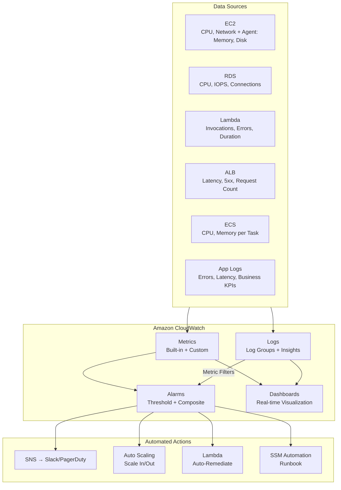
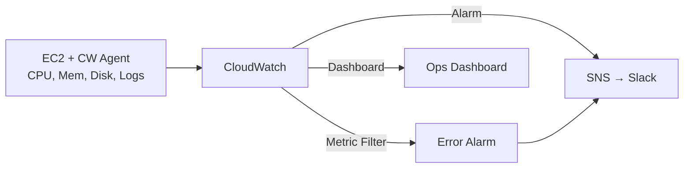

# Chapter 05 — Amazon CloudWatch

---

## Prerequisite Chapters
- Chapter 01 — AWS IAM (CloudWatch permissions, roles)
- Chapter 03 — Amazon EC2 (instance metrics, CloudWatch Agent)
- Chapter 04 — Amazon VPC (VPC Flow Logs)

## Used In Production Practicals
- Practical 12 — Auto Scaling (CloudWatch alarms trigger scaling)
- Practical 15 — Flagship Production Architecture (monitoring layer)
- Practical 34 — CloudWatch Monitoring
- Every practical — CloudWatch is the observability backbone

---

## 1. Learning Objectives

By the end of this chapter, you will be able to:

1. **Explain** CloudWatch components — metrics, alarms, logs, dashboards, Logs Insights.
2. **Monitor** EC2, RDS, Lambda, ALB, and ECS with built-in and custom metrics.
3. **Create** alarms with actions (SNS, Auto Scaling, EC2 recovery).
4. **Configure** CloudWatch Agent for custom metrics (memory, disk).
5. **Manage** CloudWatch Logs — log groups, retention, metric filters, subscriptions.
6. **Build** dashboards for real-time production visibility.
7. **Query** logs with CloudWatch Logs Insights.
8. **Troubleshoot** application issues using logs, metrics, and traces.
9. **Answer** interview questions about monitoring and observability.

---

## 2. What is Amazon CloudWatch?

Amazon CloudWatch is the **monitoring and observability** service for AWS. It collects metrics, logs, and events from your AWS resources and applications, letting you monitor, alert, and troubleshoot.

### CloudWatch = Three Pillars of Observability

| Pillar | CloudWatch Feature | What It Answers |
|--------|-------------------|----------------|
| **Metrics** | CloudWatch Metrics | How is my resource performing? (CPU, memory, latency) |
| **Logs** | CloudWatch Logs | What happened? (application logs, error details) |
| **Traces** | AWS X-Ray (see Chapter 41) | Where is the bottleneck? (request path tracing) |

### Key Characteristics
- **Built-in metrics** — automatically collected for most AWS services (free)
- **Custom metrics** — push your own data (memory, queue depth, business KPIs)
- **Alarms** — trigger actions based on metric thresholds
- **Dashboards** — real-time visualizations
- **Logs Insights** — SQL-like query engine for log data
- **Free tier** — 10 custom metrics, 5 GB log ingestion, 3 dashboards

---

## 3. Why Do We Need It?

### Without Monitoring
```
Problem happens → Users complain → Team investigates → Hours to find root cause
  - "The website is slow" → Which server? Which component?
  - "The database crashed" → Was it CPU? Memory? Disk? Connections?
  - "Errors increased" → Which function? What error? When did it start?
```

### With CloudWatch
```
CloudWatch detects anomaly → Alarm triggers → Auto-remediation + notification
  - CPU > 80% for 5 min → Auto Scale adds instances → team notified
  - 5xx errors > 10/min → alarm → PagerDuty → engineer investigates
  - Disk > 90% → Lambda archives logs → space freed automatically
```

---

## 4. Real-World Production Use Cases

### 1. Auto Scaling Trigger
CloudWatch CPU alarm triggers Auto Scaling to add/remove EC2 instances based on demand.

### 2. Application Error Alerting
Metric filter on "[ERROR]" in logs → CloudWatch alarm → SNS → Slack/PagerDuty.

### 3. Cost Monitoring
CloudWatch alarms on billing metrics → alert when spend exceeds threshold.

### 4. Database Performance
RDS Performance Insights + CloudWatch metrics → identify slow queries and resource bottlenecks.

### 5. Security Monitoring
VPC Flow Logs + CloudTrail logs → CloudWatch Logs → metric filters → detect suspicious activity.

---

## 5. Core Concepts

### Metrics

A metric is a time-ordered set of data points:

```
Namespace:  AWS/EC2
MetricName: CPUUtilization
Dimensions: InstanceId = i-0abc123
Timestamp:  2026-09-18T14:00:00Z
Value:      72.5
Unit:       Percent
```

### Important Default Metrics

| Service | Key Metrics | NOT Included (Need Agent) |
|---------|------------|--------------------------|
| **EC2** | CPUUtilization, NetworkIn/Out, StatusCheckFailed | ❌ Memory, ❌ Disk |
| **RDS** | CPUUtilization, FreeableMemory, ReadIOPS, DatabaseConnections | All included |
| **Lambda** | Invocations, Duration, Errors, Throttles, ConcurrentExecutions | All included |
| **ALB** | RequestCount, TargetResponseTime, HTTPCode_ELB_5XX | All included |
| **ECS** | CPUUtilization, MemoryUtilization (Container Insights) | Requires Container Insights |
| **S3** | BucketSizeBytes, NumberOfObjects (daily) | Request metrics (enable) |
| **SQS** | ApproximateNumberOfMessagesVisible, ApproximateAgeOfOldestMessage | All included |

> **Interview Favorite**: "EC2 does NOT report memory or disk metrics by default — you need the CloudWatch Agent."

### Metric Resolution

| Type | Period | Cost | Use Case |
|------|--------|------|----------|
| **Basic monitoring** | 5 minutes | Free | Default |
| **Detailed monitoring** | 1 minute | ~$3.50/instance/month | Production + Auto Scaling |
| **High-resolution custom** | 1 second | Higher | Real-time dashboards |

### CloudWatch Alarms

```
Alarm States:
  OK      → metric is within threshold
  ALARM   → metric breached threshold
  INSUFFICIENT_DATA → not enough data to evaluate

Alarm Components:
  Metric:     CPUUtilization
  Threshold:  > 80%
  Period:     300 seconds (5 minutes)
  Evaluation: 3 out of 5 data points breaching (M out of N)
  Action:     Send SNS + trigger Auto Scaling policy

Treat Missing Data:
  missing        → maintain current state
  notBreaching   → treat as OK
  breaching      → treat as ALARM
  ignore         → do nothing
```

### Alarm Actions

| Action Type | Targets | Use Case |
|-------------|---------|----------|
| **SNS** | Email, SMS, Slack, PagerDuty | Alert humans |
| **Auto Scaling** | Scale out/in policies | Handle load changes |
| **EC2** | Stop, terminate, reboot, recover | Instance remediation |
| **Lambda** | Custom function | Automated remediation |
| **Systems Manager** | Run automation | Complex runbooks |

### Composite Alarms
```
Composite Alarm = combines multiple alarms with AND/OR logic

Example: Alert only when BOTH CPU > 80% AND Memory > 90%
  → Reduces false positives
  → Suppress: don't alert during maintenance windows
```

### CloudWatch Logs

```
Hierarchy:
  Log Group: /application/prod/web-app
    └── Log Stream: i-0abc123/application.log
        └── Log Event: 2026-09-18T14:00:02Z [ERROR] DB connection timeout

Where logs come from:
  - EC2: CloudWatch Agent pushes log files
  - Lambda: Automatic (stdout/stderr)
  - ECS: awslogs log driver
  - RDS: Engine logs (PostgreSQL, MySQL)
  - VPC: VPC Flow Logs
  - API Gateway: Access/execution logs
  - CloudTrail: API audit logs
```

### Log Retention

| Retention | Monthly Cost (per GB stored) | Use Case |
|-----------|------------------------------|----------|
| 1 day | Lowest | Development |
| 7 days | Low | Short-term debug |
| 30 days | Moderate | **Standard production** |
| 90 days | Higher | Compliance |
| 365 days | High | Regulatory |
| Never expire | Highest | Avoid (use S3 export) |

### Metric Filters

Extract metrics from log data:
```
Filter Pattern: [ERROR]
  → Every "[ERROR]" in logs increments ErrorCount metric
  → Alarm: ErrorCount > 10 in 5 minutes → alert

Filter Pattern: { $.statusCode = 500 }
  → Parse JSON logs, count HTTP 500 errors
  → Custom metric: HTTP500Count

Filter Pattern: { $.responseTime > 3000 }
  → Track slow API responses (> 3 seconds)
```

### CloudWatch Logs Insights

SQL-like query engine for log analysis:
```
# Top 10 error messages in last hour
fields @timestamp, @message
| filter @message like /ERROR/
| stats count(*) as errorCount by @message
| sort errorCount desc
| limit 10

# P99 latency for API calls
fields @timestamp, responseTime
| stats percentile(responseTime, 99) as p99 by bin(5m)

# Find all 5xx errors with request details
fields @timestamp, httpMethod, path, statusCode
| filter statusCode >= 500
| sort @timestamp desc
| limit 50
```

---

## 6. Architecture

### CloudWatch in Production



---

## 7. Important Components

### CloudWatch Agent

The CloudWatch Agent collects **memory, disk, and application logs** from EC2 instances.

```bash
# Install (Amazon Linux 2023)
sudo yum install -y amazon-cloudwatch-agent

# Configure via wizard
sudo /opt/aws/amazon-cloudwatch-agent/bin/amazon-cloudwatch-agent-config-wizard

# Or use SSM Parameter Store config
sudo /opt/aws/amazon-cloudwatch-agent/bin/amazon-cloudwatch-agent-ctl \
    -a fetch-config -m ec2 \
    -s -c ssm:AmazonCloudWatch-Config
```

### Agent Configuration (JSON)
```json
{
    "agent": {
        "metrics_collection_interval": 60,
        "run_as_user": "cwagent"
    },
    "metrics": {
        "namespace": "CWAgent",
        "metrics_collected": {
            "mem": {
                "measurement": ["mem_used_percent"],
                "metrics_collection_interval": 60
            },
            "disk": {
                "measurement": ["disk_used_percent"],
                "resources": ["/"],
                "metrics_collection_interval": 60
            },
            "cpu": {
                "measurement": ["cpu_usage_idle", "cpu_usage_user", "cpu_usage_system"],
                "totalcpu": true
            }
        }
    },
    "logs": {
        "logs_collected": {
            "files": {
                "collect_list": [
                    {
                        "file_path": "/var/log/application/*.log",
                        "log_group_name": "/app/prod/web-app",
                        "log_stream_name": "{instance_id}/{hostname}",
                        "retention_in_days": 30
                    },
                    {
                        "file_path": "/var/log/httpd/error_log",
                        "log_group_name": "/app/prod/httpd-errors",
                        "log_stream_name": "{instance_id}",
                        "retention_in_days": 30
                    }
                ]
            }
        }
    }
}
```

### Container Insights (ECS/EKS)
```
Enable Container Insights for:
  - Per-task CPU and memory metrics
  - Network metrics per container
  - Application-level metrics
  
Cost: ~$0.30 per task per month
```

---

## 8. How It Works

### Metrics Pipeline
```
1. AWS service emits metric data point (e.g., CPUUtilization=72.5%)
2. CloudWatch stores data point with timestamp and dimensions
3. Data retained: 
   - 1-second resolution: 3 hours
   - 1-minute resolution: 15 days
   - 5-minute resolution: 63 days
   - 1-hour resolution: 455 days (15 months)
4. Alarm evaluates metric against threshold
5. If threshold breached → alarm state changes → actions triggered
```

### Logs Pipeline
```
1. CloudWatch Agent / SDK sends log event to Log Group
2. Log event stored in Log Stream
3. Metric Filters evaluate log events → generate metrics
4. Logs Insights queries scan log data on demand
5. Subscription Filters forward to Lambda/Kinesis/S3
```

---

## 9. AWS Console Walkthrough

### Create a CloudWatch Alarm
1. **CloudWatch Console** → **Alarms** → **Create alarm**
2. **Select metric**: EC2 → Per-Instance → CPUUtilization → select instance
3. **Conditions**: Greater than 80, for 3 out of 5 evaluation periods
4. **Actions**: In alarm → Send notification to SNS topic "ops-alerts"
5. **Name**: `high-cpu-prod-web-01`
6. Click **Create alarm**

### Create a Dashboard
1. **CloudWatch Console** → **Dashboards** → **Create dashboard**
2. Add widgets: Line chart (CPU), Number (errors), Logs table (recent errors)
3. Select metrics for each widget
4. Save dashboard

---

## 10. AWS CLI Commands

### Create Alarm
```bash
# CPU alarm → SNS + Auto Scaling
aws cloudwatch put-metric-alarm \
    --alarm-name "high-cpu-prod-web" \
    --metric-name CPUUtilization \
    --namespace AWS/EC2 \
    --statistic Average \
    --period 300 \
    --threshold 80 \
    --comparison-operator GreaterThanThreshold \
    --evaluation-periods 3 \
    --datapoints-to-alarm 3 \
    --alarm-actions \
        arn:aws:sns:ap-south-1:123:ops-alerts \
        arn:aws:autoscaling:ap-south-1:123:scalingPolicy:...:policyName/scale-out \
    --ok-actions arn:aws:sns:ap-south-1:123:ops-alerts \
    --dimensions Name=InstanceId,Value=i-0abc123 \
    --treat-missing-data missing
```

### Composite Alarm
```bash
aws cloudwatch put-composite-alarm \
    --alarm-name "prod-critical-composite" \
    --alarm-rule 'ALARM("high-cpu-prod") AND ALARM("high-memory-prod")' \
    --alarm-actions arn:aws:sns:ap-south-1:123:pagerduty
```

### Query Metrics
```bash
aws cloudwatch get-metric-statistics \
    --namespace AWS/EC2 \
    --metric-name CPUUtilization \
    --dimensions Name=InstanceId,Value=i-0abc123 \
    --start-time $(date -d '-1 hour' -u +%FT%TZ) \
    --end-time $(date -u +%FT%TZ) \
    --period 300 \
    --statistics Average Maximum \
    --output table
```

### Publish Custom Metric
```bash
aws cloudwatch put-metric-data \
    --namespace "MyApp/Production" \
    --metric-name "OrdersProcessed" \
    --value 42 \
    --unit Count \
    --dimensions Environment=production,Service=order-service
```

### CloudWatch Logs
```bash
# Create log group with retention
aws logs create-log-group --log-group-name /app/prod/web --retention-in-days 30

# Search logs with Logs Insights
aws logs start-query \
    --log-group-name /app/prod/web \
    --start-time $(date -d '-1 hour' +%s) \
    --end-time $(date +%s) \
    --query-string 'fields @timestamp, @message | filter @message like /ERROR/ | sort @timestamp desc | limit 20'

# Get query results
aws logs get-query-results --query-id $QUERY_ID
```

### Metric Filter
```bash
aws logs put-metric-filter \
    --log-group-name /app/prod/web \
    --filter-name "ErrorCount" \
    --filter-pattern "[ERROR]" \
    --metric-transformations '[{
        "metricName": "ApplicationErrors",
        "metricNamespace": "MyApp",
        "metricValue": "1",
        "defaultValue": 0
    }]'
```

### Python (Boto3) — Publish Custom Metric
```python
import boto3

cloudwatch = boto3.client('cloudwatch')

cloudwatch.put_metric_data(
    Namespace='MyApp/Production',
    MetricData=[{
        'MetricName': 'OrdersProcessed',
        'Value': 42,
        'Unit': 'Count',
        'Dimensions': [
            {'Name': 'Environment', 'Value': 'production'},
            {'Name': 'Service', 'Value': 'order-service'}
        ]
    }]
)
```

---

## 11. Hands-On Practical

### Practical: Production Monitoring Setup

#### Objective
Configure CloudWatch monitoring with Agent, alarms, metric filters, dashboard, and automated alerting.

#### Architecture


#### Step 1 — Install CloudWatch Agent
```bash
sudo yum install -y amazon-cloudwatch-agent
sudo /opt/aws/amazon-cloudwatch-agent/bin/amazon-cloudwatch-agent-ctl \
    -a fetch-config -m ec2 -s -c ssm:AmazonCloudWatch-Config
```

#### Step 2 — Create CPU Alarm
```bash
aws cloudwatch put-metric-alarm --alarm-name "high-cpu" \
    --metric-name CPUUtilization --namespace AWS/EC2 \
    --statistic Average --period 300 --threshold 80 \
    --comparison-operator GreaterThanThreshold \
    --evaluation-periods 3 --alarm-actions $SNS_ARN \
    --dimensions Name=InstanceId,Value=$INSTANCE_ID
```

#### Step 3 — Create Error Metric Filter + Alarm
```bash
aws logs put-metric-filter --log-group-name /app/prod/web \
    --filter-name ErrorCount --filter-pattern "[ERROR]" \
    --metric-transformations '[{"metricName":"AppErrors","metricNamespace":"MyApp","metricValue":"1"}]'

aws cloudwatch put-metric-alarm --alarm-name "high-errors" \
    --metric-name AppErrors --namespace MyApp \
    --statistic Sum --period 300 --threshold 10 \
    --comparison-operator GreaterThanThreshold \
    --evaluation-periods 1 --alarm-actions $SNS_ARN
```

#### Validation
```bash
# Verify agent is running
sudo /opt/aws/amazon-cloudwatch-agent/bin/amazon-cloudwatch-agent-ctl -a status

# Verify memory metric exists
aws cloudwatch list-metrics --namespace CWAgent --metric-name mem_used_percent

# Test alarm by generating CPU load
stress --cpu 4 --timeout 600
```

---

## 12. Production Architecture

### Production Monitoring Configuration
```
EC2 Monitoring:
  - Detailed monitoring enabled (1-minute)
  - CloudWatch Agent: memory, disk, app logs
  - Alarms: CPU > 80%, Memory > 85%, Disk > 90%
  - Status check alarm → EC2 auto-recovery

RDS Monitoring:
  - Enhanced Monitoring (60-second granularity)
  - Performance Insights enabled
  - Alarms: CPU > 80%, FreeableMemory < 500 MB,
            DatabaseConnections > 80%, FreeStorageSpace < 10 GB

Lambda Monitoring:
  - Alarms: Errors > 0, Duration > 80% of timeout,
            Throttles > 0, ConcurrentExecutions > 80% of limit

ALB Monitoring:
  - Alarms: TargetResponseTime > 2s, HTTPCode_ELB_5XX > 0,
            UnHealthyHostCount > 0

Application Monitoring:
  - Metric filters: [ERROR], [WARN], HTTP 5xx
  - Custom metrics: orders/sec, queue depth, response time
  - Logs Insights: saved queries for common investigations
```

---

## 13. Security Best Practices

1. **IAM roles** — CloudWatch Agent uses EC2 Instance Profile (CloudWatchAgentServerPolicy)
2. **Log group encryption** — encrypt with KMS for sensitive logs
3. **Log retention** — set retention to avoid unlimited growth (and cost)
4. **Cross-account** — use CloudWatch cross-account observability for centralized monitoring
5. **Alarm permissions** — restrict who can create/modify/delete alarms

---

## 14. High Availability

- CloudWatch is a **regional** service — automatically HA within a region
- No infrastructure to manage — fully managed by AWS
- For multi-region: use cross-account cross-region dashboards
- Alarms continue to evaluate even during partial service disruptions

---

## 15. Scalability

- **Unlimited custom metrics** — publish as many as needed
- **Unlimited log ingestion** — no cap on volume
- **Logs Insights** — queries scale to TB of log data
- **API limits** — PutMetricData: 500 TPS per account (request increase if needed)

---

## 16. Monitoring & Observability

### The Three Pillars

```
Metrics (CloudWatch)     → How much? (CPU 85%, latency 200ms)
Logs (CloudWatch Logs)   → What happened? (error stack trace)
Traces (X-Ray, Ch. 41)   → Where? (which service caused the slowdown)

Together = Full Observability
```

### Observability Maturity Model
```
Level 1: Basic monitoring (default EC2 metrics)
Level 2: Custom metrics (memory, disk, app metrics)
Level 3: Centralized logging (all logs in CloudWatch)
Level 4: Alerting & automation (alarms → auto-remediation)
Level 5: Distributed tracing (X-Ray service map)
Level 6: AIOps (anomaly detection, predictive insights)
```

---

## 17. Cost Optimization

### CloudWatch Cost Components
```
Metrics:        $0.30/metric/month (first 10,000)
Alarms:         $0.10/alarm/month (standard)
Logs Ingestion: $0.50/GB
Logs Storage:   $0.03/GB/month
Logs Insights:  $0.005/GB scanned
Dashboards:     $3/dashboard/month (first 3 free)
```

### Cost Optimization Strategies
1. **Set log retention** — don't keep logs forever (default: never expire!)
2. **Export old logs to S3** — $0.023/GB vs $0.03/GB
3. **Use metric math** — derive metrics instead of publishing new ones
4. **Remove unused alarms** — audit quarterly
5. **Use embedded metric format** — publish metrics from logs (no extra PutMetricData calls)

---

## 18. Disaster Recovery

- CloudWatch metrics: retained automatically (up to 15 months)
- CloudWatch Logs: replicated within region, not cross-region
- For DR: export logs to S3 with cross-region replication
- Alarms: regional — recreate in DR region using CloudFormation

---

## 19. Troubleshooting

### Problem 1: CloudWatch Agent Not Sending Metrics
```bash
# Check agent status
sudo /opt/aws/amazon-cloudwatch-agent/bin/amazon-cloudwatch-agent-ctl -a status

# Check agent logs
sudo tail -f /opt/aws/amazon-cloudwatch-agent/logs/amazon-cloudwatch-agent.log

# Common causes:
# - IAM role missing CloudWatchAgentServerPolicy
# - Agent config has wrong metric names
# - Agent not started after install
```

### Problem 2: Alarm Stuck in INSUFFICIENT_DATA
```
Causes:
  - Metric not being published (check namespace, dimensions)
  - Instance stopped (no data points)
  - Wrong treat-missing-data setting

Fix: Verify metric exists:
  aws cloudwatch list-metrics --namespace AWS/EC2 --metric-name CPUUtilization
```

### Problem 3: Log Group Not Receiving Logs
```bash
# CloudWatch Agent: check agent log for errors
# Lambda: check execution role has logs:CreateLogGroup, logs:PutLogEvents
# ECS: check task definition has awslogs log driver configured
# VPC Flow Logs: check IAM role for flow log delivery
```

---

## 20. Common Production Problems

| # | Problem | Root Cause | Prevention |
|---|---------|------------|------------|
| 1 | No memory metrics | CloudWatch Agent not installed | Install agent on all EC2 instances |
| 2 | Alarm noise (too many alerts) | Threshold too sensitive | Use composite alarms, M-out-of-N |
| 3 | Log costs exploding | No retention set (default: forever) | Set 30-day retention on all log groups |
| 4 | Can't find relevant logs | No structured logging | Use JSON logging format |
| 5 | Dashboard not updating | Wrong time range or namespace | Verify metric namespace and dimensions |
| 6 | Alarm didn't fire | Wrong evaluation period or statistic | Test alarms with simulated load |
| 7 | Agent crashing | Config error | Validate config before deploying |
| 8 | Cross-account monitoring | Not configured | Use CloudWatch cross-account observability |

---

## 21. Real-World Scenario

### Scenario: Production Outage Detection and Response

**Event**: At 2:00 AM, the e-commerce website starts returning 500 errors. The on-call engineer is asleep.

**CloudWatch Response**:
```
1. ALB metric: HTTPCode_ELB_5XX spikes from 0 to 500/min
2. Alarm "high-5xx-errors" triggers → state changes to ALARM
3. SNS sends notification to PagerDuty → pages on-call engineer
4. Composite alarm "critical-production" also triggers → escalation
5. Auto Scaling health check fails → unhealthy instances replaced

Engineer investigation:
6. Dashboard shows: CPU normal, Memory normal, 5xx spike at 2:00 AM
7. Logs Insights query:
   fields @timestamp, @message | filter @message like /ERROR/ | sort @timestamp desc
8. Root cause: RDS connection pool exhausted (max_connections reached)
9. Fix: Increase RDS instance size + add connection pooling (PgBouncer)
```

---

## 22. Interview Questions

### Basic Questions (10)

**Q1: What is Amazon CloudWatch?**
A: CloudWatch is the monitoring and observability service for AWS. It collects metrics, logs, and events. You create alarms to trigger automated actions and build dashboards for visibility.

**Q2: What metrics does EC2 NOT report by default?**
A: Memory utilization and disk usage. You must install the CloudWatch Agent to collect these. This is a very common interview question.

**Q3: What is the difference between basic and detailed monitoring?**
A: Basic: 5-minute interval, free. Detailed: 1-minute interval, ~$3.50/instance/month. Use detailed for production with Auto Scaling.

**Q4: What is a CloudWatch Alarm?**
A: An alarm monitors a metric and triggers actions when it breaches a threshold. States: OK, ALARM, INSUFFICIENT_DATA. Actions: SNS, Auto Scaling, EC2 recovery, Lambda.

**Q5: What is a CloudWatch Log Group?**
A: A container for log streams from the same source. Example: `/app/prod/web-app`. Each instance creates a log stream within the group. Retention, encryption, and access are set at the log group level.

**Q6: How do you get application logs into CloudWatch?**
A: Install the CloudWatch Agent and configure it to read log files. For Lambda: automatic. For ECS: use the `awslogs` log driver. For API Gateway: enable access/execution logging.

**Q7: What is a Metric Filter?**
A: A filter that scans log events and creates CloudWatch metrics when patterns are matched. Example: count occurrences of "[ERROR]" in logs. Can then create alarms on the extracted metric.

**Q8: What is CloudWatch Logs Insights?**
A: A SQL-like query engine for searching and analyzing log data. Supports aggregations (count, avg, percentile), filtering, sorting. Charged per GB scanned.

**Q9: How do CloudWatch Alarms integrate with Auto Scaling?**
A: You create a scaling policy that references a CloudWatch alarm. When CPU > threshold → alarm → scale-out policy adds instances. When CPU < threshold → alarm → scale-in policy removes instances.

**Q10: What is the CloudWatch free tier?**
A: 10 custom metrics, 10 alarms, 5 GB log ingestion, 3 dashboards, 1 million API requests per month. Basic monitoring (5-minute) for EC2 is free.

### Intermediate Questions (10)

**Q11: What is a composite alarm?**
A: An alarm that triggers based on a combination of other alarms using AND/OR logic. Reduces alert noise. Example: only page the engineer when both CPU AND memory are high.

**Q12: How do you monitor a Lambda function?**
A: CloudWatch automatically collects Invocations, Duration, Errors, Throttles, and ConcurrentExecutions. Create alarms on Errors > 0 and Duration > 80% of timeout. Logs go to CloudWatch automatically.

**Q13: What is the difference between CloudWatch Events and EventBridge?**
A: EventBridge is the evolution of CloudWatch Events. It adds custom event buses, schema registry, and third-party event sources. CloudWatch Events still works but new features go to EventBridge.

**Q14: How do you reduce CloudWatch Logs costs?**
A: 1) Set retention (don't keep forever). 2) Export to S3 for archival. 3) Use subscription filters to forward only important logs. 4) Use embedded metric format instead of separate PutMetricData calls.

**Q15: What is embedded metric format?**
A: A JSON format that lets you emit custom metrics from logs. CloudWatch automatically extracts metrics from log events without separate PutMetricData API calls. Cheaper and easier.

**Q16: How do you monitor ECS tasks?**
A: Enable Container Insights for CPU/memory per task. Use `awslogs` log driver for container logs. Create alarms on service-level metrics (CPU, memory utilization).

**Q17: What is anomaly detection in CloudWatch?**
A: CloudWatch uses ML to create a band of expected values. Alarm triggers when metric falls outside the band. Useful when you don't know the exact threshold (e.g., request count varies by time of day).

**Q18: How do you create a cross-account dashboard?**
A: Enable CloudWatch cross-account observability. Set up source accounts (share metrics/logs) and monitoring account (aggregate dashboards). Uses IAM roles for cross-account access.

**Q19: What is the difference between metric math and custom metrics?**
A: Metric math applies formulas to existing metrics (e.g., error rate = errors / total requests). Custom metrics are new data points you publish. Metric math is free; custom metrics cost $0.30/month each.

**Q20: How does CloudWatch integrate with Auto Scaling?**
A: Target tracking: CloudWatch metric → maintained at target (e.g., CPU at 60%). Step scaling: alarm thresholds trigger specific scaling actions. CloudWatch alarm → scaling policy → ASG adjusts capacity.

### Advanced Questions (10)

**Q21: Design a monitoring strategy for a microservices architecture.**
A: Per-service: custom metrics (latency, error rate, throughput). Centralized: cross-service dashboard. Distributed tracing: X-Ray. Alarms: per-service + composite for cascading failures. Logs: structured JSON, centralized log group per service.

**Q22: CloudWatch Logs costs are $5,000/month. How do you reduce them?**
A: 1) Audit log groups — delete unused ones. 2) Reduce log verbosity (DEBUG → INFO in production). 3) Set retention (30 days). 4) Export to S3 for long-term storage. 5) Use subscription filters to drop noise. 6) Compress before ingestion where possible.

**Q23: How do you detect and alert on a slow database query from CloudWatch?**
A: RDS exports slow query logs to CloudWatch. Create a metric filter for slow queries. Or use Performance Insights (built into RDS) for top SQL analysis. Set alarm on ReadLatency or DiskQueueDepth metrics.

**Q24: Explain CloudWatch Contributor Insights.**
A: Analyzes log data to find top contributors (e.g., top 10 IP addresses generating errors, top API endpoints by latency). Creates real-time graphs. Useful for identifying abuse or performance bottlenecks.

**Q25: Your alarm fired but the team says "nothing happened." Investigation?**
A: 1) Check alarm history for exact breach time. 2) Verify metric data (was it a spike?). 3) Check alarm configuration (period, evaluation, statistic). 4) Check treat-missing-data setting. 5) If legitimate: adjust threshold or use composite alarm.

**Q26: How do you implement SLO monitoring with CloudWatch?**
A: Define SLI metrics (availability, latency). Create metric math for SLO: e.g., availability = 1 - (5xx errors / total requests). Dashboard widget showing current SLO vs target. Alarm when error budget is nearly consumed.

**Q27: Describe CloudWatch Synthetics.**
A: Canary functions that run on a schedule to test endpoints. Simulate user behavior (login, checkout). Report availability and latency. Alert when canary fails. Like external monitoring from AWS-managed infrastructure.

**Q28: How do you monitor a serverless application end-to-end?**
A: API Gateway access logs + Lambda execution logs + DynamoDB metrics + X-Ray traces. Custom metrics for business KPIs. Alarm on each component. Unified dashboard showing request flow latency.

**Q29: What is CloudWatch ServiceLens?**
A: Integrates CloudWatch metrics, logs, and X-Ray traces into a single view. Shows service map with health indicators. Click a service to see metrics, logs, and traces together. Faster root cause analysis.

**Q30: How do you prevent alarm fatigue in a large infrastructure?**
A: 1) Composite alarms (multiple conditions). 2) M-out-of-N evaluation (not single spike). 3) Suppress during maintenance windows. 4) Tiered severity (INFO/WARN/CRITICAL). 5) Runbook for each alarm. 6) Regular alarm audit.

### Scenario-Based Questions (10)

**Q31: CPU alarm fires at 3 AM on production EC2. Walk through your response.**
A: 1) Check CloudWatch dashboard: CPU, memory, network. 2) Check ALB metrics: is traffic higher? 3) Logs Insights: any error spikes? 4) If traffic-driven: verify Auto Scaling added instances. 5) If not traffic: SSM Session Manager → `top` to find the process. 6) Mitigate → investigate → document.

**Q32: RDS alarms show FreeableMemory dropping to zero. What do you do?**
A: 1) Check DatabaseConnections (connection leak?). 2) Check Performance Insights for memory-hungry queries. 3) Short-term: failover to standby (Multi-AZ). 4) Long-term: scale up instance class. 5) Fix: optimize queries, add connection pooling.

**Q33: CloudWatch shows Lambda errors spiking but the function code hasn't changed. Why?**
A: 1) Check downstream dependencies (DynamoDB throttled? API timeout?). 2) Check concurrent executions (throttling?). 3) Check memory allocation (OOM?). 4) Check timeout (downstream latency increase?). 5) Check environment variables (Secrets Manager rotation changed credentials?).

**Q34: Your team can't find logs for a specific ECS task that crashed. How?**
A: 1) Check task definition: is `awslogs` log driver configured? 2) Check execution role: has CloudWatch Logs permissions? 3) Check log group: does it exist? 4) Check task stop reason: `aws ecs describe-tasks --tasks TASK_ARN`. 5) If task crashed before log driver started: check ECS events in the service.

**Q35: A billing alarm shows AWS costs doubled this month. How do you investigate?**
A: 1) Cost Explorer: filter by service → which service grew? 2) If CloudWatch Logs: check log groups for unexpected growth. 3) If EC2: check instance count (ASG max too high?). 4) If NAT Gateway: add VPC endpoints for S3. 5) Tag resources for cost allocation.

**Q36: Your dashboard shows ALB returning 503 errors but EC2 instances show low CPU. Why?**
A: ALB 503 = no healthy targets. Check: 1) Target Group health checks (wrong path/port?). 2) EC2 health check failed (app crashed but OS is fine). 3) Security group (ALB can't reach EC2?). 4) Deregistration in progress.

**Q37: You need to monitor custom business metrics (orders per minute). How?**
A: Application publishes custom metric using `put-metric-data` or embedded metric format in logs. Create alarm when orders < expected (detect outage). Dashboard showing orders per minute trend. Compare to previous day/week.

**Q38: All CloudWatch alarms in a region go to INSUFFICIENT_DATA simultaneously. What happened?**
A: Likely a regional AWS issue affecting CloudWatch or the monitored services. Check AWS Health Dashboard. If metrics are actually being published, it may be a CloudWatch service issue. Wait for resolution; escalate via AWS Support.

**Q39: You're asked to implement "golden signal" monitoring. What are the metrics?**
A: The four golden signals (Google SRE): 1) Latency (TargetResponseTime). 2) Traffic (RequestCount). 3) Errors (HTTPCode_5XX). 4) Saturation (CPU, Memory, Connections). Implement using ALB + EC2 + RDS metrics.

**Q40: How do you troubleshoot why a CloudWatch Alarm action (Lambda) didn't execute?**
A: 1) Check alarm history — did state change to ALARM? 2) Check alarm action: is Lambda ARN correct? 3) Check Lambda resource-based policy: does CloudWatch have permission to invoke? 4) Check Lambda logs for execution errors. 5) Check SNS delivery logs if going through SNS.

---

## 23. Scenario-Based Interview Questions

*(Covered in section 22 above — Q31 through Q40)*

---

## 24. Common Mistakes

1. **Not installing CloudWatch Agent** — missing memory/disk metrics
2. **No log retention set** — logs grow forever, costs skyrocket
3. **Alarm on single data point** — causes false positives (use M-out-of-N)
4. **Not using composite alarms** — too many individual alerts
5. **Ignoring detailed monitoring** — 5-minute granularity too coarse for Auto Scaling
6. **No structured logging** — can't parse logs effectively with Insights
7. **Missing alarm actions** — alarm fires but nobody is notified
8. **Not testing alarms** — alarm config wrong, only discovered during real incident
9. **Custom metrics without dimensions** — can't filter by instance/service
10. **Logging to same region only** — no DR for log data

---

## 25. Production Checklist

- [ ] CloudWatch Agent installed on all EC2 instances
- [ ] Memory and disk metrics collected
- [ ] Application logs streaming to CloudWatch Logs
- [ ] Log retention set on ALL log groups (30 days default)
- [ ] Detailed monitoring enabled for production instances
- [ ] Alarms for CPU, memory, disk on all instances
- [ ] Alarms for RDS (CPU, memory, connections, storage)
- [ ] Alarms for ALB (5xx, latency, unhealthy hosts)
- [ ] Alarms for Lambda (errors, throttles, duration)
- [ ] All alarms connected to SNS → ops team notification
- [ ] Metric filters for application error patterns
- [ ] Composite alarms for critical scenarios
- [ ] Dashboard for production overview
- [ ] Logs Insights queries saved for common investigations
- [ ] Container Insights enabled (if using ECS/EKS)
- [ ] Cross-account monitoring configured (if multi-account)

---

## 26. Chapter Summary

CloudWatch is your eyes and ears in AWS. Key takeaways:

1. **EC2 doesn't report memory/disk** — install CloudWatch Agent (interview favorite!)
2. **Alarms drive automation** — SNS, Auto Scaling, Lambda, SSM
3. **Logs Insights for investigation** — SQL-like queries on log data
4. **Metric filters extract metrics from logs** — "[ERROR]" → ErrorCount metric
5. **Dashboards for visibility** — build one for each production service
6. **Detailed monitoring for production** — 1-minute granularity needed for Auto Scaling
7. **Set log retention** — default is forever (costs grow silently)
8. **Custom metrics for business KPIs** — orders/sec, queue depth, revenue
9. **Composite alarms reduce noise** — combine metrics for smarter alerting
10. **Three pillars** — Metrics (CloudWatch) + Logs (CloudWatch Logs) + Traces (X-Ray)

If you can't see it, you can't fix it. CloudWatch makes the invisible visible.

---
---

# 🔬 Practical Lab 26 — Production Monitoring

## Lab Overview
| Item | Detail |
|------|--------|
| **Difficulty** | Intermediate |
| **Duration** | 35 minutes |
| **Cost** | Free tier includes 10 metrics, 3 dashboards |
| **Prerequisites** | Practical 13 (ALB), Practical 15 (ASG) |
| **Lab Environment** | Environment 7 — Storage & Security |

## Business Scenario
> Your production application is running. You need comprehensive monitoring: CPU/memory metrics, application logs, alarms for critical thresholds, and a dashboard the ops team can use.

### Step 1 — Create CloudWatch Dashboard
1. **CloudWatch** → **Dashboards** → **Create dashboard**: `prod-monitoring`
2. Add widgets: EC2 CPU, ALB RequestCount, RDS Connections, ALB 5xx Errors

📸 **Screenshot 01** — Production Dashboard
> **What you should see**: Multi-widget dashboard showing real-time metrics

### Step 2 — Create Alarm
1. **Alarms** → **Create alarm**
   - **Metric**: EC2 CPUUtilization
   - **Threshold**: > 80% for 2 consecutive periods
   - **Action**: SNS → `prod-alerts` topic → email

📸 **Screenshot 02** — CPU Alarm Created
> **Verify**: Alarm shows "OK" state (CPU below threshold)

### Step 3 — Send Application Logs
```bash
# Install and configure CloudWatch Agent on EC2
sudo dnf install -y amazon-cloudwatch-agent
# Configure to send /var/log/nginx/access.log to CloudWatch
```

📸 **Screenshot 03** — Logs Appearing in CloudWatch
> **What you should see**: Nginx access logs in CloudWatch Logs group

🎯 **Interview Insight**: "What do you monitor in production?"
> **Strong answer**: "Four Golden Signals: latency (ALB TargetResponseTime), traffic (RequestCount), errors (5xx rate), saturation (CPU, memory, disk). Plus: RDS connections, queue depth, custom business metrics. All with alarms → SNS → PagerDuty."

---
---

# 🔬 Practical Lab 27 — CloudWatch Logs Insights

### Step 1 — Run Logs Insights Query
```
fields @timestamp, @message
| filter @message like /500/
| stats count() by bin(5m)
| sort @timestamp desc
```

📸 **Screenshot 01** — Logs Insights Query Results
> **What you should see**: Bar chart showing 500 errors over time
> **Verify**: Can identify when errors occurred and their frequency
