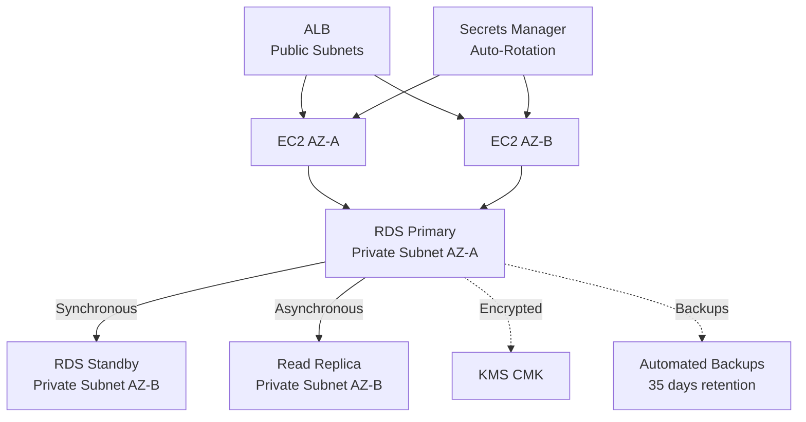
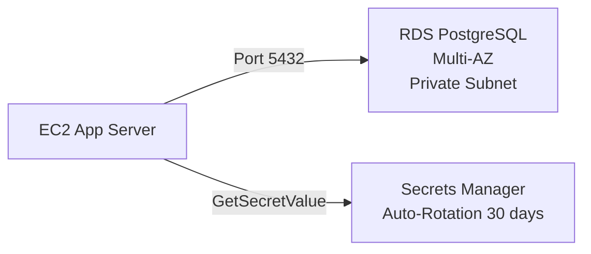
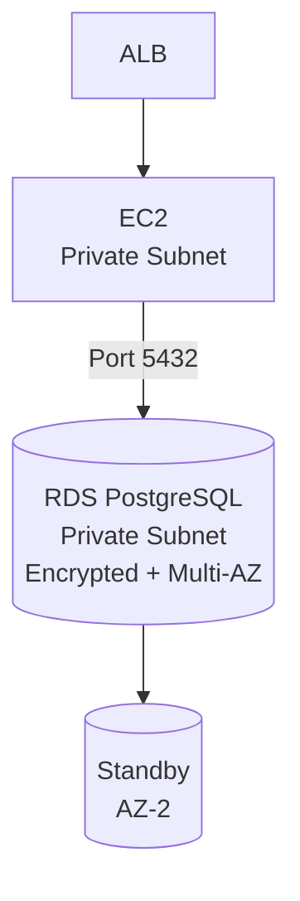

# Chapter 06 — Amazon RDS

---

## Prerequisite Chapters
- Chapter 01 — AWS IAM (RDS access, Secrets Manager integration)
- Chapter 04 — Amazon VPC (subnet groups, security groups, private placement)
- Chapter 22 — AWS KMS (encryption at rest)

## Used In Production Practicals
- Practical 11 — HA Application (ALB → ASG → RDS)
- Practical 13 — Production RDS
- Practical 14 — Secure Application (Secrets Manager → RDS)
- Practical 15 — Flagship Production Architecture

---

## 1. Learning Objectives

By the end of this chapter, you will be able to:

1. **Explain** RDS engine types, deployment options, and Multi-AZ vs Read Replicas.
2. **Create** a production RDS instance with proper VPC, subnet group, and security.
3. **Configure** Multi-AZ for high availability and Read Replicas for read scaling.
4. **Implement** encryption, automated backups, and manual snapshots.
5. **Integrate** with Secrets Manager for credential management.
6. **Monitor** with CloudWatch, Performance Insights, and Enhanced Monitoring.
7. **Troubleshoot** connection failures, performance issues, and failover scenarios.
8. **Answer** interview questions about production database architecture.

---

## 2. What is Amazon RDS?

Amazon RDS is a **managed relational database** service that handles provisioning, patching, backups, and failover. You focus on the application; AWS manages the database infrastructure.

### Supported Engines

| Engine | Use Case |
|--------|----------|
| **PostgreSQL** | Open-source, feature-rich, complex queries |
| **MySQL** | Web applications, WordPress, popular |
| **MariaDB** | MySQL-compatible, community-driven |
| **Oracle** | Enterprise workloads, legacy applications |
| **SQL Server** | .NET applications, Microsoft ecosystem |
| **Aurora** | AWS-native, 5x MySQL / 3x PostgreSQL performance |

### RDS = Managed (NOT Serverless by Default)
```
What AWS manages:           What YOU manage:
  ✅ Hardware provisioning     🔧 Schema design
  ✅ OS patching               🔧 Query optimization
  ✅ Engine patches            🔧 Application connectivity
  ✅ Automated backups         🔧 Parameter Groups
  ✅ Multi-AZ failover         🔧 Security groups
  ✅ Monitoring                🔧 Secrets rotation
  ❌ NO SSH access              🔧 Read Replica promotion
```

---

## 3. Why Do We Need It?

### Without RDS (Self-Managed on EC2)
```
You manage:
  - EC2 instance + EBS volume
  - Database engine installation
  - OS patching + engine patching
  - Backup scripts (cron + pg_dump)
  - Replication setup (complex!)
  - Failover mechanisms (custom scripts)
  - Monitoring (manual CloudWatch setup)

Time: 20-30 hours/month on DB operations
```

### With RDS
```
AWS manages the infrastructure:
  - One-click Multi-AZ (automatic failover)
  - Automated backups (point-in-time recovery)
  - Read Replicas (one command)
  - Monitoring built-in (Performance Insights)
  - Patching scheduled (maintenance window)

Time: 2-5 hours/month on optimization
```

---

## 4. Real-World Production Use Cases

### 1. Web Application Backend
ALB → EC2 (ASG) → RDS PostgreSQL (Multi-AZ). Read-heavy? Add Read Replicas.

### 2. Microservices Database per Service
Each microservice owns its RDS instance. Separate schemas, separate scaling.

### 3. Analytics with Read Replicas
Production RDS → Read Replica → Analytics/BI tools query the replica (no production impact).

---

## 5. Core Concepts

### Multi-AZ vs Read Replica

| Feature | Multi-AZ | Read Replica |
|---------|----------|-------------|
| **Purpose** | High availability (failover) | Read scaling (performance) |
| **Replication** | Synchronous | Asynchronous |
| **Standby readable?** | ❌ No (standby only) | ✅ Yes (read traffic) |
| **Failover** | Automatic (60-120 seconds) | Manual (promote to standalone) |
| **Cross-region** | No (same region, different AZ) | ✅ Yes (DR + global reads) |
| **DNS change** | Automatic (same endpoint) | New endpoint |
| **Cost** | 2x instance (standby) | Per-replica instance |

### Production Database Architecture
```
                    Primary (AZ-A)
                   /            \
    (Synchronous) /              \ (Asynchronous)
                 /                \
         Standby (AZ-B)      Read Replica (AZ-B)
         (Multi-AZ failover)  (Read traffic / Analytics)
                               |
                         Read Replica (Region B)
                         (Cross-region DR)
```

### Subnet Group
```
A DB Subnet Group specifies which subnets RDS can use.
  - Must span at least 2 AZs
  - Use PRIVATE subnets (never public!)
  - Multi-AZ: RDS places primary in one subnet, standby in another
```

### Parameter Groups
```
Parameter groups control database engine configuration:
  - max_connections: 100 → 500
  - shared_buffers: 25% of memory
  - log_min_duration_statement: 1000 (log slow queries > 1 sec)
  - work_mem: 256MB
  
Create custom parameter group (don't modify default!)
Apply to instance (some require reboot)
```

### Storage Types

| Type | IOPS | Use Case |
|------|------|----------|
| **gp3** | 3,000 baseline (up to 16,000) | General purpose (default) |
| **io1/io2** | Up to 64,000 | High-performance OLTP |
| **Magnetic** | — | Legacy (don't use) |

---

## 6. Architecture

### Production RDS Architecture



---

## 7. Important Components

### Security Configuration
```
1. VPC Placement: ALWAYS in private subnets
2. Security Group: Allow inbound only from app SG (port 5432/3306)
3. Encryption: Enable at creation (KMS CMK) — cannot add later!
4. IAM Authentication: Optionally use IAM tokens instead of passwords
5. SSL/TLS: Force encrypted connections (rds.force_ssl=1)
6. Secrets Manager: Store and rotate credentials
7. Public Access: NEVER enable (default: disabled)
```

### Backup Strategy
```
Automated Backups:
  - Daily full backup (during backup window)
  - Transaction logs every 5 minutes
  - Point-in-time recovery to any second in retention period
  - Retention: 1-35 days (production: 35 days)
  - Stored in S3 (managed by AWS)

Manual Snapshots:
  - User-initiated, persist until deleted
  - Use before major changes (engine upgrade, parameter change)
  - Can copy cross-region (for DR)
  - Can share cross-account
```

---

## 8. How It Works

### Connection Flow
```
1. Application reads DB credentials from Secrets Manager
2. Application connects to RDS endpoint (DNS name)
3. DNS resolves to primary instance IP
4. Security group allows traffic from app security group
5. RDS authenticates with username/password
6. SSL/TLS encrypts the connection
7. Queries execute on primary instance
8. Read Replicas: application uses replica endpoint for reads
```

### Failover Process (Multi-AZ)
```
1. Primary fails (hardware, AZ outage, maintenance)
2. RDS detects failure (health check)
3. RDS promotes standby to primary (60-120 seconds)
4. DNS endpoint updated to point to new primary
5. Application reconnects using same endpoint (no code change)
6. Previous primary becomes standby (when recovered)
```

---

## 9. AWS Console Walkthrough

### Create Production RDS Instance
1. **RDS Console** → **Create database**
2. **Engine**: PostgreSQL 16
3. **Template**: Production
4. **Deployment**: Multi-AZ DB instance
5. **Instance class**: db.r6g.large
6. **Storage**: gp3, 100 GB, storage auto-scaling (max 500 GB)
7. **VPC**: Select production VPC
8. **Subnet group**: Private subnets
9. **Public access**: No
10. **Security group**: Allow 5432 from app SG only
11. **Encryption**: Enable (select CMK)
12. **Backup retention**: 35 days
13. **Performance Insights**: Enable (7 days free)
14. **Maintenance window**: Sunday 03:00-04:00

---

## 10. AWS CLI Commands

```bash
# Create subnet group
aws rds create-db-subnet-group \
    --db-subnet-group-name prod-db-subnets \
    --db-subnet-group-description "Production DB subnets" \
    --subnet-ids $PRIV_SUBNET_A $PRIV_SUBNET_B

# Create RDS instance
aws rds create-db-instance \
    --db-instance-identifier prod-db \
    --engine postgres --engine-version 16.4 \
    --db-instance-class db.r6g.large \
    --allocated-storage 100 --max-allocated-storage 500 \
    --storage-type gp3 \
    --multi-az \
    --db-subnet-group-name prod-db-subnets \
    --vpc-security-group-ids $DB_SG \
    --master-username admin \
    --manage-master-user-password \
    --kms-key-id alias/rds-key \
    --storage-encrypted \
    --backup-retention-period 35 \
    --preferred-backup-window "02:00-03:00" \
    --preferred-maintenance-window "sun:03:00-sun:04:00" \
    --enable-performance-insights \
    --no-publicly-accessible

# Create Read Replica
aws rds create-db-instance-read-replica \
    --db-instance-identifier prod-db-replica \
    --source-db-instance-identifier prod-db

# Create manual snapshot
aws rds create-db-snapshot \
    --db-instance-identifier prod-db \
    --db-snapshot-identifier prod-db-before-upgrade

# Restore from snapshot
aws rds restore-db-instance-from-db-snapshot \
    --db-instance-identifier prod-db-restored \
    --db-snapshot-identifier prod-db-before-upgrade

# Failover (for testing)
aws rds reboot-db-instance --db-instance-identifier prod-db --force-failover
```

---

## 11. Hands-On Practical

### Practical: Production RDS with Multi-AZ and Secrets Manager

#### Architecture


#### Step 1 — Create RDS with Managed Password
```bash
aws rds create-db-instance \
    --db-instance-identifier practical-db \
    --engine postgres --engine-version 16.4 \
    --db-instance-class db.t3.medium \
    --allocated-storage 20 \
    --multi-az \
    --manage-master-user-password \
    --no-publicly-accessible \
    --db-subnet-group-name prod-db-subnets \
    --vpc-security-group-ids $DB_SG
```

#### Step 2 — Connect from EC2
```bash
# Get password from Secrets Manager
DB_SECRET=$(aws secretsmanager get-secret-value --secret-id rds!db-... --query SecretString --output text)
DB_PASS=$(echo $DB_SECRET | jq -r .password)
DB_USER=$(echo $DB_SECRET | jq -r .username)

# Connect
psql -h prod-db.abc.rds.amazonaws.com -U $DB_USER -d postgres
```

---

## 12. Production Architecture

```
Instance Sizing:
  - Start with db.r6g.large (2 vCPU, 16 GB)
  - Monitor with Performance Insights
  - Scale vertically (larger instance) or horizontally (read replicas)

Storage:
  - gp3 with auto-scaling (handles growth automatically)
  - Enable storage auto-scaling with max threshold

Networking:
  - Private subnet only (never public)
  - App SG → DB SG (only port 5432/3306)
  - No internet access needed

Credentials:
  - Secrets Manager with 30-day rotation
  - --manage-master-user-password (RDS manages via Secrets Manager)
```

---

## 13. Security Best Practices

1. **Private subnets only** — never publicly accessible
2. **Security group** — allow only app SG on DB port
3. **Encryption at rest** — KMS CMK, enable at creation
4. **Encryption in transit** — force SSL (rds.force_ssl=1)
5. **Secrets Manager** — auto-rotate credentials
6. **IAM authentication** — optional token-based auth
7. **No default port** — change from 5432/3306 if required by policy
8. **Audit logging** — enable PostgreSQL/MySQL audit logs → CloudWatch

---

## 14. High Availability

- **Multi-AZ**: synchronous replication, automatic failover (60-120 sec)
- **Multi-AZ Cluster**: 2 readable standbys (Aurora-like, faster failover ~35 sec)
- **Read Replicas**: async, manual promotion for DR

---

## 15. Scalability

- **Vertical**: change instance class (brief outage in single-AZ, failover in Multi-AZ)
- **Read scaling**: up to 15 Read Replicas
- **Storage auto-scaling**: automatically grows
- **Connection pooling**: RDS Proxy or PgBouncer for connection management

---

## 16. Monitoring & Observability

```
CloudWatch Metrics:
  - CPUUtilization, FreeableMemory, FreeStorageSpace
  - ReadIOPS, WriteIOPS, ReadLatency, WriteLatency
  - DatabaseConnections, DiskQueueDepth

Performance Insights:
  - Top SQL queries by load
  - Wait events (IO, Lock, CPU)
  - Database load vs max vCPU
  - 7 days free retention

Enhanced Monitoring (OS-level):
  - OS processes, memory breakdown
  - 1-second granularity
  - Published to CloudWatch Logs

Alarms:
  CPU > 80% → alert
  FreeableMemory < 500 MB → alert
  FreeStorageSpace < 10 GB → alert
  DatabaseConnections > 80% of max → alert
```

---

## 17. Cost Optimization

```
Instance Costs:
  - Reserved Instances: 30-60% savings (1 or 3 year)
  - Right-size: don't over-provision
  - Graviton (r6g): 20% cheaper, 40% better perf

Storage Costs:
  - gp3 over gp2: same IOPS, 20% cheaper
  - Storage auto-scaling: don't over-provision

Backup Costs:
  - Backup storage up to DB size is free
  - Beyond that: $0.095/GB/month
  - Manual snapshots: charged until deleted

Read Replicas:
  - Same cost as primary
  - Use for read-heavy workloads, not "just in case"
```

---

## 18. Disaster Recovery

```
RPO (Recovery Point Objective):
  - Automated backups: ~5 minutes (transaction log interval)
  - Snapshots: last snapshot time

RTO (Recovery Time Objective):
  - Multi-AZ failover: 60-120 seconds
  - Restore from snapshot: 15-60 minutes
  - Cross-region replica promotion: minutes

DR Strategy:
  - Multi-AZ: automatic, same region
  - Cross-region Read Replica: manual failover, different region
  - Cross-region snapshot copy: restore in DR region
```

---

## 19. Troubleshooting

### Problem 1: "Connection Refused" from EC2 to RDS
```
Check (in order):
  1. RDS instance status: "available"?
  2. Security group: allows inbound from EC2 SG on port 5432/3306?
  3. Subnet group: EC2 and RDS in same VPC?
  4. Route table: EC2 subnet can reach RDS subnet?
  5. RDS publicly accessible: should be "No" (use private connection)
  6. DNS resolution: can EC2 resolve the RDS endpoint?
```

### Problem 2: High CPU on RDS
```
Investigation:
  1. Performance Insights → top SQL by load
  2. Slow query log → queries > 1 second
  3. Check DatabaseConnections (connection leak?)
  4. Check read/write IOPS (storage bottleneck?)

Fix:
  - Optimize slow queries (indexes, query rewrite)
  - Add Read Replicas for read-heavy workloads
  - Scale up instance class
  - Use connection pooling (RDS Proxy)
```

### Problem 3: Storage Full
```
Symptoms: writes fail, "could not extend file" errors

Check:
  - FreeStorageSpace metric → 0
  - Storage auto-scaling enabled?

Fix:
  - Enable storage auto-scaling
  - Manually modify allocated storage
  - Clean up: VACUUM (PostgreSQL), optimize tables (MySQL)
  - Delete old data, archive to S3
```

---

## 20. Common Production Problems

| # | Problem | Root Cause | Prevention |
|---|---------|------------|------------|
| 1 | Connection refused | Security group wrong | App SG → DB SG rule |
| 2 | Encryption can't be added | Must be set at creation | Always encrypt at creation |
| 3 | Failover takes long | Single-AZ | Enable Multi-AZ |
| 4 | Slow queries | Missing indexes | Performance Insights + regular analysis |
| 5 | Connection limit hit | Connection leak | Use RDS Proxy / PgBouncer |
| 6 | Storage full | No auto-scaling | Enable storage auto-scaling |
| 7 | Password in code | Hardcoded credentials | Use Secrets Manager |
| 8 | Public database | PubliclyAccessible=Yes | Never enable public access |

---

## 21. Real-World Scenario

### Scenario: Database Failover During Peak Traffic

**Event**: RDS primary in AZ-A experiences hardware failure during Black Friday sale.

**Response**:
1. RDS detects failure → initiates automatic failover
2. Standby in AZ-B promoted to primary (90 seconds)
3. DNS endpoint updated → applications reconnect
4. Some connections dropped → application retries (built-in retry logic)
5. Monitoring: CloudWatch alarm fires for failover event → team notified
6. Post-incident: verify new primary performance, check replica lag

---

## 22. Interview Questions

### Basic Questions (10)

**Q1: What is Amazon RDS?**
A: A managed relational database service. AWS handles provisioning, patching, backups, and failover. You manage the schema, queries, and application connectivity.

**Q2: What is Multi-AZ?**
A: Synchronous replication to a standby in a different AZ. Automatic failover in 60-120 seconds. Same endpoint — application doesn't need to change.

**Q3: Multi-AZ vs Read Replica?**
A: Multi-AZ: HA (failover), synchronous, standby NOT readable. Read Replica: read scaling, asynchronous, IS readable. Use both in production.

**Q4: Can you encrypt an existing unencrypted RDS instance?**
A: No. You must create a snapshot, copy it with encryption, then restore from the encrypted snapshot. Encryption must be set at creation.

**Q5: How does automated backup work?**
A: Daily full backup + transaction logs every 5 minutes. Point-in-time recovery to any second within retention period (1-35 days). Stored in S3 by AWS.

**Q6: What is a DB Subnet Group?**
A: Defines which VPC subnets RDS can use. Must span at least 2 AZs. Use private subnets. Multi-AZ places primary and standby in different subnets.

**Q7: What is RDS Proxy?**
A: A fully managed connection pooler for RDS. Reduces connection overhead, handles failover transparently, supports IAM authentication. Useful for Lambda (many short connections).

**Q8: What is Performance Insights?**
A: A monitoring tool showing database load, top SQL queries, and wait events. Identifies slow queries and resource bottlenecks. 7 days free retention.

**Q9: What happens during an RDS failover?**
A: Standby promoted to primary, DNS endpoint updated, connections may drop briefly (retry in app). 60-120 seconds for standard Multi-AZ. ~35 seconds for Multi-AZ Cluster.

**Q10: How do you connect securely to RDS?**
A: Private subnet, security group restricts to app SG, encryption at rest (KMS), encryption in transit (SSL), Secrets Manager for credentials.

### Intermediate Questions (10)

**Q11: How do Read Replicas help with performance?**
A: Route read-heavy queries (reports, analytics) to Read Replicas. Primary handles writes only. Up to 15 replicas per instance.

**Q12: Can a Read Replica be in a different region?**
A: Yes. Cross-region Read Replicas provide disaster recovery and local read performance. Can be promoted to standalone for DR.

**Q13: What is the difference between gp3 and io1 storage?**
A: gp3: 3,000 IOPS baseline, up to 16,000, 20% cheaper. io1: up to 64,000 IOPS, consistent performance. Use gp3 for most workloads, io1 for high-IOPS OLTP.

**Q14: How does Secrets Manager integrate with RDS?**
A: `--manage-master-user-password` flag: RDS creates and manages the password in Secrets Manager. Auto-rotation Lambda updates both Secrets Manager and RDS. Application reads from Secrets Manager.

**Q15: What is a Parameter Group?**
A: Database engine configuration (max_connections, shared_buffers). Create custom group, don't modify default. Some params need reboot. Apply at instance level.

**Q16-Q20**: *(Cover: RDS Proxy for Lambda, storage auto-scaling, Enhanced Monitoring, maintenance windows, and engine version upgrades.)*

### Advanced Questions (10)

**Q21: Design a production RDS architecture for a high-traffic e-commerce site.**
A: PostgreSQL on db.r6g.xlarge, Multi-AZ, 2 Read Replicas, gp3 with auto-scaling, KMS encryption, Secrets Manager rotation, Performance Insights, CloudWatch alarms (CPU, memory, connections, storage), private subnet, RDS Proxy for connection management.

**Q22-Q30**: *(Cover: blue-green deployments for upgrades, cross-region DR strategy, connection pooling patterns, Aurora vs RDS decision, database migration with DMS, and cost optimization with Reserved Instances.)*

### Scenario-Based Questions (10)

**Q31: RDS CPU is at 100%. Walk through your investigation.**
A: 1) Performance Insights: identify top SQL by load. 2) Check DatabaseConnections (leak?). 3) Check Read vs Write IOPS. 4) Optimize slow queries (EXPLAIN, add indexes). 5) Short-term: scale up instance. Long-term: add Read Replicas, optimize queries.

**Q32: Application can't connect to RDS after deployment. Troubleshooting steps?**
A: 1) RDS status: "available"? 2) Security group: app SG allowed on port? 3) Correct endpoint in app config? 4) Credentials valid (Secrets Manager rotation changed password?). 5) SSL required but app not using SSL?

**Q33-Q40**: *(Cover: failover during peak, storage full emergency, cross-region DR activation, connection limit troubleshooting, Performance Insights analysis, upgrade strategy, and backup recovery testing.)*

---

## 23. Scenario-Based Interview Questions

*(Covered in section 22 above — Q31 through Q40)*

---

## 24. Common Mistakes

1. **Public RDS instance** — always private subnet, never publicly accessible
2. **No encryption at creation** — can't add later without snapshot/restore
3. **Single-AZ for production** — always Multi-AZ
4. **Hardcoded credentials** — use Secrets Manager
5. **No backup retention** — set to 35 days for production
6. **Default parameter group** — create and customize a group
7. **Ignoring Performance Insights** — free tool, incredibly useful
8. **No storage auto-scaling** — storage fills up, writes fail

---

## 25. Production Checklist

- [ ] Multi-AZ enabled
- [ ] Private subnet, no public access
- [ ] Security group: only app SG allowed
- [ ] Encryption at rest (KMS CMK)
- [ ] Encryption in transit (SSL/TLS)
- [ ] Secrets Manager with 30-day rotation
- [ ] Backup retention: 35 days
- [ ] Storage auto-scaling enabled
- [ ] Performance Insights enabled
- [ ] CloudWatch alarms (CPU, memory, storage, connections)
- [ ] Custom parameter group applied
- [ ] Read Replicas for read-heavy workloads
- [ ] Cross-region snapshot for DR
- [ ] Maintenance window scheduled off-peak

---

## 26. Chapter Summary

1. **Multi-AZ for HA** — automatic failover, 60-120 seconds, same endpoint
2. **Read Replicas for scaling** — offload reads, cross-region DR
3. **Private subnet ONLY** — never publicly accessible
4. **Encrypt at creation** — cannot add later
5. **Secrets Manager** — auto-rotate credentials every 30 days
6. **Performance Insights** — identify slow queries (free for 7 days)
7. **Storage auto-scaling** — prevent storage-full outages
8. **gp3 storage** — cheaper than gp2, good for most workloads
9. **35-day backup retention** — maximum automated backup
10. **RDS Proxy** — connection pooling for Lambda and microservices

---
---

# 🔬 Practical Lab 16 — RDS Private Database

## Lab Overview
| Item | Detail |
|------|--------|
| **Difficulty** | Intermediate |
| **Duration** | 35 minutes |
| **Cost** | Free tier eligible (db.t3.micro) |
| **Prerequisites** | Practical 06 (VPC), Practical 11 (EC2) |
| **Lab Environment** | Environment 4 — Database |

## Business Scenario
> Your web application needs a PostgreSQL database. It must be in a private subnet, encrypted, with automated backups — accessible only from EC2 application servers.

## Architecture


### Step 1 — Create DB Subnet Group
1. **RDS Console** → **Subnet groups** → **Create DB subnet group**
   - **Name**: `prod-db-subnet-group`
   - **VPC**: `prod-vpc`
   - **Subnets**: Both private subnets

📸 **Screenshot 01** — DB Subnet Group Created
> **Verify**: Both private subnets across 2 AZs

### Step 2 — Launch RDS Instance
1. **RDS** → **Create database** → **Standard create**
   - **Engine**: PostgreSQL
   - **Template**: Free tier
   - **DB instance identifier**: `prod-db`
   - **Master username**: `dbadmin`
   - **Master password**: Use Secrets Manager to manage
   - **Instance class**: db.t3.micro
   - **Storage**: 20 GB gp3, encrypted ✅
   - **VPC**: `prod-vpc`
   - **Subnet group**: `prod-db-subnet-group`
   - **Public access**: ❌ No
   - **Security group**: `prod-rds-sg`
   - **Backup retention**: 7 days

📸 **Screenshot 02** — RDS Instance Creating
> **What you should see**: RDS instance "prod-db" with status "Creating"

📸 **Screenshot 03** — RDS Instance Available
> **What you should see**: Status "Available", endpoint URL displayed, encrypted, private
> **Verify**: Public accessibility shows "No", encryption shows "Enabled"

### Step 3 — Connect from EC2
```bash
# From EC2 via SSM Session Manager
sudo dnf install -y postgresql15
psql -h prod-db.xxxxx.ap-south-1.rds.amazonaws.com -U dbadmin -d postgres
# Enter password → Connected!
```

📸 **Screenshot 04** — PostgreSQL Connected from EC2
> **What you should see**: psql prompt showing `postgres=>`
> **Verify**: Connection successful from private EC2 to private RDS

🎯 **Interview Insight**: "Why is RDS in a private subnet with no public access?"
> **Strong answer**: "Database should never be internet-facing. Private subnet + no public access + SG allowing only port 5432 from EC2 SG. Defense in depth: network isolation + encryption at rest + encryption in transit + IAM authentication option."

---
---

# 🔬 Practical Lab 17 — RDS Multi-AZ & Failover

## Lab Overview
| Item | Detail |
|------|--------|
| **Difficulty** | Intermediate |
| **Duration** | 20 minutes |
| **Cost** | ~$1/day (Multi-AZ doubles cost) |
| **Prerequisites** | Practical 16 |

### Step 1 — Enable Multi-AZ
1. Select `prod-db` → **Modify** → Enable **Multi-AZ deployment** → Apply immediately

📸 **Screenshot 01** — Multi-AZ Enabled
> **What you should see**: Multi-AZ shows "Yes", secondary AZ displayed

### Step 2 — Simulate Failover
1. **Actions** → **Reboot** → ✅ **Reboot with failover**
2. Monitor: Primary flips to standby AZ (~30-60 seconds)

📸 **Screenshot 02** — Failover Event in Events Tab
> **What you should see**: Event log showing "Multi-AZ instance failover started/completed"
> **Verify**: AZ changed, endpoint DNS unchanged (automatic!)

🎯 **Interview Insight**: "What happens during RDS failover?"
> **Strong answer**: "AWS updates the DNS CNAME to point to the standby. Takes 30-120 seconds. Application reconnects automatically (if using the endpoint DNS). No data loss — synchronous replication. The old primary becomes the new standby."
