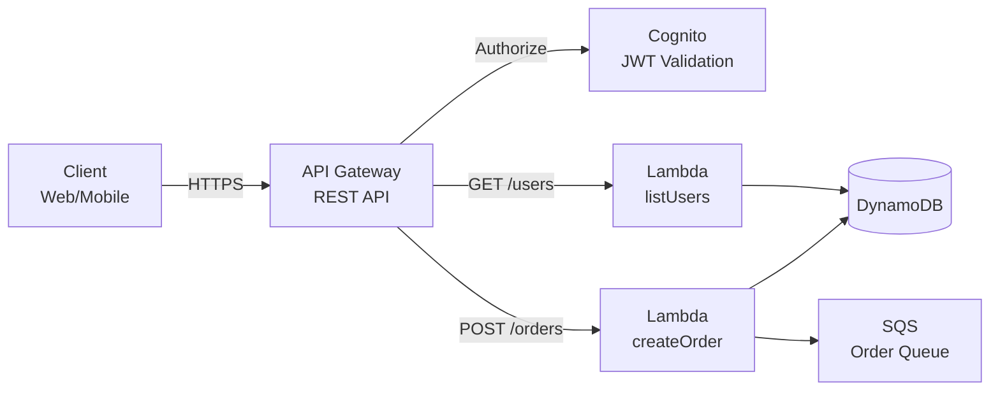
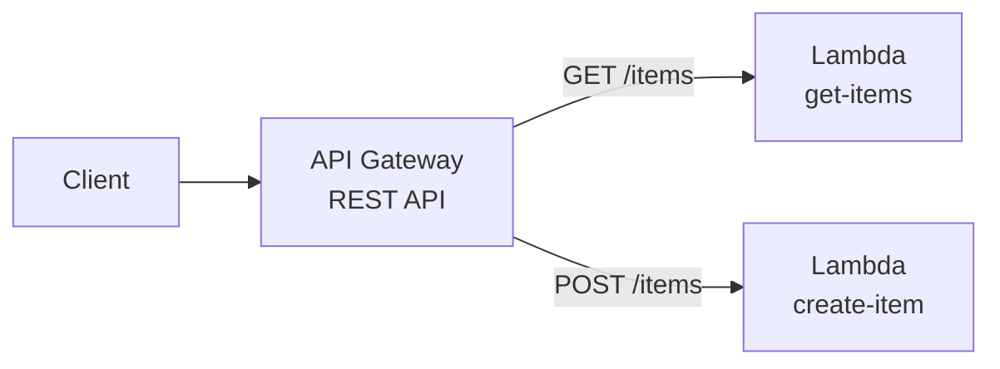

# Chapter 09 — Amazon API Gateway

---

## Prerequisite Chapters
- Chapter 01 — AWS IAM (API execution roles)
- Chapter 08 — AWS Lambda (backend integration)
- Chapter 11 — Amazon Cognito (API authentication)

## Used In Production Practicals
- Practical 19 — API Gateway + Lambda + DynamoDB
- Practical 20 — Cognito + API Gateway + Lambda + DynamoDB
- Practical 15 — Flagship Production Architecture

---

## 1. Learning Objectives

By the end of this chapter, you will be able to:

1. **Explain** REST API vs HTTP API vs WebSocket API — when to use each.
2. **Create** a REST API with resources, methods, and Lambda integration.
3. **Configure** authorization with Cognito, IAM, and Lambda authorizers.
4. **Implement** stages, deployment, throttling, and caching.
5. **Set up** custom domains with ACM certificates.
6. **Monitor** with CloudWatch access logs, execution logs, and X-Ray.
7. **Troubleshoot** 4xx/5xx errors, CORS, and integration issues.
8. **Answer** interview questions about API design and management.

---

## 2. What is Amazon API Gateway?

API Gateway is a fully managed service for creating, publishing, and managing APIs at any scale. It acts as the "front door" for your backend services.

### API Types

| Type | Protocol | Use Case | Cost |
|------|---------|----------|------|
| **REST API** | HTTP | Full-featured (caching, WAF, transforms) | $3.50/million requests |
| **HTTP API** | HTTP | Simple, low-cost proxy to Lambda/HTTP | $1.00/million requests |
| **WebSocket API** | WebSocket | Real-time (chat, notifications, gaming) | $1.00/million messages |

### REST API vs HTTP API

| Feature | REST API | HTTP API |
|---------|----------|----------|
| **Cost** | $3.50/million | $1.00/million (70% cheaper) |
| **Caching** | ✅ Built-in | ❌ No |
| **WAF** | ✅ Yes | ❌ No |
| **Request validation** | ✅ Yes | ❌ No |
| **Request/response transform** | ✅ Yes | ❌ No |
| **Usage plans + API keys** | ✅ Yes | ❌ No |
| **Cognito authorizer** | ✅ Yes | ✅ JWT authorizer |
| **Lambda integration** | ✅ Proxy + non-proxy | ✅ Proxy only |
| **Latency** | Higher | Lower (~60% faster) |

### When to Use
```
HTTP API:  Simple Lambda proxy, cost-sensitive, don't need caching/WAF
REST API:  Need caching, WAF, request validation, API keys, full control
WebSocket: Real-time bidirectional communication
```

---

## 3. Why Do We Need It?

### Without API Gateway
```
Expose Lambda/ECS directly?
  - No authentication
  - No rate limiting
  - No caching
  - No request validation
  - No API versioning
  - No usage monitoring
  - No custom domains
```

### With API Gateway
```
Single entry point for all APIs:
  - Authentication (Cognito, IAM, custom)
  - Rate limiting (throttling)
  - Response caching
  - Request validation
  - API versioning (stages)
  - Monitoring (CloudWatch, X-Ray)
  - Custom domain (api.example.com)
  - WAF protection
```

---

## 4. Real-World Production Use Cases

### 1. Serverless REST API
API Gateway → Lambda → DynamoDB. The most common serverless pattern.

### 2. Microservices Gateway
Single API Gateway routes to different microservices based on path: `/users` → User Service, `/orders` → Order Service.

### 3. Mobile Backend
API Gateway + Cognito + Lambda. Mobile app authenticates with Cognito, calls API with JWT token.

---

## 5. Core Concepts

### API Structure
```
API (my-api)
  └── Resource (/users)
      ├── GET    → Lambda: listUsers
      ├── POST   → Lambda: createUser
      └── Resource (/{userId})
          ├── GET    → Lambda: getUser
          ├── PUT    → Lambda: updateUser
          └── DELETE → Lambda: deleteUser
```

### Integration Types
| Type | How | Use Case |
|------|-----|----------|
| **Lambda Proxy** | Passes entire request to Lambda, returns Lambda response directly | Most common (recommended) |
| **Lambda Non-Proxy** | API Gateway transforms request/response with mapping templates | When you need response shaping |
| **HTTP Proxy** | Forwards to HTTP endpoint | Backend on EC2/ECS |
| **AWS Service** | Direct integration with AWS services | SQS, Step Functions without Lambda |
| **Mock** | Return static response | Testing, CORS preflight |

### Lambda Proxy Integration
```python
# Lambda receives this event:
{
    "httpMethod": "GET",
    "path": "/users/123",
    "pathParameters": {"userId": "123"},
    "queryStringParameters": {"status": "active"},
    "headers": {"Authorization": "Bearer eyJ..."},
    "body": null
}

# Lambda must return this format:
{
    "statusCode": 200,
    "headers": {"Content-Type": "application/json", "Access-Control-Allow-Origin": "*"},
    "body": "{\"id\": \"123\", \"name\": \"Alice\"}"
}
```

### Stages and Deployment
```
Stages = environments for your API:
  dev   → https://abc123.execute-api.ap-south-1.amazonaws.com/dev
  staging → https://abc123.execute-api.ap-south-1.amazonaws.com/staging
  prod  → https://abc123.execute-api.ap-south-1.amazonaws.com/prod

Stage Variables:
  prod.lambdaAlias = "PROD"
  staging.lambdaAlias = "STAGING"
  → Lambda integration: arn:aws:lambda:...:myFunc:${stageVariables.lambdaAlias}
```

### Authorization Options

| Method | How | Use Case |
|--------|-----|----------|
| **Cognito Authorizer** | Validates JWT from Cognito User Pool | User-facing apps |
| **IAM Authorization** | AWS Signature V4 | Service-to-service |
| **Lambda Authorizer** | Custom Lambda validates token/headers | Custom auth, third-party tokens |
| **API Keys** | API key in header (NOT for auth, for tracking) | Usage plans, partner access |

### Throttling
```
Default Limits:
  Account-level: 10,000 requests/second
  Per-stage: configurable
  Per-method: configurable (override)
  Burst: 5,000 requests

Usage Plans:
  Free tier:   100 requests/day, 10/second
  Basic:       10,000 requests/day, 50/second
  Enterprise:  Unlimited, 500/second
  → Associate API key with usage plan
```

### Caching (REST API Only)
```
Cache responses to reduce Lambda invocations:
  - TTL: 0-3600 seconds (default 300)
  - Size: 0.5 GB - 237 GB
  - Cost: $0.02-$3.80/hour depending on size
  - Per-stage, per-method
  - Invalidate: header Cache-Control: max-age=0
```

---

## 6. Architecture

### Serverless API Architecture



---

## 7-10. CLI Commands & Configuration

### Create REST API
```bash
# Create API
API_ID=$(aws apigateway create-rest-api --name "my-api" \
    --endpoint-configuration '{"types":["REGIONAL"]}' \
    --query 'id' --output text)

# Get root resource
ROOT_ID=$(aws apigateway get-resources --rest-api-id $API_ID \
    --query 'items[0].id' --output text)

# Create /users resource
RESOURCE_ID=$(aws apigateway create-resource --rest-api-id $API_ID \
    --parent-id $ROOT_ID --path-part "users" \
    --query 'id' --output text)

# Create GET method with Lambda proxy
aws apigateway put-method --rest-api-id $API_ID \
    --resource-id $RESOURCE_ID --http-method GET \
    --authorization-type COGNITO_USER_POOLS \
    --authorizer-id $AUTHORIZER_ID

aws apigateway put-integration --rest-api-id $API_ID \
    --resource-id $RESOURCE_ID --http-method GET \
    --type AWS_PROXY \
    --integration-http-method POST \
    --uri "arn:aws:apigateway:ap-south-1:lambda:path/2015-03-31/functions/$LAMBDA_ARN/invocations"

# Deploy to stage
aws apigateway create-deployment --rest-api-id $API_ID --stage-name prod

# Custom domain
aws apigateway create-domain-name \
    --domain-name api.example.com \
    --regional-certificate-arn $ACM_CERT_ARN \
    --endpoint-configuration '{"types":["REGIONAL"]}'
```

### Enable CORS
```bash
# CORS must be enabled for browser-based API calls
# For Lambda Proxy: return CORS headers from Lambda
# Response must include:
#   Access-Control-Allow-Origin: *
#   Access-Control-Allow-Headers: Content-Type,Authorization
#   Access-Control-Allow-Methods: GET,POST,OPTIONS
```

---

## 11-18. Practical through Cost Optimization

### Production API Configuration
```
API Type:     REST (if need caching/WAF) or HTTP (if cost-sensitive)
Auth:         Cognito JWT authorizer (user-facing) / IAM (service-to-service)
Throttling:   Per-method limits (protect backend)
Caching:      Enable for frequently-read endpoints (GET /products)
WAF:          Block SQL injection, rate limiting
Custom Domain: api.example.com with ACM certificate
Logging:      Access logs + execution logs to CloudWatch
X-Ray:        Enable for distributed tracing
Stages:       dev, staging, prod (separate deployments)
```

---

## 19. Troubleshooting

### Problem 1: 403 Forbidden
```
Causes:
  - Missing or invalid authorization header
  - API key required but not provided
  - WAF blocking the request
  - Resource policy denying the caller
  - Cognito token expired
Fix: Check authorization header, API key, WAF rules, resource policy
```

### Problem 2: 502 Bad Gateway
```
Causes:
  - Lambda returned invalid response format (missing statusCode)
  - Lambda timeout
  - Lambda threw unhandled exception
  - Integration endpoint unreachable
Fix: Check Lambda logs (CloudWatch), verify response format
```

### Problem 3: CORS Error in Browser
```
Causes:
  - Lambda not returning Access-Control-Allow-Origin header
  - OPTIONS method not configured
  - Response headers not matching request origin
Fix: Return CORS headers from Lambda, enable CORS on resource
```

### Problem 4: 429 Too Many Requests
```
Cause: Throttling limit reached
Fix: Increase throttle limits, implement client-side retry with exponential backoff
```

---

## 22. Interview Questions

### Basic Questions (10)

**Q1: What is Amazon API Gateway?**
A: A managed service for creating, deploying, and managing APIs. Handles authentication, throttling, caching, monitoring. Acts as front door for Lambda, EC2, any HTTP backend.

**Q2: REST API vs HTTP API?**
A: REST: full-featured (caching, WAF, API keys, transforms), $3.50/million. HTTP: simple proxy, 70% cheaper ($1/million), lower latency, but no caching/WAF.

**Q3: What is Lambda Proxy integration?**
A: API Gateway passes the entire request (headers, body, path) to Lambda. Lambda returns statusCode + headers + body. Most common pattern — simple and flexible.

**Q4: How do you handle authentication?**
A: Cognito authorizer (JWT), IAM authorization (SigV4), Lambda authorizer (custom), or API keys (for usage tracking, not auth).

**Q5: What is API Gateway caching?**
A: REST API can cache responses to reduce backend calls. Configure TTL (0-3600s), cache size, per-method. Reduces Lambda invocations and latency.

**Q6: What is a stage?**
A: An environment for your API (dev, staging, prod). Each stage has its own URL, stage variables, caching, and throttling settings.

**Q7: How do you set up a custom domain?**
A: Create ACM certificate → create custom domain in API Gateway → create base path mapping to stage → add CNAME/A record in Route 53.

**Q8: What are usage plans?**
A: Throttle and quota limits associated with API keys. Control access levels for different customers (free tier vs paid tier).

**Q9: What causes a 502 error?**
A: Backend (Lambda) returned an invalid response format or timed out. Check Lambda logs, verify response has statusCode, headers, body.

**Q10: How do you enable CORS?**
A: For Lambda Proxy: return CORS headers (Access-Control-Allow-Origin) from Lambda. Configure OPTIONS method. Both frontend and backend must handle CORS.

### Intermediate-Advanced & Scenario Questions (30)

**Q11-Q40**: *(Cover: request validation, mapping templates, Cognito vs Lambda authorizer, WebSocket API patterns, API versioning strategies, canary deployments, VPC link for private backends, request throttling architecture, API Gateway + WAF, multi-region API, and error handling patterns.)*

---

## 24. Common Mistakes

1. **Using REST API when HTTP API suffices** — 3.5x more expensive
2. **Not returning CORS headers from Lambda** — browser errors
3. **Invalid Lambda response format** — 502 errors
4. **API keys for authentication** — use Cognito/IAM, keys are for tracking
5. **No throttling configured** — backend overwhelmed
6. **No custom domain** — using `execute-api` URL in production
7. **Caching without invalidation strategy** — stale data
8. **No access logging** — can't debug API issues

---

## 25. Production Checklist

- [ ] API type selected (REST vs HTTP) based on requirements
- [ ] Authorization configured (Cognito/IAM/Lambda authorizer)
- [ ] Throttling limits set per method
- [ ] Custom domain with ACM certificate
- [ ] CORS configured for browser clients
- [ ] Access logging enabled (CloudWatch)
- [ ] X-Ray tracing enabled
- [ ] WAF attached (REST API) for security
- [ ] Caching enabled for read-heavy endpoints
- [ ] Usage plans for API consumers

---

## 26. Chapter Summary

1. **HTTP API for simple/cheap** — 70% less cost, lower latency
2. **REST API for full features** — caching, WAF, API keys, transforms
3. **Lambda Proxy is the default** — pass everything to Lambda, return formatted response
4. **Cognito for user auth** — JWT validation without Lambda
5. **Throttling protects backends** — per-method, per-stage limits
6. **Custom domain** — api.example.com with ACM certificate
7. **CORS from Lambda** — must return headers in Lambda response
8. **502 = bad Lambda response** — check format and timeout
9. **Stages for environments** — dev, staging, prod
10. **Caching reduces cost** — fewer Lambda invocations

---
---

# 🔬 Practical Lab 34 — API Gateway + Lambda

## Lab Overview
| Item | Detail |
|------|--------|
| **Difficulty** | Intermediate |
| **Duration** | 30 minutes |
| **Cost** | Free tier: 1M API calls/month |
| **Prerequisites** | Practical 33 (Lambda) |
| **Lab Environment** | Environment 8 — Serverless |

## Business Scenario
> Build a REST API that your mobile and web applications can call. API Gateway handles routing, throttling, and CORS — Lambda handles the business logic.

## Architecture


### Step 1 — Create REST API
1. **API Gateway** → **Create API** → **REST API** → **Build**
   - **Name**: `prod-api`
   - **Endpoint type**: Regional

📸 **Screenshot 01** — API Created

### Step 2 — Create Resource and Methods
1. **Create resource**: `/items`
2. **Create method**: GET → Lambda integration → `prod-get-items`
3. **Create method**: POST → Lambda integration → `prod-create-item`

📸 **Screenshot 02** — Resources and Methods Configured
> **Verify**: /items with GET and POST methods pointing to Lambda functions

### Step 3 — Deploy API
1. **Deploy API** → **New stage**: `prod`
2. Copy the invoke URL

📸 **Screenshot 03** — API Deployed to prod Stage
> **What you should see**: Invoke URL displayed

### Step 4 — Test API
```bash
# GET request
curl -s https://xxx.execute-api.ap-south-1.amazonaws.com/prod/items

# POST request
curl -s -X POST https://xxx.execute-api.ap-south-1.amazonaws.com/prod/items \
    -H "Content-Type: application/json" \
    -d '{"name": "Test Item", "price": 29.99}'
```

📸 **Screenshot 04** — API Responding Successfully
> **Verify**: GET returns items, POST creates new item

🎯 **Interview Insight**: "REST API vs HTTP API?"
> **Strong answer**: "HTTP API: cheaper (70%), faster, simpler — best for most use cases. REST API: API keys, usage plans, request validation, WAF integration, caching — best for enterprise APIs. Use HTTP API by default, REST API when you need advanced features."
