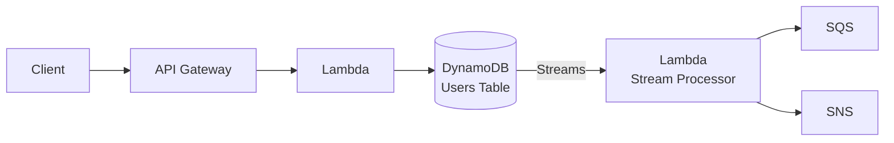
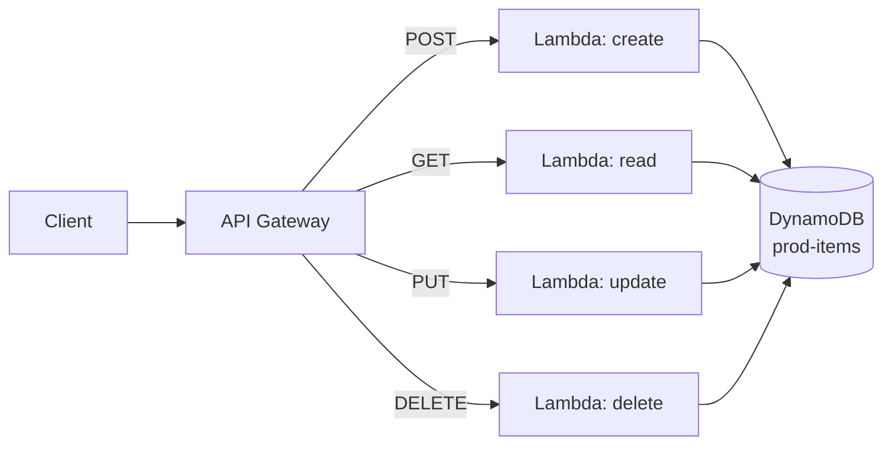

# Chapter 10 — Amazon DynamoDB

---

## Prerequisite Chapters
- Chapter 01 — AWS IAM (table access policies)
- Chapter 08 — AWS Lambda (event-driven processing)
- Chapter 22 — AWS KMS (encryption at rest)

## Used In Production Practicals
- Practical 19 — API Gateway + Lambda + DynamoDB
- Practical 20 — Cognito + API Gateway + Lambda + DynamoDB
- Practical 15 — Flagship Production Architecture

---

## 1. Learning Objectives

By the end of this chapter, you will be able to:

1. **Explain** DynamoDB data model — tables, items, attributes, partition keys, sort keys.
2. **Design** partition keys for even distribution and hot key avoidance.
3. **Create** Global Secondary Indexes (GSI) and Local Secondary Indexes (LSI).
4. **Choose** between On-Demand and Provisioned capacity modes.
5. **Implement** DynamoDB Streams for event-driven architectures.
6. **Configure** TTL for automatic data expiration.
7. **Troubleshoot** throttling, hot partitions, and capacity issues.
8. **Answer** interview questions about NoSQL database design.

---

## 2. What is Amazon DynamoDB?

DynamoDB is a fully managed **NoSQL key-value and document database** designed for single-digit millisecond performance at any scale. Serverless — no servers to manage.

### DynamoDB vs RDS

| Feature | DynamoDB | RDS |
|---------|----------|-----|
| **Type** | NoSQL (key-value) | Relational (SQL) |
| **Schema** | Flexible (schemaless) | Fixed schema (tables, columns) |
| **Scaling** | Automatic (horizontal) | Manual (vertical) |
| **Joins** | Not supported | Full SQL joins |
| **Transactions** | Limited (25 items) | Full ACID |
| **Latency** | Single-digit ms | Variable |
| **Operations** | Zero (serverless) | Managed (patching, backups) |
| **Best for** | High-throughput key lookups | Complex queries, relationships |

### When to Use DynamoDB
```
✅ High throughput, low latency (gaming, IoT, mobile)
✅ Simple access patterns (get/put by key)
✅ Serverless applications (Lambda + API Gateway)
✅ Session storage, shopping cart, user profiles
✅ Event stores, audit logs

❌ Complex joins and relationships
❌ Ad-hoc SQL queries
❌ Financial transactions (complex multi-table)
❌ Small dataset with complex queries (RDS better)
```

---

## 3. Core Concepts

### Data Model
```
Table: Users
  ├── Item: {PK: "user#123", SK: "PROFILE", name: "Alice", email: "alice@ex.com"}
  ├── Item: {PK: "user#123", SK: "ORDER#001", total: 99.99, status: "shipped"}
  ├── Item: {PK: "user#123", SK: "ORDER#002", total: 149.99, status: "pending"}
  ├── Item: {PK: "user#456", SK: "PROFILE", name: "Bob", email: "bob@ex.com"}
  └── Item: {PK: "user#456", SK: "ORDER#001", total: 49.99, status: "delivered"}

Partition Key (PK): Determines which partition stores the item
Sort Key (SK):      Enables range queries within a partition
```

### Key Design Patterns

| Pattern | PK | SK | Query |
|---------|----|----|-------|
| **User profile** | `user#123` | `PROFILE` | Get user by ID |
| **User orders** | `user#123` | `ORDER#001` | Get all orders: SK begins_with "ORDER#" |
| **Product catalog** | `product#ABC` | `METADATA` | Get product details |
| **Time series** | `sensor#001` | `2026-09-18T14:00:00Z` | Query range: SK between dates |

### Capacity Modes

| Mode | Pricing | Scaling | Best For |
|------|---------|---------|----------|
| **On-Demand** | Per request ($1.25/million writes, $0.25/million reads) | Instant, automatic | Variable/unpredictable traffic |
| **Provisioned** | Per RCU/WCU ($0.00065/WCU/hr) | Manual or auto-scaling | Predictable, steady traffic |

### Read/Write Capacity Units
```
WCU (Write Capacity Unit): 1 write/second for item up to 1 KB
RCU (Read Capacity Unit):  1 strongly consistent read/second for item up to 4 KB
                           2 eventually consistent reads/second for item up to 4 KB
```

### Global Secondary Index (GSI) vs Local Secondary Index (LSI)

| Feature | GSI | LSI |
|---------|-----|-----|
| **When to create** | Anytime | Table creation only |
| **Key** | Different PK + optional SK | Same PK, different SK |
| **Consistency** | Eventually consistent only | Strong or eventual |
| **Capacity** | Own provisioned RCU/WCU | Shares table's capacity |
| **Limit** | 20 per table | 5 per table |

### DynamoDB Streams
```
Enable Streams on a table → every change (insert, update, delete) creates a stream record

Stream → Lambda trigger:
  Insert: process new order → send confirmation email
  Update: order status changed → notify customer
  Delete: item expired (TTL) → archive to S3

Stream record contains:
  - Keys only
  - New image (after change)
  - Old image (before change)
  - New and old images (both)
```

### TTL (Time to Live)
```
Set TTL attribute on items → DynamoDB automatically deletes expired items

Example:
  {PK: "session#abc", ttl: 1695050400}  ← Unix timestamp
  When current time > ttl → item deleted (no WCU cost!)

Use cases:
  - Session expiration
  - Temporary tokens
  - Log retention (30 days)
```

---

## 4. Architecture

### Serverless Application with DynamoDB



---

## 5-10. CLI Commands & Operations

### Table Operations
```bash
# Create table
aws dynamodb create-table \
    --table-name Users \
    --attribute-definitions \
        AttributeName=PK,AttributeType=S \
        AttributeName=SK,AttributeType=S \
    --key-schema \
        AttributeName=PK,KeyType=HASH \
        AttributeName=SK,KeyType=RANGE \
    --billing-mode PAY_PER_REQUEST

# Put item
aws dynamodb put-item --table-name Users --item '{
    "PK": {"S": "user#123"}, "SK": {"S": "PROFILE"},
    "name": {"S": "Alice"}, "email": {"S": "alice@example.com"}
}'

# Get item
aws dynamodb get-item --table-name Users --key '{
    "PK": {"S": "user#123"}, "SK": {"S": "PROFILE"}
}'

# Query (all items for a partition key)
aws dynamodb query --table-name Users \
    --key-condition-expression "PK = :pk AND begins_with(SK, :sk)" \
    --expression-attribute-values '{":pk": {"S": "user#123"}, ":sk": {"S": "ORDER#"}}'

# Enable TTL
aws dynamodb update-time-to-live --table-name Users \
    --time-to-live-specification Enabled=true,AttributeName=ttl

# Enable Streams
aws dynamodb update-table --table-name Users \
    --stream-specification StreamEnabled=true,StreamViewType=NEW_AND_OLD_IMAGES
```

### Python (Boto3)
```python
import boto3
from boto3.dynamodb.conditions import Key

dynamodb = boto3.resource('dynamodb')
table = dynamodb.Table('Users')

# Put item
table.put_item(Item={
    'PK': 'user#123', 'SK': 'PROFILE',
    'name': 'Alice', 'email': 'alice@example.com'
})

# Get item
response = table.get_item(Key={'PK': 'user#123', 'SK': 'PROFILE'})
user = response['Item']

# Query user's orders
response = table.query(
    KeyConditionExpression=Key('PK').eq('user#123') & Key('SK').begins_with('ORDER#')
)
orders = response['Items']
```

---

## 11-18. Production through Cost

### Production DynamoDB Configuration
```
Capacity:    On-Demand for variable traffic, Provisioned + Auto-Scaling for predictable
Encryption:  Enabled (default: AWS owned key, or specify CMK)
Streams:     Enable for event-driven processing
TTL:         Enable for ephemeral data (sessions, tokens)
Backups:     Point-in-time recovery enabled (35 days)
Global Table: Multi-region for global applications (active-active)
DAX:         DynamoDB Accelerator for microsecond reads (in-memory cache)
```

---

## 19. Troubleshooting

### Problem 1: ProvisionedThroughputExceededException (Throttling)
```
Cause: More requests than provisioned capacity
Fix:
  - Switch to On-Demand mode
  - Enable auto-scaling
  - Improve partition key design (avoid hot keys)
  - Use DAX for read-heavy workloads
```

### Problem 2: Hot Partition
```
Cause: One partition key getting disproportionate traffic
Example: PK = "country" → "US" gets 90% of traffic
Fix: Add randomness to key (PK = "US#3"), use composite keys
```

---

## 22. Interview Questions

### Basic Questions (10)

**Q1: What is DynamoDB?**
A: A fully managed NoSQL key-value database. Serverless, single-digit ms latency, automatic scaling. Accessed via API (no SQL). Best for high-throughput, simple access patterns.

**Q2: Partition key vs sort key?**
A: Partition key: determines data distribution. Must be unique (if no sort key). Sort key: enables range queries within a partition. Together they form the primary key.

**Q3: On-Demand vs Provisioned?**
A: On-Demand: pay per request, instant scaling, no capacity planning. Provisioned: set RCU/WCU, cheaper for predictable traffic, use auto-scaling.

**Q4: What is a GSI?**
A: Global Secondary Index — alternate partition key + optional sort key. Enables queries on non-primary key attributes. Has its own capacity. Eventually consistent only.

**Q5: What is DynamoDB Streams?**
A: A time-ordered sequence of item-level changes. Triggers Lambda on insert/update/delete. Used for event-driven architectures, replication, auditing.

**Q6: What is TTL?**
A: Time to Live — automatically deletes items after a timestamp. No WCU cost. Use for sessions, tokens, temporary data.

**Q7: Strongly vs Eventually consistent reads?**
A: Strongly consistent: always returns latest data, costs 1 RCU per 4 KB. Eventually consistent: may return stale data (milliseconds), costs 0.5 RCU per 4 KB (50% cheaper).

**Q8: What is DAX?**
A: DynamoDB Accelerator — in-memory cache in front of DynamoDB. Microsecond read latency. Compatible with DynamoDB API (drop-in replacement for reads).

**Q9: Maximum item size?**
A: 400 KB per item. For larger data: store in S3, save S3 URL in DynamoDB.

**Q10: How do you handle hot partitions?**
A: Improve key design (add randomness/composite keys), use write sharding, enable auto-scaling, use On-Demand mode.

### Intermediate-Advanced & Scenario Questions (30)

**Q11-Q40**: *(Cover: single-table design, access patterns, GSI overloading, DynamoDB transactions, batch operations, conditional writes, query vs scan, global tables, backup strategies, migration from RDS, and cost optimization.)*

---

## 25. Production Checklist

- [ ] Partition key designed for even distribution
- [ ] On-Demand or Provisioned + Auto-Scaling
- [ ] Point-in-time recovery enabled
- [ ] Encryption enabled (CMK for compliance)
- [ ] DynamoDB Streams enabled (if event-driven)
- [ ] TTL configured for ephemeral data
- [ ] GSI for additional access patterns
- [ ] CloudWatch alarms for throttling
- [ ] DAX for read-heavy workloads

---

## 26. Chapter Summary

1. **NoSQL = design for access patterns** — not for relationships
2. **Partition key = most important decision** — determines performance
3. **On-Demand for variable traffic** — no capacity planning
4. **Streams for event-driven** — trigger Lambda on data changes
5. **TTL for automatic cleanup** — no WCU cost
6. **GSI for alternate queries** — different key, own capacity
7. **400 KB item limit** — large data in S3
8. **DAX for microsecond reads** — in-memory cache
9. **Avoid hot partitions** — distribute traffic across keys
10. **Single-table design** — one table per microservice, multiple entity types

---
---

# 🔬 Practical Lab 35 — Serverless CRUD (API Gateway + Lambda + DynamoDB)

## Lab Overview
| Item | Detail |
|------|--------|
| **Difficulty** | Intermediate |
| **Duration** | 45 minutes |
| **Cost** | Free tier for all services |
| **Prerequisites** | Practical 34 (API Gateway + Lambda) |
| **Lab Environment** | Environment 8 — Serverless |

## Business Scenario
> Build a complete serverless CRUD API — no servers to manage. This is an excellent portfolio/interview project.

## Architecture


### Step 1 — Create DynamoDB Table
1. **DynamoDB** → **Create table**
   - **Name**: `prod-items`
   - **Partition key**: `id` (String)

📸 **Screenshot 01** — DynamoDB Table Created

### Step 2 — Create Lambda Functions
Create 4 Lambda functions: create-item, get-items, update-item, delete-item

```python
# create-item Lambda
import json, boto3, uuid
dynamodb = boto3.resource('dynamodb')
table = dynamodb.Table('prod-items')

def lambda_handler(event, context):
    body = json.loads(event['body'])
    item = {'id': str(uuid.uuid4()), **body}
    table.put_item(Item=item)
    return {'statusCode': 201, 'body': json.dumps(item)}
```

📸 **Screenshot 02** — Four Lambda Functions Created

### Step 3 — Wire API Gateway
Map each HTTP method to the corresponding Lambda function.

📸 **Screenshot 03** — API Gateway with CRUD Methods

### Step 4 — Test Full CRUD
```bash
API="https://xxx.execute-api.ap-south-1.amazonaws.com/prod"

# Create
curl -s -X POST $API/items -d '{"name":"Widget","price":9.99}'

# Read
curl -s $API/items

# Update
curl -s -X PUT $API/items/ITEM_ID -d '{"name":"Widget Pro","price":19.99}'

# Delete
curl -s -X DELETE $API/items/ITEM_ID
```

📸 **Screenshot 04** — All CRUD Operations Working
> **Verify**: Create returns 201, Read returns items, Update modifies, Delete removes

📸 **Screenshot 05** — DynamoDB Items in Console
> **What you should see**: Items in DynamoDB table matching API operations

🎯 **Interview Insight**: "Walk me through a serverless CRUD architecture."
> **Strong answer**: "API Gateway (REST/HTTP API) → Lambda functions (one per operation) → DynamoDB. No servers, auto-scaling, pay-per-request. IAM roles on Lambda with least-privilege DynamoDB permissions. Add Cognito for authentication, X-Ray for tracing, CloudWatch for monitoring."
