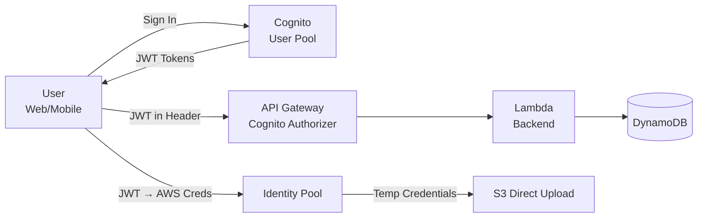

# Chapter 11 — Amazon Cognito

---

## Prerequisite Chapters
- Chapter 01 — AWS IAM (federated access, roles)
- Chapter 09 — Amazon API Gateway (API authentication)

## Used In Production Practicals
- Practical 20 — Cognito + API Gateway + Lambda + DynamoDB
- Practical 15 — Flagship Production Architecture (auth layer)

---

## 1. Learning Objectives

By the end of this chapter, you will be able to:

1. **Explain** User Pools vs Identity Pools and when to use each.
2. **Create** a User Pool with sign-up, sign-in, and MFA.
3. **Integrate** Cognito with API Gateway for JWT authentication.
4. **Configure** social login (Google, Facebook, Apple) and SAML federation.
5. **Implement** the Hosted UI for quick authentication flows.
6. **Use** Identity Pools to grant temporary AWS credentials.
7. **Configure** Lambda triggers for custom authentication logic.
8. **Troubleshoot** authentication errors and token issues.
9. **Answer** interview questions about authentication and authorization.

---

## 2. What is Amazon Cognito?

Amazon Cognito provides **authentication, authorization, and user management** for web and mobile applications. Users can sign in directly or through third-party identity providers.

### Two Main Components

| Component | Purpose | Returns |
|-----------|---------|---------|
| **User Pool** | User directory (sign-up, sign-in, MFA) | JWT tokens (ID, Access, Refresh) |
| **Identity Pool** | Exchange tokens for AWS credentials | Temporary AWS STS credentials |

### How They Work Together
```
1. User signs in via User Pool → receives JWT tokens
2. Application sends JWT to API Gateway → validates and authorizes
3. (Optional) JWT exchanged via Identity Pool → temp AWS credentials
4. User accesses AWS services directly (S3 upload) with temp credentials
```

---

## 3. Why Do We Need It?

### Without Cognito
```
Building authentication from scratch:
  - User database (passwords, hashing)
  - Sign-up flow (email verification)
  - Password reset flow
  - MFA implementation
  - OAuth 2.0 / OIDC implementation
  - Token management (JWT generation, validation)
  - Social login (Google, Facebook APIs)
  - Security: brute force protection, account lockout

Months of work. Security vulnerabilities likely.
```

### With Cognito
```
All handled by AWS:
  - User directory with sign-up/sign-in
  - Email/phone verification
  - MFA (SMS, TOTP)
  - Password policies
  - JWT tokens (standards-compliant)
  - Social login (one-click setup)
  - Hosted UI (pre-built auth pages)
  - Advanced security (risk-based auth)

Days to integrate. AWS handles security.
```

---

## 4. Core Concepts

### User Pool Features
```
User Management:
  - Sign-up with email/phone verification
  - Password policies (length, complexity, history)
  - MFA (SMS, TOTP authenticator app)
  - Account recovery (email/SMS)
  - User groups (admin, users, readonly)

Authentication:
  - Username/password
  - Social login (Google, Facebook, Apple, Amazon)
  - SAML federation (corporate SSO)
  - OIDC federation
  - Custom auth flows (Lambda triggers)

Tokens:
  ID Token:      User identity claims (name, email, groups) — 1 hour
  Access Token:  Authorization scopes (API access) — 1 hour
  Refresh Token: Get new tokens without re-authenticating — 30 days
```

### JWT Token (Decoded)
```json
{
    "sub": "abc123-def456",
    "email": "alice@example.com",
    "cognito:groups": ["admin", "developers"],
    "name": "Alice",
    "iss": "https://cognito-idp.ap-south-1.amazonaws.com/ap-south-1_ABC123",
    "aud": "app-client-id",
    "exp": 1695050400,
    "token_use": "id"
}
```

### Lambda Triggers
```
Pre sign-up:          Validate/reject sign-up, auto-confirm
Post confirmation:    Send welcome email, create user record in DynamoDB
Pre authentication:   Custom validation (IP check, account status)
Post authentication:  Logging, analytics, update last login
Pre token generation: Add custom claims to JWT
Custom message:       Customize verification email/SMS
Define auth challenge: Custom authentication flow (CAPTCHA, security questions)
```

### Hosted UI
```
Pre-built authentication UI:
  URL: https://your-domain.auth.ap-south-1.amazoncognito.com/login

Features:
  - Sign up, sign in, forgot password
  - Social login buttons (Google, Facebook)
  - SAML federation
  - Customizable logo and CSS
  - OAuth 2.0 / OIDC compliant
  
Use for: Quick MVPs, internal tools, rapid prototyping
Don't use for: Highly branded consumer apps (build custom UI)
```

---

## 5. Architecture



---

## 6-10. CLI Commands & Configuration

### Create User Pool
```bash
POOL_ID=$(aws cognito-idp create-user-pool \
    --pool-name "prod-app-users" \
    --auto-verified-attributes email \
    --mfa-configuration OPTIONAL \
    --policies '{
        "PasswordPolicy": {
            "MinimumLength": 12,
            "RequireUppercase": true,
            "RequireLowercase": true,
            "RequireNumbers": true,
            "RequireSymbols": true
        }
    }' \
    --schema '[
        {"Name": "email", "Required": true, "Mutable": true},
        {"Name": "name", "Required": true, "Mutable": true}
    ]' \
    --query 'UserPool.Id' --output text)

# Create App Client (no secret for public clients)
CLIENT_ID=$(aws cognito-idp create-user-pool-client \
    --user-pool-id $POOL_ID \
    --client-name "web-app" \
    --no-generate-secret \
    --explicit-auth-flows ALLOW_USER_PASSWORD_AUTH ALLOW_REFRESH_TOKEN_AUTH ALLOW_USER_SRP_AUTH \
    --query 'UserPoolClient.ClientId' --output text)
```

### User Operations
```bash
# Sign up
aws cognito-idp sign-up \
    --client-id $CLIENT_ID \
    --username "alice@example.com" \
    --password "StrongP@ss123!" \
    --user-attributes Name=email,Value=alice@example.com

# Confirm sign-up
aws cognito-idp confirm-sign-up \
    --client-id $CLIENT_ID \
    --username "alice@example.com" \
    --confirmation-code "123456"

# Sign in
aws cognito-idp initiate-auth \
    --client-id $CLIENT_ID \
    --auth-flow USER_PASSWORD_AUTH \
    --auth-parameters USERNAME=alice@example.com,PASSWORD=StrongP@ss123!
```

### Python Integration
```python
import boto3
import requests

cognito = boto3.client('cognito-idp')

# Sign in
response = cognito.initiate_auth(
    ClientId='YOUR_CLIENT_ID',
    AuthFlow='USER_PASSWORD_AUTH',
    AuthParameters={
        'USERNAME': 'alice@example.com',
        'PASSWORD': 'StrongP@ss123!'
    }
)
id_token = response['AuthenticationResult']['IdToken']

# Use token for API Gateway
headers = {'Authorization': id_token}
response = requests.get('https://api.example.com/users', headers=headers)
```

---

## 11-18. Production through DR

### Production Cognito Configuration
```
User Pool:
  - Strong password policy (12+ chars)
  - MFA: OPTIONAL (SMS + TOTP)
  - Email verification required
  - Advanced security features enabled
  - Custom domain (auth.example.com)
  - Lambda triggers for custom logic

API Gateway:
  - Cognito authorizer validates JWT
  - No Lambda call for auth (faster, cheaper)

Token Configuration:
  - ID/Access token: 1 hour (default)
  - Refresh token: 30 days (configurable)
  - Configure token revocation

Groups:
  - admin, developers, users, readonly
  - Map to API Gateway method permissions
```

---

## 19. Troubleshooting

### Problem 1: "NotAuthorizedException"
```
Causes:
  - Wrong username or password
  - User not confirmed (check email verification)
  - User disabled by admin
  - MFA code required but not provided
  - Auth flow not enabled on app client
```

### Problem 2: Token Expired (API returns 401)
```
Fix: Use Refresh Token to get new tokens:
  cognito.initiate_auth(
      ClientId='...', AuthFlow='REFRESH_TOKEN_AUTH',
      AuthParameters={'REFRESH_TOKEN': refresh_token}
  )
```

### Problem 3: API Gateway Returns 401
```
Check:
  1. Using ID token (not Access token) for Cognito authorizer
  2. Token not expired
  3. Token issued by correct User Pool
  4. Authorization header format correct
```

---

## 22. Interview Questions

### Basic Questions (10)

**Q1: What is Amazon Cognito?**
A: A managed authentication service. User Pool = user directory (sign-up, sign-in, MFA, JWT tokens). Identity Pool = exchange tokens for temporary AWS credentials.

**Q2: User Pool vs Identity Pool?**
A: User Pool: authentication (who are you?) — returns JWT. Identity Pool: authorization (what AWS resources?) — returns STS credentials. Use together: User Pool authenticates, Identity Pool authorizes AWS access.

**Q3: How does Cognito integrate with API Gateway?**
A: Create Cognito Authorizer on API Gateway pointing to User Pool. Client sends JWT in Authorization header. API Gateway validates token (signature, expiry, issuer) without Lambda — faster and cheaper.

**Q4: What are Lambda triggers?**
A: Hooks at key authentication events: pre-sign-up (validation), post-confirmation (welcome email), pre-authentication (custom checks), pre-token-generation (add custom claims).

**Q5: What tokens does Cognito return?**
A: ID Token (user identity claims), Access Token (authorization scopes), Refresh Token (get new tokens without re-authenticating).

**Q6: What is the Hosted UI?**
A: Pre-built authentication pages provided by Cognito. Handles sign-up, sign-in, password reset, social login. Quick to set up, customizable with CSS.

**Q7: How do you add social login?**
A: Configure Google/Facebook/Apple as identity providers in User Pool. Add provider details (client ID, secret). Users see social login buttons in Hosted UI.

**Q8-Q10**: *(Cover: MFA options, custom domains, and user groups for RBAC.)*

### Intermediate-Advanced & Scenario Questions (30)

**Q11-Q40**: *(Cover: SAML federation, custom auth challenges, advanced security features, user migration Lambda, token customization, cross-app SSO, Identity Pool role mapping, Cognito + ALB, security best practices, and token revocation.)*

---

## 25. Production Checklist

- [ ] Strong password policy configured
- [ ] MFA enabled (OPTIONAL or REQUIRED)
- [ ] Email verification required
- [ ] App client configured (no secret for public clients)
- [ ] API Gateway Cognito authorizer configured
- [ ] Lambda triggers for custom logic
- [ ] Advanced security features enabled
- [ ] Custom domain for Hosted UI
- [ ] Token expiration configured
- [ ] User groups for RBAC

---

## 26. Chapter Summary

1. **User Pool for authentication** — sign-up, sign-in, MFA, JWT tokens
2. **Identity Pool for AWS access** — exchange tokens for temp credentials
3. **API Gateway integration** — built-in JWT validation (no Lambda)
4. **Social login built-in** — Google, Facebook, Apple, SAML
5. **Lambda triggers** — customize auth at every stage
6. **Hosted UI for quick start** — pre-built, customizable auth pages
7. **Tokens expire in 1 hour** — use Refresh Token for renewal
8. **Don't build your own auth** — Cognito handles security

---
---

# 🔬 Practical Lab 36 — Cognito Authentication

## Lab Overview
| Item | Detail |
|------|--------|
| **Difficulty** | Intermediate |
| **Duration** | 35 minutes |
| **Cost** | Free tier: 50K MAU |
| **Prerequisites** | Practical 35 (Serverless CRUD) |
| **Lab Environment** | Environment 8 — Serverless |

## Business Scenario
> Your API is currently open to anyone. You need authentication — only signed-in users should access the API.

### Step 1 — Create User Pool
1. **Cognito** → **Create user pool**
   - **Sign-in**: Email
   - **Password policy**: 12+ characters, mixed case + symbols
   - **MFA**: Optional (TOTP)
   - **App client**: `web-app` (no secret)

📸 **Screenshot 01** — User Pool Created
> **Verify**: User pool ID and app client ID displayed

### Step 2 — Create Test User
```bash
aws cognito-idp sign-up --client-id YOUR_CLIENT_ID \
    --username test@example.com --password "Test@Pass123!"
aws cognito-idp admin-confirm-sign-up --user-pool-id YOUR_POOL_ID \
    --username test@example.com
```

📸 **Screenshot 02** — Test User Confirmed

### Step 3 — Add Cognito Authorizer to API Gateway
1. API Gateway → **Authorizers** → **Create** → Cognito → Select user pool

📸 **Screenshot 03** — Cognito Authorizer Created

### Step 4 — Test Authenticated API
```bash
# Get token
TOKEN=$(aws cognito-idp initiate-auth --client-id YOUR_CLIENT_ID \
    --auth-flow USER_PASSWORD_AUTH \
    --auth-parameters USERNAME=test@example.com,PASSWORD="Test@Pass123!" \
    --query 'AuthenticationResult.IdToken' --output text)

# Call API with token
curl -s -H "Authorization: $TOKEN" https://xxx.execute-api.ap-south-1.amazonaws.com/prod/items

# Call without token — should get 401
curl -s https://xxx.execute-api.ap-south-1.amazonaws.com/prod/items
```

📸 **Screenshot 04** — Authenticated Access Works, Unauthenticated Blocked
> **Verify**: With token = 200, without token = 401

🎯 **Interview Insight**: "How do you secure an API?"
> **Strong answer**: "Cognito User Pool for authentication (JWT tokens). API Gateway Cognito authorizer validates JWT without Lambda (faster, cheaper). Add API keys + usage plans for rate limiting. WAF for DDoS protection. CloudFront for caching."
