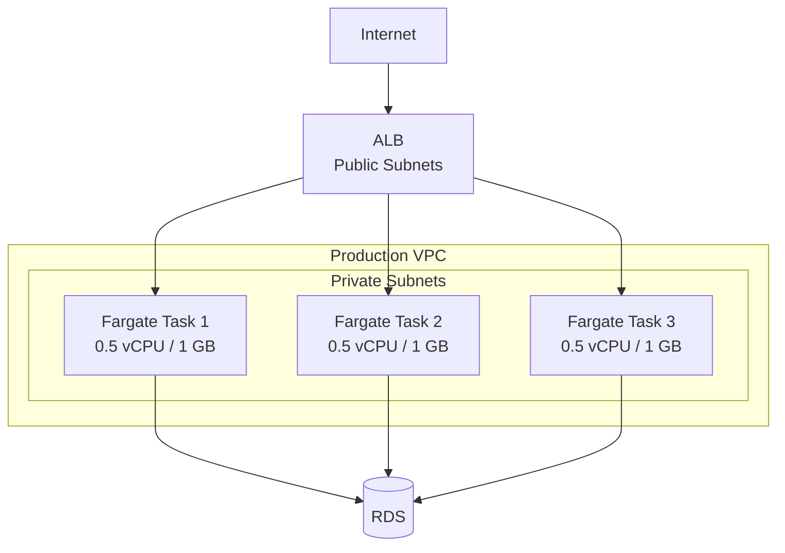

# Chapter 17 — AWS Fargate

---

## Prerequisite Chapters
- Chapter 15 — Amazon ECR (container images)
- Chapter 16 — Amazon ECS (task definitions, services)
- Chapter 04 — Amazon VPC (subnets, security groups)

## Used In Production Practicals
- Practical 27 — ECS + Fargate + ALB + RDS
- Practical 33 — Container CI/CD
- Practical 15 — Flagship Production Architecture

---

## 1. Learning Objectives

By the end of this chapter, you will be able to:

1. **Explain** Fargate vs EC2 launch type and when to use each.
2. **Deploy** containers on Fargate without managing servers.
3. **Configure** task CPU, memory, networking, and IAM roles.
4. **Implement** Fargate with ECS services, ALB, and auto scaling.
5. **Optimize** costs with Fargate Spot and ARM (Graviton).
6. **Debug** running containers with ECS Exec.
7. **Troubleshoot** task failures, networking, and resource issues.
8. **Answer** interview questions about serverless containers.

---

## 2. What is AWS Fargate?

Fargate is a **serverless compute engine for containers**. You define your containers (CPU, memory, image) and Fargate runs them — no EC2 instances to provision or manage.

### Fargate vs EC2 Launch Type

| Feature | Fargate | EC2 Launch Type |
|---------|---------|----------------|
| **Server management** | None (serverless) | You manage EC2 instances |
| **Scaling** | Per-task scaling | Must scale EC2 fleet |
| **Pricing** | Per vCPU/memory per second | EC2 instance pricing |
| **Patching** | AWS patches runtime | You patch EC2 instances |
| **GPU support** | ❌ No | ✅ Yes |
| **SSH access** | ❌ No (use ECS Exec) | ✅ Yes |
| **Best for** | Variable workloads, less ops | GPU, steady-state, cost optimize |

---

## 3. Core Concepts

### Fargate Task Definition
```json
{
    "family": "web-app",
    "requiresCompatibilities": ["FARGATE"],
    "networkMode": "awsvpc",
    "cpu": "512",
    "memory": "1024",
    "executionRoleArn": "arn:aws:iam::123:role/ecsTaskExecutionRole",
    "taskRoleArn": "arn:aws:iam::123:role/webAppTaskRole",
    "containerDefinitions": [{
        "name": "web",
        "image": "123.dkr.ecr.ap-south-1.amazonaws.com/web-app:v1.0.0",
        "portMappings": [{"containerPort": 8080, "protocol": "tcp"}],
        "logConfiguration": {
            "logDriver": "awslogs",
            "options": {
                "awslogs-group": "/ecs/web-app",
                "awslogs-region": "ap-south-1",
                "awslogs-stream-prefix": "web"
            }
        },
        "secrets": [
            {"name": "DB_PASSWORD", "valueFrom": "arn:aws:secretsmanager:..."}
        ]
    }]
}
```

### CPU/Memory Combinations

| CPU (vCPU) | Memory (GB) Options |
|------------|-------------------|
| 0.25 | 0.5, 1, 2 |
| 0.5 | 1, 2, 3, 4 |
| 1 | 2, 3, 4, 5, 6, 7, 8 |
| 2 | 4 – 16 (1 GB increments) |
| 4 | 8 – 30 (1 GB increments) |
| 8 | 16 – 60 (4 GB increments) |
| 16 | 32 – 120 (8 GB increments) |

### Two IAM Roles
```
Execution Role (ecsTaskExecutionRole):
  Used by ECS agent to: pull images from ECR, push logs to CloudWatch, read secrets
  Permissions: ecr:GetAuthorizationToken, ecr:BatchGetImage, logs:PutLogEvents

Task Role (application-specific):
  Used by YOUR application code to: access DynamoDB, S3, SQS
  Equivalent of EC2 Instance Profile
  Unique per application
```

### Networking (awsvpc)
```
Each Fargate task gets its own ENI:
  - Own private IP address in your VPC subnet
  - Security groups applied directly to the task
  - Must be in your VPC subnet

Production:
  - Tasks in private subnets
  - ALB in public subnets → routes to tasks
  - NAT Gateway for outbound (or VPC endpoints)
```

---

## 4. Architecture



---

## 5-10. CLI Commands & Operations

### Create Fargate Service
```bash
aws ecs create-service \
    --cluster prod-cluster \
    --service-name web-app \
    --task-definition web-app:1 \
    --desired-count 3 \
    --launch-type FARGATE \
    --network-configuration '{
        "awsvpcConfiguration": {
            "subnets": ["subnet-priv-a", "subnet-priv-b"],
            "securityGroups": ["sg-web-app"],
            "assignPublicIp": "DISABLED"
        }
    }' \
    --load-balancers '[{
        "targetGroupArn": "arn:aws:elasticloadbalancing:...",
        "containerName": "web", "containerPort": 8080
    }]'
```

### ECS Exec (Debug Running Container)
```bash
aws ecs execute-command \
    --cluster prod-cluster \
    --task $TASK_ARN \
    --container web \
    --interactive \
    --command "/bin/sh"
```

---

## 17. Cost Optimization

```
Pricing (per second, 1 min minimum):
  vCPU: ~$0.04048/vCPU/hour
  Memory: ~$0.004445/GB/hour

Example: 0.5 vCPU + 1 GB, 24/7 for 30 days = $17.77/task/month

Optimization:
  Fargate Spot:  50-70% savings (fault-tolerant workloads)
  ARM (Graviton): 20% cheaper
  Right-size:    Match CPU/memory to actual usage
  Scale to zero: Min tasks = 0 (off-hours)
```

---

## 19. Troubleshooting

### Problem 1: Task Keeps Stopping
```
aws ecs describe-tasks --tasks $TASK_ARN → check stoppedReason
Common: App crash (check logs), health check failing, OOM, image pull failure
```

### Problem 2: Task Can't Pull Image
```
Causes: Missing ECR permissions on execution role, no NAT/VPC endpoint, image doesn't exist
```

### Problem 3: Task Can't Reach Database
```
Check: SG allows outbound to DB port, DB SG allows inbound from task SG, correct subnet
```

---

## 22. Interview Questions

### Basic Questions (10)

**Q1: What is Fargate?**
A: Serverless compute engine for containers. Define CPU/memory/image, Fargate runs it. No EC2 instances to manage.

**Q2: Fargate vs EC2 launch type?**
A: Fargate: no server management, per-task pricing, variable workloads. EC2: GPU support, SSH access, cheaper for steady workloads with Reserved Instances.

**Q3: Execution role vs task role?**
A: Execution role: used by ECS agent (pull images, push logs). Task role: used by your application code (access DynamoDB, S3).

**Q4: How does networking work?**
A: awsvpc mode — each task gets own ENI with private IP. Security groups applied at task level. Same as EC2 networking.

**Q5: How do you debug a Fargate container?**
A: 1) CloudWatch Logs (stdout/stderr). 2) ECS Exec (interactive shell). 3) Check stopped task reason. 4) Container Insights metrics.

**Q6-Q10**: *(Cover: Fargate Spot, Graviton, auto scaling, service discovery, and secret injection.)*

### Intermediate-Advanced & Scenario Questions (30)

**Q11-Q40**: *(Cover: zero-downtime deployments, circuit breaker, capacity providers, sidecar containers, health checks, logging patterns, VPC endpoint requirements, cost comparison, and migration from EC2 to Fargate.)*

---

## 25. Production Checklist

- [ ] Tasks in private subnets
- [ ] ALB for external traffic
- [ ] Execution role with minimal permissions
- [ ] Task role with app-specific permissions
- [ ] Secrets via Secrets Manager
- [ ] CloudWatch Logs configured
- [ ] Health check on ALB
- [ ] Auto Scaling configured
- [ ] Container Insights enabled
- [ ] ECS Exec enabled for debugging
- [ ] VPC endpoints for ECR, S3, CloudWatch Logs

---

## 26. Chapter Summary

1. **Serverless containers** — no EC2 to manage
2. **awsvpc networking** — each task gets own ENI
3. **Two IAM roles** — execution (ECS agent) + task (your app)
4. **Private subnets + ALB** — production pattern
5. **Right-size CPU/memory** — don't over-provision
6. **Fargate Spot** — 50-70% savings
7. **ECS Exec** — debug without SSH
8. **Secrets Manager** — no plaintext env vars
9. **VPC endpoints** — reduce NAT costs
10. **Container Insights** — per-task observability

---
---

# 🔬 Practical Lab 43 — ECS + Fargate (Serverless Containers)

## Lab Overview
| Item | Detail |
|------|--------|
| **Difficulty** | Advanced |
| **Duration** | 35 minutes |
| **Cost** | ~$0.50/day |
| **Prerequisites** | Practical 41 (ECR), Practical 06 (VPC) |
| **Lab Environment** | Environment 9 — Containers |

### Step 1 — Create Fargate Task Definition
1. Task definition with `requiresCompatibilities: FARGATE`
   - **Network mode**: awsvpc
   - **CPU**: 0.25 vCPU, **Memory**: 0.5 GB
   - **Container**: ECR image, port 8080
   - **Secrets**: DB password from Secrets Manager

📸 **Screenshot 01** — Fargate Task Definition

### Step 2 — Create Fargate Service
1. **Service**: `prod-web-fargate`
   - **Launch type**: Fargate
   - **Tasks**: 2
   - **Subnets**: Private subnets
   - **ALB**: Attach target group

📸 **Screenshot 02** — Fargate Tasks Running
> **Verify**: 2 tasks running, each with own private IP (awsvpc mode)

📸 **Screenshot 03** — Website via ALB → Fargate
> **What you should see**: Same website, but no EC2 instances to manage

🎯 **Interview Insight**: "EC2 vs Fargate launch type?"
> **Strong answer**: "Fargate: serverless, no instance management, per-task pricing. EC2: SSH access, GPU, cheaper with RIs for steady workloads. Fargate for variable workloads and less ops overhead. EC2 for GPU or cost optimization with Reserved Instances."
