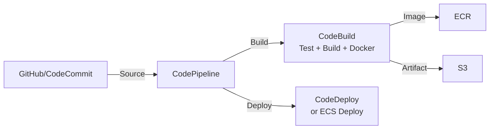

# Chapter 19 — AWS CodeBuild

---

## Prerequisite Chapters
- Chapter 01 — AWS IAM (build role permissions)
- Chapter 02 — Amazon S3 (artifact storage)
- Chapter 15 — Amazon ECR (container image builds)

## Used In Production Practicals
- Practical 31 — CodeBuild CI
- Practical 32 — CodePipeline CI/CD
- Practical 33 — Container CI/CD (Docker → ECR)
- Practical 15 — Flagship Production Architecture

---

## 1. Learning Objectives

By the end of this chapter, you will be able to:

1. **Explain** CodeBuild's role in CI/CD pipelines and how it differs from Jenkins.
2. **Write** buildspec.yml files for build, test, and package workflows.
3. **Configure** build environments (managed images, custom Docker images).
4. **Build** Docker images and push to ECR using CodeBuild.
5. **Integrate** with CodePipeline, GitHub, S3, and Secrets Manager.
6. **Implement** caching, VPC builds, and concurrent builds.
7. **Troubleshoot** build failures, permission errors, and timeout issues.
8. **Answer** interview questions about CI/CD and build automation.

---

## 2. What is AWS CodeBuild?

CodeBuild is a fully managed **continuous integration** service that compiles source code, runs tests, and produces deployable artifacts. No build servers to manage.

### Key Characteristics
- **Fully managed** — no Jenkins/build servers to maintain
- **Pay per build minute** — only when builds are running
- **Scales automatically** — hundreds of concurrent builds
- **Docker-based** — each build runs in a fresh Docker container
- **Integrates natively** — CodePipeline, ECR, S3, Secrets Manager

### CodeBuild vs Jenkins

| Feature | CodeBuild | Jenkins |
|---------|-----------|---------|
| **Infrastructure** | Fully managed | Self-managed servers |
| **Scaling** | Automatic | Manual (agents) |
| **Cost** | Per minute | Server always running |
| **Maintenance** | Zero | Plugins, updates, patches |
| **Docker builds** | Built-in | Requires Docker-in-Docker setup |
| **AWS integration** | Native | Via plugins |

---

## 3. Why Do We Need It?

### Without CodeBuild
```
Developer pushes code → manually builds → manually tests → manually packages
  OR
Jenkins server: install, patch, scale, maintain plugins, manage agents
  Cost: EC2 instance running 24/7 even when not building
```

### With CodeBuild
```
Developer pushes code → CodeBuild automatically: builds, tests, packages
  No servers, auto-scales, pay only for build time
  Integrates with CodePipeline for full CI/CD
```

---

## 4. Real-World Production Use Cases

### 1. Application CI
Run unit tests, linting, security scans on every commit. Fail fast before merge.

### 2. Docker Image Build
Build Docker images from Dockerfile, push to ECR. Used in container CI/CD pipelines.

### 3. Artifact Packaging
Compile Java/Go/Python applications, create deployment packages for CodeDeploy or Lambda.

### 4. Infrastructure Validation
Run `cfn-lint`, `terraform validate`, or `checkov` to validate IaC before deployment.

---

## 5. Core Concepts

### buildspec.yml — The Build Blueprint

```yaml
version: 0.2

env:
  variables:
    APP_NAME: "my-web-app"
    ECR_REPO: "123456789012.dkr.ecr.ap-south-1.amazonaws.com"
  parameter-store:
    DB_HOST: "/app/prod/db-host"
  secrets-manager:
    DB_PASSWORD: "prod/db-credentials:password"

phases:
  install:
    runtime-versions:
      nodejs: 18
    commands:
      - echo "Installing dependencies..."
      - npm ci

  pre_build:
    commands:
      - echo "Running linter..."
      - npm run lint
      - echo "Running unit tests..."
      - npm test
      - echo "Logging into ECR..."
      - aws ecr get-login-password --region $AWS_DEFAULT_REGION | docker login --username AWS --password-stdin $ECR_REPO

  build:
    commands:
      - echo "Building application..."
      - npm run build
      - echo "Building Docker image..."
      - docker build -t $ECR_REPO/$APP_NAME:$CODEBUILD_RESOLVED_SOURCE_VERSION .
      - docker tag $ECR_REPO/$APP_NAME:$CODEBUILD_RESOLVED_SOURCE_VERSION $ECR_REPO/$APP_NAME:latest
      - docker push $ECR_REPO/$APP_NAME:$CODEBUILD_RESOLVED_SOURCE_VERSION
      - docker push $ECR_REPO/$APP_NAME:latest

  post_build:
    commands:
      - echo "Creating deployment artifact..."
      - printf '[{"name":"web","imageUri":"%s"}]' $ECR_REPO/$APP_NAME:$CODEBUILD_RESOLVED_SOURCE_VERSION > imagedefinitions.json

reports:
  junit-reports:
    files:
      - 'test-results/*.xml'
    file-format: 'JUNITXML'

artifacts:
  files:
    - imagedefinitions.json
    - appspec.yml
    - scripts/**/*

cache:
  paths:
    - 'node_modules/**/*'
    - '/root/.m2/**/*'
```

### Build Phases
```
SUBMITTED → QUEUED → PROVISIONING → DOWNLOAD_SOURCE → INSTALL → PRE_BUILD → BUILD → POST_BUILD → UPLOAD_ARTIFACTS → FINALIZING → SUCCEEDED/FAILED
```

### Build Environment

| Compute Type | vCPU | Memory | Use Case |
|-------------|------|--------|----------|
| BUILD_GENERAL1_SMALL | 2 | 3 GB | Unit tests, linting |
| BUILD_GENERAL1_MEDIUM | 4 | 7 GB | Most builds (default) |
| BUILD_GENERAL1_LARGE | 8 | 15 GB | Docker builds, large projects |
| BUILD_GENERAL1_2XLARGE | 72 | 145 GB | Large compilations, ML |

### Built-in Environment Variables
```
CODEBUILD_BUILD_ID              — unique build ID
CODEBUILD_BUILD_NUMBER          — sequential build number
CODEBUILD_RESOLVED_SOURCE_VERSION — git commit SHA (full)
CODEBUILD_SOURCE_VERSION        — branch name or commit
CODEBUILD_SRC_DIR               — source code directory
AWS_DEFAULT_REGION              — current region
CODEBUILD_BUILD_ARN             — build ARN
```

### Source Providers
| Source | Authentication |
|--------|---------------|
| **CodeCommit** | IAM role |
| **GitHub** | OAuth / Personal Access Token / CodeStar Connection |
| **Bitbucket** | CodeStar Connection |
| **S3** | IAM role |
| **GitHub Enterprise** | Personal Access Token |

---

## 6. Architecture

### CodeBuild in CI/CD Pipeline



### Docker Build Flow
```
1. CodePipeline triggers on git push
2. Source stage: pull code from GitHub
3. Build stage: CodeBuild runs buildspec.yml
   a. npm ci (install dependencies)
   b. npm test (run tests)
   c. docker build (create image)
   d. docker push (push to ECR)
   e. Output imagedefinitions.json
4. Deploy stage: ECS updates service with new image
```

---

## 7. Important Components

### Caching
```yaml
# S3 cache (persists across builds)
cache:
  type: S3
  location: my-codebuild-cache/node-modules

# Local cache (faster, within build fleet)
cache:
  type: LOCAL
  modes:
    - LOCAL_DOCKER_LAYER_CACHE    # Reuse Docker layers
    - LOCAL_SOURCE_CACHE          # Reuse source
    - LOCAL_CUSTOM_CACHE          # Custom paths
```

### VPC Builds
```
When CodeBuild needs to access private resources (RDS, ElastiCache):
  - Configure VPC, subnets, security group in build project
  - CodeBuild launches build container in your VPC
  - Can access private resources
  - Needs NAT Gateway for internet access (npm install, docker pull)
```

### Build Badges
```
https://codebuild.ap-south-1.amazonaws.com/badges?uuid=BUILD_BADGE_URL
  → Embeddable badge showing build status (passing/failing)
  → Add to README.md for visibility
```

---

## 8. How It Works

```
1. Trigger: CodePipeline, webhook, manual, schedule
2. CodeBuild provisions a NEW Docker container (clean environment)
3. Downloads source code from configured source
4. Runs buildspec.yml phases in order
5. If any phase fails → build fails → pipeline stops
6. Artifacts uploaded to S3
7. Reports published (test results)
8. Container destroyed (clean slate for next build)
```

---

## 9. AWS Console Walkthrough

### Create a CodeBuild Project
1. **CodeBuild Console** → **Create build project**
2. **Source**: GitHub (connect account)
3. **Environment**: Managed image, Amazon Linux 2, Standard, 5.0
4. **Privileged mode**: ✅ (if building Docker images)
5. **Service role**: Create new or use existing
6. **Buildspec**: Use buildspec.yml from source
7. **Artifacts**: S3 bucket
8. **Logs**: CloudWatch Logs group
9. Click **Create build project**

---

## 10. AWS CLI Commands

### Create Build Project
```bash
aws codebuild create-project \
    --name my-app-build \
    --source '{
        "type": "GITHUB",
        "location": "https://github.com/myorg/myapp.git",
        "buildspec": "buildspec.yml"
    }' \
    --artifacts '{
        "type": "S3",
        "location": "my-build-artifacts",
        "packaging": "ZIP",
        "name": "my-app.zip"
    }' \
    --environment '{
        "type": "LINUX_CONTAINER",
        "image": "aws/codebuild/amazonlinux2-x86_64-standard:5.0",
        "computeType": "BUILD_GENERAL1_MEDIUM",
        "privilegedMode": true,
        "environmentVariables": [
            {"name": "APP_NAME", "value": "my-app", "type": "PLAINTEXT"},
            {"name": "DB_PASSWORD", "value": "prod/db-creds:password", "type": "SECRETS_MANAGER"}
        ]
    }' \
    --service-role arn:aws:iam::123:role/CodeBuildServiceRole \
    --logs-config '{
        "cloudWatchLogs": {"status": "ENABLED", "groupName": "/codebuild/my-app"}
    }'
```

### Start and Monitor Build
```bash
# Start build
BUILD_ID=$(aws codebuild start-build --project-name my-app-build \
    --query 'build.id' --output text)

# Check build status
aws codebuild batch-get-builds --ids $BUILD_ID \
    --query 'builds[0].{Status:buildStatus,Phase:currentPhase,Duration:buildComplete}'

# View build logs
aws logs get-log-events --log-group-name /codebuild/my-app \
    --log-stream-name $LOG_STREAM --limit 50
```

---

## 11. Hands-On Practical

### Practical: Docker Image CI with CodeBuild

#### Objective
Set up CodeBuild to automatically build, test, and push Docker images to ECR on every code commit.

#### Step 1 — Create ECR Repository
```bash
aws ecr create-repository --repository-name my-app --image-scanning-configuration scanOnPush=true
```

#### Step 2 — Create buildspec.yml
```yaml
version: 0.2
phases:
  pre_build:
    commands:
      - aws ecr get-login-password | docker login --username AWS --password-stdin $ECR_URI
      - COMMIT_SHA=$(echo $CODEBUILD_RESOLVED_SOURCE_VERSION | cut -c 1-7)
  build:
    commands:
      - docker build -t $ECR_URI/my-app:$COMMIT_SHA .
      - docker push $ECR_URI/my-app:$COMMIT_SHA
  post_build:
    commands:
      - printf '[{"name":"app","imageUri":"%s"}]' $ECR_URI/my-app:$COMMIT_SHA > imagedefinitions.json
artifacts:
  files: [imagedefinitions.json]
```

#### Step 3 — Create CodeBuild Project and Run
```bash
aws codebuild create-project --name my-app-ci ...
aws codebuild start-build --project-name my-app-ci
```

---

## 12. Production Architecture

### Production CodeBuild Configuration
```
Source:       GitHub with CodeStar Connection
Environment: Amazon Linux 2, Standard 5.0, MEDIUM
Privileged:  Yes (Docker builds)
Service Role: Least-privilege (ECR push, S3 write, Logs, Secrets Manager read)
Caching:     S3 cache for node_modules / Maven repo
VPC:         Only if build needs private resources
Timeout:     30 minutes (default 60)
Logging:     CloudWatch Logs + S3 (for long-term)
Reports:     JUnit XML test results
```

---

## 13. Security Best Practices

1. **Least-privilege service role** — only permissions CodeBuild needs
2. **Secrets Manager** — never hardcode credentials in buildspec
3. **Parameter Store** — for non-secret configuration
4. **No plaintext environment variables** — for sensitive data
5. **VPC for private access** — when build needs RDS/ElastiCache
6. **Build badge** — make build status visible to the team

---

## 14. High Availability

- CodeBuild is a fully managed regional service — HA within the region
- No single points of failure
- Concurrent builds scale automatically

---

## 15. Scalability

- Default: 60 concurrent builds per account (request increase)
- Each build gets a dedicated container — no resource contention
- Large builds: use BUILD_GENERAL1_LARGE or 2XLARGE

---

## 16. Monitoring & Observability

```
CloudWatch Metrics:
  - BuildsCount, SucceededBuilds, FailedBuilds
  - Duration (average build time)

CloudWatch Logs:
  - Build output logs (every command's stdout/stderr)

Reports:
  - Test results (JUnit, Cucumber, etc.)
  - Code coverage reports

Alarms:
  - FailedBuilds > 0 → alert the team
  - Duration > threshold → build is slow, investigate
```

---

## 17. Cost Optimization

```
Pricing (Linux, per minute):
  SMALL:   $0.005/min
  MEDIUM:  $0.010/min
  LARGE:   $0.020/min
  2XLARGE: $0.200/min

Optimization:
  1. Use caching (S3 or local) → reduce install time
  2. Use SMALL compute for simple tests
  3. Parallelize tests → shorter build time
  4. Use ARM images → 20% cheaper
  5. Skip unnecessary phases (don't rebuild when only docs changed)
```

---

## 18. Disaster Recovery

- Build projects are regional — recreate in DR region using CloudFormation
- Source code in GitHub/CodeCommit (distributed)
- Artifacts in S3 (cross-region replication)
- Docker images in ECR (cross-region replication)

---

## 19. Troubleshooting

### Problem 1: Build Fails at DOWNLOAD_SOURCE
```
Causes:
  - Invalid repository URL
  - GitHub OAuth token expired
  - CodeBuild service role can't access CodeCommit
Fix: Check source credentials, re-authorize GitHub connection
```

### Problem 2: Docker Build Fails
```
Causes:
  - privilegedMode not enabled
  - Dockerfile syntax error
  - Base image pull failed (no internet in VPC build)
Fix: Enable privileged mode, check Dockerfile, add NAT Gateway for VPC builds
```

### Problem 3: ECR Push Fails "AccessDeniedException"
```
Causes:
  - Service role missing ecr:GetAuthorizationToken, ecr:PutImage
  - ECR login command not in pre_build
Fix: Add ECR permissions to service role, run ecr get-login-password
```

### Problem 4: Build Timeout
```
Default: 60 minutes. If build consistently times out:
  - Optimize build steps (caching, parallel tests)
  - Use larger compute type
  - Increase timeout: --timeout-in-minutes 120
```

### Problem 5: npm install / pip install Fails in VPC Build
```
Cause: VPC build has no internet access without NAT Gateway
Fix: Add NAT Gateway to the VPC OR use CodeArtifact for private packages
```

---

## 20. Common Production Problems

| # | Problem | Root Cause | Prevention |
|---|---------|------------|------------|
| 1 | Build fails on first run | Missing permissions | Test service role before pipeline |
| 2 | Docker build fails | Privileged mode off | Always enable for Docker |
| 3 | Slow builds | No caching | Enable S3 or local caching |
| 4 | Flaky tests fail intermittently | Test isolation issues | Fix tests, add retries |
| 5 | Secret exposed in logs | Echoing secret values | Never echo secrets |
| 6 | Build works locally, fails in CB | Different environment | Use same Docker image locally |
| 7 | VPC build can't reach internet | No NAT Gateway | Add NAT or VPC endpoints |
| 8 | Artifact not found in deploy | Wrong artifact path | Verify artifacts section in buildspec |

---

## 21. Real-World Scenario

### Scenario: CI Pipeline for Microservices

**Setup**: 5 microservices, each with its own CodeBuild project. CodePipeline triggers on git push. Each build: lint → test → Docker build → push to ECR → deploy to ECS.

**Optimization**:
- Shared custom Docker build image (pre-installed tools)
- S3 caching for node_modules per service
- Parallel builds (each service builds independently)
- Build badge on each repo's README
- Failed build → SNS → Slack notification

---

## 22. Interview Questions

### Basic Questions (10)

**Q1: What is AWS CodeBuild?**
A: A fully managed CI service that compiles code, runs tests, and produces artifacts. No servers to manage. Pay per build minute. Docker-based — each build runs in a fresh container.

**Q2: What is buildspec.yml?**
A: The build specification file that defines build phases (install, pre_build, build, post_build), environment variables, artifacts, and caching. CodeBuild reads this file to know what to do.

**Q3: What are the build phases?**
A: install (runtime setup), pre_build (login, test prep), build (compile, Docker build), post_build (create deployment artifacts, cleanup).

**Q4: How do you build Docker images in CodeBuild?**
A: Enable privilegedMode in the build environment. In buildspec: run `docker build`, `docker tag`, `docker push`. Login to ECR first with `aws ecr get-login-password`.

**Q5: How does CodeBuild get source code?**
A: From CodeCommit, GitHub, Bitbucket, S3, or GitHub Enterprise. Configured in the source settings of the build project.

**Q6: Where are build artifacts stored?**
A: In S3 (configured as artifact destination). Can also push Docker images to ECR. Artifacts are used by downstream pipeline stages.

**Q7: How do you pass secrets to CodeBuild?**
A: Use `secrets-manager` or `parameter-store` sections in buildspec env. CodeBuild retrieves them at build time. Never use plaintext environment variables for secrets.

**Q8: What is the build timeout?**
A: Default 60 minutes. Maximum 8 hours (480 minutes). Configure based on your build's expected duration.

**Q9: How do you speed up CodeBuild?**
A: 1) Enable caching (S3 or local). 2) Use local Docker layer cache. 3) Use larger compute type. 4) Parallelize tests. 5) Use a custom build image with tools pre-installed.

**Q10: How does CodeBuild integrate with CodePipeline?**
A: CodePipeline adds CodeBuild as a build action in a stage. CodePipeline passes source artifacts to CodeBuild. CodeBuild outputs build artifacts for the next stage.

### Intermediate Questions (10)

**Q11: What is privileged mode and when do you need it?**
A: Privileged mode gives the build container elevated Docker permissions. Required for `docker build` and `docker run` commands. Without it, Docker commands fail.

**Q12: How do you run CodeBuild in a VPC?**
A: Configure VPC, subnets, and security group in the build project. Build container launches in your VPC. Needed when build must access private resources (RDS, ElastiCache). Requires NAT Gateway for internet access.

**Q13: Explain CodeBuild caching strategies.**
A: S3 cache: persists across builds, stores node_modules/Maven repo in S3. Local cache: faster, stores Docker layers, source, custom paths on the build fleet. Use both for best performance.

**Q14: How do you handle build secrets securely?**
A: 1) Use Secrets Manager reference in buildspec env. 2) Use Parameter Store SecureString. 3) Never echo secrets in commands. 4) CodeBuild resolves secrets at runtime — they're not stored in the project config.

**Q15: What happens if a build phase fails?**
A: The build stops. post_build phase runs even if build phase fails (for cleanup). The build status is FAILED. In CodePipeline, the pipeline stops and the stage shows failed.

**Q16: How do you run tests in CodeBuild and see results?**
A: Run tests that output JUnit XML, configure `reports` section in buildspec. CodeBuild shows test results in the console (pass/fail counts, details). Can set up test trends over time.

**Q17: What is a custom build environment?**
A: Instead of AWS-managed images, you provide your own Docker image (from ECR or Docker Hub). Use when you need specific tools or versions not in managed images.

**Q18: How do you trigger CodeBuild?**
A: 1) CodePipeline (most common). 2) Webhook (GitHub push event). 3) Manual (console/CLI). 4) Schedule (EventBridge rule). 5) API call.

**Q19: What are CodeBuild reports?**
A: Visualizations of test results. Support JUnit XML, Cucumber JSON, and other formats. Show pass/fail trends, code coverage. Accessible in CodeBuild console.

**Q20: How do you debug a failing build?**
A: 1) Read build logs (CloudWatch or console). 2) Find which phase/command failed. 3) Check the error message. 4) Run the same commands locally. 5) Use `aws codebuild start-build --debugsession-enabled` for interactive debugging.

### Advanced Questions (10)

**Q21: Design a CI/CD pipeline for a microservices architecture using CodeBuild.**
A: Each service has its own CodeBuild project and CodePipeline. Shared: custom build image in ECR. Per-service buildspec. Parallel builds triggered by service-specific path changes (monorepo filter). Shared artifact bucket. Standardized test/deploy stages.

**Q22: Your build takes 15 minutes. How do you reduce it to 5?**
A: 1) Cache dependencies (npm, pip, Maven). 2) Docker layer caching (local cache). 3) Parallel test execution. 4) Custom build image with tools pre-installed. 5) Larger compute type. 6) Multi-stage Docker build. 7) Skip unchanged layers.

**Q23: How do you implement security scanning in CodeBuild?**
A: Add scanning tools to buildspec: 1) `npm audit` for Node dependencies. 2) `trivy` or `grype` for Docker image scanning. 3) `checkov` or `cfn-lint` for IaC. 4) `bandit` for Python. Fail the build on high-severity findings.

**Q24: Explain the difference between CodeBuild and GitHub Actions.**
A: Both are CI services. CodeBuild: AWS-native, better AWS integration, pay per minute, VPC support. GitHub Actions: GitHub-native, larger marketplace of actions, free tier for public repos, YAML workflow files.

**Q25: How do you handle a monorepo with multiple services in CodeBuild?**
A: 1) Path-based triggers (only build changed service). 2) Shared buildspec with conditional logic. 3) Or separate CodeBuild projects per service with CodePipeline filters. 4) Build cache per service.

**Q26-Q30**: *(Cover: cross-account builds, batch builds, build notifications via EventBridge, CodeBuild + Terraform, and build artifact versioning strategies.)*

### Scenario-Based Questions (10)

**Q31: Build passes locally but fails in CodeBuild. How do you investigate?**
A: 1) Compare environments (Node version, OS version). 2) Check if local has cached dependencies. 3) Run `codebuild-local` agent for identical environment. 4) Check VPC/network differences. 5) Check environment variables differ.

**Q32: Docker push to ECR returns "denied." What do you check?**
A: 1) `ecr get-login-password` ran before push? 2) Service role has ecr:GetAuthorizationToken + ecr:PutImage? 3) ECR repository exists? 4) Repository policy allows the build role? 5) Token hasn't expired?

**Q33: Builds are queuing — 10 builds waiting. How do you fix?**
A: Default concurrent build limit is 60. Check current limit. If at limit, request increase via AWS Support. Or reduce build frequency (batch similar commits).

**Q34-Q40**: *(Cover: VPC build internet access issues, secret rotation breaking builds, build costs optimization at scale, cross-region artifact deployment, buildspec for multi-stage Docker builds, CodeBuild batch builds for testing matrix, and integrating third-party tools.)*

---

## 23. Scenario-Based Interview Questions

*(Covered in section 22 above — Q31 through Q40)*

---

## 24. Common Mistakes

1. **Forgetting privilegedMode for Docker** — builds fail silently
2. **Hardcoding secrets in buildspec** — use Secrets Manager references
3. **No caching configured** — every build downloads dependencies from scratch
4. **Echoing secrets in commands** — appears in build logs
5. **Wrong artifact path** — deploy stage can't find the artifact
6. **Default timeout too short** — long builds fail unexpectedly
7. **Not checking build logs** — the error message tells you exactly what's wrong
8. **VPC build without NAT** — can't reach internet for npm/pip install

---

## 25. Production Checklist

- [ ] buildspec.yml in source repository (not inline)
- [ ] Service role with least-privilege permissions
- [ ] Secrets via Secrets Manager (no plaintext)
- [ ] Caching enabled (S3 or local)
- [ ] privilegedMode enabled (if Docker builds)
- [ ] Build timeout configured appropriately
- [ ] CloudWatch Logs enabled
- [ ] Test reports configured (JUnit XML)
- [ ] Build badge embedded in README
- [ ] VPC configured only if needed (adds NAT cost)
- [ ] Git commit SHA used as image tag
- [ ] Failed build alarm → SNS notification

---

## 26. Chapter Summary

CodeBuild is the build engine of AWS CI/CD. Key takeaways:

1. **buildspec.yml defines everything** — phases, env, artifacts, cache
2. **Pay per build minute** — no idle server costs
3. **privilegedMode for Docker** — required for `docker build`
4. **Cache dependencies** — reduces build time by 50-80%
5. **Secrets Manager** — never hardcode credentials
6. **Git SHA as image tag** — traceability from image to code
7. **VPC builds for private resources** — needs NAT for internet
8. **Test reports** — built-in JUnit visualization
9. **Concurrent builds** — scales automatically
10. **Integrates with CodePipeline** — the build stage in your CI/CD pipeline

---
---

# 🔬 Practical Lab 44 — CodeBuild

## Lab Overview
| Item | Detail |
|------|--------|
| **Difficulty** | Intermediate |
| **Duration** | 25 minutes |
| **Cost** | Free tier: 100 build minutes/month |
| **Prerequisites** | Source code in GitHub/CodeCommit |
| **Lab Environment** | Environment 10 — CI/CD |

### Step 1 — Create buildspec.yml
```yaml
version: 0.2
phases:
  install:
    runtime-versions:
      python: 3.12
  pre_build:
    commands:
      - echo "Running tests..."
      - pip install -r requirements.txt
      - python -m pytest tests/
  build:
    commands:
      - echo "Building Docker image..."
      - docker build -t $ECR_REPO:$CODEBUILD_RESOLVED_SOURCE_VERSION .
  post_build:
    commands:
      - docker push $ECR_REPO:$CODEBUILD_RESOLVED_SOURCE_VERSION
artifacts:
  files: ['**/*']
```

📸 **Screenshot 01** — buildspec.yml in Repository

### Step 2 — Create CodeBuild Project
1. **CodeBuild** → **Create project**
   - **Source**: GitHub/CodeCommit
   - **Environment**: Managed image, Ubuntu, Standard runtime
   - **Buildspec**: Use buildspec.yml from source
   - **Privileged**: ✅ (for Docker builds)

📸 **Screenshot 02** — CodeBuild Project Created

### Step 3 — Run Build
1. **Start build** → Monitor logs in real-time

📸 **Screenshot 03** — Build Succeeded
> **What you should see**: All phases green (INSTALL, PRE_BUILD, BUILD, POST_BUILD)

📸 **Screenshot 04** — Build Logs
> **Verify**: Tests passed, Docker image pushed to ECR

🎯 **Interview Insight**: "What is buildspec.yml?"
> **Strong answer**: "Build specification file that defines the build phases: install (dependencies), pre_build (tests, lint), build (compile, docker build), post_build (push image, deploy). Lives in the source repo. Environment variables for secrets. Artifacts for output."
