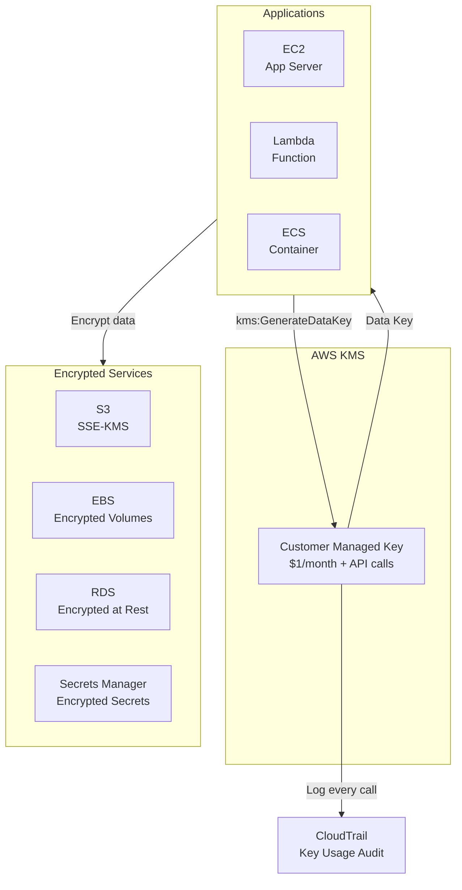

# Chapter 22 — AWS KMS (Key Management Service)

---

## Prerequisite Chapters
- Chapter 01 — AWS IAM (key policies, grants)
- Chapter 02 — Amazon S3 (SSE-KMS encryption)
- Chapter 06 — Amazon RDS (database encryption)

## Used In Production Practicals
- Practical 17 — Secure S3 + KMS
- Practical 03 — Secure Secrets
- Practical 15 — Flagship Production Architecture
- Every service that uses encryption at rest

---

## 1. Learning Objectives

By the end of this chapter, you will be able to:

1. **Explain** KMS key types, key policies, and envelope encryption.
2. **Create** Customer Managed Keys (CMKs) with proper key policies.
3. **Encrypt** data at rest for S3, EBS, RDS, and Secrets Manager.
4. **Implement** key rotation and cross-account key sharing.
5. **Configure** grants and ViaService conditions.
6. **Troubleshoot** KMS permission errors and throttling.
7. **Answer** interview questions about encryption and key management.

---

## 2. What is AWS KMS?

KMS is a managed service to create and control **encryption keys** used to protect your data across AWS services. Keys never leave KMS unencrypted — they're generated and used inside FIPS 140-2 validated hardware security modules (HSMs).

### Key Characteristics
- **Centralized key management** — create, rotate, disable, audit keys
- **Integrated with 100+ services** — S3, EBS, RDS, Lambda, Secrets Manager
- **Envelope encryption** — encrypt data keys, not your data directly
- **Audit trail** — every key usage logged in CloudTrail
- **FIPS 140-2 Level 2** — hardware-validated security

---

## 3. Why Do We Need It?

### Without KMS
```
Encryption keys stored in:
  - Application config files (exposed in git)
  - Environment variables (visible in console)
  - Separate key management system (complex, expensive)
  
Problems:
  - Key rotation is manual
  - No audit trail of key usage
  - Keys can be accidentally exposed
  - No centralized control
```

### With KMS
```
Keys managed centrally by AWS:
  - Never leave HSM unencrypted
  - Automatic rotation (annual)
  - Full audit trail in CloudTrail
  - Fine-grained access control via key policies
  - Integrated with every AWS service
```

---

## 4. Real-World Production Use Cases

### 1. S3 Data Encryption
All objects encrypted with SSE-KMS. Bucket policy denies unencrypted uploads. Audit who accessed which key via CloudTrail.

### 2. Database Encryption
RDS encrypted at rest with CMK. Snapshots automatically encrypted. Cross-region copy re-encrypts with destination region key.

### 3. Secrets Encryption
Secrets Manager encrypts all secrets with KMS. Separate key per application for blast radius isolation.

### 4. EBS Volume Encryption
All EBS volumes encrypted by default (account-level setting). Snapshots encrypted. AMIs encrypted.

---

## 5. Core Concepts

### Key Types

| Type | Managed By | Rotation | Cost | Use Case |
|------|-----------|----------|------|----------|
| **AWS Owned** | AWS (invisible to you) | AWS manages | Free | Default S3 encryption |
| **AWS Managed** | AWS (`aws/s3`, `aws/ebs`) | Annual, automatic | Free* | Service default encryption |
| **Customer Managed (CMK)** | You | Optional (annual) | $1/month/key | Fine-grained control |
| **Imported Key Material** | You provide key | Manual | $1/month | Regulatory requirement |

*Free for the key, but API calls are charged ($0.03/10,000 requests)

### Key Policy (THE Most Important Concept)

KMS keys have a **resource-based policy** (key policy) that is the PRIMARY authorization mechanism:

```json
{
    "Version": "2012-10-17",
    "Statement": [
        {
            "Sid": "Enable root account access",
            "Effect": "Allow",
            "Principal": {"AWS": "arn:aws:iam::123456789012:root"},
            "Action": "kms:*",
            "Resource": "*"
        },
        {
            "Sid": "Allow key administrators",
            "Effect": "Allow",
            "Principal": {"AWS": "arn:aws:iam::123456789012:role/KeyAdminRole"},
            "Action": [
                "kms:Create*", "kms:Describe*", "kms:Enable*", "kms:List*",
                "kms:Put*", "kms:Update*", "kms:Revoke*", "kms:Disable*",
                "kms:Get*", "kms:Delete*", "kms:TagResource",
                "kms:ScheduleKeyDeletion", "kms:CancelKeyDeletion"
            ],
            "Resource": "*"
        },
        {
            "Sid": "Allow key usage",
            "Effect": "Allow",
            "Principal": {"AWS": "arn:aws:iam::123456789012:role/AppRole"},
            "Action": [
                "kms:Encrypt", "kms:Decrypt", "kms:ReEncrypt*",
                "kms:GenerateDataKey", "kms:DescribeKey"
            ],
            "Resource": "*"
        },
        {
            "Sid": "Allow cross-account access",
            "Effect": "Allow",
            "Principal": {"AWS": "arn:aws:iam::222222222222:root"},
            "Action": [
                "kms:Encrypt", "kms:Decrypt", "kms:GenerateDataKey", "kms:DescribeKey"
            ],
            "Resource": "*"
        }
    ]
}
```

**Critical**: Without the root account statement, you can lock yourself out of the key!

### Envelope Encryption
```
Problem: KMS can only encrypt up to 4 KB of data directly

Solution: Envelope Encryption
  1. Call kms:GenerateDataKey → KMS returns:
     a. Plaintext data key (use immediately, then discard)
     b. Encrypted data key (store alongside your data)
  2. Encrypt your data (any size) with the plaintext data key
  3. Delete plaintext data key from memory
  4. Store: encrypted data + encrypted data key

Decryption:
  1. Send encrypted data key to KMS → kms:Decrypt
  2. KMS returns plaintext data key
  3. Decrypt your data with the plaintext data key
  4. Delete plaintext data key from memory

Result: KMS never sees your data. Your data key is always encrypted at rest.
```

### Key Rotation
```
Automatic Rotation (CMK):
  - KMS generates new key material annually
  - Old key material preserved (for decrypting old data)
  - Key ID and ARN don't change (aliases still work)
  - Transparent to applications

Manual Rotation:
  - Create a new key
  - Update alias to point to new key
  - Old key used to decrypt old data
  - New key used for new encryption
```

### Grants
```
Grants = temporary, fine-grained permissions for a key

Use case: Allow EC2 to use the key only for encrypting EBS volumes
  → Create a grant with:
    - Grantee: ec2.amazonaws.com
    - Operations: Encrypt, Decrypt, GenerateDataKey
    - Constraints: EncryptionContext must match
```

---

## 6. Architecture

### KMS in Production Architecture



### KMS per Service Integration
```
S3:    Bucket → Default encryption → SSE-KMS → Key ARN
EBS:   Volume → Encryption → KMS Key
RDS:   Instance → Storage encryption → KMS Key (at creation only!)
SM:    Secret → Encryption key → KMS Key
EFS:   File system → Encryption → KMS Key
```

---

## 7. Important Components

### Key Aliases
```bash
# Alias = friendly name for a key (human-readable)
# Can point to only one key, can be updated
# Format: alias/my-key-name

aws kms create-alias --alias-name alias/prod-data --target-key-id $KEY_ID
aws kms update-alias --alias-name alias/prod-data --target-key-id $NEW_KEY_ID
```

### ViaService Condition
```json
{
    "Condition": {
        "StringEquals": {
            "kms:ViaService": "s3.ap-south-1.amazonaws.com"
        }
    }
}
// Key can only be used through S3, not directly
```

### S3 Bucket Key
```
Without Bucket Key:
  Each S3 PUT → KMS API call → GenerateDataKey
  1,000,000 objects → 1,000,000 KMS calls → $3,000

With Bucket Key:
  S3 generates a bucket-level key from KMS (one call)
  Uses bucket key to create per-object keys locally
  1,000,000 objects → ~1 KMS call → $0.003

Enable Bucket Key → save up to 99% on KMS costs for S3
```

---

## 8. How It Works

### Encrypt/Decrypt Flow
```
Encrypt (small data < 4 KB):
  App → kms:Encrypt(KeyId, Plaintext) → KMS returns CiphertextBlob

Decrypt:
  App → kms:Decrypt(CiphertextBlob) → KMS returns Plaintext
  (KMS determines which key was used from the ciphertext metadata)

Envelope Encrypt (large data):
  App → kms:GenerateDataKey(KeyId) → KMS returns {Plaintext, CiphertextBlob}
  App encrypts data with Plaintext key, stores CiphertextBlob
  App deletes Plaintext from memory
```

---

## 9. AWS Console Walkthrough

### Create a Customer Managed Key
1. **KMS Console** → **Create key**
2. **Key type**: Symmetric (encrypt/decrypt)
3. **Key usage**: Encrypt and decrypt
4. **Alias**: `prod-data-key`
5. **Key administrators**: Admin role
6. **Key users**: Application role
7. Click **Create key**

---

## 10. AWS CLI Commands

```bash
# Create key
KEY_ID=$(aws kms create-key \
    --description "Production data encryption key" \
    --key-usage ENCRYPT_DECRYPT \
    --query 'KeyMetadata.KeyId' --output text)

# Create alias
aws kms create-alias --alias-name alias/prod-data --target-key-id $KEY_ID

# Enable automatic rotation
aws kms enable-key-rotation --key-id $KEY_ID

# Verify rotation status
aws kms get-key-rotation-status --key-id $KEY_ID

# Encrypt data
aws kms encrypt --key-id alias/prod-data \
    --plaintext fileb://secret.txt \
    --output text --query CiphertextBlob | base64 --decode > encrypted.bin

# Decrypt data
aws kms decrypt --ciphertext-blob fileb://encrypted.bin \
    --output text --query Plaintext | base64 --decode > decrypted.txt

# Generate data key (envelope encryption)
aws kms generate-data-key --key-id alias/prod-data \
    --key-spec AES_256

# List keys
aws kms list-keys --query 'Keys[*].KeyId'

# Describe key
aws kms describe-key --key-id alias/prod-data

# Schedule key deletion (7-30 day waiting period)
aws kms schedule-key-deletion --key-id $KEY_ID --pending-window-in-days 30
```

### Python (Boto3)
```python
import boto3
import base64

kms = boto3.client('kms')

# Encrypt
response = kms.encrypt(
    KeyId='alias/prod-data',
    Plaintext=b'My secret data'
)
ciphertext = response['CiphertextBlob']

# Decrypt
response = kms.decrypt(CiphertextBlob=ciphertext)
plaintext = response['Plaintext']

# Generate data key (envelope encryption)
response = kms.generate_data_key(
    KeyId='alias/prod-data',
    KeySpec='AES_256'
)
plaintext_key = response['Plaintext']       # Use to encrypt, then delete
encrypted_key = response['CiphertextBlob']  # Store alongside encrypted data
```

---

## 11. Hands-On Practical

### Practical: End-to-End Encryption with KMS

#### Objective
Create a CMK, encrypt S3 objects, enforce encryption via bucket policy, and verify audit trail.

#### Step 1 — Create CMK
```bash
KEY_ID=$(aws kms create-key --description "S3 encryption key" --query 'KeyMetadata.KeyId' --output text)
aws kms create-alias --alias-name alias/s3-data --target-key-id $KEY_ID
aws kms enable-key-rotation --key-id $KEY_ID
```

#### Step 2 — Configure S3 Default Encryption
```bash
aws s3api put-bucket-encryption --bucket my-secure-bucket \
    --server-side-encryption-configuration '{
        "Rules": [{"ApplyServerSideEncryptionByDefault": {"SSEAlgorithm": "aws:kms", "KMSMasterKeyID": "alias/s3-data"}, "BucketKeyEnabled": true}]
    }'
```

#### Step 3 — Enforce Encryption via Bucket Policy
```bash
aws s3api put-bucket-policy --bucket my-secure-bucket --policy '{
    "Version": "2012-10-17",
    "Statement": [{
        "Effect": "Deny", "Principal": "*", "Action": "s3:PutObject",
        "Resource": "arn:aws:s3:::my-secure-bucket/*",
        "Condition": {"StringNotEquals": {"s3:x-amz-server-side-encryption": "aws:kms"}}
    }]
}'
```

#### Validation
```bash
# Upload and verify encryption
aws s3 cp test.txt s3://my-secure-bucket/
aws s3api head-object --bucket my-secure-bucket --key test.txt \
    --query '{Encryption:ServerSideEncryption,KeyId:SSEKMSKeyId}'

# Check CloudTrail for key usage
aws cloudtrail lookup-events --lookup-attributes AttributeKey=ResourceType,AttributeValue=AWS::KMS::Key
```

---

## 12-18. Production through DR

### Production KMS Configuration
```
Keys:
  - One CMK per application/data classification
  - Separate key admin and key user roles
  - Automatic rotation enabled
  - Alias for human-readable reference

S3:   SSE-KMS with Bucket Key enabled
EBS:  Default encryption enabled at account level
RDS:  Encrypted at creation (CMK)
EFS:  Encrypted at creation (CMK)
SM:   Per-secret CMK (optional, default: aws/secretsmanager)

Cross-account:
  - Key policy grants access to target account root
  - Target account IAM policy allows kms:Decrypt
  - Both must allow for cross-account to work
```

---

## 19. Troubleshooting

### Problem 1: "AccessDeniedException" on kms:Decrypt
```
Authorization check:
  1. Key policy allows the caller? (REQUIRED — always checked)
  2. IAM policy allows kms:Decrypt? (checked if key policy delegates to IAM)
  3. Cross-account? BOTH key policy AND IAM must allow
  4. KMS ViaService condition restricts to specific service?
  5. Encryption context matches? (if condition on grant)
```

### Problem 2: KMS Throttling (ThrottlingException)
```
Default limits:
  - Symmetric: 5,500-30,000 requests/sec (varies by region)
  
Solutions:
  - Enable S3 Bucket Key (reduces calls by 99%)
  - Use data key caching (AWS Encryption SDK)
  - Request limit increase via AWS Support
```

### Problem 3: Can't Delete a KMS Key
```
KMS keys have mandatory 7-30 day waiting period before deletion
  - During wait: key is disabled (can't encrypt/decrypt)
  - Cancel: aws kms cancel-key-deletion --key-id KEY_ID
  - After wait: key material deleted permanently

If you delete a key used by existing encrypted data → DATA IS UNRECOVERABLE
```

---

## 20. Common Production Problems

| # | Problem | Root Cause | Prevention |
|---|---------|------------|------------|
| 1 | AccessDenied on decrypt | Key policy doesn't allow caller | Check key policy + IAM |
| 2 | KMS throttling | Too many API calls | Enable Bucket Key, cache data keys |
| 3 | Can't encrypt RDS after creation | Encryption must be set at creation | Always encrypt at creation |
| 4 | Cross-account decrypt fails | Only key policy set, not IAM | Both key policy AND IAM required |
| 5 | Deleted key, lost data | Key deleted after waiting period | Disable (don't delete) unless certain |
| 6 | High KMS costs | Per-API-call charging | Bucket Key, data key caching |
| 7 | Key rotation confusion | Old data uses old key material | Old material preserved automatically |
| 8 | Locked out of key | Removed root account from key policy | Always keep root access statement |

---

## 21. Real-World Scenario

### Scenario: Cross-Account Encrypted S3 Data Sharing

**Setup**: Account A has encrypted S3 data (CMK). Account B needs to read it.

**Solution**:
1. Account A: update KMS key policy → allow Account B root to Decrypt
2. Account B: create IAM policy → allow kms:Decrypt on Account A's key ARN
3. Account B: create IAM policy → allow s3:GetObject on Account A's bucket
4. Account A: update S3 bucket policy → allow Account B's role to GetObject

**Both** KMS key policy AND IAM policy must allow, **plus** S3 bucket policy.

---

## 22. Interview Questions

### Basic Questions (10)

**Q1: What is AWS KMS?**
A: KMS is a managed service for creating and controlling encryption keys. Keys are stored in hardware security modules (HSMs). Used to encrypt data across 100+ AWS services.

**Q2: What is the difference between AWS Managed and Customer Managed keys?**
A: AWS Managed (aws/s3, aws/ebs): AWS creates and manages, auto-rotates, free for the key. Customer Managed: you create, you set key policy, optional rotation, $1/month. Use CMK for fine-grained control and cross-account sharing.

**Q3: What is envelope encryption?**
A: KMS generates a data key. You encrypt your data with the data key. KMS encrypts the data key. Store: encrypted data + encrypted data key. KMS never sees your actual data.

**Q4: Why can't you directly encrypt large data with KMS?**
A: KMS has a 4 KB limit for direct encryption. Envelope encryption solves this: KMS encrypts a small data key, and you use that key to encrypt data of any size locally.

**Q5: What is a key policy?**
A: A resource-based policy attached to a KMS key. It's the PRIMARY authorization mechanism. Even if an IAM policy allows access, if the key policy doesn't, access is denied.

**Q6: What happens when you rotate a KMS key?**
A: New key material is generated. Old key material is preserved for decrypting existing data. The key ID and ARN don't change. Applications use the same alias. Rotation is transparent.

**Q7: How does S3 use KMS for encryption?**
A: SSE-KMS: S3 calls KMS to generate a data key for each object. The data key encrypts the object. The encrypted data key is stored as object metadata. On GET, S3 calls KMS to decrypt the data key.

**Q8: What is a KMS alias?**
A: A friendly name for a key (e.g., alias/prod-data). Points to one key ID. Can be updated to point to a different key (useful for manual key rotation).

**Q9: What is the S3 Bucket Key feature?**
A: S3 generates a bucket-level data key from KMS (one API call). Uses it to create per-object keys locally. Reduces KMS API calls by up to 99%, saving significant cost.

**Q10: Can you delete a KMS key immediately?**
A: No. There's a mandatory 7-30 day waiting period (configurable). During this period, the key is disabled. You can cancel deletion. After the period, key material is permanently deleted — any data encrypted with it is unrecoverable.

### Intermediate Questions (10)

**Q11: How does cross-account KMS access work?**
A: Two-step: 1) Key policy in Account A must allow the principal in Account B. 2) IAM policy in Account B must allow kms:Decrypt on Account A's key ARN. Both must allow.

**Q12: What is the difference between key policy and IAM policy for KMS?**
A: Key policy is always evaluated (primary). IAM policy is only evaluated if the key policy delegates to IAM (the root account statement enables this). Without the root statement, IAM policies are ignored.

**Q13: What is encryption context?**
A: Key-value pairs provided during encrypt/decrypt. They must match exactly for decryption. Logged in CloudTrail. Use for additional authorization and audit. Example: {"department": "finance"}.

**Q14: How do you encrypt an existing unencrypted EBS volume?**
A: Create snapshot → copy snapshot with encryption → create volume from encrypted snapshot. Or use `aws ec2 create-snapshot` → `aws ec2 copy-snapshot --encrypted` → `aws ec2 create-volume`.

**Q15: Can you change the KMS key used by RDS?**
A: No. RDS encryption key is set at creation and cannot be changed. To change: take snapshot → copy snapshot with new key → restore from copy.

**Q16-Q20**: *(Cover: grants vs key policies, symmetric vs asymmetric keys, multi-region keys, KMS + CloudTrail integration, and custom key stores with CloudHSM.)*

### Advanced Questions (10)

**Q21: Design a KMS key strategy for a multi-account organization.**
A: Central security account owns CMKs. Per-application keys (blast radius). Key policies grant access to specific workload accounts. Automatic rotation. CloudTrail logs all usage. AWS Config rule ensures encryption is enabled.

**Q22-Q30**: *(Cover: envelope encryption implementation, KMS throttling at scale, key policy locked out recovery, BYOK scenarios, CMK vs multi-region key for DR, KMS + Terraform automation, and regulatory compliance with KMS.)*

### Scenario-Based Questions (10)

**Q31: A developer accidentally deleted a KMS key. How do you recover?**
A: If within the waiting period (7-30 days): `aws kms cancel-key-deletion`. If past the waiting period: key material is permanently gone — data encrypted with it is unrecoverable. Prevention: remove ScheduleKeyDeletion permission from non-admin roles.

**Q32-Q40**: *(Cover: AccessDenied troubleshooting, cost spike from KMS API calls, cross-region encrypted data migration, encryption context mismatch debugging, and compliance audit of key usage.)*

---

## 23. Scenario-Based Interview Questions

*(Covered in section 22 above — Q31 through Q40)*

---

## 24. Common Mistakes

1. **Removing root from key policy** — locks you out of the key
2. **Not enabling rotation** — compliance requirement in most organizations
3. **Using AWS Managed keys for cross-account** — can't share, use CMK
4. **Deleting keys** — disable instead of delete unless absolutely certain
5. **No Bucket Key for S3** — paying 100x more KMS API costs
6. **Same key for everything** — use separate keys per application/classification
7. **Not checking key policy** — IAM alone doesn't grant KMS access
8. **Encrypting RDS after creation** — must be set at creation time

---

## 25. Production Checklist

- [ ] CMK created for each application/data classification
- [ ] Key policy has root account access (prevent lockout)
- [ ] Key admin and key user roles separated
- [ ] Automatic rotation enabled on all CMKs
- [ ] Key aliases created for human readability
- [ ] S3 Bucket Key enabled (cost optimization)
- [ ] EBS default encryption enabled at account level
- [ ] RDS encryption enabled at creation
- [ ] CloudTrail logging all KMS API calls
- [ ] Cross-account key policies configured (if needed)
- [ ] Key deletion prevention (remove ScheduleKeyDeletion from non-admins)

---

## 26. Chapter Summary

KMS is the encryption foundation of AWS. Key takeaways:

1. **Customer Managed Keys for production** — $1/month, full control, audit trail
2. **Envelope encryption** — KMS encrypts data keys, you encrypt data
3. **Key policy is PRIMARY** — must allow access even if IAM allows
4. **Root account in key policy** — never remove (lockout risk)
5. **S3 Bucket Key** — reduces KMS API costs by up to 99%
6. **Automatic rotation** — transparent, old data still decryptable
7. **Cross-account = key policy + IAM** — both must allow
8. **Never delete keys hastily** — disable first, delete only when certain
9. **Separate keys per application** — blast radius isolation
10. **CloudTrail audits every key usage** — who decrypted what, when

---
---

# 🔬 Practical Lab 29 — KMS Encryption Architecture

## Lab Overview
| Item | Detail |
|------|--------|
| **Difficulty** | Intermediate |
| **Duration** | 25 minutes |
| **Cost** | $1/key/month |
| **Prerequisites** | Practical 23 (S3), Practical 16 (RDS) |
| **Lab Environment** | Environment 7 — Storage & Security |

### Step 1 — Create Customer Managed Key (CMK)
1. **KMS** → **Create key**
   - **Type**: Symmetric
   - **Alias**: `prod-data-key`
   - **Key admin**: Your admin user
   - **Key usage**: EC2 role, RDS service

📸 **Screenshot 01** — CMK Created
> **Verify**: Key shows "Enabled", alias "prod-data-key"

### Step 2 — Encrypt S3 Bucket with CMK
1. Bucket → **Properties** → **Default encryption** → SSE-KMS → Select `prod-data-key`

📸 **Screenshot 02** — S3 Using CMK Encryption
> **Verify**: Default encryption shows KMS with your key ARN

### Step 3 — Encrypt EBS Volume with CMK
```bash
aws ec2 create-volume --size 10 --volume-type gp3 \
    --encrypted --kms-key-id alias/prod-data-key \
    --availability-zone ap-south-1a
```

📸 **Screenshot 03** — Encrypted EBS Volume
> **Verify**: Encryption shows "Enabled", KMS key shows "prod-data-key"

🎯 **Interview Insight**: "AWS Managed Key vs Customer Managed Key?"
> **Strong answer**: "AWS Managed: free, auto-rotated yearly, can't control policy. Customer Managed: $1/month, you control the key policy (who can use/administer), configurable rotation, cross-account sharing, can disable/delete. Use CMK for compliance and multi-account architectures."
