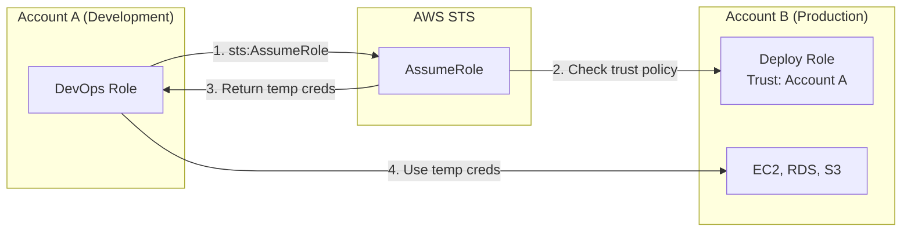
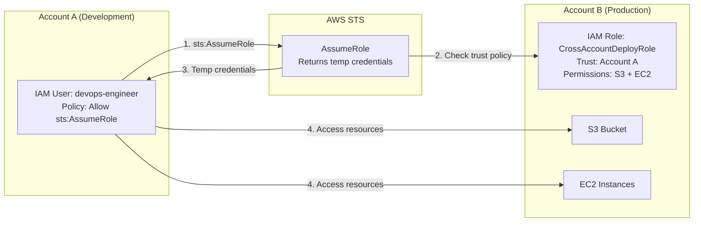

# Chapter 23 — AWS STS (Security Token Service)

---

## Prerequisite Chapters
- Chapter 01 — AWS IAM (roles, policies, federation)

## Used In Production Practicals
- Practical 01 — IAM Foundation (cross-account roles)
- Practical 02 — Enterprise AWS Accounts (assume role)
- Practical 15 — Flagship Production Architecture

---

## 1. Learning Objectives

By the end of this chapter, you will be able to:

1. **Explain** STS and how temporary credentials work.
2. **Use** AssumeRole for cross-account access and service access.
3. **Implement** federation with SAML and OIDC.
4. **Configure** session duration, session policies, and ExternalId.
5. **Troubleshoot** assume role failures and token issues.
6. **Answer** interview questions about temporary credentials and federation.

---

## 2. What is AWS STS?

STS provides **temporary security credentials** (access key + secret key + session token) for users or applications that need limited-time access to AWS resources.

### Key Characteristics
- **Temporary** — credentials expire automatically (15 min to 36 hours)
- **No long-term storage** — no password rotation needed
- **Scoped** — session policies can further restrict permissions
- **Auditable** — every AssumeRole call logged in CloudTrail
- **Cross-account** — the primary mechanism for multi-account access
- **Federation** — allows external identities (AD, Google) to access AWS

---

## 3. Why Do We Need It?

### Without STS (Long-term Access Keys)
```
Problems:
  - Keys never expire unless manually rotated
  - If leaked → unlimited access until discovered
  - Hard to track which application used which key
  - Cross-account: share keys? Create IAM users in every account?
```

### With STS (Temporary Credentials)
```
Benefits:
  - Expire automatically (1 hour default)
  - If leaked → damage limited to session duration
  - Every AssumeRole logged in CloudTrail
  - Cross-account: assume role, no credential sharing
  - Can be further scoped with session policies
```

---

## 4. Real-World Production Use Cases

### 1. Cross-Account Access
DevOps team in Account A assumes a role in Account B (production) to deploy infrastructure. No IAM users in Account B.

### 2. EC2 Instance Roles
EC2 instance assumes its instance profile role → STS provides temporary credentials → application accesses S3/DynamoDB.

### 3. CI/CD Pipeline
CodeBuild assumes a deployment role in the production account to deploy CloudFormation stacks.

### 4. Third-Party Access
External vendor assumes a role in your account with ExternalId to prevent confused deputy attacks.

### 5. Federation
Corporate employees sign in via Active Directory → SAML → AssumeRoleWithSAML → temporary AWS credentials.

---

## 5. Core Concepts

### STS API Operations

| Operation | Use Case | Duration |
|-----------|----------|----------|
| **AssumeRole** | Cross-account access, service roles | 15 min — 12 hrs |
| **AssumeRoleWithSAML** | Enterprise SSO (Active Directory) | 15 min — 12 hrs |
| **AssumeRoleWithWebIdentity** | Mobile/web apps (Google, Facebook) | 15 min — 12 hrs |
| **GetSessionToken** | MFA-protected API access | 15 min — 36 hrs |
| **GetFederationToken** | Temporary access for federated users | 15 min — 36 hrs |

### How AssumeRole Works
```
Step 1: Caller in Account A calls sts:AssumeRole
  → Target: arn:aws:iam::222222222222:role/DeployRole

Step 2: STS checks:
  a. Caller's IAM policy allows sts:AssumeRole on the target role ARN
  b. Target role's trust policy allows the caller's principal
  c. ExternalId matches (if required in trust policy)

Step 3: STS returns temporary credentials:
  {
    "AccessKeyId": "ASIA...",          (starts with ASIA, not AKIA)
    "SecretAccessKey": "wJalr...",
    "SessionToken": "FwoGZX...",       (MUST be included in API calls)
    "Expiration": "2026-09-18T15:00:00Z"
  }

Step 4: Caller uses credentials to access Account B resources
Step 5: Credentials expire → caller must re-assume
```

### Trust Policy (on the target role)
```json
{
    "Version": "2012-10-17",
    "Statement": [{
        "Effect": "Allow",
        "Principal": {
            "AWS": "arn:aws:iam::111111111111:role/DevOpsRole"
        },
        "Action": "sts:AssumeRole",
        "Condition": {
            "StringEquals": {
                "sts:ExternalId": "unique-id-12345"
            }
        }
    }]
}
```

### ExternalId (Confused Deputy Prevention)
```
Without ExternalId:
  Attacker tricks a third-party service into assuming YOUR role
  → Third-party has legitimate AssumeRole permission
  → Attacker gains access to your account through the third party

With ExternalId:
  Trust policy requires ExternalId = "unique-id-12345"
  → Only the legitimate third party knows the ExternalId
  → Attacker can't provide the correct ExternalId → denied
```

### Session Policies
```
Session policies FURTHER RESTRICT the assumed role's permissions
  → Cannot GRANT additional permissions
  → Effective permissions = intersection of role policy AND session policy

Use case: Assume a powerful role but restrict to specific S3 bucket
```

### Role Chaining
```
Role A assumes Role B, Role B assumes Role C

Limitation: Maximum session duration = 1 hour (regardless of individual role settings)
Each AssumeRole in the chain = one STS API call logged in CloudTrail
```

---

## 6. Architecture

### Cross-Account Access with STS



---

## 7-10. CLI Commands & Practical

### AWS CLI — AssumeRole
```bash
# Assume role in another account
CREDS=$(aws sts assume-role \
    --role-arn arn:aws:iam::222222222222:role/DeployRole \
    --role-session-name "deploy-session" \
    --duration-seconds 3600 \
    --external-id "unique-id-12345")

# Extract credentials
export AWS_ACCESS_KEY_ID=$(echo $CREDS | jq -r '.Credentials.AccessKeyId')
export AWS_SECRET_ACCESS_KEY=$(echo $CREDS | jq -r '.Credentials.SecretAccessKey')
export AWS_SESSION_TOKEN=$(echo $CREDS | jq -r '.Credentials.SessionToken')

# Now all AWS CLI commands use Account B credentials
aws s3 ls  # Lists Account B's buckets
```

### AWS CLI Profile (Simpler)
```ini
# ~/.aws/config
[profile prod-deploy]
role_arn = arn:aws:iam::222222222222:role/DeployRole
source_profile = default
external_id = unique-id-12345
region = ap-south-1

# Usage:
aws s3 ls --profile prod-deploy
```

### Python (Boto3)
```python
import boto3

sts = boto3.client('sts')

# Assume role
response = sts.assume_role(
    RoleArn='arn:aws:iam::222222222222:role/DeployRole',
    RoleSessionName='my-session',
    DurationSeconds=3600,
    ExternalId='unique-id-12345'
)

credentials = response['Credentials']

# Create client with temporary credentials
s3 = boto3.client('s3',
    aws_access_key_id=credentials['AccessKeyId'],
    aws_secret_access_key=credentials['SecretAccessKey'],
    aws_session_token=credentials['SessionToken']
)

# Access resources in Account B
buckets = s3.list_buckets()
```

### Get Caller Identity (Who am I?)
```bash
# Check which identity you're currently using
aws sts get-caller-identity
# Returns: Account, UserId, ARN
```

---

## 11-18. Practical through DR

### Production STS Patterns
```
Pattern 1: Cross-Account Deployment
  CI/CD (Account A) → AssumeRole → Deploy (Account B)

Pattern 2: Break-Glass Access
  Engineer → AssumeRole (requires MFA) → Emergency admin access

Pattern 3: Third-Party Vendor
  Vendor → AssumeRole (requires ExternalId) → Read-only access

Pattern 4: Service-to-Service
  Lambda (Account A) → AssumeRole → DynamoDB (Account B)
```

---

## 19. Troubleshooting

### Problem 1: "AccessDenied" on AssumeRole
```
Check (in order):
  1. Caller's IAM policy allows sts:AssumeRole on the target role ARN?
  2. Target role's trust policy allows the caller's principal?
  3. ExternalId matches (if required)?
  4. Session duration within allowed max?
  5. Role chaining? (max 1 hour)
  6. MFA required but not provided?
```

### Problem 2: Temporary Credentials Not Working
```
Check:
  1. Including SessionToken in API calls? (required!)
  2. Credentials expired? (check Expiration timestamp)
  3. Role has permissions for the action?
  4. Session policy further restricting? (intersection logic)
```

---

## 20-21. Common Problems & Scenario

| # | Problem | Root Cause | Prevention |
|---|---------|------------|------------|
| 1 | AssumeRole denied | Trust policy wrong | Verify principal ARN exactly |
| 2 | Missing SessionToken | Not included in API call | Always set AWS_SESSION_TOKEN |
| 3 | Credentials expired | Session too short | Re-assume before expiry |
| 4 | Role chaining fails | > 1 hour session | Design architecture to avoid chains |
| 5 | Confused deputy | No ExternalId | Always require ExternalId for third parties |

---

## 22. Interview Questions

### Basic Questions (10)

**Q1: What is AWS STS?**
A: STS provides temporary security credentials for users and applications. Credentials include AccessKeyId, SecretAccessKey, and SessionToken, and they expire automatically.

**Q2: What is AssumeRole?**
A: An STS API call that returns temporary credentials for a specified IAM role. Used for cross-account access, service roles, and federation. Requires trust policy on the target role.

**Q3: What is the difference between long-term and temporary credentials?**
A: Long-term: IAM user access keys, never expire, must rotate manually. Temporary: STS credentials, expire automatically, no rotation needed, auditable via CloudTrail.

**Q4: What is a trust policy?**
A: A resource-based policy on an IAM role that specifies who can assume it. Defines the trusted principals (users, roles, accounts, services).

**Q5: What is ExternalId?**
A: A unique identifier required in AssumeRole calls for third-party access. Prevents confused deputy attacks where an attacker tricks a trusted service into accessing your resources.

**Q6: How do EC2 instances get AWS credentials?**
A: Via Instance Profile (IAM role). STS automatically provides temporary credentials to the instance, refreshed before expiry. Applications use the instance metadata service (IMDS) to retrieve them.

**Q7: What is the maximum session duration?**
A: AssumeRole: up to 12 hours (configurable on the role). GetSessionToken: up to 36 hours. Role chaining: always 1 hour.

**Q8: How do you check which identity you're using?**
A: `aws sts get-caller-identity` — returns Account, UserId, and ARN.

**Q9: What is a session policy?**
A: An inline policy passed during AssumeRole that further restricts the assumed role's permissions. Cannot grant additional permissions beyond the role's policy.

**Q10: How do you verify if AssumeRole was successful?**
A: Check the response for Credentials (AccessKeyId, SecretAccessKey, SessionToken, Expiration). Or call `aws sts get-caller-identity` with the new credentials.

### Intermediate Questions (10)

**Q11: Explain the confused deputy problem with an example.**
A: Service X is trusted by your Account A. Attacker tells Service X to assume the role in Account A on their behalf. Without ExternalId, Service X can access your resources for the attacker. With ExternalId, Service X must provide the correct ExternalId that only the legitimate customer knows.

**Q12: What is role chaining and what is its limitation?**
A: Assuming a role, then using those credentials to assume another role. Each hop is a separate STS call. Limitation: maximum session duration is always 1 hour regardless of role settings.

**Q13: How does SAML federation work with STS?**
A: User authenticates with corporate IdP (AD). IdP sends SAML assertion to AWS. STS validates assertion → AssumeRoleWithSAML → returns temporary credentials. User accesses AWS resources.

**Q14: What is the difference between AssumeRoleWithSAML and AssumeRoleWithWebIdentity?**
A: SAML: for enterprise IdPs (Active Directory, Okta). WebIdentity: for web/mobile apps (Google, Facebook, Amazon). Both return temporary credentials but use different identity sources.

**Q15-Q20**: *(Cover: federation vs IAM users, MFA with STS, cross-region STS calls, token service endpoint optimization, and STS + Organizations SCPs.)*

### Advanced & Scenario Questions (20)

**Q21: Design a cross-account access strategy for a 50-account organization.**
A: Use IAM Identity Center (SSO) for human access. For service-to-service: define roles in target accounts with trust policies for source account roles. Use Organizations SCPs as guardrails. Log all AssumeRole calls in centralized CloudTrail.

**Q22: A developer's temporary credentials are being used from an unexpected IP. Investigation?**
A: 1) CloudTrail: find AssumeRole call, check source IP. 2) If compromised: revoke active sessions on the role. 3) Add IP condition to trust policy. 4) Investigate how credentials were exposed.

**Q23-Q40**: *(Cover: break-glass access patterns, revoking STS sessions, confusion between IAM policies and trust policies, cross-account Lambda access, STS regional endpoints, credential forwarding risks, and temporary credentials in CI/CD.)*

---

## 24. Common Mistakes

1. **Forgetting SessionToken** — API calls fail without it
2. **Wrong principal in trust policy** — must be exact ARN
3. **No ExternalId for third parties** — confused deputy risk
4. **Role chaining with long sessions** — always capped at 1 hour
5. **Using long-term keys when STS is available** — prefer temporary
6. **Not checking trust policy** — common AssumeRole failure cause
7. **Hardcoding credentials from STS** — they expire, use SDK auto-refresh

---

## 25. Production Checklist

- [ ] Cross-account roles use AssumeRole (no shared credentials)
- [ ] ExternalId required for all third-party trust relationships
- [ ] Session duration set appropriately (not maximum)
- [ ] Trust policies specify exact principal ARNs (not wildcards)
- [ ] CloudTrail logs all AssumeRole calls
- [ ] EC2 instances use Instance Profiles (not access keys)
- [ ] Lambda uses execution roles (not embedded keys)
- [ ] Role chaining avoided where possible

---

## 26. Chapter Summary

STS is how AWS does identity federation and cross-account access. Key takeaways:

1. **Temporary credentials > long-term keys** — always prefer STS
2. **AssumeRole for cross-account** — no credential sharing between accounts
3. **Trust policy + IAM policy** — both must allow for AssumeRole to work
4. **ExternalId for third parties** — prevents confused deputy attacks
5. **Session Token is required** — include in every API call
6. **Role chaining = 1 hour max** — plan architecture accordingly
7. **EC2 Instance Profiles use STS** — auto-refreshed, no key management
8. **Every AssumeRole is audited** — CloudTrail captures all STS calls

---
---

# 🔬 Practical Lab 03 — Cross-Account IAM Role (AssumeRole)

## Lab Overview

| Item | Detail |
|------|--------|
| **Difficulty** | Intermediate |
| **Duration** | 40 minutes |
| **Cost** | Free (IAM + STS are free) |
| **Prerequisites** | Practical 01 completed, understanding of IAM roles |
| **Lab Environment** | Environment 1 — Foundation |
| **AWS Region** | ap-south-1 (Mumbai) |

## Business Scenario

> Your company has two AWS accounts: **Development** (Account A) and **Production** (Account B). The DevOps engineer in Account A needs to deploy infrastructure in Account B without creating an IAM user in Account B. You need to implement **cross-account access using AssumeRole** — the AWS-recommended pattern for multi-account access.

> **If you only have one AWS account**: You can simulate this by creating a role in your own account with a trust policy that allows your own account's IAM user to assume it. The concepts are identical.

## Architecture



## What You Will Learn

1. Create a cross-account IAM role with a trust policy
2. Create a permissions policy on the source account to allow AssumeRole
3. Use `aws sts assume-role` to get temporary credentials
4. Access resources in the target account using temporary credentials
5. Use AWS CLI profiles for seamless cross-account access
6. Understand ExternalId for third-party access

---

### Step 1 — Create the Cross-Account Role (in Account B / Target)

> **If single account**: Create this role in your own account. Set the trust to your own account ID.

#### AWS Console

1. Navigate to **IAM Console** → **Roles** → **Create role**
2. **Trusted entity type**: AWS account
3. **An AWS account**: Select **Another AWS account**
   - **Account ID**: Enter Account A's 12-digit ID (or your own account ID)
   - ✅ **Require external ID**: `devops-access-2026` (optional but best practice)
4. Click **Next**
5. **Attach policies**: Select `AmazonS3FullAccess` and `AmazonEC2ReadOnlyAccess`
6. Click **Next**
7. **Role name**: `CrossAccountDeployRole`
8. **Description**: `Allows Account A DevOps engineers to access S3 and view EC2 in this account`
9. Click **Create role**

📸 **Screenshot 01** — Role Created with Trust Policy
> **What you should see**: Role "CrossAccountDeployRole" with 2 policies, trust showing Account A's ID
> **Verify**: Trust relationship tab shows the source account ID and ExternalId condition

10. Click the role → **Trust relationships** tab → Verify the trust policy:

```json
{
    "Version": "2012-10-17",
    "Statement": [{
        "Effect": "Allow",
        "Principal": {
            "AWS": "arn:aws:iam::111111111111:root"
        },
        "Action": "sts:AssumeRole",
        "Condition": {
            "StringEquals": {
                "sts:ExternalId": "devops-access-2026"
            }
        }
    }]
}
```

📸 **Screenshot 02** — Trust Policy JSON
> **What you should see**: Principal showing Account A's root ARN, Condition with ExternalId
> **Verify**: The Account ID is correct and ExternalId matches what you entered

#### AWS CLI

```bash
# In Account B (or your account for single-account simulation)
ACCOUNT_A_ID="111111111111"  # Replace with actual Account A ID

cat > cross-account-trust.json << EOF
{
    "Version": "2012-10-17",
    "Statement": [{
        "Effect": "Allow",
        "Principal": {"AWS": "arn:aws:iam::${ACCOUNT_A_ID}:root"},
        "Action": "sts:AssumeRole",
        "Condition": {
            "StringEquals": {"sts:ExternalId": "devops-access-2026"}
        }
    }]
}
EOF

aws iam create-role \
    --role-name CrossAccountDeployRole \
    --assume-role-policy-document file://cross-account-trust.json

aws iam attach-role-policy --role-name CrossAccountDeployRole \
    --policy-arn arn:aws:iam::aws:policy/AmazonS3FullAccess
aws iam attach-role-policy --role-name CrossAccountDeployRole \
    --policy-arn arn:aws:iam::aws:policy/AmazonEC2ReadOnlyAccess
```

🎯 **Interview Insight**: "What is ExternalId and why do you need it?"
> **What they're testing**: Understanding of the confused deputy problem
> **Strong answer**: "ExternalId prevents confused deputy attacks. Without it, a malicious third party could trick a trusted service into assuming a role in your account on their behalf. ExternalId acts as a shared secret — only the legitimate party knows it, so the attacker can't forge the AssumeRole request."
> **Weak answer**: "It's extra security." (Too vague — interviewers want the confused deputy explanation)

---

### Step 2 — Grant AssumeRole Permission (in Account A / Source)

#### AWS Console (Account A)

1. Navigate to **IAM Console** → **Users** → select `devops-engineer` (or create one)
2. **Add permissions** → **Create inline policy** → **JSON**:

```json
{
    "Version": "2012-10-17",
    "Statement": [{
        "Effect": "Allow",
        "Action": "sts:AssumeRole",
        "Resource": "arn:aws:iam::222222222222:role/CrossAccountDeployRole"
    }]
}
```

3. **Policy name**: `AllowAssumeDeployRole`
4. Click **Create policy**

📸 **Screenshot 03** — AssumeRole Permission on Source User
> **What you should see**: Inline policy "AllowAssumeDeployRole" attached to the user
> **Verify**: Resource ARN points to Account B's CrossAccountDeployRole

#### AWS CLI

```bash
# In Account A
ACCOUNT_B_ID="222222222222"  # Replace with actual Account B ID

cat > assume-role-policy.json << EOF
{
    "Version": "2012-10-17",
    "Statement": [{
        "Effect": "Allow",
        "Action": "sts:AssumeRole",
        "Resource": "arn:aws:iam::${ACCOUNT_B_ID}:role/CrossAccountDeployRole"
    }]
}
EOF

aws iam put-user-policy \
    --user-name devops-engineer \
    --policy-name AllowAssumeDeployRole \
    --policy-document file://assume-role-policy.json
```

🎯 **Interview Insight**: "Both accounts need to allow the access — explain why."
> **What they're testing**: Cross-account authorization model
> **Strong answer**: "Cross-account access requires TWO things: 1) The trust policy on the target role must allow the source principal. 2) The IAM policy on the source principal must allow sts:AssumeRole on the target role ARN. If either is missing, the AssumeRole call fails. It's like a door with two locks — both must be unlocked."

---

### Step 3 — Assume the Role and Access Resources

#### AWS CLI

```bash
# From Account A — Assume the role in Account B
CREDS=$(aws sts assume-role \
    --role-arn arn:aws:iam::222222222222:role/CrossAccountDeployRole \
    --role-session-name "devops-deploy-session" \
    --external-id "devops-access-2026" \
    --duration-seconds 3600 \
    --output json)

echo "Assumed role successfully!"
echo $CREDS | python3 -m json.tool

# Extract credentials
export AWS_ACCESS_KEY_ID=$(echo $CREDS | python3 -c "import sys,json;print(json.load(sys.stdin)['Credentials']['AccessKeyId'])")
export AWS_SECRET_ACCESS_KEY=$(echo $CREDS | python3 -c "import sys,json;print(json.load(sys.stdin)['Credentials']['SecretAccessKey'])")
export AWS_SESSION_TOKEN=$(echo $CREDS | python3 -c "import sys,json;print(json.load(sys.stdin)['Credentials']['SessionToken'])")

# Verify identity — should show Account B's role
aws sts get-caller-identity
```

📸 **Screenshot 04** — AssumeRole Output
> **What you should see**: JSON with AccessKeyId (starts with ASIA), SecretAccessKey, SessionToken, Expiration
> **Verify**: `get-caller-identity` shows Account B's account ID and the CrossAccountDeployRole ARN

```bash
# Now access Account B resources
aws s3 ls  # Lists Account B's buckets
aws ec2 describe-instances --region ap-south-1  # Lists Account B's instances
```

📸 **Screenshot 05** — Cross-Account Resource Access
> **What you should see**: S3 buckets from Account B, EC2 instances from Account B
> **Verify**: These are NOT Account A's resources — you're operating in Account B

```bash
# Try something NOT allowed (e.g., IAM — not in the role's permissions)
aws iam list-users  # Should get AccessDenied
```

📸 **Screenshot 06** — Least Privilege Verification
> **What you should see**: AccessDenied error for IAM actions
> **Verify**: Role only has S3 and EC2 ReadOnly — IAM is denied (least privilege)

---

### Step 4 — Configure AWS CLI Profile for Seamless Access

Instead of manually exporting credentials, configure a CLI profile:

```bash
# Add to ~/.aws/config
cat >> ~/.aws/config << 'EOF'

[profile account-b-deploy]
role_arn = arn:aws:iam::222222222222:role/CrossAccountDeployRole
source_profile = default
external_id = devops-access-2026
region = ap-south-1
EOF
```

```bash
# Now use it seamlessly — CLI handles AssumeRole automatically!
aws s3 ls --profile account-b-deploy
aws ec2 describe-instances --profile account-b-deploy
aws sts get-caller-identity --profile account-b-deploy
```

📸 **Screenshot 07** — CLI Profile Working
> **What you should see**: Resources from Account B returned when using --profile account-b-deploy
> **Verify**: `get-caller-identity` shows the CrossAccountDeployRole ARN

🎯 **Interview Insight**: "How do you manage credentials for multiple AWS accounts?"
> **What they're testing**: Practical multi-account workflow
> **Strong answer**: "Use AWS CLI profiles with role_arn and source_profile. The CLI automatically handles AssumeRole and credential refresh. For many accounts, use IAM Identity Center (SSO) with `aws configure sso` for centralized access. Never share or copy access keys between accounts."
> **Weak answer**: "Create IAM users in every account." (Anti-pattern, doesn't scale)

---

### Step 5 — Verify in CloudTrail

#### AWS Console (Account B)

1. Navigate to **CloudTrail Console** → **Event history**
2. Filter: **Event name** = `AssumeRole`
3. Find the event → Click to expand

📸 **Screenshot 08** — CloudTrail AssumeRole Event
> **What you should see**: AssumeRole event showing: source Account A principal, target role ARN, session name "devops-deploy-session"
> **Verify**: Event details show requestParameters with roleArn and externalId

---

## Validation

### Test 1 — Verify Cross-Account Identity
```bash
# From Account A with profile
aws sts get-caller-identity --profile account-b-deploy
```
**Expected**: Account shows Account B's ID, ARN shows `assumed-role/CrossAccountDeployRole/devops-deploy-session`

### Test 2 — Verify Permissions
```bash
aws s3 ls --profile account-b-deploy  # Should work
aws iam list-users --profile account-b-deploy  # Should be denied
```
**Expected**: S3 allowed, IAM denied

---

## Troubleshooting

| Problem | Likely Cause | Fix |
|---------|-------------|-----|
| "AccessDenied" on AssumeRole | Trust policy wrong | Verify Account A's ID in trust policy Principal |
| "AccessDenied" with correct trust | Source user missing sts:AssumeRole permission | Add sts:AssumeRole policy to source user |
| ExternalId mismatch | Different ExternalId in trust vs CLI call | Match exactly, case-sensitive |
| "Token is expired" | Session expired | Re-assume the role (or let CLI profile auto-refresh) |
| Can't access resources after assuming | Wrong session token | Verify AWS_SESSION_TOKEN is exported |

---

## Interview Questions From This Practical

**Q1: Walk me through how cross-account access works.**
A: Two authorization gates: 1) Trust policy on target role allows the source principal. 2) IAM policy on source principal allows sts:AssumeRole. Both must pass. STS returns temporary credentials. All calls use those credentials to access the target account. Everything is logged in CloudTrail.

**Q2: Can you use a role's permissions to modify the trust policy of that same role?**
A: Only if the role has iam:UpdateAssumeRolePolicy permission. This is dangerous — a compromised role could expand its own trust. Don't grant IAM write permissions to cross-account roles.

**Q3: Why should you use ExternalId when granting access to a third-party vendor?**
A: To prevent confused deputy attacks. Without ExternalId, an attacker could trick the vendor into assuming your role on their behalf (since the vendor's principal is trusted). ExternalId is a shared secret that only the legitimate customer-vendor relationship knows.

---

## Cleanup

```bash
# Clear environment variables
unset AWS_ACCESS_KEY_ID AWS_SECRET_ACCESS_KEY AWS_SESSION_TOKEN

# Remove CLI profile (edit ~/.aws/config manually)

# In Account B: Delete the role
aws iam detach-role-policy --role-name CrossAccountDeployRole \
    --policy-arn arn:aws:iam::aws:policy/AmazonS3FullAccess
aws iam detach-role-policy --role-name CrossAccountDeployRole \
    --policy-arn arn:aws:iam::aws:policy/AmazonEC2ReadOnlyAccess
aws iam delete-role --role-name CrossAccountDeployRole

# In Account A: Remove inline policy
aws iam delete-user-policy --user-name devops-engineer --policy-name AllowAssumeDeployRole
```

📸 **Screenshot 09** — Cleanup Complete
> **Verify**: Role deleted from Account B, inline policy removed from Account A user
