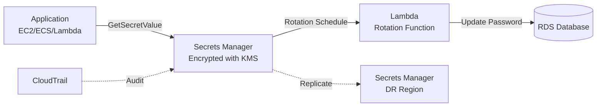

# Chapter 24 — AWS Secrets Manager

---

## Prerequisite Chapters
- Chapter 01 — AWS IAM (access to secrets)
- Chapter 22 — AWS KMS (encryption of secrets)
- Chapter 06 — Amazon RDS (database password management)

## Used In Production Practicals
- Practical 03 — Secure Secrets
- Practical 14 — Secure Application (ALB → EC2 → Secrets Manager → RDS)
- Practical 15 — Flagship Production Architecture

---

## 1. Learning Objectives

By the end of this chapter, you will be able to:

1. **Explain** Secrets Manager vs SSM Parameter Store — when to use each.
2. **Store** and retrieve secrets (database passwords, API keys, OAuth tokens).
3. **Configure** automatic rotation for RDS and custom secrets.
4. **Integrate** secrets with Lambda, ECS, Fargate, and EC2.
5. **Implement** cross-region replication for DR.
6. **Troubleshoot** access denied, rotation failures, and caching.
7. **Answer** interview questions about secret management.

---

## 2. What is AWS Secrets Manager?

Secrets Manager stores, rotates, and retrieves secrets securely. It encrypts secrets with KMS and supports **automatic rotation** — the killer feature that distinguishes it from Parameter Store.

### Secrets Manager vs SSM Parameter Store

| Feature | Secrets Manager | SSM Parameter Store |
|---------|----------------|-------------------|
| **Primary use** | Secrets (passwords, keys, tokens) | Configuration + simple secrets |
| **Automatic rotation** | ✅ Built-in (Lambda-powered) | ❌ No built-in rotation |
| **Cost** | $0.40/secret/month + $0.05/10K API | Free (Standard) |
| **Cross-region replication** | ✅ Built-in | ❌ Not available |
| **Size** | Up to 65 KB | 4 KB (std) / 8 KB (advanced) |
| **RDS integration** | ✅ Native rotation for RDS | ❌ Manual |
| **Versioning** | ✅ Automatic (current, previous, pending) | ✅ Labels |
| **KMS encryption** | ✅ Always encrypted | Optional (SecureString) |

### When to Use Each
```
Secrets Manager:
  ✅ Database passwords (needs rotation)
  ✅ API keys that expire
  ✅ OAuth tokens
  ✅ Multi-region secret replication

Parameter Store:
  ✅ Feature flags (ON/OFF)
  ✅ Database endpoints (non-secret config)
  ✅ Application settings
  ✅ Cost-sensitive (free tier)
  ✅ Hierarchical config (/app/prod/db-host)
```

---

## 3. Why Do We Need It?

### Without Secrets Manager
```
Where are your passwords?
  - Hardcoded in application code (leaked in git)
  - Environment variables (visible in console)
  - Config files on disk (compromised if server breached)
  - Shared team spreadsheet (yes, this happens)
  
Problems:
  - No rotation (same password for years)
  - No audit trail (who accessed what?)
  - No encryption at rest (plaintext files)
  - Password change = redeploy every application
```

### With Secrets Manager
```
Passwords stored securely:
  - Encrypted with KMS (AES-256)
  - Automatic rotation every 30 days
  - Full audit trail (CloudTrail)
  - Application retrieves at runtime (no hardcoding)
  - Password change = automatic, no redeploy
```

---

## 4. Real-World Production Use Cases

### 1. RDS Database Credentials
Store master password in Secrets Manager → auto-rotate every 30 days → application retrieves current password at runtime.

### 2. Third-Party API Keys
Store API keys for Stripe, Twilio, SendGrid → rotate when compromised → Lambda rotation function calls third-party API.

### 3. ECS/Fargate Container Secrets
Task definition references Secrets Manager ARN → ECS injects secret as environment variable at task launch.

### 4. Cross-Region DR
Replicate secrets to DR region → application in DR region uses the same secret ARN pattern.

---

## 5. Core Concepts

### Secret Structure
```json
{
    "SecretId": "prod/db-credentials",
    "SecretString": "{\"username\":\"admin\",\"password\":\"StrongP@ss123!\",\"host\":\"prod-db.abc.rds.amazonaws.com\",\"port\":\"5432\",\"dbname\":\"myapp\"}",
    "VersionId": "a1b2c3d4-5678-90ab-cdef-EXAMPLE11111",
    "VersionStages": ["AWSCURRENT"]
}

Versions:
  AWSCURRENT  → active version (used by applications)
  AWSPREVIOUS → previous version (rollback)
  AWSPENDING  → being rotated (temporary)
```

### Rotation Process
```
1. createSecret: Lambda creates new password in AWSPENDING
2. setSecret:    Lambda updates RDS with new password
3. testSecret:   Lambda tests connection with new password
4. finishSecret: Lambda moves AWSPENDING → AWSCURRENT
                 Old AWSCURRENT → AWSPREVIOUS

If any step fails → rotation fails → old password still works
```

### Rotation Strategies

| Strategy | How | Use Case |
|----------|-----|----------|
| **Single user** | Change password for one user | Simple apps, single DB user |
| **Alternating users** | Alternate between user1 and user2 | Zero-downtime rotation |

---

## 6. Architecture



---

## 7-10. CLI Commands & Practical

### Store and Retrieve Secrets
```bash
# Create secret
aws secretsmanager create-secret \
    --name "prod/db-credentials" \
    --description "Production database credentials" \
    --secret-string '{"username":"admin","password":"StrongP@ss123!","host":"prod-db.abc.rds.amazonaws.com","port":"5432","dbname":"myapp"}'

# Retrieve secret
aws secretsmanager get-secret-value --secret-id "prod/db-credentials" \
    --query 'SecretString' --output text | python -m json.tool

# Update secret
aws secretsmanager update-secret --secret-id "prod/db-credentials" \
    --secret-string '{"username":"admin","password":"NewP@ss456!","host":"prod-db.abc.rds.amazonaws.com"}'

# List secrets
aws secretsmanager list-secrets --query 'SecretList[*].{Name:Name,Rotation:RotationEnabled}'
```

### Enable Rotation
```bash
aws secretsmanager rotate-secret \
    --secret-id "prod/db-credentials" \
    --rotation-lambda-arn arn:aws:lambda:ap-south-1:123:function:SecretsManagerRDSRotation \
    --rotation-rules '{"AutomaticallyAfterDays": 30}'
```

### Python (Boto3)
```python
import boto3
import json

def get_db_credentials():
    client = boto3.client('secretsmanager')
    response = client.get_secret_value(SecretId='prod/db-credentials')
    return json.loads(response['SecretString'])

# Use in application
creds = get_db_credentials()
connection = psycopg2.connect(
    host=creds['host'], port=int(creds['port']),
    user=creds['username'], password=creds['password'],
    dbname=creds['dbname']
)
```

### ECS Task Definition Integration
```json
{
    "containerDefinitions": [{
        "name": "web-app",
        "secrets": [
            {
                "name": "DB_PASSWORD",
                "valueFrom": "arn:aws:secretsmanager:ap-south-1:123:secret:prod/db-credentials:password::"
            },
            {
                "name": "API_KEY",
                "valueFrom": "arn:aws:secretsmanager:ap-south-1:123:secret:prod/api-key"
            }
        ]
    }]
}
```

### Lambda Environment Variable Integration
```yaml
# SAM / CloudFormation
Environment:
  Variables:
    DB_SECRET_ARN: !Ref MySecret

# Lambda code retrieves at runtime
import boto3
secret = boto3.client('secretsmanager').get_secret_value(
    SecretId=os.environ['DB_SECRET_ARN']
)
```

---

## 11-18. Production through DR

### Production Secrets Configuration
```
Every application secret:
  - Stored in Secrets Manager (never in code/config)
  - Encrypted with CMK (per-application key)
  - Rotation enabled (30 days for DB passwords)
  - Cross-region replication (for DR)
  - Access via IAM role (least privilege)
  - CloudTrail auditing (who accessed what)

Naming Convention:
  {environment}/{service}/{secret-name}
  prod/web-app/db-credentials
  prod/payment-service/stripe-api-key
  staging/web-app/db-credentials
```

---

## 19. Troubleshooting

### Problem 1: "AccessDeniedException" on GetSecretValue
```
Check:
  1. IAM policy allows secretsmanager:GetSecretValue on the secret ARN
  2. KMS key policy allows kms:Decrypt for the caller
  3. Resource policy on the secret allows the caller (if set)
  4. VPC endpoint policy allows the action (if using PrivateLink)
```

### Problem 2: Rotation Fails
```bash
# Check Lambda rotation function logs
aws logs tail /aws/lambda/SecretsManagerRDSRotation --follow

# Common causes:
# - Lambda can't reach RDS (VPC/SG issue)
# - Lambda role missing permissions (SM, RDS, KMS)
# - RDS max_connections reached
# - Secret JSON format wrong (missing required fields)
```

### Problem 3: Application Gets Old Password After Rotation
```
Causes:
  - Application caches the secret and doesn't refresh
  - Using AWSPREVIOUS version instead of AWSCURRENT

Fix:
  - Use AWS Secrets Manager caching library
  - Set appropriate cache TTL (e.g., 1 hour)
  - Handle connection errors by re-fetching secret
```

---

## 22. Interview Questions

### Basic Questions (10)

**Q1: What is AWS Secrets Manager?**
A: A managed service to store, rotate, and retrieve secrets (passwords, API keys). Encrypted with KMS. Supports automatic rotation. Integrates with RDS, ECS, Lambda.

**Q2: Secrets Manager vs Parameter Store — when to use each?**
A: Secrets Manager: passwords that need rotation, database credentials, API keys ($0.40/secret/month). Parameter Store: configuration values, feature flags, non-rotating secrets (free).

**Q3: How does automatic rotation work?**
A: A Lambda function runs on schedule (e.g., every 30 days). It creates a new password, updates the database, tests the connection, then promotes the new password to AWSCURRENT.

**Q4: How do ECS tasks access secrets?**
A: In the task definition, reference the secret ARN in the `secrets` section. ECS retrieves the secret at task launch and injects it as an environment variable. Requires execution role with secretsmanager:GetSecretValue.

**Q5: How is a secret encrypted?**
A: With KMS. Each secret version is encrypted with a data key generated from the specified KMS key (default: aws/secretsmanager or your CMK).

**Q6-Q10**: *(Cover: secret versioning, cross-region replication, Lambda integration, resource policies on secrets, and secret caching.)*

### Intermediate Questions (10)

**Q11: What is the alternating users rotation strategy?**
A: Two database users (user1, user2). Rotation alternates between them. While one is being rotated, the other serves traffic. Zero-downtime rotation.

**Q12: How do you handle a failed rotation?**
A: Rotation Lambda logs errors to CloudWatch. The old password (AWSCURRENT) remains active. Fix the issue (VPC, permissions, connectivity), then manually trigger rotation.

**Q13-Q20**: *(Cover: multi-region secrets, rotation Lambda VPC requirements, secret resource policies, cost optimization, caching strategies, audit with CloudTrail, cross-account secret sharing, and migration from plaintext to Secrets Manager.)*

### Advanced & Scenario Questions (20)

**Q21: Design a secrets management strategy for a microservices architecture.**
A: Per-service secrets (blast radius). Per-environment (prod/staging). CMK per application. 30-day rotation. ECS injects at launch. Lambda retrieves at invocation. Centralized audit via CloudTrail.

**Q22-Q40**: *(Cover: rotation during deployment, secret sprawl, compliance requirements, zero-downtime password change, emergency secret revocation, and integrating with third-party vaults.)*

---

## 24. Common Mistakes

1. **Hardcoding passwords in code** — use Secrets Manager, always
2. **No rotation configured** — same password for years
3. **Rotation Lambda can't reach DB** — Lambda in VPC without SG/NAT access to RDS
4. **Caching without TTL** — application uses stale password after rotation
5. **Using Secrets Manager for config** — use Parameter Store (free) for non-secrets
6. **No KMS CMK** — using default key means less control and no cross-account sharing
7. **No cross-region replication** — DR region can't access secrets

---

## 25. Production Checklist

- [ ] All database passwords in Secrets Manager
- [ ] All API keys in Secrets Manager
- [ ] Automatic rotation enabled (30 days for DB)
- [ ] KMS CMK used (not default key)
- [ ] ECS/Lambda retrieve secrets at runtime
- [ ] Cross-region replication for DR
- [ ] CloudTrail auditing enabled
- [ ] IAM least-privilege access to secrets
- [ ] Rotation Lambda tested and monitored
- [ ] Secret naming convention established

---

## 26. Chapter Summary

1. **Never hardcode credentials** — always use Secrets Manager or Parameter Store
2. **Automatic rotation** — 30-day rotation for database passwords (set and forget)
3. **Secrets Manager for passwords** — Parameter Store for configuration
4. **ECS/Lambda native integration** — inject secrets as environment variables
5. **KMS encryption** — every secret encrypted at rest
6. **Cross-region replication** — secrets available in DR region
7. **Caching** — use SDK caching library to reduce API calls and cost
8. **CloudTrail** — full audit trail of who accessed which secret

---
---

# 🔬 Practical Lab 18 — RDS + Secrets Manager

## Lab Overview
| Item | Detail |
|------|--------|
| **Difficulty** | Intermediate |
| **Duration** | 25 minutes |
| **Cost** | $0.40/secret/month |
| **Prerequisites** | Practical 16 (RDS) |
| **Lab Environment** | Environment 4 — Database |

## Business Scenario
> Your team has been hardcoding database passwords in config files. The security audit flagged this. Migrate to Secrets Manager for automatic rotation and secure retrieval.

### Step 1 — Store RDS Credentials
1. **Secrets Manager** → **Store a new secret**
   - **Secret type**: Credentials for Amazon RDS database
   - **Username**: `dbadmin`
   - **Password**: (your RDS password)
   - **Database**: Select `prod-db`
   - **Secret name**: `prod/db/credentials`

📸 **Screenshot 01** — Secret Created
> **What you should see**: Secret "prod/db/credentials" with status "Active"

### Step 2 — Configure Automatic Rotation
1. Select secret → **Rotation** → **Edit rotation**
   - **Rotation schedule**: Every 30 days
   - **Lambda function**: Create new (Secrets Manager auto-creates)

📸 **Screenshot 02** — Rotation Configured
> **Verify**: Next rotation date displayed, Lambda function created

### Step 3 — Retrieve Secret from EC2
```bash
# From EC2 via SSM
aws secretsmanager get-secret-value --secret-id prod/db/credentials \
    --query 'SecretString' --output text | python3 -m json.tool
```

📸 **Screenshot 03** — Secret Retrieved Programmatically
> **What you should see**: JSON with username, password, host, port, dbname
> **Verify**: Password matches, no hardcoded credentials on disk

```python
# Python example — production pattern
import json, boto3
client = boto3.client('secretsmanager')
secret = json.loads(client.get_secret_value(SecretId='prod/db/credentials')['SecretString'])
# Use secret['username'], secret['password'] to connect to RDS
```

🎯 **Interview Insight**: "How do you manage database credentials?"
> **Strong answer**: "Store in Secrets Manager, not in code/config files. Enable automatic rotation (30-90 days). Application retrieves at runtime via SDK. IAM role on EC2/Lambda grants secretsmanager:GetSecretValue. Secrets Manager handles the rotation Lambda and database password update."
