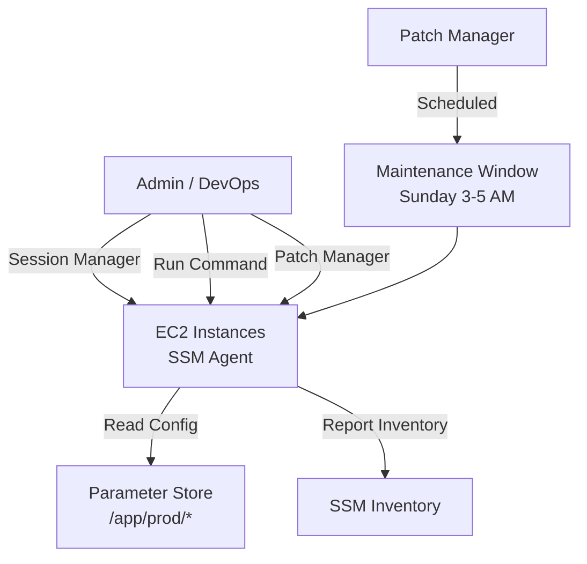

# Chapter 25 — AWS Systems Manager (SSM)

---

## Prerequisite Chapters
- Chapter 01 — AWS IAM (SSM roles, managed instance permissions)
- Chapter 03 — Amazon EC2 (managed instances)
- Chapter 05 — Amazon CloudWatch (SSM + monitoring)

## Used In Production Practicals
- Practical 10 — EC2 Web Server (Session Manager access)
- Practical 12 — Auto Scaling (Run Command fleet management)
- Practical 15 — Flagship Production Architecture
- Practical 34 — CloudWatch Monitoring (Parameter Store config)

---

## 1. Learning Objectives

By the end of this chapter, you will be able to:

1. **Explain** SSM components — Session Manager, Parameter Store, Patch Manager, Run Command, Automation.
2. **Use** Session Manager to access EC2 instances without SSH.
3. **Store** configuration and secrets in Parameter Store.
4. **Automate** patching with Patch Manager.
5. **Run** commands across a fleet of instances with Run Command.
6. **Create** automation runbooks for operational tasks.
7. **Troubleshoot** SSM agent connectivity and permission issues.
8. **Answer** interview questions about operations management.

---

## 2. What is AWS Systems Manager?

SSM is a **unified management service** for your AWS infrastructure. It provides operational tools for viewing data, automating tasks, and managing EC2 instances and on-premises servers — all without SSH.

### Key Characteristics
- **No SSH needed** — Session Manager provides secure shell access via IAM
- **Fleet management** — run commands across hundreds of instances
- **Automated patching** — schedule OS security patches
- **Configuration store** — Parameter Store for config and secrets
- **Automation** — runbooks for complex multi-step operations
- **Inventory** — track software and configurations

---

## 3. Why Do We Need It?

### Without SSM
```
Access: SSH with key pairs → manage keys, open port 22, bastion hosts
Patching: SSH into each server → apt update → manual, error-prone
Config: Store in files, environment variables, or application code
Commands: SSH into each server individually → doesn't scale
```

### With SSM
```
Access: Session Manager → IAM-controlled, auditable, no port 22
Patching: Patch Manager → scheduled, automated, compliance reports
Config: Parameter Store → centralized, versioned, encrypted
Commands: Run Command → execute on hundreds of instances at once
```

---

## 4. Core Concepts

### SSM Agent
```
SSM Agent = software installed on EC2 instances that enables SSM features
  - Pre-installed on Amazon Linux 2023, Amazon Linux 2, Ubuntu (AWS AMIs)
  - Must be installed manually on custom AMIs
  - Requires IAM role with AmazonSSMManagedInstanceCore policy
  - Communicates with SSM service via HTTPS (port 443)
```

### Key Components

| Component | Purpose | Use Case |
|-----------|---------|----------|
| **Session Manager** | Shell access via browser/CLI | Replace SSH entirely |
| **Parameter Store** | Key-value config store | Feature flags, DB endpoints, simple secrets |
| **Run Command** | Execute scripts on fleet | Install software, run maintenance |
| **Patch Manager** | Automated OS patching | Monthly security patches |
| **State Manager** | Enforce desired state | Ensure agent running, config applied |
| **Automation** | Multi-step runbooks | AMI creation, instance remediation |
| **Inventory** | Collect instance metadata | Software inventory, compliance |
| **Maintenance Windows** | Schedule operations | Patching during off-hours |

---

## 5. Session Manager (Replace SSH)

```bash
# Connect to instance — no key pair, no port 22 needed
aws ssm start-session --target i-0abc123def456

# Benefits over SSH:
# ✅ No port 22 open in security group
# ✅ No key pair to manage or rotate
# ✅ Full session audit in CloudTrail
# ✅ Session logging to S3/CloudWatch
# ✅ IAM-controlled (who can start sessions)
# ✅ Works without public IP (via NAT/VPC endpoint)
# ✅ No bastion host needed
# ✅ Browser-based access (AWS Console)
```

### Session Manager Logging
```bash
# Log all session activity to S3 and CloudWatch
# Configure in SSM Console → Session Manager → Preferences:
#   S3 bucket: my-session-logs
#   CloudWatch log group: /ssm/sessions
#   Encryption: KMS key

# Now every keystroke is audited!
```

---

## 6. Parameter Store

### Store and Retrieve Configuration
```bash
# String parameter (free)
aws ssm put-parameter \
    --name "/app/prod/db-host" \
    --value "prod-db.abc.rds.amazonaws.com" \
    --type String

# SecureString parameter (encrypted with KMS)
aws ssm put-parameter \
    --name "/app/prod/api-key" \
    --value "sk_live_abc123" \
    --type SecureString \
    --key-id alias/app-config-key

# Retrieve
aws ssm get-parameter --name "/app/prod/db-host" --query 'Parameter.Value' --output text

# Retrieve secret (with decryption)
aws ssm get-parameter --name "/app/prod/api-key" --with-decryption --query 'Parameter.Value'

# Get all params by path (hierarchical)
aws ssm get-parameters-by-path --path "/app/prod/" --recursive --with-decryption
```

### Parameter Store Tiers

| Feature | Standard (Free) | Advanced |
|---------|----------------|---------|
| **Max params** | 10,000 | 100,000 |
| **Max size** | 4 KB | 8 KB |
| **Cost** | Free | $0.05/param/month |
| **Parameter policies** | No | TTL, notification |

### Parameter Store vs Secrets Manager
```
Parameter Store:
  /app/prod/db-host = "prod-db.abc.rds.amazonaws.com"  (String, free)
  /app/prod/feature-flag = "true"                       (String, free)
  /app/prod/api-key = "sk_live_..."                     (SecureString, free)

Secrets Manager:
  prod/db-credentials = {"user":"admin","pass":"..."}   ($0.40/month, rotation)
  prod/stripe-key = "sk_live_..."                       ($0.40/month, rotation)

Rule of thumb:
  Needs rotation? → Secrets Manager
  Just config or rarely-changing secret? → Parameter Store
```

---

## 7. Run Command

```bash
# Execute a command on all production instances
aws ssm send-command \
    --targets '[{"Key":"tag:Environment","Values":["production"]}]' \
    --document-name "AWS-RunShellScript" \
    --parameters '{"commands":["yum update -y","systemctl restart httpd"]}' \
    --comment "Monthly maintenance restart"

# Check command status
aws ssm list-command-invocations --command-id $CMD_ID \
    --query 'CommandInvocations[*].{Instance:InstanceId,Status:Status}'

# Get command output
aws ssm get-command-invocation --command-id $CMD_ID --instance-id i-0abc123
```

---

## 8. Patch Manager

```bash
# Create patch baseline
aws ssm create-patch-baseline \
    --name "prod-linux-security" \
    --operating-system AMAZON_LINUX_2023 \
    --approval-rules '{
        "PatchRules": [{
            "PatchFilterGroup": {
                "PatchFilters": [
                    {"Key": "CLASSIFICATION", "Values": ["Security"]},
                    {"Key": "SEVERITY", "Values": ["Critical", "Important"]}
                ]
            },
            "ApproveAfterDays": 7,
            "ComplianceLevel": "CRITICAL"
        }]
    }'

# Scan for missing patches
aws ssm send-command \
    --document-name "AWS-RunPatchBaseline" \
    --targets '[{"Key":"tag:PatchGroup","Values":["production"]}]' \
    --parameters '{"Operation":["Scan"]}'

# Install patches
aws ssm send-command \
    --document-name "AWS-RunPatchBaseline" \
    --targets '[{"Key":"tag:PatchGroup","Values":["production"]}]' \
    --parameters '{"Operation":["Install"]}'
```

---

## 9. Automation

```bash
# Run automation document (create AMI)
aws ssm start-automation-execution \
    --document-name "AWS-CreateImage" \
    --parameters '{"InstanceId":["i-0abc123"],"NoReboot":["true"]}'

# Custom automation: restart instance and verify
aws ssm create-document \
    --name "RestartAndVerify" \
    --document-type "Automation" \
    --content '{
        "schemaVersion": "0.3",
        "description": "Restart instance and verify health",
        "mainSteps": [
            {"name": "stopInstance", "action": "aws:changeInstanceState", "inputs": {"DesiredState": "stopped", "InstanceIds": ["{{InstanceId}}"]}},
            {"name": "startInstance", "action": "aws:changeInstanceState", "inputs": {"DesiredState": "running", "InstanceIds": ["{{InstanceId}}"]}},
            {"name": "verifyHealth", "action": "aws:waitForAwsResourceProperty", "inputs": {"PropertySelector": "$.InstanceStatuses[0].InstanceStatus.Status", "DesiredValues": ["ok"]}}
        ]
    }'
```

---

## 10-18. Architecture through DR

### Production SSM Architecture


---

## 19. Troubleshooting

### Problem 1: Instance Not Showing in SSM
```
Check:
  1. SSM Agent installed and running?
     sudo systemctl status amazon-ssm-agent
  2. IAM role attached with AmazonSSMManagedInstanceCore?
  3. Instance can reach SSM endpoint?
     - Public subnet: internet access
     - Private subnet: NAT Gateway or SSM VPC endpoints
  4. Instance metadata service (IMDS) accessible?
```

### Problem 2: Session Manager Connection Fails
```
Check:
  1. IAM user/role has ssm:StartSession permission
  2. Instance has SSM Agent running
  3. Network: instance can reach ssm.region.amazonaws.com (port 443)
  4. VPC endpoint or NAT Gateway configured (for private subnets)
```

### Problem 3: Run Command Times Out
```
Check:
  1. Command timeout too short (default 3600 seconds)
  2. Instance responding? (check SSM Agent status)
  3. Command requires sudo but script doesn't use it
  4. Network connectivity issue (can't report back)
```

---

## 22. Interview Questions

### Basic Questions (10)

**Q1: What is AWS Systems Manager?**
A: A management service that provides tools for operations: Session Manager (shell access), Parameter Store (config), Run Command (fleet commands), Patch Manager (automated patching), Automation (runbooks).

**Q2: Why use Session Manager instead of SSH?**
A: No port 22 open, no key pairs, IAM-controlled access, full audit trail (CloudTrail), session logging, works without public IP. More secure and auditable than SSH.

**Q3: What is Parameter Store?**
A: A hierarchical key-value store for configuration and secrets. Types: String (free), SecureString (KMS encrypted, free). Supports hierarchy: /app/prod/db-host.

**Q4: Parameter Store vs Secrets Manager?**
A: Parameter Store: free, no rotation, config + simple secrets. Secrets Manager: $0.40/secret/month, automatic rotation, RDS integration. Use Secrets Manager for passwords that need rotation.

**Q5: What is SSM Agent?**
A: Software running on EC2 that enables SSM features. Pre-installed on Amazon Linux. Communicates with SSM service over HTTPS (443). Requires IAM role with AmazonSSMManagedInstanceCore.

**Q6: What is Run Command?**
A: Execute commands on one or many instances simultaneously. Target by tags, instance IDs, or resource groups. No SSH needed. Results logged.

**Q7: What is Patch Manager?**
A: Automates OS patching. Define baselines (which patches, severity), schedule maintenance windows, scan and install patches, report compliance.

**Q8: How does Session Manager differ from EC2 Instance Connect?**
A: Session Manager: IAM-controlled, auditable, supports all OS, no port needed. Instance Connect: pushes temporary SSH key, requires port 22, Linux only. Session Manager is preferred for production.

**Q9: What is an SSM document?**
A: A JSON or YAML definition of actions to perform. Types: Command (Run Command), Automation (multi-step), Session (Session Manager config). AWS provides pre-built documents.

**Q10: Can SSM manage on-premises servers?**
A: Yes. Install SSM Agent on on-premises servers, register as managed instances. Enables Session Manager, Run Command, Patch Manager for hybrid environments.

### Intermediate-Advanced Questions (30)

**Q11-Q40**: *(Cover: SSM in private subnets, VPC endpoints for SSM, maintenance windows, State Manager associations, Inventory collection, Automation runbooks, change management with Change Manager, OpsCenter for operational issues, hybrid management, fleet-wide compliance, SSM + CloudWatch integration, and operational best practices.)*

---

## 24. Common Mistakes

1. **Using SSH when Session Manager is available** — less secure, less auditable
2. **Not installing SSM Agent on custom AMIs** — only pre-installed on AWS AMIs
3. **Missing IAM role** — AmazonSSMManagedInstanceCore required
4. **No VPC endpoint in private subnet** — instance can't reach SSM service
5. **Using Parameter Store for rotating secrets** — use Secrets Manager instead
6. **Not setting up session logging** — lose audit trail
7. **Running Patch Manager without testing** — test in staging first

---

## 25. Production Checklist

- [ ] SSM Agent running on all instances
- [ ] IAM Instance Profile with AmazonSSMManagedInstanceCore
- [ ] Session Manager configured with logging (S3 + CloudWatch)
- [ ] SSH port 22 removed from security groups
- [ ] Parameter Store used for application config
- [ ] Patch Manager configured with maintenance windows
- [ ] Run Command used for fleet operations
- [ ] VPC endpoints for SSM (private subnets)
- [ ] Automation runbooks for common tasks (AMI creation, restart)

---

## 26. Chapter Summary

1. **Session Manager replaces SSH** — more secure, auditable, no port 22
2. **Parameter Store for configuration** — free, hierarchical, KMS encryption
3. **Secrets Manager for rotating passwords** — don't use Parameter Store for these
4. **Run Command for fleet management** — execute scripts on tagged instances
5. **Patch Manager for compliance** — automated security patching
6. **SSM Agent is the foundation** — must be installed and have IAM role
7. **VPC endpoints for private subnets** — SSM needs network access
8. **Automation for runbooks** — AMI creation, remediation, multi-step operations

---
---

# 🔬 Practical Lab 12 — EC2 + SSM (Session Manager)

## Lab Overview
| Item | Detail |
|------|--------|
| **Difficulty** | Beginner |
| **Duration** | 20 minutes |
| **Cost** | Free tier |
| **Prerequisites** | Practical 11 (EC2 with IAM role) |
| **Lab Environment** | Environment 3 — Compute |

## Business Scenario
> Your security team mandates: "No SSH keys, no port 22." You need to demonstrate that Session Manager provides secure, auditable access to EC2 instances without SSH.

### Step 1 — Verify SSM Agent
1. EC2 instance must have `AmazonSSMManagedInstanceCore` policy on its IAM role
2. **Systems Manager** → **Fleet Manager** → Verify instance appears

📸 **Screenshot 01** — Instance in Fleet Manager
> **What you should see**: Instance listed as "Online" in Fleet Manager
> **Verify**: SSM Agent status shows "Online"

### Step 2 — Start Session
1. **Session Manager** → **Start session** → Select instance → **Start session**

📸 **Screenshot 02** — Session Manager Terminal
> **What you should see**: Browser-based terminal connected to instance
> **Verify**: No SSH key or port 22 needed

```bash
# Run commands as ssm-user
whoami          # ssm-user
sudo su -       # switch to root
hostname -I     # shows private IP
aws sts get-caller-identity  # shows IAM role
```

📸 **Screenshot 03** — Commands Running via SSM

### Step 3 — View Session Logs in CloudTrail
1. **CloudTrail** → Filter: Event name = `StartSession`

📸 **Screenshot 04** — Session Audit in CloudTrail
> **What you should see**: StartSession event with user identity and instance ID
> **Verify**: Full audit trail without SSH

🎯 **Interview Insight**: "How do you access EC2 without SSH?"
> **Strong answer**: "SSM Session Manager. No port 22, no SSH keys, full CloudTrail audit. Can log session output to S3/CloudWatch. Supports Run Command for fleet-wide operations. Uses IAM for access control instead of SSH key management."
