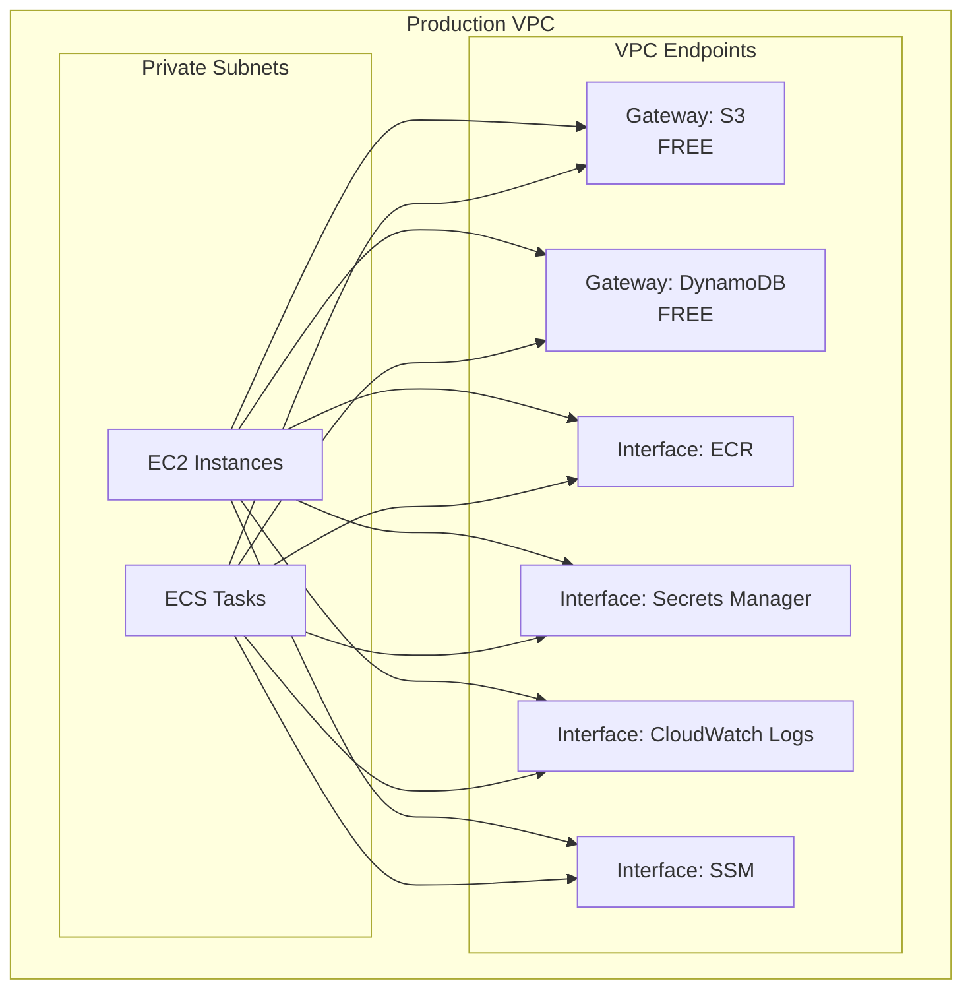

# Chapter 32 — AWS PrivateLink

---

## Prerequisite Chapters
- Chapter 04 — Amazon VPC (VPC endpoints, networking)
- Chapter 01 — AWS IAM (endpoint policies)

## Used In Production Practicals
- Practical 08 — Private Connectivity
- Practical 15 — Flagship Production Architecture
- Practical 06 — Production VPC

---

## 1. Learning Objectives

By the end of this chapter, you will be able to:

1. **Explain** PrivateLink, Interface Endpoints, Gateway Endpoints, and when to use each.
2. **Create** VPC Endpoints for AWS services (S3, SQS, ECR, Secrets Manager).
3. **Expose** your own services via PrivateLink (Endpoint Service).
4. **Configure** endpoint policies and security groups.
5. **Compare** PrivateLink vs VPC Peering vs Transit Gateway.
6. **Troubleshoot** DNS resolution, connectivity, and access issues.
7. **Answer** interview questions about private connectivity.

---

## 2. What is AWS PrivateLink?

PrivateLink provides **private connectivity** between VPCs, AWS services, and on-premises networks without exposing traffic to the public internet. Traffic stays on the AWS network backbone.

### The Problem PrivateLink Solves
```
Without PrivateLink:
  EC2 (private subnet) → NAT Gateway → IGW → Internet → S3/SQS
  
  Problems:
  - Traffic traverses the public internet
  - NAT Gateway cost: $0.045/GB processed
  - NAT Gateway is a bottleneck (45 Gbps limit)
  - Security: data exposed to internet threats

With PrivateLink (VPC Endpoint):
  EC2 (private subnet) → VPC Endpoint → S3/SQS (private network)
  
  Benefits:
  - Traffic stays on AWS private network
  - No NAT Gateway needed for AWS services
  - Lower cost for high-volume services
  - More secure (no internet exposure)
```

---

## 3. Core Concepts

### Two Types of VPC Endpoints

| Type | Endpoint Type | How It Works | Cost | Services |
|------|-------------|-------------|------|----------|
| **Gateway Endpoint** | Route table entry | Route table directs traffic to endpoint | **FREE** | S3, DynamoDB |
| **Interface Endpoint** | ENI in subnet | Creates ENI with private IP | $0.01/AZ/hr + $0.01/GB | SQS, SNS, ECR, KMS, SM, CloudWatch, etc. |

### Gateway Endpoints (S3, DynamoDB) — FREE
```
How: Add a prefix list to the route table
  Route table → destination: pl-12345 (S3 prefix list) → target: vpce-abc
  
No ENI, no IP address, no security group
Just a route table entry → traffic goes directly to S3/DynamoDB

Configure:
  aws ec2 create-vpc-endpoint \
    --vpc-id $VPC_ID \
    --vpc-endpoint-type Gateway \
    --service-name com.amazonaws.ap-south-1.s3 \
    --route-table-ids $PRIV_RT_A $PRIV_RT_B
```

### Interface Endpoints (Everything Else)
```
How: Creates an ENI in your subnet with a private IP
  EC2 → ENI (10.0.1.100) → AWS service (private network)

Features:
  - Security group on the ENI (control who can use it)
  - Private DNS (use same service URL, no code changes)
  - Multiple AZs for HA (one ENI per AZ)

Configure:
  aws ec2 create-vpc-endpoint \
    --vpc-id $VPC_ID \
    --vpc-endpoint-type Interface \
    --service-name com.amazonaws.ap-south-1.sqs \
    --subnet-ids $PRIV_SUBNET_A $PRIV_SUBNET_B \
    --security-group-ids $ENDPOINT_SG \
    --private-dns-enabled
```

### Common Interface Endpoints (Production)

| Service | Endpoint | Why You Need It |
|---------|----------|----------------|
| ECR (API + DKR) | `ecr.api`, `ecr.dkr` | Pull images in private subnet |
| CloudWatch Logs | `logs` | Push logs without NAT |
| Secrets Manager | `secretsmanager` | Retrieve secrets privately |
| KMS | `kms` | Decrypt without NAT |
| SQS | `sqs` | Queue operations privately |
| SSM | `ssm`, `ssmmessages`, `ec2messages` | Session Manager in private subnet |
| STS | `sts` | AssumeRole without NAT |
| S3 | Gateway (free) | S3 access without NAT |

### Endpoint Service (Your Own PrivateLink)
```
Expose your service to other VPCs/accounts via PrivateLink:

Your VPC:
  Your Application → NLB → Endpoint Service

Consumer VPC:
  Consumer → Interface Endpoint → Your Endpoint Service → NLB → Your App

Benefits:
  - Consumer doesn't need VPC peering
  - CIDR overlap is fine
  - One-way access (consumer → provider)
  - No internet exposure
```

### PrivateLink vs VPC Peering vs Transit Gateway

| Feature | PrivateLink | VPC Peering | Transit Gateway |
|---------|-------------|-------------|----------------|
| **Direction** | One-way (consumer→provider) | Bidirectional | Bidirectional |
| **CIDR overlap** | ✅ Allowed | ❌ Not allowed | ❌ Not allowed |
| **Transitive routing** | No | No | ✅ Yes |
| **Scale** | Thousands of consumers | Limited pairs | Thousands of VPCs |
| **Use case** | Service access | VPC-to-VPC | Hub-and-spoke |
| **Bandwidth** | NLB limits | 128 Gbps | 50 Gbps |

---

## 4. Architecture

### Production VPC with Endpoints



---

## 5-10. CLI Commands & Configuration

### Endpoint Policy (Restrict Access)
```json
{
    "Statement": [{
        "Effect": "Allow",
        "Principal": "*",
        "Action": "s3:GetObject",
        "Resource": "arn:aws:s3:::my-app-bucket/*"
    }]
}
// S3 endpoint only allows GetObject on specific bucket
```

### Security Group for Interface Endpoint
```bash
# Create SG allowing HTTPS from VPC CIDR
aws ec2 create-security-group \
    --group-name endpoint-sg \
    --description "Allow HTTPS to VPC endpoints" \
    --vpc-id $VPC_ID

aws ec2 authorize-security-group-ingress \
    --group-id $ENDPOINT_SG \
    --protocol tcp --port 443 --cidr 10.0.0.0/16
```

### Private DNS
```
With private DNS enabled:
  sqs.ap-south-1.amazonaws.com → resolves to private IP (10.0.1.100)
  
Your application code doesn't change!
  boto3.client('sqs')  → automatically uses private endpoint
  aws sqs send-message → goes through VPC endpoint

Without private DNS:
  Must use endpoint-specific URL: vpce-abc.sqs.ap-south-1.vpce.amazonaws.com
```

---

## 11-18. Practical through Cost Optimization

### Cost Analysis: NAT Gateway vs VPC Endpoints
```
Scenario: 100 GB/month of S3 traffic from private subnet

NAT Gateway:
  Hourly:    $0.045/hr × 720 = $32.40
  Data:      $0.045/GB × 100 = $4.50
  Total:     $36.90/month

S3 Gateway Endpoint:
  Total:     $0.00/month (FREE)

Savings:    $36.90/month = $442.80/year

Interface Endpoint (SQS, 2 AZs):
  Hourly:    $0.01/AZ/hr × 2 × 720 = $14.40
  Data:      $0.01/GB × 100 = $1.00
  Total:     $15.40/month

NAT for same SQS traffic:
  Total:     $36.90/month

Savings:    $21.50/month
```

---

## 19. Troubleshooting

### Problem 1: Interface Endpoint Not Resolving
```
Check:
  1. Private DNS enabled? (--private-dns-enabled)
  2. VPC DNS resolution enabled? (enableDnsHostnames, enableDnsSupport)
  3. Security group allows inbound HTTPS (443)?
  4. Endpoint in same AZ as the instance?
```

### Problem 2: Gateway Endpoint Not Working
```
Check:
  1. Route table associated with the subnet?
  2. Endpoint policy allows the action?
  3. S3 bucket policy allows the VPC endpoint?
  4. Correct prefix list in route table?
```

### Problem 3: Cross-Account Endpoint Service Connection Pending
```
Check:
  1. Endpoint service requires acceptance? (acceptance-required)
  2. Service owner accepted the connection?
  3. Service NLB healthy?
```

---

## 22. Interview Questions

### Basic Questions (10)

**Q1: What is AWS PrivateLink?**
A: PrivateLink provides private connectivity between VPCs and AWS services without internet exposure. Traffic stays on the AWS network. Implemented via VPC Endpoints.

**Q2: Gateway Endpoint vs Interface Endpoint?**
A: Gateway: route table-based, FREE, only S3 and DynamoDB. Interface: ENI-based, has cost ($0.01/AZ/hr), supports 100+ services, has security group.

**Q3: Why is Gateway Endpoint free for S3?**
A: AWS wants to encourage private S3 access. It's implemented as a route table entry with no infrastructure cost. Saves NAT Gateway costs.

**Q4: How does private DNS work with Interface Endpoints?**
A: When enabled, the service's public DNS name resolves to the endpoint's private IP. Your application code needs no changes — same boto3/CLI calls work.

**Q5: What is an Endpoint Service?**
A: Your own PrivateLink-powered service. Put your app behind an NLB, create an Endpoint Service. Other VPCs connect via Interface Endpoints. CIDR overlap OK.

**Q6-Q10**: *(Cover: endpoint policies, security groups on endpoints, multi-AZ endpoints, VPC DNS requirements, and endpoint routing.)*

### Intermediate-Advanced Questions (30)

**Q11: When would you use PrivateLink vs VPC Peering?**
A: PrivateLink: one-way service access, CIDR overlap OK, many consumers. VPC Peering: bidirectional, full network access, must have non-overlapping CIDRs.

**Q12: How do you secure a VPC Endpoint?**
A: 1) Endpoint policy (restrict actions/resources). 2) Security group (restrict source IPs/CIDRs). 3) S3 bucket policy with VPC endpoint condition.

**Q13-Q40**: *(Cover: cross-account endpoint services, endpoint costs vs NAT costs, high-bandwidth scenarios, endpoint HA, DNS failover, on-premises connectivity via PrivateLink, Transit Gateway + PrivateLink, and troubleshooting connectivity.)*

---

## 24. Common Mistakes

1. **Using NAT Gateway for S3 traffic** — use free Gateway Endpoint
2. **Not enabling private DNS** — code must use endpoint-specific URLs
3. **Missing security group on Interface Endpoint** — HTTPS (443) blocked
4. **Forgetting VPC DNS settings** — enableDnsHostnames and enableDnsSupport must be true
5. **Endpoint in one AZ only** — create in multiple AZs for HA
6. **No endpoint policy** — endpoint allows all actions by default

---

## 25. Production Checklist

- [ ] S3 Gateway Endpoint created (free, always do this)
- [ ] DynamoDB Gateway Endpoint created (if used)
- [ ] Interface Endpoints for ECR, Logs, SSM, KMS, Secrets Manager
- [ ] Security groups on all Interface Endpoints (port 443)
- [ ] Private DNS enabled on all Interface Endpoints
- [ ] Endpoint policies restricting to necessary actions
- [ ] Multi-AZ Interface Endpoints for HA
- [ ] NAT Gateway only for non-AWS internet access

---

## 26. Chapter Summary

1. **Gateway Endpoints for S3/DynamoDB** — free, always create these
2. **Interface Endpoints for everything else** — ENI-based, small hourly cost
3. **Private DNS** — same URLs work, no code changes
4. **Endpoint policies** — restrict what actions go through the endpoint
5. **Security groups on Interface Endpoints** — control who can access
6. **Saves NAT Gateway costs** — especially for high-volume S3 traffic
7. **PrivateLink for your services** — expose via NLB, consumers use Interface Endpoint
8. **CIDR overlap OK** — unlike VPC peering, PrivateLink handles overlapping ranges

---
---

# 🔬 Practical Lab 09 — VPC Endpoints

## Lab Overview
| Item | Detail |
|------|--------|
| **Difficulty** | Intermediate |
| **Duration** | 20 minutes |
| **Cost** | Gateway endpoints free, Interface ~$7.50/month |
| **Prerequisites** | Practical 06 (VPC) |
| **Lab Environment** | Environment 2 — Network |

### Step 1 — Create S3 Gateway Endpoint
1. **VPC** → **Endpoints** → **Create endpoint**
   - **Service**: com.amazonaws.ap-south-1.s3 (Gateway)
   - **VPC**: `prod-vpc`
   - **Route tables**: Private route table

📸 **Screenshot 01** — S3 Gateway Endpoint Created
> **Verify**: Route table shows s3 prefix list in routes

### Step 2 — Test S3 Access Without NAT
```bash
# From private EC2 (remove NAT route temporarily)
aws s3 ls  # Still works — traffic goes through VPC endpoint!
```

📸 **Screenshot 02** — S3 Access via Endpoint (No NAT)
> **Verify**: S3 accessible even without NAT Gateway route

🎯 **Interview Insight**: "Why use VPC endpoints?"
> **Strong answer**: "Traffic stays within AWS network (never hits internet). Gateway endpoints (S3, DynamoDB) are free. Interface endpoints for other services. Reduces NAT Gateway costs and improves security by keeping traffic private."

---
---

# 🔬 Practical Lab 51 — PrivateLink (Interface Endpoint)

### Step 1 — Create Interface Endpoint for ECR
```bash
aws ec2 create-vpc-endpoint --vpc-id $VPC_ID \
    --service-name com.amazonaws.ap-south-1.ecr.dkr \
    --vpc-endpoint-type Interface \
    --subnet-ids $PRIV_A $PRIV_B \
    --security-group-ids $ENDPOINT_SG
```

📸 **Screenshot 01** — Interface Endpoint Created
> **Verify**: ENIs created in private subnets with private IPs

📸 **Screenshot 02** — ECR Pull via PrivateLink (No NAT)
> **Verify**: Docker pull works from private subnet without NAT
