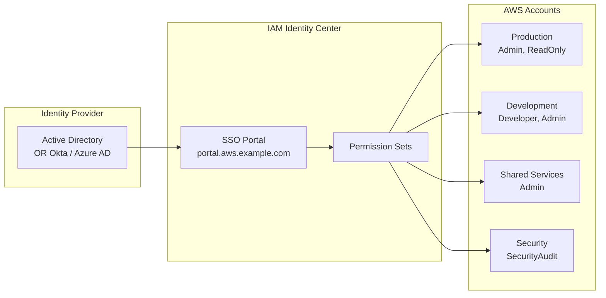
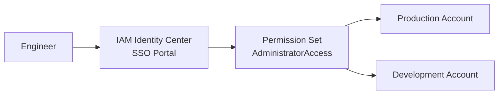

# Chapter 36 — AWS IAM Identity Center (SSO)

---

## Prerequisite Chapters
- Chapter 01 — AWS IAM (users, roles, federation)
- Chapter 23 — AWS STS (temporary credentials, AssumeRole)
- Chapter 31 — AWS Organizations & Control Tower (multi-account)

## Used In Production Practicals
- Practical 02 — Enterprise AWS Accounts
- Practical 39 — Enterprise Multi-Account AWS

---

## 1. Learning Objectives

By the end of this chapter, you will be able to:

1. **Explain** IAM Identity Center and why it replaces IAM users for human access.
2. **Configure** SSO with an external identity provider (Active Directory, Okta, Azure AD).
3. **Create** Permission Sets for different access levels.
4. **Assign** users and groups to AWS accounts with specific permissions.
5. **Use** the SSO portal and AWS CLI with SSO profiles.
6. **Troubleshoot** SSO login failures and permission issues.
7. **Answer** interview questions about centralized access management.

---

## 2. What is IAM Identity Center?

IAM Identity Center (formerly AWS SSO) provides **centralized access management** for all your AWS accounts and applications. Users sign in once and access any assigned account without separate IAM users.

### The Scale Problem
```
Without IAM Identity Center:
  50 employees × 10 accounts = 500 IAM users to manage
  - Password rotation for 500 users
  - Employee leaves = delete 10 IAM users
  - No single sign-on
  - No corporate directory integration
  - Access keys scattered everywhere

With IAM Identity Center:
  50 employees in ONE directory (AD/Okta)
  - One login → access to all assigned accounts
  - Employee leaves → disable in IdP → access revoked everywhere
  - SSO portal shows all accounts at a glance
  - No IAM users needed (except for break-glass)
  - CLI access via temporary credentials
```

---

## 3. Core Concepts

### Key Components

| Concept | Description |
|---------|-------------|
| **Identity Source** | Where users come from: built-in directory, Active Directory, or external IdP (Okta, Azure AD) |
| **Permission Set** | Collection of IAM policies that define what a user can do in an account |
| **Account Assignment** | Maps: user/group → account → permission set |
| **SSO Portal** | Web page where users see all assigned accounts and roles |
| **Access Portal URL** | `https://my-company.awsapps.com/start` |

### Permission Set Examples
```
AdministratorAccess:
  - AWS managed policy: AdministratorAccess
  - Session duration: 4 hours
  - Assigned to: Platform team → All accounts

DeveloperAccess:
  - Custom policy: EC2, Lambda, S3, DynamoDB, CloudWatch
  - Session duration: 8 hours
  - Assigned to: Developers group → Dev + Staging accounts only

ReadOnlyAccess:
  - AWS managed policy: ReadOnlyAccess
  - Session duration: 12 hours
  - Assigned to: Auditors group → All accounts

DatabaseAdmin:
  - Custom policy: RDS full, Secrets Manager, KMS
  - Session duration: 4 hours
  - Assigned to: DBA team → Production account only
```

### Identity Sources

| Source | Setup | Best For |
|--------|-------|----------|
| **Built-in** | Create users in IAM Identity Center | Small teams, no existing IdP |
| **Active Directory** | AWS Managed AD or AD Connector | Enterprise with on-premises AD |
| **External IdP** | SAML 2.0 (Okta, Azure AD, OneLogin) | Enterprise with cloud IdP |

---

## 4. Architecture



### How SSO Login Works
```
1. User visits https://my-company.awsapps.com/start
2. Redirected to IdP (Okta/AD) → authenticates
3. IdP sends SAML assertion to Identity Center
4. Identity Center shows portal with assigned accounts/roles
5. User clicks account + role → STS AssumeRole
6. Browser opens AWS Console with temporary credentials
7. Or user copies temporary credentials for CLI
```

---

## 5-10. CLI Configuration & Usage

### AWS CLI SSO Setup
```bash
# Configure SSO profile
aws configure sso
# SSO session name: my-company
# SSO start URL: https://my-company.awsapps.com/start
# SSO Region: ap-south-1
# → Browser opens, authenticate with IdP
# → Select account and role from list

# Login (opens browser)
aws sso login --profile prod-admin

# Use the profile
aws s3 ls --profile prod-admin
aws ec2 describe-instances --profile prod-admin
```

### ~/.aws/config SSO Profiles
```ini
[sso-session my-company]
sso_start_url = https://my-company.awsapps.com/start
sso_region = ap-south-1
sso_registration_scopes = sso:account:access

[profile prod-admin]
sso_session = my-company
sso_account_id = 111111111111
sso_role_name = AdministratorAccess
region = ap-south-1

[profile dev-developer]
sso_session = my-company
sso_account_id = 222222222222
sso_role_name = DeveloperAccess
region = ap-south-1

[profile prod-readonly]
sso_session = my-company
sso_account_id = 111111111111
sso_role_name = ReadOnlyAccess
region = ap-south-1
```

---

## 11-18. Production Architecture through DR

### Production Multi-Account Access Strategy
```
Platform Team:
  → All accounts: AdministratorAccess
  → Session: 4 hours

Development Team:
  → Dev account: DeveloperAccess (full dev permissions)
  → Staging account: DeveloperAccess
  → Production account: ReadOnlyAccess (no changes!)

DBA Team:
  → All accounts: DatabaseAdmin
  → Production: requires MFA + 4-hour session

Security Team:
  → All accounts: SecurityAudit (read-only security)
  → Security account: SecurityAdmin

On-Call Engineer:
  → Production account: IncidentResponse (broad but time-limited)
  → Session: 1 hour

Break-Glass:
  → IAM user with MFA in management account (not SSO)
  → Used only when Identity Center is unavailable
```

---

## 19. Troubleshooting

### Problem 1: SSO Login Fails
```
Check:
  1. Identity source configured correctly (SAML metadata)?
  2. IdP (Okta/AD) user is active?
  3. User assigned to at least one account + permission set?
  4. Browser allows cookies/popups for the SSO URL?
```

### Problem 2: "You do not have any accounts"
```
Check:
  1. User/group is assigned to accounts with permission sets?
  2. Account assignment completed (not just user created)?
  3. User is in the correct IdP group that's mapped?
```

### Problem 3: CLI Profile Not Working
```bash
# Re-login
aws sso login --profile prod-admin

# Check token cache
ls ~/.aws/sso/cache/

# Verify identity
aws sts get-caller-identity --profile prod-admin
```

---

## 22. Interview Questions

### Basic Questions (10)

**Q1: What is IAM Identity Center?**
A: Centralized access management for all AWS accounts. Users sign in once (SSO) and access any assigned account. Replaces creating IAM users in every account. Formerly called AWS SSO.

**Q2: Why use Identity Center instead of IAM users?**
A: Centralized management (one directory), single sign-on, easier onboarding/offboarding, works with corporate IdP, temporary credentials, no access keys to manage.

**Q3: What is a Permission Set?**
A: A collection of IAM policies that define what a user can do in an AWS account. Assigned to users/groups for specific accounts. Created centrally, deployed to accounts as IAM roles.

**Q4: What identity sources does Identity Center support?**
A: Built-in directory, AWS Managed AD, external IdP (SAML 2.0: Okta, Azure AD, OneLogin, Google Workspace).

**Q5: How does CLI access work with SSO?**
A: `aws configure sso` creates a profile. `aws sso login` opens browser for authentication. CLI uses temporary credentials from SSO session. No access keys stored.

**Q6: What happens when an employee leaves?**
A: Disable in the identity provider (AD/Okta). Access revoked from ALL AWS accounts immediately. No individual IAM users to find and delete.

**Q7: What is the SSO portal?**
A: A web page where authenticated users see all their assigned AWS accounts and roles. Click to open Console or copy CLI credentials. URL: `https://company.awsapps.com/start`.

**Q8: Can you use MFA with Identity Center?**
A: Yes. Configure in Identity Center settings or at the IdP level. Can require MFA for specific permission sets.

**Q9: What is an account assignment?**
A: The mapping of user/group → AWS account → permission set. "DevTeam group gets DeveloperAccess in the Dev account."

**Q10: Is Identity Center regional or global?**
A: Identity Center is deployed in ONE region (your chosen home region) but manages access across all accounts in the organization.

### Intermediate-Advanced Questions (30)

**Q11: How do Permission Sets become IAM roles?**
A: When you assign a permission set to an account, Identity Center creates an IAM role in that account with the permission set's policies. Users assume this role via SSO.

**Q12: How do you implement least-privilege with Identity Center?**
A: Create fine-grained permission sets per function (DeveloperAccess, DBAAccess, ReadOnly). Assign groups to specific accounts with appropriate permission sets. Developers get full access in dev, read-only in prod.

**Q13-Q40**: *(Cover: multi-IdP scenarios, permission set boundaries, session duration settings, ABAC with Identity Center, delegated administration, emergency access, audit with CloudTrail, migration from IAM users to SSO, and integration with third-party applications.)*

---

## 24. Common Mistakes

1. **Still creating IAM users for humans** — use Identity Center
2. **One permission set for everyone** — create function-specific sets
3. **Developers with admin in production** — read-only for prod
4. **No break-glass IAM user** — need backup if Identity Center fails
5. **Not integrating with corporate IdP** — manual user management
6. **Long session durations** — 1-4 hours for production access
7. **No MFA** — always require MFA for admin permission sets

---

## 25. Production Checklist

- [ ] Identity Center enabled in management account
- [ ] External IdP configured (Okta/AD/Azure AD)
- [ ] Permission Sets created per function (Admin, Developer, ReadOnly, DBA)
- [ ] Account assignments completed for all teams
- [ ] MFA required (at IdP or Identity Center level)
- [ ] Session durations set appropriately per permission set
- [ ] CLI SSO profiles documented for the team
- [ ] Break-glass IAM user in management account (with MFA)
- [ ] CloudTrail logging SSO events
- [ ] Regular access review (quarterly)

---

## 26. Chapter Summary

1. **Replace IAM users with Identity Center** — for all human access to AWS
2. **One login, all accounts** — SSO portal shows all assigned accounts
3. **Permission Sets** — centrally managed, consistent access policies
4. **Works with existing IdP** — Active Directory, Okta, Azure AD
5. **CLI support** — `aws configure sso` for developer access
6. **Employee offboarding** — disable in IdP, revoked everywhere
7. **Break-glass IAM user** — backup access when SSO is unavailable
8. **No access keys** — temporary credentials, auto-refreshed

---
---

# 🔬 Practical Lab 05 — IAM Identity Center (SSO)

## Lab Overview
| Item | Detail |
|------|--------|
| **Difficulty** | Intermediate |
| **Duration** | 30 minutes |
| **Cost** | Free |
| **Prerequisites** | Practical 04 (Organizations) |
| **Lab Environment** | Environment 1 — Foundation |

## Business Scenario
> Your company has 50 engineers. Instead of creating IAM users in every account, implement centralized SSO using IAM Identity Center.

## Architecture


### Step 1 — Enable IAM Identity Center
1. **IAM Identity Center** → **Enable** (requires Organizations)

📸 **Screenshot 01** — Identity Center Dashboard
> **What you should see**: IAM Identity Center enabled, SSO portal URL displayed

### Step 2 — Create User
1. **Users** → **Add user** → Name: `devops-engineer`, Email, Set password

📸 **Screenshot 02** — User Created
> **Verify**: User shows "Active" status

### Step 3 — Create Permission Set
1. **Permission sets** → **Create** → Select `AdministratorAccess` managed policy
2. Session duration: 4 hours

📸 **Screenshot 03** — Permission Set Created
> **Verify**: Permission set "AdministratorAccess" visible

### Step 4 — Assign User to Account
1. **AWS accounts** → Select account → **Assign users** → Select devops-engineer → Select permission set

📸 **Screenshot 04** — Assignment Complete

### Step 5 — Test SSO Login
1. Open SSO portal URL → Sign in → Select account → Click "Management console"

📸 **Screenshot 05** — SSO Portal with Account Access
> **What you should see**: SSO portal showing available accounts and permission sets
> **Verify**: Can access Management Console via SSO without IAM user credentials

🎯 **Interview Insight**: "IAM Users vs IAM Identity Center?"
> **Strong answer**: "IAM Identity Center is the modern approach — centralized SSO, temporary credentials, integrates with corporate IdP (Active Directory, Okta). IAM users have long-term credentials. For enterprise, always use Identity Center."
