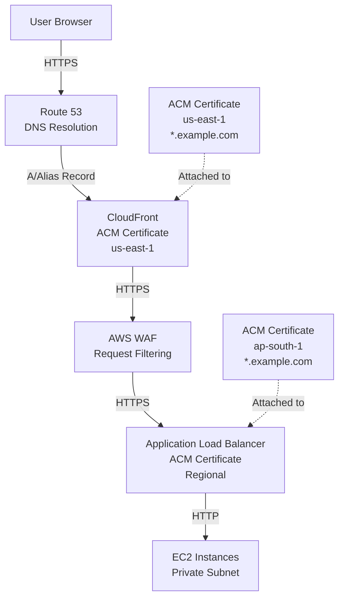
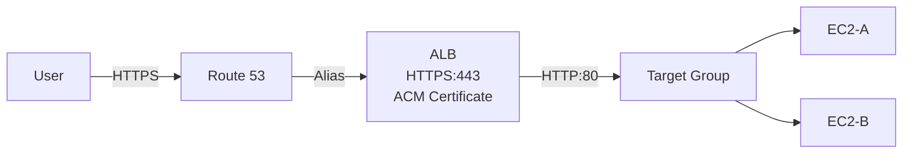
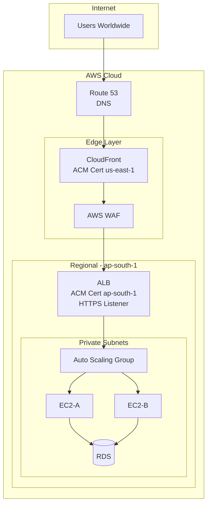
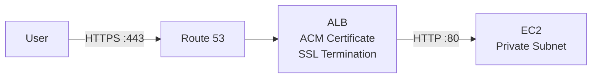

# Chapter 38 — AWS Certificate Manager (ACM)

---

## Prerequisite Chapters
- Chapter 01 — AWS IAM (policies, roles)
- Chapter 04 — Amazon VPC (networking fundamentals)
- Chapter 07 — Amazon Route 53 (DNS, hosted zones)
- Chapter 18 — Elastic Load Balancing (ALB listeners)
- Chapter 29 — Amazon CloudFront (distributions)

## Used In Production Practicals
- Practical 09 — Production DNS
- Practical 10 — EC2 Web Server (HTTPS)
- Practical 11 — HA Application
- Practical 15 — Flagship Production Architecture
- Practical 16 — S3 + CloudFront Static Website
- Practical 38 — CloudFront + WAF Security

---

## 1. Learning Objectives

By the end of this chapter, you will be able to:

1. **Explain** what ACM is, why HTTPS matters, and how TLS/SSL certificates work.
2. **Request** public and private certificates using DNS and email validation.
3. **Attach** certificates to ALB, CloudFront, and API Gateway.
4. **Configure** automatic renewal and monitor certificate lifecycle.
5. **Design** production HTTPS architectures using Route 53 → CloudFront → ACM → ALB → EC2.
6. **Troubleshoot** common certificate issues including validation failures, expiry, and regional mismatches.
7. **Answer** interview questions about HTTPS, TLS termination, and certificate management in production.

---

## 2. What is AWS Certificate Manager (ACM)?

AWS Certificate Manager (ACM) is a managed service that lets you provision, manage, and deploy **SSL/TLS certificates** for use with AWS services and your internal resources.

ACM eliminates the manual, error-prone process of purchasing certificates from third-party Certificate Authorities (CAs), generating CSRs, installing certificates on servers, and tracking expiration dates.

### Key Facts
- **Free** public certificates for use with integrated AWS services (ALB, CloudFront, API Gateway)
- **Automatic renewal** for ACM-managed certificates
- **No certificate files** to manage — ACM handles the private key securely
- **Regional service** — certificates are region-specific (except CloudFront, which requires us-east-1)

---

## 3. Why Do We Need It?

### The Problem Without ACM

Without ACM, deploying HTTPS requires:

1. **Purchasing** a certificate from a CA (DigiCert, Let's Encrypt, GoDaddy) — cost and procurement overhead
2. **Generating** a Certificate Signing Request (CSR) and private key on your server
3. **Installing** the certificate on every server, load balancer, or CDN
4. **Tracking** expiration dates manually — a single expired certificate causes site outages
5. **Renewing** certificates every 90 days (Let's Encrypt) or annually (paid CAs)
6. **Distributing** updated certificates to every endpoint

### The Problem ACM Solves

| Challenge | Without ACM | With ACM |
|-----------|------------|----------|
| Certificate cost | $100-$500/year per domain | Free for public certificates |
| Provisioning time | Hours to days | Minutes |
| Renewal | Manual, error-prone | Automatic |
| Private key security | Stored on servers | AWS-managed, never exported |
| Multi-domain support | Complex SAN configuration | Simple additional names |
| Wildcard certificates | Extra cost | Free |

---

## 4. Real-World Production Use Cases

### 1. Production Website HTTPS
Every production website must serve traffic over HTTPS. ACM provides the certificate that terminates TLS at the ALB or CloudFront.

```
User → HTTPS → Route 53 → CloudFront (ACM cert) → ALB (ACM cert) → EC2
```

### 2. API Security
REST APIs exposed through API Gateway require TLS certificates for custom domains. ACM provides certificates for `api.example.com`.

### 3. Internal Microservice Communication
Private ACM certificates (via AWS Private CA) secure communication between internal services within a VPC.

### 4. Multi-Domain Enterprise
A single ACM certificate can cover `example.com`, `*.example.com`, `api.example.com`, `app.example.com` — simplifying enterprise certificate management.

### 5. Compliance Requirements
PCI DSS, HIPAA, SOC 2 all require encryption in transit. ACM is the easiest way to achieve this on AWS.

---

## 5. Core Concepts

### SSL vs TLS
- **SSL** (Secure Sockets Layer) — the original protocol, now deprecated
- **TLS** (Transport Layer Security) — the modern replacement (TLS 1.2 and 1.3)
- In practice, "SSL certificate" and "TLS certificate" mean the same thing

### How TLS Works (Simplified)
```
1. Client sends "Hello" with supported TLS versions and cipher suites
2. Server responds with chosen cipher suite and its certificate
3. Client verifies certificate against trusted CAs
4. Client and server negotiate a session key
5. All subsequent traffic is encrypted with the session key
```

### Certificate Types in ACM

| Type | Use Case | Cost | Renewal |
|------|----------|------|---------|
| **Public Certificate** | Internet-facing services (ALB, CloudFront, API GW) | Free | Automatic |
| **Private Certificate** | Internal services (requires AWS Private CA) | $400/month for Private CA + $0.75/cert | Automatic |
| **Imported Certificate** | Third-party certificates you already own | Free to import | Manual renewal |

### Validation Methods

| Method | How It Works | Best For |
|--------|-------------|----------|
| **DNS Validation** (Recommended) | Add a CNAME record to your DNS | Automated workflows, Route 53 integration |
| **Email Validation** | Respond to an email sent to domain contacts | Domains without DNS control |

### Key Terminology
- **FQDN** — Fully Qualified Domain Name (e.g., `www.example.com`)
- **SAN** — Subject Alternative Name (additional domains on one certificate)
- **Wildcard** — Certificate covering all subdomains (e.g., `*.example.com`)
- **CA** — Certificate Authority (entity that issues certificates)
- **CSR** — Certificate Signing Request
- **TLS Termination** — Decrypting HTTPS traffic at the load balancer/CDN

---

## 6. Architecture

### Production HTTPS Architecture



### Request Flow
```
1. User types https://www.example.com in browser
2. Browser performs DNS lookup → Route 53 returns CloudFront distribution
3. Browser establishes TLS connection with CloudFront (ACM cert in us-east-1)
4. CloudFront forwards request to ALB origin (HTTPS or HTTP)
5. If HTTPS to ALB: second TLS termination with regional ACM cert
6. ALB forwards plain HTTP to EC2 instances in private subnet
7. EC2 processes request and responds back through the chain
```

### Certificate Regional Requirements

```
┌──────────────────────────────────────────────┐
│           ACM Certificate Placement          │
├──────────────────────────────────────────────┤
│                                              │
│  CloudFront  ──→  us-east-1 ONLY             │
│                                              │
│  ALB         ──→  Same region as ALB          │
│                                              │
│  API Gateway ──→  Same region as API          │
│  (Regional)                                  │
│                                              │
│  API Gateway ──→  us-east-1                   │
│  (Edge)                                      │
│                                              │
└──────────────────────────────────────────────┘
```

---

## 7. Important Components

### 1. Public Certificate
- Free SSL/TLS certificate issued by Amazon's CA
- Valid for 13 months, automatically renewed
- Cannot be exported (private key managed by AWS)
- Can only be used with integrated AWS services

### 2. Private Certificate
- Issued by AWS Private Certificate Authority
- Used for internal service-to-service communication
- Can be exported and installed on any server
- Requires AWS Private CA ($400/month)

### 3. Imported Certificate
- Third-party certificate imported into ACM
- You manage renewal manually
- ACM sends expiry notifications 45 days before expiration
- Can be used with the same AWS services as ACM certificates

### 4. Certificate Transparency Logging
- All public certificates are logged to public CT logs
- Required by browser vendors (Chrome, Firefox)
- You can opt out, but browsers may show warnings

---

## 8. How It Works

### Certificate Request Lifecycle

```
Request Certificate
       ↓
Choose Validation Method
       ↓
   ┌───────────┬──────────────┐
   │           │              │
DNS Validation  Email Validation
   │           │              │
Add CNAME      Approve Email  │
to DNS         │              │
   │           │              │
   └───────────┴──────────────┘
       ↓
Certificate Issued
(Status: ISSUED)
       ↓
Attach to AWS Service
(ALB, CloudFront, API GW)
       ↓
Automatic Renewal
(60 days before expiry)
```

### DNS Validation Process
1. You request a certificate for `example.com`
2. ACM provides a CNAME record: `_abc123.example.com → _xyz789.acm-validations.aws`
3. You add this CNAME to your DNS (Route 53 or external)
4. ACM verifies the CNAME exists → issues the certificate
5. **Keep the CNAME record** — ACM uses it for automatic renewal

### Automatic Renewal Requirements
For ACM to automatically renew a certificate:
- The DNS validation CNAME record must still exist
- The certificate must be associated with at least one AWS resource
- The domain must be resolvable

---

## 9. AWS Console Walkthrough

### Step 1 — Request a Public Certificate

1. Navigate to **ACM Console** → **Request a certificate**
2. Select **Request a public certificate** → Next
3. Enter domain names:
   - `example.com`
   - `*.example.com` (wildcard for all subdomains)
4. Select **DNS validation** (recommended)
5. Click **Request**

### Step 2 — Validate the Certificate

**If using Route 53:**
1. On the certificate details page, click **Create records in Route 53**
2. ACM automatically creates the CNAME validation records
3. Wait 5-30 minutes for validation (status changes to **Issued**)

**If using external DNS:**
1. Copy the CNAME Name and Value from ACM console
2. Add the CNAME record in your DNS provider's control panel
3. Wait for DNS propagation and validation

### Step 3 — Attach to ALB

1. Navigate to **EC2 Console** → **Load Balancers**
2. Select your ALB → **Listeners** tab
3. Add or edit the **HTTPS:443** listener
4. Under **Default SSL/TLS certificate**, select **From ACM**
5. Choose your certificate → Save

### Step 4 — Attach to CloudFront

1. Navigate to **CloudFront Console** → select your distribution
2. Click **Edit** under General settings
3. Under **Custom SSL certificate**, select your ACM certificate
4. **Important**: The certificate must be in **us-east-1**
5. Save changes and wait for deployment

---

## 10. AWS CLI Commands

### Request a Public Certificate
```bash
# Request certificate for domain and wildcard
aws acm request-certificate \
    --domain-name example.com \
    --subject-alternative-names "*.example.com" \
    --validation-method DNS \
    --region us-east-1

# Output: CertificateArn
```

### Describe Certificate (Check Status)
```bash
aws acm describe-certificate \
    --certificate-arn arn:aws:acm:us-east-1:123456789012:certificate/abc-123 \
    --region us-east-1
```

### List All Certificates
```bash
aws acm list-certificates \
    --region us-east-1 \
    --output table
```

### Get DNS Validation Records
```bash
aws acm describe-certificate \
    --certificate-arn arn:aws:acm:us-east-1:123456789012:certificate/abc-123 \
    --query 'Certificate.DomainValidationOptions[*].ResourceRecord' \
    --region us-east-1
```

### Create Route 53 Validation Record (Automated)
```bash
# Get the validation CNAME details
CERT_ARN="arn:aws:acm:us-east-1:123456789012:certificate/abc-123"
HOSTED_ZONE_ID="Z1234567890"

# Get validation record details
VALIDATION=$(aws acm describe-certificate \
    --certificate-arn $CERT_ARN \
    --query 'Certificate.DomainValidationOptions[0].ResourceRecord' \
    --output json)

RECORD_NAME=$(echo $VALIDATION | jq -r '.Name')
RECORD_VALUE=$(echo $VALIDATION | jq -r '.Value')

# Create the CNAME record in Route 53
aws route53 change-resource-record-sets \
    --hosted-zone-id $HOSTED_ZONE_ID \
    --change-batch '{
        "Changes": [{
            "Action": "UPSERT",
            "ResourceRecordSet": {
                "Name": "'$RECORD_NAME'",
                "Type": "CNAME",
                "TTL": 300,
                "ResourceRecords": [{"Value": "'$RECORD_VALUE'"}]
            }
        }]
    }'
```

### Delete a Certificate
```bash
# Certificate must not be attached to any AWS resource
aws acm delete-certificate \
    --certificate-arn arn:aws:acm:us-east-1:123456789012:certificate/abc-123 \
    --region us-east-1
```

### Import a Third-Party Certificate
```bash
aws acm import-certificate \
    --certificate fileb://certificate.pem \
    --private-key fileb://private-key.pem \
    --certificate-chain fileb://certificate-chain.pem \
    --region us-east-1
```

---

## 11. Hands-On Practical

### Practical: End-to-End HTTPS with ACM + ALB + Route 53

#### Objective
Configure HTTPS for a production web application using ACM, ALB, and Route 53.

#### Business Scenario
Your company is launching a customer-facing web application at `app.example.com`. Security compliance requires all traffic to be encrypted with TLS 1.2+. You need to provision certificates, configure HTTPS on the ALB, and redirect all HTTP traffic to HTTPS.

#### Architecture


#### Services Used
- ACM, Route 53, ALB, EC2, VPC

#### Prerequisites
- A registered domain in Route 53
- An ALB with target group and EC2 instances (see Chapter 18)
- VPC with public and private subnets (see Chapter 04)

#### Step 1 — Request ACM Certificate
```bash
# Request certificate (same region as ALB)
aws acm request-certificate \
    --domain-name app.example.com \
    --subject-alternative-names "*.example.com" \
    --validation-method DNS \
    --region ap-south-1
```

#### Step 2 — DNS Validation via Route 53
```bash
# Create validation CNAME records in Route 53
# (Use the console "Create records in Route 53" button or script above)
```

#### Step 3 — Wait for Certificate Issuance
```bash
# Poll until status is ISSUED
aws acm wait certificate-validated \
    --certificate-arn $CERT_ARN \
    --region ap-south-1
```

#### Step 4 — Add HTTPS Listener to ALB
```bash
# Add HTTPS listener with ACM certificate
aws elbv2 create-listener \
    --load-balancer-arn $ALB_ARN \
    --protocol HTTPS \
    --port 443 \
    --ssl-policy ELBSecurityPolicy-TLS13-1-2-2021-06 \
    --certificates CertificateArn=$CERT_ARN \
    --default-actions Type=forward,TargetGroupArn=$TG_ARN
```

#### Step 5 — Redirect HTTP to HTTPS
```bash
# Modify HTTP:80 listener to redirect to HTTPS
aws elbv2 modify-listener \
    --listener-arn $HTTP_LISTENER_ARN \
    --default-actions '[{
        "Type": "redirect",
        "RedirectConfig": {
            "Protocol": "HTTPS",
            "Port": "443",
            "StatusCode": "HTTP_301"
        }
    }]'
```

#### Step 6 — Create Route 53 Alias Record
```bash
aws route53 change-resource-record-sets \
    --hosted-zone-id $ZONE_ID \
    --change-batch '{
        "Changes": [{
            "Action": "UPSERT",
            "ResourceRecordSet": {
                "Name": "app.example.com",
                "Type": "A",
                "AliasTarget": {
                    "HostedZoneId": "'$ALB_ZONE_ID'",
                    "DNSName": "'$ALB_DNS'",
                    "EvaluateTargetHealth": true
                }
            }
        }]
    }'
```

#### Validation
```bash
# Test HTTPS connection
curl -vI https://app.example.com

# Verify certificate details
openssl s_client -connect app.example.com:443 -servername app.example.com < /dev/null 2>/dev/null | openssl x509 -noout -subject -dates -issuer

# Test HTTP redirect
curl -I http://app.example.com
# Expected: HTTP/1.1 301 Moved Permanently
# Location: https://app.example.com:443/
```

#### Expected Result
- `https://app.example.com` loads with a valid certificate (green padlock)
- `http://app.example.com` redirects to HTTPS automatically
- Certificate shows Amazon as the issuer
- Certificate auto-renews before expiry

---

## 12. Production Architecture

### Full Production HTTPS Stack



### Certificate Strategy for Production

| Component | Certificate | Region | Why |
|-----------|------------|--------|-----|
| CloudFront | `*.example.com` | us-east-1 | CloudFront requires us-east-1 |
| ALB | `*.example.com` | Same as ALB | Regional requirement |
| API Gateway (Edge) | `api.example.com` | us-east-1 | Edge-optimized requires us-east-1 |
| API Gateway (Regional) | `api.example.com` | Same as API | Regional requirement |

### Multi-Environment Certificate Design
```
Production:   *.example.com           → CloudFront + ALB
Staging:      *.staging.example.com   → ALB only
Development:  *.dev.example.com       → ALB only
```

---

## 13. Security Best Practices

1. **Always use DNS validation** — enables automatic renewal without manual intervention
2. **Use wildcard certificates wisely** — `*.example.com` covers first-level subdomains only, not `sub.sub.example.com`
3. **Enforce TLS 1.2+** — use ALB security policy `ELBSecurityPolicy-TLS13-1-2-2021-06` or newer
4. **Never export ACM private keys** — public certificates cannot be exported by design
5. **Redirect HTTP to HTTPS** — configure ALB HTTP:80 listener to 301 redirect to HTTPS:443
6. **Enable Certificate Transparency** — keep CT logging enabled (default) for trust
7. **Tag certificates** — use tags like `Environment`, `Application`, `Owner` for governance
8. **Monitor certificate expiry** — set up CloudWatch alarms for imported certificates
9. **Use separate certificates per environment** — don't share production certs with staging
10. **Keep DNS validation CNAMEs** — deleting them prevents automatic renewal

---

## 14. High Availability

### ACM High Availability
- ACM itself is a **regional, highly available** managed service
- Certificates are replicated within the region
- If a region fails, certificates in that region are unavailable

### Multi-Region Strategy
```
Primary Region (ap-south-1):
  - ALB + ACM certificate for *.example.com
  
DR Region (us-west-2):
  - ALB + ACM certificate for *.example.com (separate cert)
  
Global:
  - CloudFront + ACM certificate in us-east-1
  - Route 53 failover routing between regions
```

### Important: You need **separate certificates per region**
- ACM certificates cannot be shared across regions
- Request the same domain certificate in each region where you need it
- CloudFront always uses us-east-1

---

## 15. Scalability

- ACM has **no limit** on the number of certificates you can request
- Default quota: 2,500 ACM certificates per account (adjustable)
- Each certificate can have up to **10 domain names** (adjustable to 100)
- Wildcard certificates scale automatically as you add subdomains
- No performance impact — TLS termination happens at ALB/CloudFront, not ACM

---

## 16. Monitoring & Observability

### CloudWatch Metrics for ACM
ACM itself doesn't publish CloudWatch metrics, but you can monitor:

```bash
# Check certificate expiry days remaining
aws acm describe-certificate \
    --certificate-arn $CERT_ARN \
    --query 'Certificate.NotAfter'
```

### EventBridge for Certificate Expiry
```json
{
    "source": ["aws.acm"],
    "detail-type": ["ACM Certificate Approaching Expiration"],
    "detail": {
        "DaysToExpiry": [45, 30, 15, 7, 3, 1]
    }
}
```

### AWS Config Rule
```bash
# Check that all ALBs have HTTPS listeners with valid certificates
aws configservice put-config-rule \
    --config-rule '{
        "ConfigRuleName": "alb-http-to-https-redirection-check",
        "Source": {
            "Owner": "AWS",
            "SourceIdentifier": "ALB_HTTP_TO_HTTPS_REDIRECTION_CHECK"
        }
    }'
```

### Production Monitoring Checklist
- [ ] EventBridge rule for certificate expiry notifications → SNS → email/Slack
- [ ] AWS Config rule for HTTPS enforcement on all ALBs
- [ ] CloudWatch alarm on ALB 4xx/5xx errors (may indicate cert issues)
- [ ] Monthly certificate inventory review

---

## 17. Cost Optimization

| Item | Cost |
|------|------|
| Public ACM certificates | **Free** |
| Private CA | $400/month |
| Private certificates | $0.75 per certificate |
| Imported certificates | Free to import |

### Cost Tips
1. **Use public ACM certificates** whenever possible — they're free
2. **Avoid Private CA** unless you have internal service-to-service TLS requirements
3. **Use wildcard certificates** to cover all subdomains with one cert instead of many
4. **Delete unused certificates** — they don't cost money, but clean up reduces confusion
5. **Use ACM instead of buying** from DigiCert/GoDaddy — saves $100-$500/year per domain

---

## 18. Disaster Recovery

### Certificate DR Strategy

| Scenario | Impact | Recovery |
|----------|--------|----------|
| Certificate expires | Site shows browser warning | Request new certificate (5-30 min) |
| Region outage | Regional certificates unavailable | DR region has its own certificates |
| DNS validation CNAME deleted | Renewal fails | Re-add the CNAME record |
| Imported cert expires | Site shows browser warning | Import renewed certificate |

### DR Procedure
```bash
# Step 1: Check certificate status
aws acm describe-certificate --certificate-arn $CERT_ARN

# Step 2: If expired, request new certificate
aws acm request-certificate --domain-name example.com --validation-method DNS

# Step 3: Validate and attach to ALB/CloudFront
# (Follow standard provisioning steps)
```

### Proactive DR
- Request certificates in **both primary and DR regions**
- Use **Route 53 health checks + failover routing** for automatic failover
- Keep DNS validation CNAME records **permanent** — never delete them

---

## 19. Troubleshooting

### Problem 1: Certificate Stuck in "Pending Validation"

**Symptoms**: Certificate status shows `PENDING_VALIDATION` for more than 30 minutes.

**Investigation**:
```bash
# 1. Check validation records required
aws acm describe-certificate \
    --certificate-arn $CERT_ARN \
    --query 'Certificate.DomainValidationOptions'

# 2. Verify DNS record exists
dig CNAME _abc123.example.com

# 3. Check if using the correct hosted zone
aws route53 list-hosted-zones-by-name --dns-name example.com
```

**Common Causes**:
- DNS validation CNAME not created or has incorrect value
- CNAME created in wrong hosted zone (e.g., private instead of public)
- DNS propagation delay — wait up to 72 hours for external DNS providers
- Domain uses DNSSEC and CNAME conflicts with existing records

**Fix**:
```bash
# Recreate the CNAME record with exact values from ACM
# Ensure the hosted zone is PUBLIC, not private
```

### Problem 2: CloudFront Says "Certificate Not Found"

**Root Cause**: Certificate is not in us-east-1.

**Fix**:
```bash
# Request certificate specifically in us-east-1
aws acm request-certificate \
    --domain-name example.com \
    --validation-method DNS \
    --region us-east-1
```

### Problem 3: ALB HTTPS Listener Returns 502

**Investigation**:
```bash
# 1. Check target group health
aws elbv2 describe-target-health --target-group-arn $TG_ARN

# 2. Check security group allows HTTPS (443) inbound
aws ec2 describe-security-groups --group-ids $ALB_SG

# 3. Check backend is listening on the correct port
# ALB forwards to target group port (often 80), NOT 443
```

### Problem 4: Certificate Auto-Renewal Failed

**Symptoms**: ACM sends "Certificate approaching expiration" notification.

**Investigation**:
```bash
# Check renewal status
aws acm describe-certificate \
    --certificate-arn $CERT_ARN \
    --query 'Certificate.RenewalSummary'
```

**Common Causes**:
- DNS validation CNAME record was deleted
- Certificate is not associated with any AWS resource
- Domain DNS has changed and validation record is unreachable

**Fix**:
- Re-add the DNS validation CNAME record
- Ensure certificate is attached to at least one ALB/CloudFront/API GW

### Problem 5: Browser Shows "Not Secure" Despite Certificate

**Causes**:
- Mixed content (HTTP resources on HTTPS page)
- Certificate doesn't match the domain (e.g., cert for `example.com` but accessing `www.example.com`)
- Certificate expired
- Self-signed or untrusted CA

---

## 20. Common Production Problems

| # | Problem | Root Cause | Impact | Prevention |
|---|---------|------------|--------|------------|
| 1 | Certificate expired | Imported cert not renewed, or DNS CNAME deleted | Site outage | Use ACM-managed certs with DNS validation |
| 2 | Wrong region | CloudFront cert not in us-east-1 | CloudFront deployment fails | Always create CloudFront certs in us-east-1 |
| 3 | Wildcard mismatch | `*.example.com` doesn't cover `example.com` | Root domain shows cert error | Add both `example.com` and `*.example.com` as SANs |
| 4 | HTTP not redirected | Missing HTTP→HTTPS redirect rule | Traffic sent unencrypted | Configure ALB HTTP:80 redirect to HTTPS:443 |
| 5 | Renewal failure | DNS validation CNAME deleted | Certificate expires | Never delete validation CNAME records |
| 6 | Mixed content | Page loads HTTP resources over HTTPS | Browser security warning | Use relative URLs or HTTPS for all resources |
| 7 | TLS version too old | ALB security policy allows TLS 1.0 | Compliance failure | Use TLS 1.2+ security policy |
| 8 | Certificate limit reached | Too many certificates requested | Cannot provision new certs | Request quota increase |

---

## 21. Real-World Scenario

### Scenario: E-Commerce Company HTTPS Migration

**Background**: An e-commerce company runs `shop.example.com` on ALB with HTTP only. They need HTTPS for PCI DSS compliance before processing credit cards.

**Architecture Before**:
```
User → HTTP → Route 53 → ALB:80 → EC2
```

**Architecture After**:
```
User → HTTPS → Route 53 → CloudFront (ACM) → ALB:443 (ACM) → EC2
         ↑
     HTTP 301 redirect
```

**Implementation Steps**:
1. Request ACM certificate in us-east-1 for `shop.example.com` and `*.example.com`
2. Request ACM certificate in ap-south-1 (ALB region) for the same domains
3. Add HTTPS:443 listener to ALB with regional certificate
4. Configure HTTP:80 listener to redirect to HTTPS:443
5. Create CloudFront distribution with us-east-1 certificate
6. Update Route 53 to point to CloudFront instead of ALB
7. Test HTTPS and verify redirect
8. Update application to use HTTPS URLs for all resources

**Result**: Zero-downtime HTTPS migration with automatic certificate renewal.

---

## 22. Interview Questions

### Basic Questions (10)

**Q1: What is AWS Certificate Manager?**
A: ACM is a managed service that provisions, manages, and deploys SSL/TLS certificates for use with AWS services like ALB, CloudFront, and API Gateway. Public certificates are free and automatically renewed.

**Q2: What is the difference between SSL and TLS?**
A: SSL (Secure Sockets Layer) is the deprecated predecessor. TLS (Transport Layer Security) is the modern standard. TLS 1.2 and 1.3 are current. When people say "SSL certificate," they mean a TLS certificate.

**Q3: What validation methods does ACM support?**
A: DNS validation (add a CNAME record — recommended) and Email validation (approve via email to domain contacts).

**Q4: Can you export an ACM public certificate's private key?**
A: No. ACM public certificate private keys are managed entirely by AWS and cannot be exported. This is a security feature.

**Q5: How does ACM automatic renewal work?**
A: ACM attempts renewal 60 days before expiry. For DNS-validated certificates, it re-verifies the CNAME record. If validation succeeds, the certificate is renewed and attached services are updated automatically.

**Q6: What is a wildcard certificate?**
A: A certificate for `*.example.com` that covers all first-level subdomains (e.g., `app.example.com`, `api.example.com`). It does NOT cover the root domain (`example.com`) or multi-level subdomains (`sub.app.example.com`).

**Q7: Where must CloudFront ACM certificates be created?**
A: In the `us-east-1` (N. Virginia) region. This is a hard requirement regardless of where your origin is.

**Q8: What is TLS termination?**
A: The process of decrypting HTTPS traffic at a specific point (ALB, CloudFront). Traffic behind that point can travel unencrypted (HTTP) within the private network.

**Q9: Is ACM a regional or global service?**
A: Regional. You must request certificates in each region where you need them. Exception: CloudFront requires certificates in us-east-1.

**Q10: How much do ACM public certificates cost?**
A: Free. There is no charge for public SSL/TLS certificates provisioned through ACM.

### Intermediate Questions (10)

**Q11: How would you set up HTTPS for an ALB?**
A: Request an ACM certificate in the same region as the ALB. Add an HTTPS:443 listener to the ALB, select the ACM certificate, and choose a TLS security policy (TLS 1.2+). Optionally, configure the HTTP:80 listener to redirect to HTTPS.

**Q12: What happens if a DNS validation CNAME record is deleted?**
A: The certificate continues to work until expiry, but ACM cannot automatically renew it. ACM will send expiry notifications. You must re-add the CNAME or manually re-validate.

**Q13: Can one ACM certificate cover multiple domains?**
A: Yes, using Subject Alternative Names (SANs). You can add up to 10 additional domain names (adjustable to 100) when requesting the certificate.

**Q14: How do you handle certificates for multi-region deployments?**
A: Request separate certificates in each region. For example, ACM cert in us-east-1 for CloudFront, ACM cert in ap-south-1 for the ALB. Both can cover the same domains.

**Q15: What is the difference between ACM public and private certificates?**
A: Public certificates are free, automatically renewed, and issued by Amazon's public CA. Private certificates require AWS Private CA ($400/month), are used for internal service communication, and can be exported.

**Q16: How do you enforce HTTPS on an ALB?**
A: Configure the HTTP:80 listener with a redirect action to HTTPS:443 (HTTP 301). This ensures all HTTP traffic is automatically redirected to HTTPS.

**Q17: What ALB security policies should you use?**
A: Use `ELBSecurityPolicy-TLS13-1-2-2021-06` or newer. This enforces TLS 1.2+ and disables weak cipher suites. Avoid `ELBSecurityPolicy-2016-08` (allows TLS 1.0).

**Q18: How does ACM integrate with API Gateway?**
A: For custom domains in API Gateway, you request an ACM certificate for the custom domain. For edge-optimized APIs, the certificate must be in us-east-1. For regional APIs, it must be in the same region.

**Q19: What happens to HTTPS if an ACM certificate expires?**
A: The ALB/CloudFront continues to serve the expired certificate. Browsers will show security warnings ("Your connection is not private"). Users may not be able to access the site.

**Q20: How do you import a third-party certificate into ACM?**
A: Use `aws acm import-certificate` with the certificate body, private key, and certificate chain in PEM format. You are responsible for renewing and re-importing before expiry.

### Advanced Questions (10)

**Q21: Design a certificate strategy for a company with 50 microservices across 3 regions.**
A: Use wildcard public certificates (`*.example.com`) in each region for external-facing services. Use AWS Private CA with private certificates for internal service-to-service mTLS. Automate certificate deployment with CloudFormation. Use EventBridge to alert on expiry.

**Q22: How would you automate certificate provisioning in a CI/CD pipeline?**
A: Use CloudFormation or Terraform to request ACM certificates with DNS validation. Use Route 53 for automated CNAME creation. Wait for certificate validation using `aws acm wait certificate-validated`. Attach to ALB/CloudFront in the same template.

**Q23: Explain the difference between TLS termination at CloudFront vs ALB.**
A: CloudFront terminates TLS at edge locations closest to users (lower latency). ALB terminates TLS at the regional load balancer. For end-to-end encryption, use HTTPS between CloudFront and ALB (requires regional ACM cert). For performance, use HTTPS at CloudFront and HTTP between CloudFront and ALB.

**Q24: A production certificate will expire in 2 days and auto-renewal failed. What do you do?**
A: 1) Check why renewal failed: `aws acm describe-certificate --query RenewalSummary`. 2) If DNS CNAME missing, re-add it. 3) If still failing, request a new certificate. 4) Validate the new certificate. 5) Update ALB/CloudFront to use the new certificate. 6) This is zero-downtime as long as you update before expiry.

**Q25: How do you implement mTLS (mutual TLS) on AWS?**
A: Use API Gateway with mutual TLS. Upload a truststore (CA certificate bundle) to S3. Configure the API Gateway custom domain with the truststore. Clients must present certificates signed by your CA. Optionally use AWS Private CA to issue client certificates.

**Q26: What is Certificate Transparency and why does it matter?**
A: CT is a public logging framework where all publicly-issued certificates are recorded. It allows domain owners to detect unauthorized certificate issuance. ACM logs all public certificates to CT logs by default. Disabling CT logging may cause browsers to distrust the certificate.

**Q27: How would you handle a security incident where a private key is compromised?**
A: ACM public certificates — the private key is managed by AWS and cannot be compromised by customers. For imported certificates — immediately import a new certificate, update ALB/CloudFront, then delete the compromised certificate. Investigate how the key was compromised and implement key management improvements.

**Q28: Explain the certificate chain of trust.**
A: Root CA → Intermediate CA → End-entity (your) certificate. The browser trusts the root CA (pre-installed). The intermediate CA is signed by the root CA. Your certificate is signed by the intermediate CA. If any link in the chain is broken or expired, the browser rejects the certificate.

**Q29: How do you handle certificate management across 100+ AWS accounts?**
A: Use AWS Organizations with centralized DNS in a shared-services account. Use CloudFormation StackSets to deploy ACM certificates across accounts. Centralize monitoring with Security Hub and EventBridge for expiry alerts. Use AWS RAM to share Private CA across accounts.

**Q30: What are the security implications of TLS termination at the ALB?**
A: Traffic between the ALB and EC2 instances travels unencrypted (HTTP) within the VPC. This is acceptable for most architectures since VPC traffic is isolated. For highly sensitive workloads (PCI DSS Level 1, HIPAA), consider end-to-end encryption by terminating TLS at the application level on EC2.

### Scenario-Based Questions (10)

**Q31: Your website shows "NET::ERR_CERT_AUTHORITY_INVALID". What happened?**
A: The certificate was issued by an untrusted CA, the certificate chain is incomplete, or it's a self-signed certificate. Check the certificate issuer. If using ACM, ensure the certificate is properly attached. If imported, verify the full certificate chain was provided.

**Q32: After deploying CloudFront, you get "ERROR: Certificate not found". Why?**
A: The ACM certificate is not in us-east-1. CloudFront requires certificates in the N. Virginia region regardless of where your origin is located. Request a new certificate in us-east-1 and attach it.

**Q33: Your ALB HTTPS listener returns a 502 Bad Gateway error. How do you troubleshoot?**
A: The certificate is fine — 502 means the ALB cannot connect to the backend. Check: 1) Target group health checks, 2) EC2 security group allows traffic from ALB on the target port, 3) EC2 application is running, 4) Correct port mapping in target group.

**Q34: ACM shows "Renewal Failed" for a certificate that was working fine. What happened?**
A: Most likely, the DNS validation CNAME record was deleted (perhaps during DNS cleanup). Re-add the CNAME record from the certificate details. ACM will retry renewal automatically within a few hours.

**Q35: You have `*.example.com` certificate but `example.com` (root) shows insecure. Why?**
A: A wildcard certificate `*.example.com` does NOT cover the apex/root domain `example.com`. When requesting the certificate, add both `example.com` and `*.example.com` as Subject Alternative Names.

**Q36: How would you migrate from a self-managed certificate to ACM with zero downtime?**
A: 1) Request ACM certificate for the same domain. 2) Validate via DNS. 3) Wait for ISSUED status. 4) Add the ACM certificate to the ALB HTTPS listener (ALB supports multiple certificates). 5) Set ACM as the default certificate. 6) Remove the old certificate. Zero downtime because ALB swaps certificates seamlessly.

**Q37: Your application makes API calls to `api.example.com`. After updating DNS, API calls fail with SSL errors. What happened?**
A: The API endpoint certificate doesn't match the new DNS name, or there's a DNS propagation issue. Check: 1) API Gateway custom domain has the correct ACM certificate. 2) DNS fully propagated. 3) Client trusts the new certificate. Use `openssl s_client` to debug.

**Q38: You're asked to implement end-to-end encryption. How?**
A: 1) TLS at CloudFront (ACM cert). 2) TLS between CloudFront and ALB (configure origin HTTPS). 3) TLS at ALB (regional ACM cert). 4) TLS between ALB and EC2 (install certificate on EC2, use HTTPS target group). 5) TLS between EC2 and RDS (enable SSL on RDS, configure app to use SSL connection).

**Q39: A compliance audit requires you to prove all traffic is encrypted. How?**
A: 1) Show ACM certificates on ALB/CloudFront. 2) Show ALB listener configuration (HTTPS only). 3) Show HTTP→HTTPS redirect rule. 4) Show AWS Config rule `alb-http-to-https-redirection-check` compliance status. 5) Show CloudTrail logs for certificate management. 6) Show VPC Flow Logs showing only port 443 traffic from internet.

**Q40: Your team accidentally deleted an ACM certificate. Impact and recovery?**
A: Impact — the ALB/CloudFront associated with the certificate will fail TLS handshakes, causing an outage. Recovery: 1) Request a new certificate immediately. 2) Validate via DNS (fastest if CNAME still exists). 3) Attach to ALB/CloudFront. Total recovery time: 5-30 minutes depending on validation speed.

---

## 23. Scenario-Based Interview Questions

*(Covered in section 22 above — Q31 through Q40)*

---

## 24. Common Mistakes

1. **Not including the root domain** — requesting `*.example.com` without also adding `example.com`
2. **Creating CloudFront certs in the wrong region** — must be us-east-1
3. **Deleting DNS validation CNAMEs** — breaks automatic renewal
4. **Not redirecting HTTP to HTTPS** — leaving HTTP:80 open and serving unencrypted traffic
5. **Using outdated TLS policies** — allowing TLS 1.0/1.1 which are insecure
6. **Forgetting to renew imported certificates** — ACM only auto-renews its own certificates
7. **Not requesting certs in DR region** — DR failover fails because there's no certificate
8. **Using ACM for non-AWS resources** — public ACM certificates can only be used with integrated AWS services (ALB, CloudFront, API GW)
9. **Assuming wildcard covers multi-level subdomains** — `*.example.com` does not cover `sub.app.example.com`
10. **Not testing certificate before go-live** — validate with `openssl s_client` before switching DNS

---

## 25. Production Checklist

- [ ] ACM certificate requested with DNS validation
- [ ] Both root domain and wildcard included as SANs
- [ ] DNS validation CNAME records created (and documented as "do not delete")
- [ ] Certificate status is ISSUED
- [ ] ALB HTTPS:443 listener configured with ACM certificate
- [ ] ALB HTTP:80 listener redirects to HTTPS:443 (HTTP 301)
- [ ] TLS security policy set to TLS 1.2+ (e.g., `ELBSecurityPolicy-TLS13-1-2-2021-06`)
- [ ] CloudFront certificate in us-east-1 (if using CloudFront)
- [ ] Route 53 alias record pointing to ALB or CloudFront
- [ ] EventBridge rule for certificate expiry notifications
- [ ] AWS Config rule for HTTPS enforcement
- [ ] Certificate tagged with Environment, Application, Owner
- [ ] DR region has its own ACM certificate
- [ ] Application updated to use HTTPS URLs (no mixed content)
- [ ] Tested with `curl -vI` and `openssl s_client`
- [ ] HTTP Strict Transport Security (HSTS) header configured in application

---

## 26. Chapter Summary

AWS Certificate Manager simplifies the entire lifecycle of SSL/TLS certificates — from provisioning to renewal to deployment. Key takeaways:

1. **Public ACM certificates are free** and automatically renewed — there's no reason to manage certificates manually
2. **DNS validation is always preferred** — it enables automatic renewal and integrates seamlessly with Route 53
3. **CloudFront certificates must be in us-east-1** — the single most common ACM mistake
4. **Always include both root and wildcard** — `example.com` AND `*.example.com`
5. **Never delete DNS validation CNAMEs** — they are required for automatic renewal
6. **Redirect HTTP to HTTPS** — configure the ALB HTTP:80 listener to 301 redirect
7. **Use modern TLS policies** — enforce TLS 1.2+ on ALB and CloudFront
8. **Plan for DR** — request certificates in both primary and DR regions

ACM is a foundational service in any production AWS architecture. Every internet-facing application should use ACM for certificate management.

---
---

# 🔬 Practical Lab 21 — HTTPS with ACM + ALB

## Lab Overview
| Item | Detail |
|------|--------|
| **Difficulty** | Intermediate |
| **Duration** | 25 minutes |
| **Cost** | Free (ACM certificates are free) |
| **Prerequisites** | Practical 13 (ALB), Practical 20 (Route 53) |
| **Lab Environment** | Environment 5 — DNS & CDN |

## Business Scenario
> Your website must use HTTPS. You need to provision an SSL/TLS certificate and attach it to the ALB for SSL termination.

## Architecture


### Step 1 — Request ACM Certificate
1. **ACM Console** → **Request certificate** → **Request a public certificate**
   - **Domain name**: `example.com`
   - **Additional names**: `*.example.com` (wildcard)
   - **Validation**: DNS validation

📸 **Screenshot 01** — Certificate Requested (Pending Validation)
> **What you should see**: Certificate status "Pending validation"

### Step 2 — DNS Validation
1. Click **Create records in Route 53** → ACM auto-creates CNAME validation records
2. Wait 5-10 minutes for validation

📸 **Screenshot 02** — Certificate Issued
> **What you should see**: Certificate status "Issued" ✅
> **Verify**: Domain and wildcard both validated

### Step 3 — Attach to ALB
1. **EC2** → **Load Balancers** → Select ALB → **Listeners**
2. **Add listener**: HTTPS:443 → Forward to `prod-web-tg`
3. **Default SSL certificate**: Select your ACM certificate
4. (Optional) Edit HTTP:80 listener → Redirect to HTTPS:443

📸 **Screenshot 03** — HTTPS Listener with ACM Certificate
> **What you should see**: Two listeners: HTTP:80 (redirect) and HTTPS:443 (forward)
> **Verify**: Certificate ARN shown on HTTPS listener

### Step 4 — Test HTTPS
```bash
curl -s https://www.example.com
# Verify certificate
openssl s_client -connect www.example.com:443 -servername www.example.com < /dev/null 2>/dev/null | grep "subject="
```

📸 **Screenshot 04** — HTTPS Working with Valid Certificate
> **What you should see**: Browser shows 🔒 padlock, certificate issued by Amazon
> **Verify**: No certificate warnings, HTTPS working

🎯 **Interview Insight**: "How do you implement HTTPS on AWS?"
> **Strong answer**: "ACM for free certificates (auto-renewing). Attach to ALB (SSL termination). HTTP→HTTPS redirect on ALB listener. EC2 only receives HTTP from ALB — no certificate management on instances. For CloudFront, certificate must be in us-east-1."
