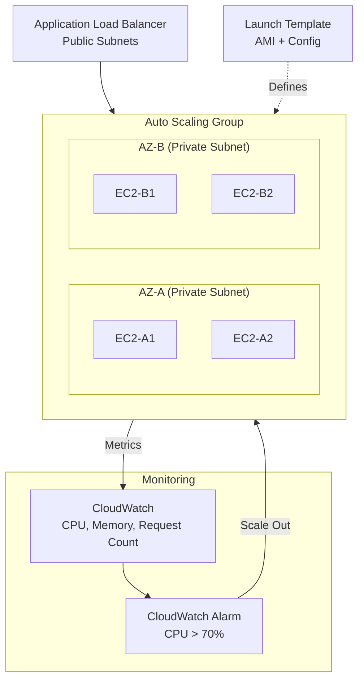
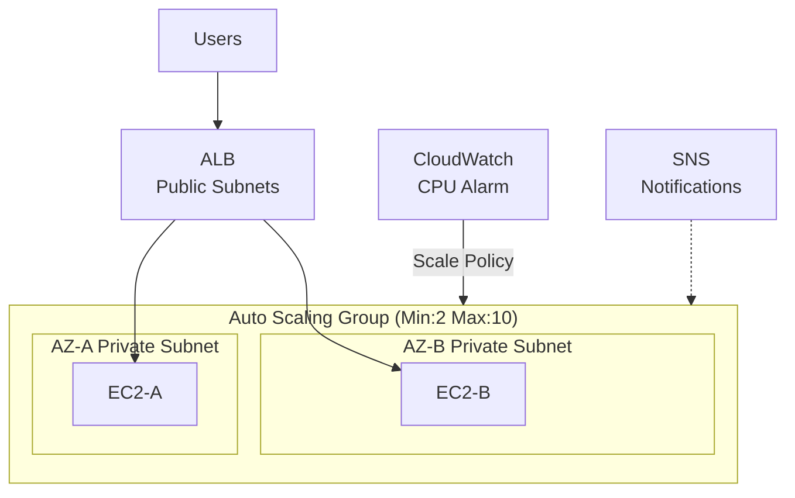
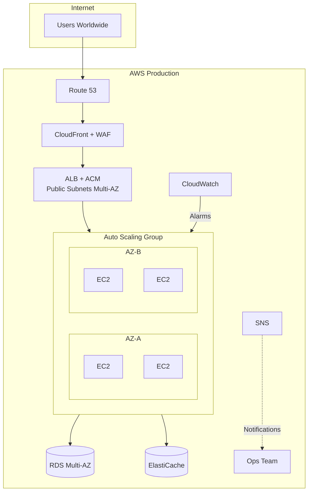
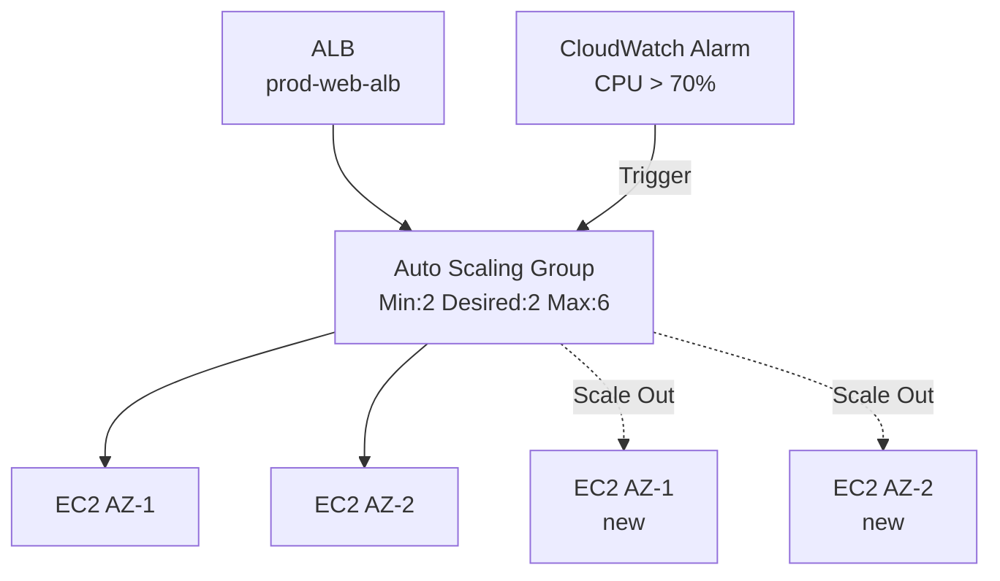

# Chapter 39 — Amazon EC2 Auto Scaling

---

## Prerequisite Chapters
- Chapter 01 — AWS IAM (roles, policies)
- Chapter 03 — Amazon EC2 (instances, AMIs, user data)
- Chapter 04 — Amazon VPC (subnets, AZs, security groups)
- Chapter 05 — Amazon CloudWatch (metrics, alarms)
- Chapter 18 — Elastic Load Balancing (ALB, target groups, health checks)

## Used In Production Practicals
- Practical 11 — HA Application
- Practical 12 — Auto Scaling
- Practical 15 — Flagship Production Architecture

---

## 1. Learning Objectives

By the end of this chapter, you will be able to:

1. **Explain** what Auto Scaling is, why it's essential for production, and how it differs from manual scaling.
2. **Create** Launch Templates with production-ready configurations.
3. **Configure** Auto Scaling Groups (ASGs) with desired, minimum, and maximum capacity.
4. **Implement** scaling policies: Target Tracking, Step Scaling, Scheduled Scaling, and Predictive Scaling.
5. **Integrate** ASGs with ALB, CloudWatch, and SNS notifications.
6. **Design** multi-AZ, highly available architectures using Auto Scaling.
7. **Troubleshoot** scaling failures, unhealthy instances, and capacity issues.
8. **Answer** interview questions about Auto Scaling in production environments.

---

## 2. What is Amazon EC2 Auto Scaling?

Amazon EC2 Auto Scaling automatically adjusts the number of EC2 instances in your application based on demand. It ensures you have the right number of instances running to handle the current traffic load.

### Three Core Capabilities

| Capability | Description |
|-----------|-------------|
| **Scale Out** | Add instances when demand increases (e.g., CPU > 70%) |
| **Scale In** | Remove instances when demand decreases (e.g., CPU < 30%) |
| **Self-Healing** | Replace unhealthy instances automatically |

### Key Components

```
Launch Template
       ↓
  Defines WHAT to launch
  (AMI, instance type, security group, user data)
       ↓
Auto Scaling Group (ASG)
       ↓
  Defines WHERE and HOW MANY
  (Subnets, min/max/desired, health checks)
       ↓
Scaling Policies
       ↓
  Defines WHEN to scale
  (CloudWatch alarms, schedules, targets)
```

---

## 3. Why Do We Need It?

### The Problem Without Auto Scaling

| Scenario | Without Auto Scaling | With Auto Scaling |
|----------|---------------------|-------------------|
| Traffic spike (10x normal) | Application crashes, users get 503 errors | New instances launch automatically in minutes |
| Night/weekend low traffic | Paying for idle servers | Instances scale down, reducing costs |
| Instance failure | Manual detection, manual replacement | Unhealthy instance replaced automatically |
| Deployment | Manual instance provisioning | Launch Template update, rolling replacement |
| Multi-AZ | Manual distribution across AZs | ASG automatically balances across AZs |

### Cost Impact Example
```
Without Auto Scaling:
  10 instances × 24 hours × 30 days = 7,200 instance-hours/month

With Auto Scaling:
  Peak (8 hours):   10 instances × 8 hours × 30 days  = 2,400 instance-hours
  Off-peak (16 hrs): 3 instances × 16 hours × 30 days = 1,440 instance-hours
  Total: 3,840 instance-hours/month (47% cost reduction)
```

---

## 4. Real-World Production Use Cases

### 1. E-Commerce Flash Sales
Auto Scaling handles traffic surges during flash sales, scaling from 5 instances to 50 within minutes, then scaling back down after the sale ends.

### 2. SaaS Application
A multi-tenant SaaS platform scales based on active user count. Weekdays see 10x more users than weekends — Auto Scaling optimizes costs.

### 3. Batch Processing
Nightly data processing jobs scale up worker instances, process the data, then scale to zero. Cost: only pay for processing time.

### 4. Self-Healing Production
When an EC2 instance fails health checks (application crash, disk full, OOM), Auto Scaling terminates it and launches a replacement automatically.

### 5. Blue/Green Deployment
Launch a new ASG with updated AMI, shift ALB traffic to the new ASG, then terminate the old ASG.

---

## 5. Core Concepts

### Launch Template

A Launch Template defines the configuration for new instances:

```
Launch Template Configuration:
├── AMI ID (operating system + application)
├── Instance Type (t3.medium, m5.large)
├── Key Pair (SSH access)
├── Security Group(s)
├── IAM Instance Profile (role)
├── User Data (startup script)
├── EBS Volume configuration
├── Network interface settings
├── Tags
└── Advanced: Spot options, placement, monitoring
```

### Auto Scaling Group (ASG)

| Setting | Description | Example |
|---------|-------------|---------|
| **Minimum Capacity** | Lowest number of instances (never goes below) | 2 |
| **Desired Capacity** | Target number of instances (ASG maintains this) | 4 |
| **Maximum Capacity** | Highest number of instances (never exceeds) | 10 |
| **Subnets** | VPC subnets where instances launch | subnet-a, subnet-b |
| **Health Check Type** | EC2 (instance status) or ELB (target group health) | ELB |
| **Health Check Grace Period** | Time to wait before checking new instance health | 300 seconds |
| **Cooldown Period** | Wait time between scaling activities | 300 seconds |
| **Termination Policy** | Which instance to terminate when scaling in | Default |

### Capacity Settings
```
                    Maximum (10)
                    ─────────────────
                    
             Desired (4)
             ─────────────────
             
     Minimum (2)
     ─────────────────
     
     ↑ Auto Scaling adjusts Desired between Min and Max
```

### Health Check Types

| Type | Checks | Use When |
|------|--------|----------|
| **EC2** | Instance status checks (hardware/system) | Standalone EC2 without ALB |
| **ELB** | ALB target group health check (application-level) | EC2 behind an ALB (recommended) |

### Termination Policies

When scaling in, ASG decides which instance to terminate:

1. **Default** — Selects the AZ with most instances, then oldest launch config/template, then closest to billing hour
2. **OldestInstance** — Terminate the oldest instance
3. **NewestInstance** — Terminate the newest instance
4. **OldestLaunchConfiguration** — Terminate instances with oldest launch config
5. **ClosestToNextInstanceHour** — Terminate instance closest to billing hour
6. **AllocationStrategy** — Used with mixed instance policies

---

## 6. Architecture

### Production Auto Scaling Architecture



### Request Flow with Auto Scaling
```
1. User sends request → Route 53 → ALB
2. ALB distributes request to healthy EC2 instance in ASG
3. CloudWatch monitors CPU/memory/request count metrics
4. If CPU > 70% for 5 minutes → CloudWatch Alarm triggers
5. Auto Scaling adds new instance using Launch Template
6. New instance boots, runs user data, registers with ALB target group
7. After health check grace period, ALB starts sending traffic
8. If CPU < 30% for 15 minutes → Auto Scaling removes an instance
9. ASG selects instance to terminate based on termination policy
10. ALB drains connections (deregistration delay) before termination
```

---

## 7. Important Components

### 1. Launch Template (vs Launch Configuration)

| Feature | Launch Template | Launch Configuration (Legacy) |
|---------|----------------|-------------------------------|
| Versioning | Yes (v1, v2, v3...) | No |
| Multiple instance types | Yes | No |
| Spot + On-Demand mix | Yes | No |
| T2/T3 Unlimited | Yes | No |
| Modifiable | New versions | Immutable |
| **Recommendation** | **Use this** | Deprecated |

### 2. Scaling Policies

#### Target Tracking Scaling (Recommended)
```
"Keep average CPU utilization at 50%"
```
- ASG automatically calculates how many instances to add/remove
- Simplest to configure, handles both scale-out and scale-in
- Predefined metrics: CPU, ALBRequestCount, Network In/Out

#### Step Scaling
```
CPU 50-70%  → Add 1 instance
CPU 70-85%  → Add 2 instances
CPU 85-100% → Add 4 instances
```
- More granular control than Target Tracking
- Responds proportionally to the alarm magnitude

#### Scheduled Scaling
```
Every weekday at 8:00 AM → Set desired capacity to 10
Every weekday at 8:00 PM → Set desired capacity to 3
```
- For predictable traffic patterns
- Good complement to dynamic scaling

#### Predictive Scaling
```
Machine learning analyzes 14 days of CloudWatch data
Proactively scales before predicted traffic spike
```
- Uses ML to forecast demand
- Scales proactively (before traffic arrives)
- Best for cyclical/predictable workloads

### 3. Instance Refresh
```
Trigger: AMI updated, user data changed, instance type changed
Process:
  1. ASG launches new instance with updated Launch Template
  2. Waits for instance to be healthy
  3. Terminates one old instance
  4. Repeats until all instances are updated
  
Configuration:
  - MinHealthyPercentage: 90% (at least 90% of instances healthy during refresh)
  - InstanceWarmup: 300 seconds
```

### 4. Lifecycle Hooks
```
Instance Launching:
  Pending → Pending:Wait → [Run custom action] → Pending:Proceed → InService

Instance Terminating:
  Terminating → Terminating:Wait → [Run custom action] → Terminating:Proceed → Terminated
```

Use cases:
- Install additional software before instance enters service
- Deregister from external monitoring before termination
- Drain connections or backup data before termination
- Notify external systems of scaling events

### 5. Warm Pools
```
Pre-initialized instances kept in a "warm" state
When ASG needs to scale out:
  - Instead of launching from scratch (cold start): 3-5 minutes
  - Use a warm instance: 30-60 seconds
```

---

## 8. How It Works

### Scaling Decision Process

```
CloudWatch Metric (e.g., CPUUtilization)
           ↓
CloudWatch Alarm (threshold breached)
           ↓
Auto Scaling Policy evaluates
           ↓
   ┌───────────────────────────┐
   │  Calculate instances      │
   │  needed to meet target    │
   │  (or follow step rules)   │
   └───────────────────────────┘
           ↓
   ┌───────┴───────┐
   │               │
Scale Out        Scale In
Add instances    Remove instances
   │               │
   ↓               ↓
Launch Template  Termination Policy
selects config   selects instance
   │               │
   ↓               ↓
Instance boots   Connection draining
User data runs   Instance terminated
   │
   ↓
Health check grace period
   ↓
ALB registers instance
   ↓
Cooldown period starts
(no more scaling for N seconds)
```

### Multi-AZ Balancing

ASG automatically distributes instances evenly across configured AZs:

```
Desired Capacity: 4
AZs: ap-south-1a, ap-south-1b

Result:
  ap-south-1a: 2 instances
  ap-south-1b: 2 instances

If ap-south-1a loses an instance:
  ap-south-1a: 1 instance
  ap-south-1b: 2 instances
  → ASG launches new instance in ap-south-1a (rebalancing)
```

---

## 9. AWS Console Walkthrough

### Step 1 — Create a Launch Template

1. Navigate to **EC2 Console** → **Launch Templates** → **Create launch template**
2. Configure:
   - **Name**: `prod-web-app-lt`
   - **AMI**: Amazon Linux 2023 (or your custom AMI)
   - **Instance Type**: `t3.medium`
   - **Key Pair**: Select your key pair
   - **Security Group**: Select web server SG (allows port 80 from ALB SG)
   - **IAM Instance Profile**: `WebAppInstanceRole`
   - **User Data**:
     ```bash
     #!/bin/bash
     yum update -y
     yum install -y httpd
     systemctl start httpd
     systemctl enable httpd
     echo "<h1>Instance: $(hostname -f)</h1>" > /var/www/html/index.html
     ```
3. Click **Create launch template**

### Step 2 — Create an Auto Scaling Group

1. Navigate to **EC2 Console** → **Auto Scaling Groups** → **Create**
2. Select the Launch Template created above
3. Configure:
   - **Name**: `prod-web-app-asg`
   - **VPC**: Select your production VPC
   - **Subnets**: Select private subnets in multiple AZs
4. **Load Balancing**: Attach to existing ALB target group
5. **Health Check**: ELB health check, grace period 300 seconds
6. **Group Size**:
   - Minimum: `2`
   - Desired: `4`
   - Maximum: `10`
7. **Scaling Policies**: Target Tracking → Average CPU → 50%
8. **Notifications**: Add SNS topic for scaling events
9. Click **Create Auto Scaling group**

---

## 10. AWS CLI Commands

### Create a Launch Template
```bash
aws ec2 create-launch-template \
    --launch-template-name prod-web-app-lt \
    --version-description "v1 - initial" \
    --launch-template-data '{
        "ImageId": "ami-0abcdef1234567890",
        "InstanceType": "t3.medium",
        "KeyName": "my-key-pair",
        "SecurityGroupIds": ["sg-0123456789abcdef0"],
        "IamInstanceProfile": {
            "Arn": "arn:aws:iam::123456789012:instance-profile/WebAppRole"
        },
        "UserData": "IyEvYmluL2Jhc2gKeXVtIHVwZGF0ZSAteQ==",
        "TagSpecifications": [{
            "ResourceType": "instance",
            "Tags": [
                {"Key": "Name", "Value": "prod-web-app"},
                {"Key": "Environment", "Value": "production"}
            ]
        }]
    }'
```

### Create an Auto Scaling Group
```bash
aws autoscaling create-auto-scaling-group \
    --auto-scaling-group-name prod-web-app-asg \
    --launch-template LaunchTemplateName=prod-web-app-lt,Version='$Latest' \
    --min-size 2 \
    --max-size 10 \
    --desired-capacity 4 \
    --vpc-zone-identifier "subnet-aaaa,subnet-bbbb" \
    --target-group-arns "arn:aws:elasticloadbalancing:...:targetgroup/prod-tg/1234567890" \
    --health-check-type ELB \
    --health-check-grace-period 300 \
    --tags '[
        {"Key":"Name","Value":"prod-web-app","PropagateAtLaunch":true},
        {"Key":"Environment","Value":"production","PropagateAtLaunch":true}
    ]'
```

### Create Target Tracking Scaling Policy
```bash
aws autoscaling put-scaling-policy \
    --auto-scaling-group-name prod-web-app-asg \
    --policy-name cpu-target-tracking \
    --policy-type TargetTrackingScaling \
    --target-tracking-configuration '{
        "PredefinedMetricSpecification": {
            "PredefinedMetricType": "ASGAverageCPUUtilization"
        },
        "TargetValue": 50.0,
        "ScaleInCooldown": 300,
        "ScaleOutCooldown": 60
    }'
```

### Create Scheduled Scaling
```bash
# Scale up for business hours
aws autoscaling put-scheduled-update-group-action \
    --auto-scaling-group-name prod-web-app-asg \
    --scheduled-action-name scale-up-business-hours \
    --recurrence "0 8 * * MON-FRI" \
    --desired-capacity 8 \
    --min-size 4

# Scale down for off-hours
aws autoscaling put-scheduled-update-group-action \
    --auto-scaling-group-name prod-web-app-asg \
    --scheduled-action-name scale-down-off-hours \
    --recurrence "0 20 * * MON-FRI" \
    --desired-capacity 2 \
    --min-size 2
```

### Describe ASG
```bash
aws autoscaling describe-auto-scaling-groups \
    --auto-scaling-group-names prod-web-app-asg \
    --query 'AutoScalingGroups[0].{
        MinSize:MinSize,
        MaxSize:MaxSize,
        DesiredCapacity:DesiredCapacity,
        Instances:Instances[*].{Id:InstanceId,Health:HealthStatus,AZ:AvailabilityZone,State:LifecycleState}
    }' \
    --output table
```

### Describe Scaling Activities
```bash
aws autoscaling describe-scaling-activities \
    --auto-scaling-group-name prod-web-app-asg \
    --max-items 10 \
    --query 'Activities[*].{Time:StartTime,Status:StatusCode,Cause:Cause}' \
    --output table
```

### Start Instance Refresh
```bash
aws autoscaling start-instance-refresh \
    --auto-scaling-group-name prod-web-app-asg \
    --preferences '{
        "MinHealthyPercentage": 90,
        "InstanceWarmup": 300
    }'
```

### Update ASG Capacity
```bash
aws autoscaling update-auto-scaling-group \
    --auto-scaling-group-name prod-web-app-asg \
    --desired-capacity 6 \
    --min-size 3 \
    --max-size 12
```

---

## 11. Hands-On Practical

### Practical: Production Auto Scaling with ALB

#### Objective
Deploy a self-healing, auto-scaling web application behind an ALB across multiple Availability Zones.

#### Business Scenario
Your company's web application must handle variable traffic (100-10,000 concurrent users). You need to ensure: minimum 2 instances for HA, automatic scaling based on CPU, and self-healing when instances fail.

#### Architecture



#### Step 1 — Create Launch Template
```bash
aws ec2 create-launch-template \
    --launch-template-name web-app-lt \
    --launch-template-data '{
        "ImageId": "ami-0abcdef1234567890",
        "InstanceType": "t3.micro",
        "SecurityGroupIds": ["sg-web-server"],
        "UserData": "IyEvYmluL2Jhc2gKeXVtIGluc3RhbGwgLXkgaHR0cGQKc3lzdGVtY3RsIHN0YXJ0IGh0dHBkCmVjaG8gIkhlbGxvIGZyb20gJChob3N0bmFtZSAtZikiID4gL3Zhci93d3cvaHRtbC9pbmRleC5odG1s"
    }'
```

#### Step 2 — Create Auto Scaling Group
```bash
aws autoscaling create-auto-scaling-group \
    --auto-scaling-group-name web-app-asg \
    --launch-template LaunchTemplateName=web-app-lt,Version='$Latest' \
    --min-size 2 --max-size 10 --desired-capacity 2 \
    --vpc-zone-identifier "subnet-private-a,subnet-private-b" \
    --target-group-arns $TG_ARN \
    --health-check-type ELB \
    --health-check-grace-period 300
```

#### Step 3 — Add Target Tracking Policy
```bash
aws autoscaling put-scaling-policy \
    --auto-scaling-group-name web-app-asg \
    --policy-name cpu-50-target \
    --policy-type TargetTrackingScaling \
    --target-tracking-configuration '{
        "PredefinedMetricSpecification": {
            "PredefinedMetricType": "ASGAverageCPUUtilization"
        },
        "TargetValue": 50.0
    }'
```

#### Step 4 — Simulate Load (Test Scale Out)
```bash
# SSH into one instance and generate CPU load
stress --cpu 4 --timeout 600
```

#### Step 5 — Observe Scaling
```bash
# Watch ASG activity
watch -n 10 'aws autoscaling describe-auto-scaling-groups \
    --auto-scaling-group-names web-app-asg \
    --query "AutoScalingGroups[0].Instances[*].[InstanceId,HealthStatus,AvailabilityZone]" \
    --output table'
```

#### Validation
```bash
# Check current instances
aws autoscaling describe-auto-scaling-groups \
    --auto-scaling-group-names web-app-asg \
    --query 'AutoScalingGroups[0].{Desired:DesiredCapacity,Running:length(Instances)}'

# Check scaling activities
aws autoscaling describe-scaling-activities \
    --auto-scaling-group-name web-app-asg --max-items 5

# Check ALB target health
aws elbv2 describe-target-health --target-group-arn $TG_ARN
```

#### Expected Result
- ASG starts with 2 instances across 2 AZs
- Under load: scales out to 4-6 instances within 5-10 minutes
- After load: scales in to 2 instances after cooldown
- If you terminate an instance: ASG replaces it within 2-3 minutes

#### Cleanup
```bash
aws autoscaling delete-auto-scaling-group \
    --auto-scaling-group-name web-app-asg --force-delete
aws ec2 delete-launch-template --launch-template-name web-app-lt
```

---

## 12. Production Architecture

### Flagship Production Setup



### Production ASG Configuration
```
Launch Template:
  - Custom AMI with application pre-installed (faster boot)
  - t3.large or m5.large (production workloads)
  - EBS: gp3, 50GB, encrypted
  - IAM Role: least-privilege
  - CloudWatch Agent in user data

ASG Settings:
  - Min: 2 (HA across AZs)
  - Desired: 4 (normal traffic)
  - Max: 20 (peak capacity)
  - Health Check: ELB (application-level)
  - Grace Period: 300s (application startup time)
  - Cooldown: 300s (prevent thrashing)

Scaling:
  - Target Tracking: CPU 50%
  - Target Tracking: ALBRequestCountPerTarget 1000
  - Scheduled: Scale up before known peak hours
  - Predictive: ML-based forecasting (optional)
```

---

## 13. Security Best Practices

1. **Use IAM Instance Profile** — never store credentials on EC2 instances
2. **Security Groups** — allow only ALB security group as inbound source (no direct public access)
3. **Private subnets** — launch ASG instances in private subnets only
4. **Encrypted EBS** — specify encrypted volumes in Launch Template
5. **IMDSv2** — require Instance Metadata Service v2 in Launch Template
6. **SSM Session Manager** — use instead of SSH (no key pair needed, auditable)
7. **Minimal AMI** — use hardened AMIs with only required packages
8. **Tag propagation** — enable `PropagateAtLaunch` for governance tags
9. **Instance refresh** — use to roll out security patches without downtime
10. **Lifecycle hooks** — run security scans before instances enter service

---

## 14. High Availability

### Multi-AZ Design
```
VPC (10.0.0.0/16)
├── AZ-A (ap-south-1a)
│   ├── Public Subnet (10.0.1.0/24) → ALB node
│   └── Private Subnet (10.0.3.0/24) → EC2 instances
│
├── AZ-B (ap-south-1b)
│   ├── Public Subnet (10.0.2.0/24) → ALB node
│   └── Private Subnet (10.0.4.0/24) → EC2 instances
│
└── ASG distributes instances evenly across AZ-A and AZ-B
```

### HA Guarantees
- **Min 2 instances across 2 AZs** — if one AZ fails, one instance continues serving
- **ELB health checks** — unhealthy instances replaced within minutes
- **AZ rebalancing** — if AZ distribution becomes uneven, ASG rebalances
- **No single point of failure** — ALB + ASG + Multi-AZ eliminates SPOF

### AZ Failure Scenario
```
Normal: AZ-A (2 instances) + AZ-B (2 instances) = 4 total

AZ-A fails:
  AZ-A: 0 instances (failed)
  AZ-B: 2 instances (surviving)
  ASG scales out: launches 2 new instances in AZ-B
  Result: AZ-B has 4 instances, application continues

AZ-A recovers:
  ASG rebalances: moves 2 instances back to AZ-A
  Result: AZ-A (2) + AZ-B (2) = 4 total (balanced)
```

---

## 15. Scalability

### Scaling Metrics Decision Guide

| Metric | Best For | When to Use |
|--------|----------|------------|
| CPU Utilization | Compute-bound applications | Web servers, API servers |
| ALBRequestCountPerTarget | Request-bound applications | APIs, microservices |
| Network In/Out | Network-bound applications | Streaming, file transfer |
| Custom Metric (SQS Queue Depth) | Queue-based processing | Worker applications |
| Custom Metric (Memory) | Memory-bound applications | Caching, data processing |

### Scaling Speed Optimization
```
Cold Launch (from AMI):           3-5 minutes
Warm Pool:                        30-60 seconds
Pre-baked AMI (golden image):     1-2 minutes
Faster instance type (Nitro):     Marginal improvement

Recommendations:
1. Use pre-baked AMIs (application installed in AMI, not user data)
2. Enable Warm Pools for latency-sensitive applications
3. Set ScaleOutCooldown to 60s (react faster to spikes)
4. Set ScaleInCooldown to 300s (avoid premature scale-in)
```

---

## 16. Monitoring & Observability

### Key CloudWatch Metrics

| Metric | Namespace | Description | Alarm Threshold |
|--------|-----------|-------------|-----------------|
| `GroupInServiceInstances` | AWS/AutoScaling | Healthy running instances | < Min capacity |
| `GroupDesiredCapacity` | AWS/AutoScaling | Target instance count | Unexpected changes |
| `GroupPendingInstances` | AWS/AutoScaling | Instances being launched | > 0 for extended time |
| `CPUUtilization` | AWS/EC2 | Instance CPU usage | > 80% sustained |
| `HealthyHostCount` | AWS/ApplicationELB | Healthy ALB targets | < Min capacity |
| `UnHealthyHostCount` | AWS/ApplicationELB | Unhealthy ALB targets | > 0 |

### CloudWatch Dashboard
```bash
# Create ASG monitoring dashboard
aws cloudwatch put-dashboard \
    --dashboard-name ASG-Monitoring \
    --dashboard-body '{
        "widgets": [
            {
                "type": "metric",
                "properties": {
                    "metrics": [
                        ["AWS/AutoScaling", "GroupInServiceInstances", "AutoScalingGroupName", "prod-web-app-asg"],
                        ["AWS/AutoScaling", "GroupDesiredCapacity", "AutoScalingGroupName", "prod-web-app-asg"]
                    ],
                    "period": 60,
                    "title": "ASG Instance Count"
                }
            }
        ]
    }'
```

### SNS Notifications for Scaling Events
```bash
aws autoscaling put-notification-configuration \
    --auto-scaling-group-name prod-web-app-asg \
    --topic-arn arn:aws:sns:ap-south-1:123456789012:ops-alerts \
    --notification-types \
        "autoscaling:EC2_INSTANCE_LAUNCH" \
        "autoscaling:EC2_INSTANCE_TERMINATE" \
        "autoscaling:EC2_INSTANCE_LAUNCH_ERROR" \
        "autoscaling:EC2_INSTANCE_TERMINATE_ERROR"
```

---

## 17. Cost Optimization

### 1. Right-Size Instance Types
```bash
# Use AWS Compute Optimizer recommendations
aws compute-optimizer get-auto-scaling-group-recommendations \
    --auto-scaling-group-arns $ASG_ARN
```

### 2. Mixed Instance Policy (Spot + On-Demand)
```bash
# Use 70% Spot + 30% On-Demand for non-critical workloads
aws autoscaling create-auto-scaling-group \
    --auto-scaling-group-name cost-optimized-asg \
    --mixed-instances-policy '{
        "LaunchTemplate": {
            "LaunchTemplateSpecification": {
                "LaunchTemplateName": "web-app-lt",
                "Version": "$Latest"
            },
            "Overrides": [
                {"InstanceType": "t3.medium"},
                {"InstanceType": "t3a.medium"},
                {"InstanceType": "m5.large"},
                {"InstanceType": "m5a.large"}
            ]
        },
        "InstancesDistribution": {
            "OnDemandBaseCapacity": 2,
            "OnDemandPercentageAboveBaseCapacity": 30,
            "SpotAllocationStrategy": "capacity-optimized"
        }
    }' \
    --min-size 2 --max-size 10 --desired-capacity 4 \
    --vpc-zone-identifier "subnet-a,subnet-b"
```

### 3. Scheduled Scaling for Cost Savings
```
Weekday business hours: Desired 8, Min 4
Weekday off-hours: Desired 2, Min 2
Weekends: Desired 2, Min 2

Savings: ~50-60% compared to running 8 instances 24/7
```

---

## 18. Disaster Recovery

### DR with Auto Scaling

| Strategy | RTO | RPO | ASG Setup |
|----------|-----|-----|-----------|
| **Pilot Light** | 15-30 min | Near-zero | ASG Min=0, Desired=0 in DR region |
| **Warm Standby** | 5-10 min | Near-zero | ASG Min=1, Desired=1 in DR region |
| **Active-Active** | Near-zero | Zero | ASG running in both regions |

### DR Failover Process
```
Normal State:
  Primary (ap-south-1): ASG Min=2, Desired=4, Max=10
  DR (us-west-2): ASG Min=0, Desired=0, Max=10

Primary Region Failure:
  1. Route 53 health check detects failure
  2. Route 53 failover routing switches to DR
  3. DR ASG scales up: Desired=4
  4. Instances launch from Launch Template (same AMI replicated to DR)
  5. ALB in DR starts serving traffic

Recovery:
  1. Primary region recovers
  2. Verify primary ASG is healthy
  3. Route 53 fails back to primary
  4. DR ASG scales down: Desired=0
```

---

## 19. Troubleshooting

### Problem 1: Instances Launch But Immediately Terminate (Flapping)

**Symptoms**: ASG continuously launches and terminates instances. Scaling activities show launch followed by termination within minutes.

**Investigation**:
```bash
# Check scaling activities for error details
aws autoscaling describe-scaling-activities \
    --auto-scaling-group-name prod-asg --max-items 20

# Check instance health
aws elbv2 describe-target-health --target-group-arn $TG_ARN

# Check instance system logs
aws ec2 get-console-output --instance-id i-0123456789abcdef0
```

**Common Causes**:
1. Health check grace period too short (application hasn't started yet)
2. User data script fails (bad AMI, missing packages)
3. Application fails health check (wrong port, wrong path)
4. Security group blocks ALB health check traffic
5. Subnet has no available IP addresses

**Fix**:
- Increase health check grace period (300-600 seconds)
- Test user data script on a standalone EC2 instance first
- Verify health check port/path matches application
- Ensure SG allows traffic from ALB SG

### Problem 2: ASG Not Scaling Out Despite High CPU

**Investigation**:
```bash
# Check if scaling policy exists
aws autoscaling describe-policies --auto-scaling-group-name prod-asg

# Check if CloudWatch alarm is in ALARM state
aws cloudwatch describe-alarms --alarm-names "TargetTracking-prod-asg-..."

# Check if ASG is at maximum capacity
aws autoscaling describe-auto-scaling-groups \
    --auto-scaling-group-names prod-asg \
    --query 'AutoScalingGroups[0].{Max:MaxSize,Desired:DesiredCapacity}'

# Check cooldown period
aws autoscaling describe-scaling-activities \
    --auto-scaling-group-name prod-asg --max-items 5
```

**Common Causes**:
1. ASG already at MaxSize
2. Cooldown period active (recent scaling activity)
3. Scaling policy not configured or misconfigured
4. CloudWatch metric not reporting (agent not installed)
5. Account EC2 instance limit reached

### Problem 3: Instances Launched in Wrong AZ

**Cause**: Subnet configuration issue or AZ rebalancing.

**Fix**:
```bash
# Verify subnet configuration
aws autoscaling describe-auto-scaling-groups \
    --auto-scaling-group-names prod-asg \
    --query 'AutoScalingGroups[0].VPCZoneIdentifier'

# Ensure both AZ subnets are specified
aws autoscaling update-auto-scaling-group \
    --auto-scaling-group-name prod-asg \
    --vpc-zone-identifier "subnet-az-a,subnet-az-b"
```

### Problem 4: Instance Refresh Stuck

**Investigation**:
```bash
aws autoscaling describe-instance-refreshes \
    --auto-scaling-group-name prod-asg

# Cancel if stuck
aws autoscaling cancel-instance-refresh \
    --auto-scaling-group-name prod-asg
```

---

## 20. Common Production Problems

| # | Problem | Root Cause | Impact | Prevention |
|---|---------|------------|--------|------------|
| 1 | Flapping instances | Health check fails before app starts | Endless launch/terminate cycle | Increase grace period |
| 2 | Can't scale out | At MaxSize or EC2 limit | Application degradation | Set appropriate Max, monitor limits |
| 3 | Slow scale-out | Cold start from base AMI | Users experience latency | Use pre-baked AMI or Warm Pools |
| 4 | Cost spike | MaxSize too high, no scale-in | Unexpected bill | Set reasonable Max, monitor costs |
| 5 | Uneven AZ distribution | Subnet capacity issue | HA risk | Use similar subnet sizes |
| 6 | Stale instances | No instance refresh | Security vulnerabilities | Regular instance refresh with new AMI |
| 7 | Scaling thrashing | Cooldown too short | Instance waste | Set appropriate cooldown periods |
| 8 | User data failures | AMI changed, repos unavailable | Instances launch but don't work | Test user data, use AMI-baked approach |

---

## 21. Real-World Scenario

### Scenario: Black Friday Traffic Surge

**Background**: An e-commerce company expects 20x traffic on Black Friday. Normal traffic: 1,000 requests/second. Expected peak: 20,000 requests/second.

**Current Setup**: 4 EC2 instances behind ALB, no Auto Scaling.

**Problem**: 4 instances can handle ~4,000 req/s. At 20,000 req/s, the site will crash.

**Solution**:

```
Pre-Event (1 week before):
  1. Create Launch Template with production AMI
  2. Create ASG: Min=4, Desired=4, Max=40
  3. Attach to existing ALB target group
  4. Configure Target Tracking: CPU 50%, ALBRequestCount 500
  5. Add Scheduled Scaling: Scale to Desired=20 at 00:00 on Black Friday
  6. Enable Predictive Scaling using historical data

During Event:
  - Scheduled scaling pre-provisions 20 instances
  - Target Tracking handles additional spikes beyond 20 instances
  - Maximum cap at 40 instances prevents runaway costs

Post-Event:
  - Traffic returns to normal
  - Auto Scaling scales in gradually (cooldown prevents rapid termination)
  - Back to 4 instances within 2-3 hours
```

**Cost Comparison**:
```
Without Auto Scaling (40 instances 24/7):
  40 × $0.10/hr × 720 hours = $2,880/month

With Auto Scaling:
  Peak (12 hours): 40 × $0.10 × 12 = $48
  Normal (708 hours): 4 × $0.10 × 708 = $283
  Total: $331/month (89% savings)
```

---

## 22. Interview Questions

### Basic Questions (10)

**Q1: What is EC2 Auto Scaling?**
A: EC2 Auto Scaling automatically adjusts the number of EC2 instances based on demand. It scales out (adds instances) when load increases and scales in (removes instances) when load decreases. It also replaces unhealthy instances automatically.

**Q2: What is the difference between a Launch Template and a Launch Configuration?**
A: Launch Templates are newer, support versioning, mixed instance types, Spot + On-Demand mix, and are modifiable. Launch Configurations are immutable and deprecated. Always use Launch Templates.

**Q3: What are Min, Desired, and Max capacity?**
A: Min = lowest instance count (never goes below). Desired = target count (ASG maintains this). Max = highest count (never exceeds). Auto Scaling adjusts Desired between Min and Max based on scaling policies.

**Q4: What health check types does ASG support?**
A: EC2 (checks instance status — running, system checks) and ELB (checks application health via ALB target group health checks). Use ELB for production — it detects application-level failures.

**Q5: What is a scaling policy?**
A: A rule that defines when and how ASG should scale. Types: Target Tracking (maintain a metric target), Step Scaling (scale proportionally to alarm), Scheduled (time-based), Predictive (ML-based forecast).

**Q6: What is a cooldown period?**
A: The wait time after a scaling activity before another scaling activity can start. Prevents rapid scaling oscillations (thrashing). Default: 300 seconds.

**Q7: How does ASG handle AZ distribution?**
A: ASG automatically distributes instances evenly across configured Availability Zones. If one AZ has more instances, ASG launches new instances in the AZ with fewer.

**Q8: What is the health check grace period?**
A: Time after instance launch during which ASG does not check health. Gives the application time to start. Default: 0 (check immediately). Production recommendation: 300-600 seconds.

**Q9: What happens when ASG terminates an instance?**
A: ASG selects an instance based on the termination policy, sends a termination signal, ALB drains connections (deregistration delay), then the instance is terminated. ASG launches a replacement if below desired capacity.

**Q10: Can ASG work without an ALB?**
A: Yes. ASG can manage standalone EC2 instances without a load balancer. However, for production web applications, ALB + ASG is the standard pattern.

### Intermediate Questions (10)

**Q11: Explain Target Tracking scaling policy.**
A: You specify a target value for a metric (e.g., "keep CPU at 50%"). ASG automatically calculates how many instances to add or remove to maintain the target. It creates and manages the CloudWatch alarms internally. This is the simplest and most recommended policy type.

**Q12: How would you handle an application that takes 10 minutes to start?**
A: Set health check grace period to at least 600 seconds (10 minutes). Use a pre-baked AMI with the application installed to reduce startup time. Consider Warm Pools to keep pre-initialized instances ready. Ensure ALB health check interval and thresholds accommodate startup time.

**Q13: What is Instance Refresh and when would you use it?**
A: Instance Refresh performs a rolling update of all instances in an ASG. You update the Launch Template (new AMI, new user data), then trigger an instance refresh. ASG replaces instances one-by-one while maintaining MinHealthyPercentage. Use for AMI updates, security patches, and configuration changes.

**Q14: How do you combine Spot and On-Demand instances in an ASG?**
A: Use a Mixed Instances Policy. Set OnDemandBaseCapacity (e.g., 2 guaranteed On-Demand), OnDemandPercentageAboveBaseCapacity (e.g., 30%), and multiple instance types as overrides. ASG launches Spot instances for cost savings while maintaining a baseline of On-Demand for reliability.

**Q15: What are Lifecycle Hooks?**
A: Lifecycle Hooks pause an instance during launch or termination to run custom actions. During launch: install software, run health checks, register with monitoring. During termination: drain connections, backup data, deregister. The instance remains in `Pending:Wait` or `Terminating:Wait` until the action completes or times out.

**Q16: How does Predictive Scaling work?**
A: Predictive Scaling uses ML to analyze 14 days of CloudWatch data, identify traffic patterns, and proactively scale before predicted spikes. It creates scheduled scaling actions based on forecasts. Best for workloads with regular, cyclical patterns (business hours, weekly patterns).

**Q17: Explain the relationship between ASG and ALB.**
A: ASG automatically registers new instances with the ALB target group and deregisters terminated instances. ALB distributes traffic to healthy instances. ALB health checks determine instance health for ASG. ASG + ALB together provide automatic scaling + load distribution + self-healing.

**Q18: What is a Warm Pool?**
A: A pool of pre-initialized EC2 instances in a stopped (or running) state. When ASG needs to scale out, it draws from the Warm Pool instead of launching from scratch. Reduces scale-out time from 3-5 minutes to 30-60 seconds. Useful for applications with long initialization times.

**Q19: How do you perform a zero-downtime deployment with ASG?**
A: Option 1: Instance Refresh — update Launch Template with new AMI, trigger refresh with 90% MinHealthyPercentage. Option 2: Blue/Green — create new ASG with new AMI, attach to same ALB target group, wait for health, detach old ASG. Option 3: Rolling update via CodeDeploy.

**Q20: What metrics should you use for scaling a web application?**
A: Primary: `ALBRequestCountPerTarget` (most directly related to user load). Secondary: `CPUUtilization` (catches compute-heavy requests). Custom: `ResponseTime` or `QueueDepth` for specific use cases. Avoid: `NetworkIn/Out` (too indirect for most web apps).

### Advanced Questions (10)

**Q21: Design an Auto Scaling architecture for a global e-commerce platform.**
A: Multi-region ASGs behind CloudFront. Each region has ALB + ASG with Target Tracking on request count. Use Predictive Scaling for Black Friday. Route 53 latency-based routing between regions. Min=4 per region for HA. Max=100 for peak. Mixed instance policy with 70% Spot for cost optimization. Warm Pools for instant scaling.

**Q22: Your ASG keeps scaling out but response times aren't improving. Why?**
A: The bottleneck is not compute — likely database (RDS), cache (ElastiCache), or external API. Adding EC2 instances doesn't help if the database is saturated. Solution: Enable RDS Read Replicas, add ElastiCache, optimize database queries, or scale the database tier.

**Q23: How do you handle ASG with stateful applications?**
A: Avoid if possible — stateful scaling is complex. If needed: use EFS for shared storage, store sessions in ElastiCache (not local), use lifecycle hooks to drain state before termination, consider sticky sessions on ALB (but this limits scaling effectiveness).

**Q24: An ASG launches instances but they all fail health checks. Root cause analysis?**
A: 1) Check security group: ALB SG must allow traffic to instance SG on health check port. 2) Check health check path: application must return 200 on the configured path. 3) Check user data: `aws ec2 get-console-output` for errors. 4) Check subnet: instances in correct subnet with proper routing. 5) Check IAM role: application may need permissions to start.

**Q25: How would you implement canary deployments with ASG?**
A: Create a second target group with weight-based routing on ALB (95/5 split). Create a new ASG with new Launch Template attached to the canary target group. Monitor error rates. If healthy, increase weight. If errors, scale canary to 0. Eventually, update the primary ASG and remove canary.

**Q26: Explain suspension of Auto Scaling processes.**
A: You can suspend specific ASG processes: Launch, Terminate, HealthCheck, ReplaceUnhealthy, AZRebalance, AlarmNotification, ScheduledActions, AddToLoadBalancer, InstanceRefresh. Use case: suspend during investigations or maintenance. Command: `aws autoscaling suspend-processes`.

**Q27: How does ASG handle Spot Instance interruptions?**
A: When AWS reclaims a Spot Instance, ASG detects the termination and launches a replacement. The Mixed Instance Policy ensures capacity-optimized allocation across multiple instance types, reducing interruption risk. For critical workloads, maintain OnDemandBaseCapacity to guarantee minimum capacity.

**Q28: Design a cost-optimized Auto Scaling strategy for a development environment.**
A: Min=0, Desired=1, Max=3. Use Scheduled Scaling to set Desired=1 during work hours (9-6) and Desired=0 after hours. Use Spot instances (t3.medium, t3a.medium, m5.large overrides). Single AZ is acceptable for dev. No Warm Pools needed. Result: ~70-80% savings vs always-on.

**Q29: What happens if the Launch Template AMI is deleted?**
A: ASG cannot launch new instances. Existing instances continue running. Scale-out fails with `Ami.NotFound` error. Self-healing fails. Fix: update Launch Template to use a valid AMI. Prevention: never delete AMIs that are referenced by active Launch Templates.

**Q30: How do you test Auto Scaling before production deployment?**
A: 1) Create a staging ASG with same configuration. 2) Use `stress` or `hey` to generate load. 3) Verify scale-out triggers within expected time. 4) Verify scale-in after load stops. 5) Terminate an instance manually — verify replacement. 6) Check CloudWatch alarms fire correctly. 7) Verify SNS notifications received.

### Scenario-Based Questions (10)

**Q31: Your production ASG has Min=2 but only 1 instance is running. What happened?**
A: An AZ failure or subnet issue may prevent launching in one AZ. Check: 1) Scaling activities for launch errors. 2) Subnet IP availability. 3) EC2 service limits. 4) Security group/VPC configuration. ASG should be trying to launch the second instance — check the error message.

**Q32: CPU is at 90% but ASG hasn't scaled. Why?**
A: 1) Check if scaling policy exists. 2) Check if ASG is at MaxSize. 3) Check cooldown period. 4) Check if detailed monitoring is enabled. 5) Check CloudWatch alarm state. 6) Check if Launch/Terminate processes are suspended.

**Q33: After scaling out to 10 instances, your bill tripled. How do you optimize?**
A: 1) Review if Max is too high. 2) Implement scale-in policies (not just scale-out). 3) Use Scheduled Scaling to reduce during off-peak. 4) Switch to Mixed Instance Policy with Spot instances. 5) Right-size instance types using Compute Optimizer. 6) Review scaling thresholds — maybe target CPU should be 60% not 40%.

**Q34: An instance was replaced by ASG but the replacement also fails. What now?**
A: This indicates a systemic issue, not a transient failure. 1) Suspend ReplaceUnhealthy to stop the loop. 2) Check the Launch Template: AMI valid? User data correct? 3) Launch a standalone instance with the same config to debug. 4) Check subnet, SG, IAM role. 5) Fix the root cause, then resume processes.

**Q35: How do you handle a deployment that causes all instances to fail health checks?**
A: 1) Immediate: set ASG to suspend HealthCheck and ReplaceUnhealthy to prevent cascade termination. 2) Roll back: update Launch Template to previous version. 3) Trigger Instance Refresh with previous version. 4) Resume ASG processes. 5) Root cause: investigate why the deployment failed (bad config, missing env var, dependency issue).

**Q36: Your ASG scales out during a deployment. Is this expected?**
A: Yes, this can happen during Instance Refresh if the replacement instances temporarily increase CPU. It can also happen if old instances are terminated before new ones are healthy, causing remaining instances to absorb more load. Mitigation: set MinHealthyPercentage to 90% and InstanceWarmup to match application startup time.

**Q37: One AZ has 4 instances and the other has 1. Why isn't ASG rebalancing?**
A: Check if AZRebalance process is suspended. Check if the lighter AZ has available capacity (IP addresses, instance limits). If you recently changed subnet configuration, ASG may not rebalance existing instances. New launches will prefer the lighter AZ.

**Q38: You need to update all instances with a critical security patch within 1 hour. How?**
A: 1) Create new AMI with the patch. 2) Update Launch Template to new version. 3) Start Instance Refresh with MinHealthyPercentage=50 (aggressive but fast). 4) With 10 instances and 50% healthy, ASG replaces 5 at a time. 5) Alternatively, use SSM Run Command to patch in-place without replacing instances.

**Q39: Your application requires exactly 4 instances at all times (no scaling). How?**
A: Set Min=4, Desired=4, Max=4. No scaling policies. ASG still provides self-healing (replaces unhealthy instances) and AZ distribution. This is valid for applications with known, fixed capacity needs.

**Q40: How would you migrate from a manually managed EC2 fleet to Auto Scaling?**
A: 1) Create AMI from a healthy existing instance. 2) Create Launch Template with the AMI and matching config. 3) Create ASG with same capacity as current fleet. 4) Attach same ALB target group. 5) Wait for new instances to become healthy. 6) Gradually terminate old manually-managed instances. 7) Verify ALB distributes traffic evenly.

---

## 23. Scenario-Based Interview Questions

*(Covered in section 22 above — Q31 through Q40)*

---

## 24. Common Mistakes

1. **Health check grace period too short** — application hasn't started when health check runs, causing flapping
2. **Not using ELB health checks** — EC2 health checks only detect instance-level failures, not application failures
3. **MaxSize too low** — can't handle traffic spikes
4. **MaxSize too high** — no cost protection during scaling anomalies
5. **Single AZ** — defeats the purpose of high availability
6. **Using Launch Configuration** — deprecated, use Launch Templates
7. **Not testing scaling** — deploy, load test, observe, adjust
8. **No notifications** — ASG scaling events go unnoticed
9. **Cooldown too short** — causes scaling thrashing (rapid scale out and in)
10. **Not using pre-baked AMIs** — user data failures cause launch failures

---

## 25. Production Checklist

- [ ] Launch Template created with production AMI (pre-baked, not user data)
- [ ] Launch Template uses encrypted EBS volumes
- [ ] Launch Template enforces IMDSv2
- [ ] ASG spans at least 2 Availability Zones
- [ ] ASG Min >= 2 for high availability
- [ ] ASG Max set to reasonable limit (cost protection)
- [ ] Health check type set to ELB (not EC2)
- [ ] Health check grace period matches application startup time
- [ ] Target Tracking scaling policy configured
- [ ] ALB target group attached
- [ ] SNS notifications configured for scaling events
- [ ] CloudWatch dashboard monitoring ASG metrics
- [ ] Tags propagated to instances (Name, Environment, Owner)
- [ ] Instances launch in private subnets
- [ ] Security group allows traffic only from ALB SG
- [ ] Instance refresh process documented for AMI updates
- [ ] DR region has equivalent ASG configuration
- [ ] Cost optimization reviewed (Spot mix, scheduled scaling)

---

## 26. Chapter Summary

Amazon EC2 Auto Scaling is the foundation of production high availability on AWS. Key takeaways:

1. **Launch Templates define WHAT**, ASGs define **WHERE and HOW MANY**, Scaling Policies define **WHEN**
2. **Always use ELB health checks** — EC2 checks only detect hardware failures, not application crashes
3. **Set Min >= 2 across >= 2 AZs** — this is the minimum for production high availability
4. **Target Tracking is the recommended policy** — simple, effective, handles both scale-out and scale-in
5. **Use pre-baked AMIs** — faster startup, more reliable than user data scripts
6. **Cooldown prevents thrashing** — 60s for scale-out, 300s for scale-in is a good starting point
7. **Instance Refresh for zero-downtime updates** — update AMI, trigger refresh, ASG handles the rest
8. **Cost optimization with Mixed Instance Policy** — Spot instances can save 60-90% for non-critical workloads
9. **Monitor scaling activities** — unexpected scaling often reveals underlying application or infrastructure issues
10. **ASG is self-healing** — it automatically replaces unhealthy instances, even without scaling policies

Auto Scaling is used in nearly every production AWS architecture. Mastering it is essential for any DevOps or Cloud Engineer.

---
---

# 🔬 Practical Lab 15 — EC2 Auto Scaling

## Lab Overview
| Item | Detail |
|------|--------|
| **Difficulty** | Intermediate |
| **Duration** | 40 minutes |
| **Cost** | ~$0.50/day (ALB + instances) |
| **Prerequisites** | Practical 13 (ALB) |
| **Lab Environment** | Environment 3 — Compute |

## Business Scenario
> Your web application experiences traffic spikes. You need the infrastructure to automatically scale out during peak hours and scale in during quiet periods — without manual intervention.

## Architecture


### Step 1 — Create Launch Template
1. **EC2** → **Launch Templates** → **Create**
   - **Name**: `prod-web-lt`
   - **AMI**: Amazon Linux 2023
   - **Instance type**: t2.micro
   - **Security group**: `prod-ec2-sg`
   - **IAM instance profile**: `prod-ec2-web-role`
   - **User data**: Same Nginx script from Practical 11

📸 **Screenshot 01** — Launch Template Created
> **What you should see**: Launch template "prod-web-lt" with version 1
> **Verify**: AMI, instance type, security group, IAM role all configured

### Step 2 — Create Auto Scaling Group
1. **EC2** → **Auto Scaling Groups** → **Create**
   - **Name**: `prod-web-asg`
   - **Launch template**: `prod-web-lt`
   - **VPC**: `prod-vpc`
   - **Subnets**: Both private subnets
   - **Load balancer**: Attach to `prod-web-tg`
   - **Health check**: ELB health check
   - **Group size**: Min=2, Desired=2, Max=6
   - **Scaling policy**: Target tracking → CPU ≥ 70% → add instances

📸 **Screenshot 02** — ASG Created with 2 Instances
> **What you should see**: ASG "prod-web-asg" with 2 instances (desired capacity met)
> **Verify**: Both instances healthy in ALB target group

📸 **Screenshot 03** — ASG Activity History
> **What you should see**: Activity showing "Launching a new EC2 instance" x2

### Step 3 — Generate Load and Observe Scaling
```bash
# Install stress tool on one instance via SSM
sudo dnf install -y stress
sudo stress --cpu 4 --timeout 300  # 5 minutes of CPU load
```

📸 **Screenshot 04** — CloudWatch CPU Alarm Triggered
> **What you should see**: CPU utilization above 70%, CloudWatch alarm in "ALARM" state

📸 **Screenshot 05** — Scale Out: New Instances Launching
> **What you should see**: ASG activity showing new instances being launched (3 or 4 instances)
> **Verify**: New instances appear in target group after ~2 minutes

### Step 4 — Stop Load and Observe Scale-In
1. Stop the stress command
2. Wait 5-10 minutes for cooldown period
3. ASG removes extra instances (back to desired=2)

📸 **Screenshot 06** — Scale In: Instances Terminating
> **What you should see**: ASG activity showing "Terminating" excess instances
> **Verify**: Instance count returns to 2

🎯 **Interview Insight**: "Walk me through your Auto Scaling configuration."
> **Strong answer**: "Launch Template defines the instance blueprint. ASG defines capacity (min/desired/max), subnets (multi-AZ), and health checks (ELB for app-level). Target Tracking scales on CPU. Cooldown period prevents thrashing. Step Scaling for more granular control. Predictive Scaling for known patterns."

### Step 5 — Test Self-Healing
1. Manually terminate one EC2 instance
2. ASG automatically launches a replacement (self-healing!)

📸 **Screenshot 07** — Self-Healing: Replacement Launched
> **What you should see**: Terminated instance replaced within minutes
> **Verify**: ASG maintains desired count even when instances are manually killed

## Cleanup
```bash
aws autoscaling delete-auto-scaling-group --auto-scaling-group-name prod-web-asg --force-delete
aws ec2 delete-launch-template --launch-template-name prod-web-lt
```
