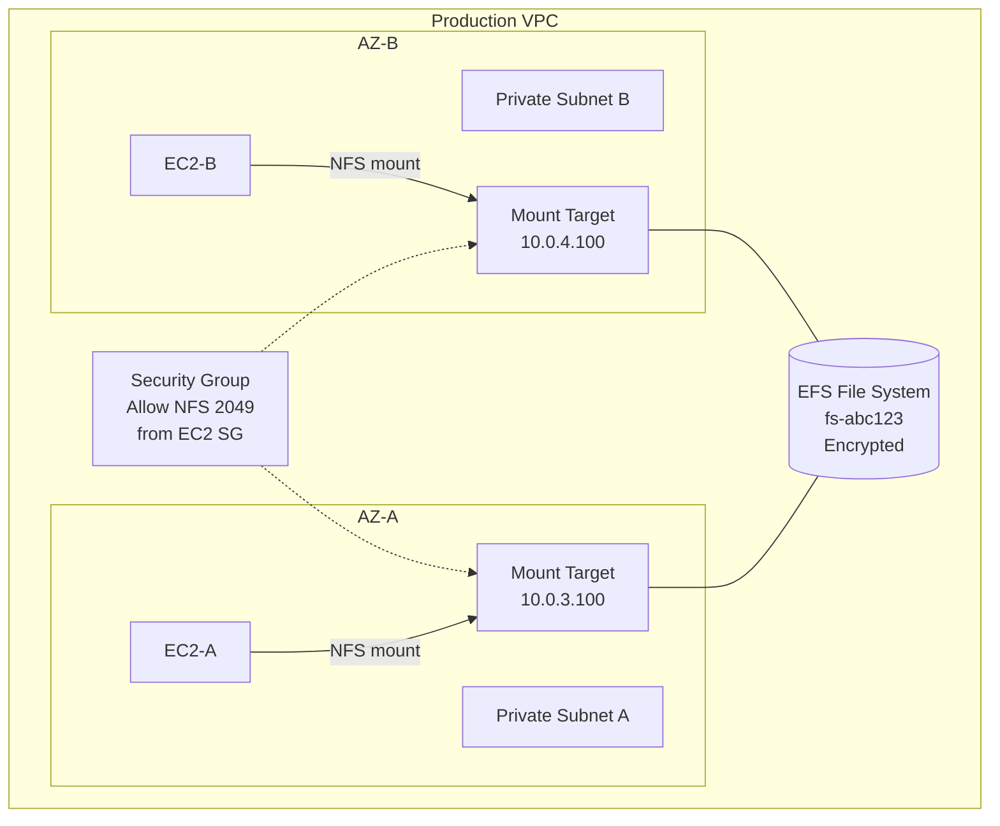
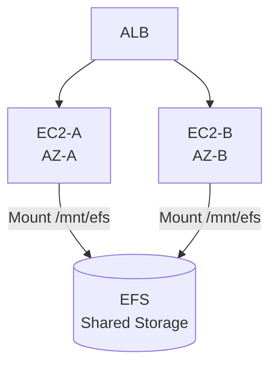
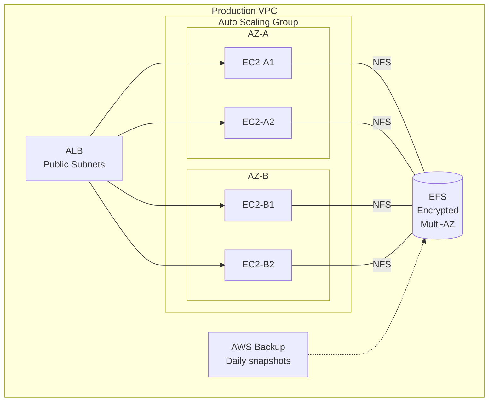
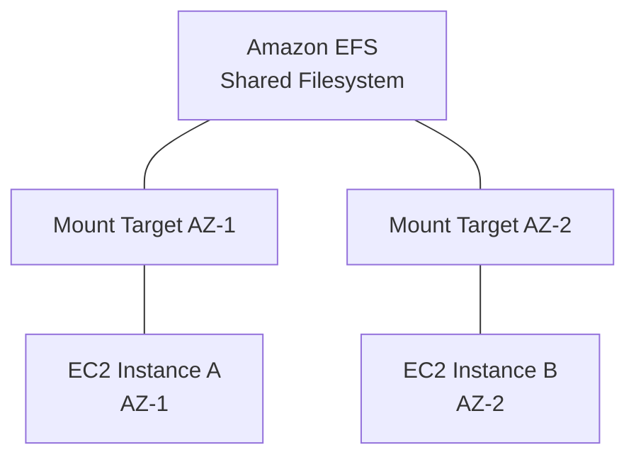

# Chapter 40 — Amazon EFS (Elastic File System)

---

## Prerequisite Chapters
- Chapter 01 — AWS IAM (roles, policies)
- Chapter 03 — Amazon EC2 (instances, security groups)
- Chapter 04 — Amazon VPC (subnets, AZs, security groups)

## Used In Production Practicals
- Practical 05 — Backup (EC2/RDS/EFS)
- Practical 15 — Flagship Production Architecture (shared storage)
- Practical 27 — ECS + Fargate + ALB + RDS (shared storage concepts)
- Practical 37 — AWS Backup + DR

---

## 1. Learning Objectives

By the end of this chapter, you will be able to:

1. **Explain** what EFS is, how it differs from EBS and S3, and when to use it.
2. **Create** an EFS file system with mount targets across multiple AZs.
3. **Mount** EFS on EC2 instances and configure access points.
4. **Configure** storage classes, lifecycle policies, throughput modes, and encryption.
5. **Design** production architectures with shared storage across multiple instances.
6. **Integrate** EFS with EC2, ECS, Fargate, and AWS Backup.
7. **Troubleshoot** mount failures, performance issues, and permission errors.
8. **Answer** interview questions about storage options and EFS in production.

---

## 2. What is Amazon EFS?

Amazon EFS is a fully managed, elastic, serverless **Network File System (NFS)** that can be shared across multiple EC2 instances, ECS containers, and Lambda functions simultaneously.

### Key Characteristics
- **Shared file storage** — multiple instances read/write the same files concurrently
- **Elastic** — automatically grows and shrinks as you add/remove files (no pre-provisioning)
- **Serverless** — no servers to manage, patch, or maintain
- **Multi-AZ** — data replicated across multiple Availability Zones
- **NFS v4.1 protocol** — standard Linux file system interface
- **Petabyte-scale** — grows to petabytes without disruption

### EFS vs EBS vs S3

| Feature | EFS | EBS | S3 |
|---------|-----|-----|-----|
| **Type** | Network file system (NFS) | Block storage (disk) | Object storage |
| **Access** | Multiple instances simultaneously | Single instance (Multi-Attach limited) | Any number of clients via API |
| **Protocol** | NFS v4.1 | Block device (ext4, xfs) | HTTP/HTTPS REST API |
| **Use Case** | Shared files, CMS, ML training data | Boot volumes, databases, single-instance apps | Static assets, backups, data lakes |
| **Availability** | Multi-AZ (automatic) | Single-AZ (snapshot for backup) | Multi-AZ (11 nines durability) |
| **Pricing** | Per GB stored (no pre-provisioning) | Per GB provisioned (pay for allocated size) | Per GB stored + requests |
| **Performance** | Network latency (ms) | Low latency (sub-ms) | Higher latency (API calls) |
| **Scaling** | Automatic (grows/shrinks) | Manual resize | Unlimited |
| **Linux/Windows** | Linux only (NFS) | Both | Both (via API) |

---

## 3. Why Do We Need It?

### The Problem Without Shared Storage

```
Without EFS:
  EC2-A has /var/www/uploads/photo1.jpg
  EC2-B does NOT have /var/www/uploads/photo1.jpg
  
  User uploads to EC2-A → file only on EC2-A
  Next request goes to EC2-B → file not found (404 error)
```

### The Solution With EFS

```
With EFS:
  EC2-A mounts EFS at /var/www/uploads
  EC2-B mounts EFS at /var/www/uploads
  
  User uploads to EC2-A → file stored on EFS
  Next request goes to EC2-B → file available on EFS ✓
```

### When to Use EFS

| Scenario | Use EFS? | Alternative |
|----------|----------|-------------|
| Shared uploads across instances | ✅ Yes | S3 (if API-based access is acceptable) |
| WordPress media files | ✅ Yes | S3 with plugin |
| ML training data shared across GPUs | ✅ Yes | FSx for Lustre (higher performance) |
| Database storage | ❌ No | EBS (block storage) |
| Static website assets | ❌ No | S3 + CloudFront |
| Single-instance application data | ❌ No | EBS (cheaper, faster) |
| Container shared volumes | ✅ Yes | EFS with ECS/Fargate |
| Serverless function data | ✅ Yes | EFS + Lambda (limited use cases) |

---

## 4. Real-World Production Use Cases

### 1. Multi-Instance Web Application
```
              EFS (/shared/uploads)
            /         |         \
         EC2-A     EC2-B     EC2-C
         (ASG)     (ASG)     (ASG)
```
All web servers share the same uploaded files, configuration, and media.

### 2. Content Management System (WordPress)
WordPress stores themes, plugins, and media on the file system. With multiple EC2 instances behind an ALB, EFS ensures all instances serve the same content.

### 3. Machine Learning Training
Multiple GPU instances access the same training dataset stored on EFS. No need to copy data to each instance.

### 4. Development Environments
Developers mount EFS on their Cloud9 or EC2 instances to share project files and build artifacts.

### 5. CI/CD Build Cache
Build servers share a common cache directory on EFS, reducing build times by reusing dependencies.

---

## 5. Core Concepts

### File System
The top-level resource. An EFS file system is where your data is stored. Each file system gets a unique ID (e.g., `fs-0123456789abcdef0`).

### Mount Target
A network interface in a specific subnet that allows EC2 instances in that subnet to mount the file system. **You need one mount target per AZ** for multi-AZ access.

```
EFS File System (fs-abc123)
├── Mount Target (AZ-A, subnet-a, 10.0.1.100)
├── Mount Target (AZ-B, subnet-b, 10.0.2.100)
└── Mount Target (AZ-C, subnet-c, 10.0.3.100)
```

### Access Points
Named entry points into the file system that enforce a specific user/group and root directory. Useful for multi-tenant access control.

```
EFS File System
├── Access Point: /app1  (uid: 1001, gid: 1001)
├── Access Point: /app2  (uid: 1002, gid: 1002)
└── Access Point: /shared (uid: 0, gid: 0)
```

### Storage Classes

| Class | Description | Cost | Use Case |
|-------|-------------|------|----------|
| **Standard** | Frequently accessed data | Higher $/GB | Active application data |
| **Standard-IA** | Infrequently accessed data | Lower $/GB + per-access fee | Backups, archives |
| **One Zone** | Single AZ, frequently accessed | 47% cheaper than Standard | Dev/test, non-critical data |
| **One Zone-IA** | Single AZ, infrequently accessed | Cheapest | Non-critical archives |

### Lifecycle Management
Automatically moves files between storage classes based on access patterns:
```
File not accessed for 30 days → Move to IA
File accessed again → Move back to Standard (optional)
```

### Throughput Modes

| Mode | Description | Use Case |
|------|-------------|----------|
| **Bursting** | Throughput scales with file system size | Most workloads |
| **Elastic** (Recommended) | Automatically scales throughput | Unpredictable workloads |
| **Provisioned** | Fixed throughput regardless of size | Predictable high throughput |

### Performance Modes

| Mode | Latency | Throughput | Use Case |
|------|---------|------------|----------|
| **General Purpose** (Default) | Low latency | Standard | Web serving, CMS, dev |
| **Max I/O** | Higher latency | Higher throughput | Big data, media processing |

---

## 6. Architecture

### Production Multi-AZ EFS Architecture



### Data Flow
```
1. EC2 instance mounts EFS at /mnt/efs (NFS v4.1, port 2049)
2. Application writes file to /mnt/efs/uploads/photo.jpg
3. Write goes through mount target in the same AZ (low latency)
4. EFS replicates data across AZs (transparent to application)
5. EC2 in another AZ reads /mnt/efs/uploads/photo.jpg
6. Read served from mount target in that AZ
```

---

## 7. Important Components

### 1. Security Group for Mount Targets
```
Inbound Rule:
  Type: NFS
  Protocol: TCP
  Port: 2049
  Source: Security group of EC2 instances (sg-ec2-web)

Important:
  - Each mount target needs a security group
  - Allow NFS (port 2049) from EC2 security group
  - Do NOT open port 2049 to 0.0.0.0/0
```

### 2. File System Policy
Resource-based policy controlling access to the file system:
```json
{
    "Version": "2012-10-17",
    "Statement": [
        {
            "Sid": "EnforceEncryptionInTransit",
            "Effect": "Deny",
            "Principal": "*",
            "Action": "*",
            "Condition": {
                "Bool": {
                    "aws:SecureTransport": "false"
                }
            }
        },
        {
            "Sid": "DenyRootAccess",
            "Effect": "Deny",
            "Principal": "*",
            "Action": "elasticfilesystem:ClientRootAccess"
        }
    ]
}
```

### 3. EFS Mount Helper
The `amazon-efs-utils` package provides:
- `mount.efs` command — simplified mount syntax
- **Encryption in transit** — TLS encryption between EC2 and EFS
- **Automatic mount** — fstab integration for boot-time mounting
- **CloudWatch logging** — mount operation logs

---

## 8. How It Works

### Mount Process
```bash
# 1. Install EFS mount helper
sudo yum install -y amazon-efs-utils

# 2. Create mount point
sudo mkdir -p /mnt/efs

# 3. Mount with encryption in transit
sudo mount -t efs -o tls fs-0123456789abcdef0:/ /mnt/efs

# 4. Verify mount
df -h /mnt/efs
ls -la /mnt/efs
```

### Automatic Mount on Boot (fstab)
```bash
# Add to /etc/fstab
fs-0123456789abcdef0:/ /mnt/efs efs _netdev,tls 0 0
```

### EFS + Auto Scaling (User Data)
```bash
#!/bin/bash
yum install -y amazon-efs-utils
mkdir -p /mnt/efs
echo "fs-0123456789abcdef0:/ /mnt/efs efs _netdev,tls 0 0" >> /etc/fstab
mount -a
```

---

## 9. AWS Console Walkthrough

### Step 1 — Create EFS File System

1. Navigate to **EFS Console** → **Create file system**
2. Click **Customize** for production settings
3. Configure:
   - **Name**: `prod-web-app-efs`
   - **Storage class**: Standard (multi-AZ)
   - **Automatic backups**: Enabled
   - **Lifecycle management**: Transition to IA after 30 days
   - **Throughput mode**: Elastic
   - **Performance mode**: General Purpose
   - **Encryption**: Enable encryption at rest (select KMS key)
4. **Network**: Select your VPC, then for each AZ:
   - Select the private subnet
   - Select/create a security group allowing NFS (port 2049) from EC2 SG
5. **File system policy**: Enable "Enforce encryption in transit"
6. Click **Create**

### Step 2 — Mount on EC2

1. SSH into your EC2 instance
2. Install the EFS mount helper:
   ```bash
   sudo yum install -y amazon-efs-utils
   ```
3. Create mount directory:
   ```bash
   sudo mkdir -p /mnt/efs
   ```
4. Mount the file system:
   ```bash
   sudo mount -t efs -o tls fs-0123456789abcdef0:/ /mnt/efs
   ```
5. Create a test file:
   ```bash
   echo "Hello from $(hostname)" | sudo tee /mnt/efs/test.txt
   ```
6. SSH into second EC2 instance in a different AZ and verify:
   ```bash
   sudo mount -t efs -o tls fs-0123456789abcdef0:/ /mnt/efs
   cat /mnt/efs/test.txt   # Should show the text from first instance
   ```

---

## 10. AWS CLI Commands

### Create File System
```bash
aws efs create-file-system \
    --performance-mode generalPurpose \
    --throughput-mode elastic \
    --encrypted \
    --kms-key-id alias/aws/elasticfilesystem \
    --tags Key=Name,Value=prod-web-app-efs Key=Environment,Value=production
```

### Create Mount Targets
```bash
# Mount target in AZ-A
aws efs create-mount-target \
    --file-system-id fs-0123456789abcdef0 \
    --subnet-id subnet-private-a \
    --security-groups sg-efs-mt

# Mount target in AZ-B
aws efs create-mount-target \
    --file-system-id fs-0123456789abcdef0 \
    --subnet-id subnet-private-b \
    --security-groups sg-efs-mt
```

### Create Access Point
```bash
aws efs create-access-point \
    --file-system-id fs-0123456789abcdef0 \
    --root-directory "Path=/app1,CreationInfo={OwnerUid=1001,OwnerGid=1001,Permissions=755}" \
    --posix-user "Uid=1001,Gid=1001" \
    --tags Key=Name,Value=app1-access-point
```

### Describe File System
```bash
aws efs describe-file-systems \
    --file-system-id fs-0123456789abcdef0 \
    --query 'FileSystems[0].{Name:Name,Size:SizeInBytes.Value,State:LifeCycleState,Encrypted:Encrypted}'
```

### Set Lifecycle Policy
```bash
aws efs put-lifecycle-configuration \
    --file-system-id fs-0123456789abcdef0 \
    --lifecycle-policies '[
        {"TransitionToIA": "AFTER_30_DAYS"},
        {"TransitionToPrimaryStorageClass": "AFTER_1_ACCESS"}
    ]'
```

### Delete File System
```bash
# First delete mount targets
aws efs delete-mount-target --mount-target-id fsmt-abc123
aws efs delete-mount-target --mount-target-id fsmt-def456

# Then delete file system
aws efs delete-file-system --file-system-id fs-0123456789abcdef0
```

---

## 11. Hands-On Practical

### Practical: Shared Storage for Multi-Instance Web Application

#### Objective
Create an EFS file system and mount it on two EC2 instances in different AZs to demonstrate shared file access.

#### Business Scenario
Your web application runs on multiple EC2 instances behind an ALB. Users upload files that must be accessible from any instance regardless of which instance handled the upload.

#### Architecture


#### Step 1 — Create Security Group for EFS
```bash
EFS_SG=$(aws ec2 create-security-group \
    --group-name efs-mount-sg \
    --description "Security group for EFS mount targets" \
    --vpc-id $VPC_ID \
    --query 'GroupId' --output text)

aws ec2 authorize-security-group-ingress \
    --group-id $EFS_SG \
    --protocol tcp \
    --port 2049 \
    --source-group $EC2_SG
```

#### Step 2 — Create EFS File System
```bash
FS_ID=$(aws efs create-file-system \
    --performance-mode generalPurpose \
    --throughput-mode elastic \
    --encrypted \
    --tags Key=Name,Value=prod-shared-efs \
    --query 'FileSystemId' --output text)

echo "File System ID: $FS_ID"
```

#### Step 3 — Create Mount Targets
```bash
aws efs create-mount-target \
    --file-system-id $FS_ID \
    --subnet-id $SUBNET_A \
    --security-groups $EFS_SG

aws efs create-mount-target \
    --file-system-id $FS_ID \
    --subnet-id $SUBNET_B \
    --security-groups $EFS_SG
```

#### Step 4 — Mount on EC2-A
```bash
sudo yum install -y amazon-efs-utils
sudo mkdir -p /mnt/efs
sudo mount -t efs -o tls $FS_ID:/ /mnt/efs
echo "Hello from EC2-A at $(date)" | sudo tee /mnt/efs/shared-test.txt
```

#### Step 5 — Mount on EC2-B (Different AZ)
```bash
sudo yum install -y amazon-efs-utils
sudo mkdir -p /mnt/efs
sudo mount -t efs -o tls $FS_ID:/ /mnt/efs
cat /mnt/efs/shared-test.txt
# Output: "Hello from EC2-A at <timestamp>"
```

#### Validation
```bash
# On EC2-A: Write a file
echo "File from A" | sudo tee /mnt/efs/from-a.txt

# On EC2-B: Read the file
cat /mnt/efs/from-a.txt  # Should show "File from A"

# On EC2-B: Write a file
echo "File from B" | sudo tee /mnt/efs/from-b.txt

# On EC2-A: Read the file
cat /mnt/efs/from-b.txt  # Should show "File from B"

# List shared files on either instance
ls -la /mnt/efs/
```

#### Expected Result
- Files written on EC2-A are immediately visible on EC2-B and vice versa
- Both instances see the same directory listing
- File system size grows dynamically as files are added

#### Cleanup
```bash
# Unmount on both instances
sudo umount /mnt/efs

# Delete mount targets
aws efs describe-mount-targets --file-system-id $FS_ID \
    --query 'MountTargets[*].MountTargetId' --output text | \
    xargs -n1 aws efs delete-mount-target --mount-target-id

# Wait for mount targets to be deleted, then delete file system
sleep 60
aws efs delete-file-system --file-system-id $FS_ID
```

---

## 12. Production Architecture

### Multi-AZ Shared Storage for Production Web App



### EFS + ECS Fargate (Container Shared Storage)
```json
{
    "containerDefinitions": [{
        "name": "web-app",
        "mountPoints": [{
            "sourceVolume": "efs-data",
            "containerPath": "/mnt/efs"
        }]
    }],
    "volumes": [{
        "name": "efs-data",
        "efsVolumeConfiguration": {
            "fileSystemId": "fs-0123456789abcdef0",
            "transitEncryption": "ENABLED",
            "authorizationConfig": {
                "accessPointId": "fsap-abc123",
                "iam": "ENABLED"
            }
        }
    }]
}
```

---

## 13. Security Best Practices

1. **Enable encryption at rest** — use KMS (default AWS-managed key or CMK)
2. **Enable encryption in transit** — use TLS mount option (`-o tls`)
3. **Security groups** — allow NFS (port 2049) only from EC2/ECS security groups
4. **File system policy** — enforce encryption in transit, deny root access
5. **Access Points** — use for multi-application access control (different uid/gid per app)
6. **IAM authorization** — enable IAM-based access for fine-grained control
7. **VPC-only access** — EFS is VPC-scoped, never exposed to the internet
8. **Backup** — enable automatic backups via AWS Backup
9. **No public mount targets** — mount targets should be in private subnets
10. **Principle of least privilege** — restrict EFS actions in IAM policies

---

## 14. High Availability

- **Multi-AZ by default** — Standard storage class replicates across all AZs in the region
- **Mount targets per AZ** — create mount targets in each AZ where your instances run
- **99.99% availability SLA** — for Standard storage class
- **Automatic failover** — if a mount target fails, EFS handles it transparently
- **No single point of failure** — data replicated, mount targets distributed

### One Zone vs Standard

| Feature | Standard (Multi-AZ) | One Zone |
|---------|---------------------|----------|
| Availability | 99.99% | 99.9% |
| Durability | 11 nines | 11 nines (single AZ) |
| Cost | Higher | 47% cheaper |
| Use Case | Production | Dev/test, non-critical |
| AZ Failure | Survives | Data unavailable |

---

## 15. Scalability

- **Automatic scaling** — grows and shrinks with data (no pre-provisioning)
- **Petabyte scale** — supports files up to 47.9 TiB each, file systems to petabytes
- **Thousands of connections** — supports thousands of concurrent NFS connections
- **Elastic throughput** — automatically adjusts throughput based on workload
- **No capacity planning** — pay only for storage used

---

## 16. Monitoring & Observability

### Key CloudWatch Metrics

| Metric | Description | Alert Threshold |
|--------|-------------|-----------------|
| `ClientConnections` | Number of active NFS client connections | Unexpected drop (mount failure) |
| `TotalIOBytes` | Total I/O throughput | Approaching throughput limit |
| `PercentIOLimit` | How close to I/O limit | > 80% |
| `BurstCreditBalance` | Remaining burst credits (bursting mode) | Near 0 |
| `StorageBytes` | Total file system size by storage class | Unexpected growth |

```bash
# Monitor file system size
aws cloudwatch get-metric-statistics \
    --namespace AWS/EFS \
    --metric-name StorageBytes \
    --dimensions Name=FileSystemId,Value=fs-abc123 Name=StorageClass,Value=Total \
    --start-time $(date -d '-1 hour' -u +%FT%TZ) \
    --end-time $(date -u +%FT%TZ) \
    --period 300 \
    --statistics Sum
```

---

## 17. Cost Optimization

| Storage Class | Price (approx) | Optimization |
|--------------|----------------|-------------|
| Standard | $0.30/GB-month | Move to IA after 30 days |
| Standard-IA | $0.025/GB-month + $0.01/GB access | Rarely accessed data |
| One Zone | $0.16/GB-month | Dev/test environments |
| One Zone-IA | $0.0133/GB-month | Archives in non-critical AZ |

### Cost Tips
1. **Enable lifecycle management** — automatically move to IA after 30 days (can save 85%+ on storage)
2. **Use One Zone for non-production** — 47% cheaper than Standard
3. **Use Elastic throughput** — don't over-provision throughput
4. **Delete unused file systems** — they accumulate cost even with small data
5. **Use Access Points** — avoid storing unnecessary data by limiting what applications can access
6. **Monitor storage growth** — set CloudWatch alarms for unexpected growth

---

## 18. Disaster Recovery

### Backup Strategies

| Strategy | RPO | RTO | How |
|----------|-----|-----|-----|
| AWS Backup | 24 hours (daily) | 1-4 hours | Automated backup to vault |
| EFS Replication | Minutes | Minutes | Cross-region replication |
| Application-level | Varies | Varies | rsync, AWS DataSync |

### Cross-Region Replication
```bash
# Create replication configuration (DR to us-west-2)
aws efs create-replication-configuration \
    --source-file-system-id fs-abc123 \
    --destinations '[{
        "Region": "us-west-2",
        "KmsKeyId": "arn:aws:kms:us-west-2:123456789012:key/mrk-abc"
    }]'
```

### AWS Backup Integration
```bash
# Enable automatic backups (done at file system creation or via AWS Backup)
aws efs put-backup-policy \
    --file-system-id fs-abc123 \
    --backup-policy Status=ENABLED
```

---

## 19. Troubleshooting

### Problem 1: Mount Fails with "Connection Timed Out"

**Investigation**:
```bash
# 1. Check security group allows NFS (port 2049)
aws ec2 describe-security-groups --group-ids $EFS_SG \
    --query 'SecurityGroups[0].IpPermissions'

# 2. Check mount target exists in the instance's AZ
aws efs describe-mount-targets --file-system-id fs-abc123

# 3. Check DNS resolution
nslookup fs-abc123.efs.ap-south-1.amazonaws.com

# 4. Check route table has route to mount target
aws ec2 describe-route-tables --route-table-ids $RT_ID
```

**Common Causes**:
- Security group doesn't allow NFS (port 2049) from EC2 SG
- No mount target in the instance's AZ
- DNS resolution not enabled in VPC
- Instance in public subnet without proper routing

### Problem 2: Permission Denied on Mount

**Fix**:
```bash
# Ensure amazon-efs-utils is installed
sudo yum install -y amazon-efs-utils

# Mount as root
sudo mount -t efs -o tls fs-abc123:/ /mnt/efs

# Set correct permissions
sudo chown -R ec2-user:ec2-user /mnt/efs
```

### Problem 3: Slow Performance

**Investigation**:
```bash
# Check if using General Purpose (default) or Max I/O
aws efs describe-file-systems --file-system-id fs-abc123 \
    --query 'FileSystems[0].PerformanceMode'

# Check throughput mode
aws efs describe-file-systems --file-system-id fs-abc123 \
    --query 'FileSystems[0].ThroughputMode'

# Check PercentIOLimit metric
aws cloudwatch get-metric-statistics \
    --namespace AWS/EFS --metric-name PercentIOLimit \
    --dimensions Name=FileSystemId,Value=fs-abc123 \
    --start-time $(date -d '-1 hour' -u +%FT%TZ) \
    --end-time $(date -u +%FT%TZ) \
    --period 300 --statistics Average
```

**Solutions**:
- Switch to Elastic throughput mode
- Use General Purpose performance mode (lower latency than Max I/O)
- Use io1/io2 EBS if single-instance performance is critical

### Problem 4: File System Not Visible After Reboot

**Fix**: Add to `/etc/fstab` for automatic mount on boot:
```bash
echo "fs-abc123:/ /mnt/efs efs _netdev,tls 0 0" | sudo tee -a /etc/fstab
```

---

## 20. Common Production Problems

| # | Problem | Root Cause | Prevention |
|---|---------|------------|------------|
| 1 | Mount timeout | Security group blocking port 2049 | Configure SG before mounting |
| 2 | Permission denied | Incorrect POSIX permissions | Use Access Points with correct uid/gid |
| 3 | Slow performance | Wrong throughput/performance mode | Use Elastic throughput for most workloads |
| 4 | High cost | No lifecycle policy | Enable IA transition after 30 days |
| 5 | Not mounted after reboot | Missing fstab entry | Add to /etc/fstab with _netdev |
| 6 | Data loss | No backups | Enable AWS Backup + cross-region replication |
| 7 | Mount failure in new AZ | No mount target in AZ | Create mount targets in all used AZs |
| 8 | NFS stale file handles | Mount target replaced | Remount the file system |

---

## 21. Real-World Scenario

### Scenario: WordPress Cluster on AWS

**Background**: A media company runs WordPress serving 10 million page views/month. Currently on a single EC2 instance. Needs high availability and scalability.

**Problem**: Single instance = single point of failure. Media uploads (10GB) on local disk not shared.

**Solution Architecture**:
```
Route 53 → CloudFront → ALB → ASG (Min:2, Max:6) → RDS
                                    ↕
                                   EFS (wp-content/uploads)
```

**EFS stores**: `/wp-content/uploads/`, `/wp-content/themes/`, `/wp-content/plugins/`

**Result**: Any EC2 instance can serve any request. Uploads go to EFS, visible from all instances. Auto Scaling handles traffic spikes.

---

## 22. Interview Questions

### Basic Questions (10)

**Q1: What is Amazon EFS?**
A: EFS is a fully managed, elastic, multi-AZ network file system (NFS v4.1) that can be shared across multiple EC2 instances simultaneously. It grows and shrinks automatically.

**Q2: How is EFS different from EBS?**
A: EFS is a shared network file system accessible by multiple instances across AZs. EBS is block storage attached to a single EC2 instance in a single AZ. EFS auto-scales; EBS requires manual resizing.

**Q3: What protocol does EFS use?**
A: NFS version 4.1 (Network File System). It operates over TCP port 2049.

**Q4: What is a mount target?**
A: A network interface (ENI) in a specific subnet that allows EC2 instances in that subnet/AZ to connect to the EFS file system. You need one per AZ.

**Q5: Can EFS be accessed from Windows?**
A: No, EFS uses NFS which is Linux-only. For Windows, use Amazon FSx for Windows File Server.

**Q6: What are EFS storage classes?**
A: Standard (multi-AZ, frequent access), Standard-IA (multi-AZ, infrequent), One Zone (single AZ, frequent), One Zone-IA (single AZ, infrequent).

**Q7: How do you encrypt EFS data?**
A: At rest: enable encryption when creating the file system (KMS). In transit: use the `-o tls` mount option with the EFS mount helper.

**Q8: What is an Access Point?**
A: A named entry point that enforces a specific root directory and POSIX user/group for applications connecting to EFS. Useful for multi-application or multi-tenant access control.

**Q9: Does EFS need capacity planning?**
A: No. EFS is elastic — it grows and shrinks automatically. You pay only for the storage you use.

**Q10: How is EFS backed up?**
A: Enable automatic backups via AWS Backup. You can also use EFS-to-EFS replication for cross-region DR.

### Intermediate Questions (10)

**Q11: When would you choose EFS over S3?**
A: When you need POSIX file system semantics (read/write/append), shared mount across instances, or application compatibility with local file system paths. S3 is better for object storage, static assets, and API-based access.

**Q12: Explain EFS throughput modes.**
A: Bursting: throughput scales with file system size (small FS = limited throughput). Elastic: automatically adjusts throughput to workload (recommended). Provisioned: fixed throughput regardless of size (for predictable high-throughput needs).

**Q13: How does lifecycle management save costs?**
A: It automatically moves files not accessed for a configurable period (7-90 days) to Infrequent Access (IA) storage class, which costs ~92% less per GB. Files are transparently moved back on access.

**Q14: How do you use EFS with ECS/Fargate?**
A: Define an EFS volume in the ECS task definition with the file system ID and access point. Enable transit encryption and IAM authorization. The container mounts it at the specified path. Fargate tasks can use EFS for persistent shared storage.

**Q15: What is EFS Replication?**
A: EFS Replication automatically copies data to another region (or same region). RPO is typically minutes. Used for disaster recovery. The replica is read-only until promoted.

**Q16: How does the security group work for EFS?**
A: The mount target has a security group. It must allow inbound NFS (TCP 2049) from the security group(s) of the EC2/ECS instances that need to mount the file system. Never open port 2049 to 0.0.0.0/0.

**Q17: Can Lambda use EFS?**
A: Yes. Lambda functions in a VPC can mount EFS. This provides persistent, shared storage for serverless functions. Use case: ML model files, large reference datasets, shared state.

**Q18: What is the maximum file size on EFS?**
A: 47.9 TiB (tebibytes) per file. The file system itself can scale to petabytes.

**Q19: How do you mount EFS in Auto Scaling user data?**
A: Install amazon-efs-utils, create mount point, add fstab entry with `_netdev,tls` options, run `mount -a`. Each new instance launched by ASG will automatically mount EFS.

**Q20: What happens during an AZ failure with EFS?**
A: With Standard storage class, instances in other AZs continue accessing the file system through their own mount targets. Data is replicated across AZs, so no data loss. Mount targets in the failed AZ become unavailable.

### Advanced Questions (10)

**Q21: Design a shared storage solution for a 50-node ML training cluster.**
A: Use EFS with Max I/O performance mode for high throughput across many nodes. Consider Amazon FSx for Lustre for extreme performance requirements. Use Provisioned throughput if Elastic doesn't meet needs. Store training data on EFS, mount on all GPU instances, use lifecycle policy to archive completed experiments to IA.

**Q22: Compare EFS, FSx for Lustre, and FSx for Windows.**
A: EFS: Linux NFS, general-purpose, elastic, multi-AZ. FSx for Lustre: high-performance Linux file system for HPC/ML, integrates with S3. FSx for Windows: Windows SMB file system, Active Directory integration. Choose based on OS, performance requirements, and workload type.

**Q23: How would you migrate 10TB of on-premises NFS data to EFS?**
A: Use AWS DataSync for automated, accelerated transfer. Install DataSync agent on-premises. Create a DataSync task with source (on-prem NFS) and destination (EFS). DataSync handles incremental sync, verification, and encryption in transit. Alternative: AWS Transfer Family with SFTP.

**Q24: Your EFS is consuming $5,000/month. How do you reduce costs?**
A: 1) Enable lifecycle policy (move to IA after 30 days — can save 85%+). 2) Identify and delete unused files. 3) Use One Zone for non-critical data. 4) Switch from Provisioned to Elastic throughput. 5) Review if EFS is the right solution (maybe S3 is better for some data).

**Q25: How do you implement multi-tenant file isolation on a single EFS?**
A: Use Access Points. Create one per tenant with unique root directory and POSIX uid/gid. Each tenant's application connects via its access point, seeing only its directory. Combine with IAM policies per tenant to prevent access point cross-use.

**Q26: EFS mount is successful but reads are extremely slow. How do you investigate?**
A: Check CloudWatch PercentIOLimit metric. Check if General Purpose mode is appropriate (use Max I/O for many clients). Check throughput mode (switch to Elastic). Check if files are in IA class (higher read latency). Check network — are instances in the same AZ as mount targets? Check for anti-virus scans on mount point.

**Q27: How do you handle EFS in a blue/green deployment?**
A: Both blue and green ASGs mount the same EFS. Data is shared seamlessly. During cutover, new instances already have access to all files. No data migration needed. Consider using Access Points to isolate application versions if needed.

**Q28: What are the limitations of EFS compared to local disk?**
A: Higher latency (network vs local), NFS protocol overhead, Linux-only, no random write optimization (not suitable for databases). For latency-sensitive workloads, use EBS io2. For databases, use EBS or instance store.

**Q29: How do you secure EFS data that contains PII?**
A: Enable encryption at rest (KMS CMK with key rotation). Enable encryption in transit (TLS). Use file system policy to enforce encryption. Restrict access via IAM and security groups. Use Access Points for application-level isolation. Enable AWS Backup with encryption. Audit access via CloudTrail.

**Q30: Describe an EFS disaster recovery strategy with RPO < 15 minutes.**
A: Enable EFS cross-region replication (RPO typically minutes). In DR region, the replica is read-only. During failover: promote the replica to read-write, update mount targets, update application configuration. Supplement with AWS Backup for point-in-time recovery.

### Scenario-Based Questions (10)

**Q31: Users report "file not found" errors on your multi-instance web app. Some instances see the file, others don't. What's wrong?**
A: Files are stored on local EBS, not shared storage. Solution: Migrate uploads to EFS or S3. Mount EFS on all instances at the upload directory. New uploads will be visible from all instances.

**Q32: Your EFS file system is growing by 100GB/day but only 50GB is actively used. How do you control costs?**
A: Enable lifecycle policy to transition to IA after 7-14 days. Review what's writing 100GB/day — likely logs or temp files. Implement log rotation. Move historical data to S3. Set CloudWatch alarm on StorageBytes for unexpected growth.

**Q33: After enabling lifecycle policy, application performance degraded. Why?**
A: Files were moved to IA storage class, which has higher access latency and per-access charges. Frequently accessed files should stay in Standard class. Enable "Transition to Primary on first access" to automatically move accessed files back. Review the transition period (30, 60, 90 days).

**Q34: ECS Fargate tasks fail to mount EFS with "access denied". How do you troubleshoot?**
A: 1) Ensure task execution role has `elasticfilesystem:ClientMount` permission. 2) Check EFS file system policy allows the task role. 3) Check security group allows NFS from Fargate ENI security group. 4) Ensure Access Point ID is correct in task definition. 5) Verify IAM authorization is enabled on Access Point.

**Q35: Your WordPress cluster uses EFS for media. During peak traffic, page load times increase. Why?**
A: EFS throughput may be insufficient. Check PercentIOLimit metric. Switch from Bursting to Elastic throughput mode. Consider caching frequently accessed files with CloudFront or varnish. Move static assets to S3 + CloudFront. Keep only dynamic/user-uploaded content on EFS.

**Q36: You need to share configuration files across 200 Lambda functions. Is EFS the right choice?**
A: Possibly, but consider alternatives. EFS + Lambda requires VPC (adds cold start latency). For small config files, use SSM Parameter Store or S3. For large reference datasets (ML models, word lists), EFS is appropriate. Evaluate cold start impact vs data access pattern.

**Q37: How would you handle a security audit finding: "EFS data not encrypted in transit"?**
A: 1) Update file system policy to enforce encryption in transit. 2) Update all mount commands to use `-o tls`. 3) Update fstab entries to include `tls` option. 4) Trigger Instance Refresh on ASGs to remount with TLS. 5) Test that all instances mount with TLS. 6) Verify with CloudWatch logs from EFS mount helper.

**Q38: EFS mount works from one EC2 instance but not another in a different AZ. Why?**
A: No mount target exists in the second instance's AZ. Create a mount target in that AZ's subnet with the appropriate security group. Or, the second subnet's route table or NACL may be blocking NFS traffic.

**Q39: Your team wants to use EFS for a PostgreSQL database. Is this a good idea?**
A: No. EFS is not suitable for databases due to NFS protocol overhead and latency. Use Amazon RDS for managed PostgreSQL or EBS (io2) for self-managed PostgreSQL on EC2. Databases need low-latency block storage, not network file systems.

**Q40: During a disaster recovery test, you promote the EFS replica but instances in DR can't mount it. What's wrong?**
A: Check: 1) Mount targets created in DR region VPC subnets. 2) Security groups configured in DR region. 3) EC2 instances using the DR file system ID (not the primary). 4) DNS resolution enabled in DR VPC. 5) amazon-efs-utils installed on DR instances.

---

## 23. Scenario-Based Interview Questions

*(Covered in section 22 above — Q31 through Q40)*

---

## 24. Common Mistakes

1. **Using EFS for databases** — use EBS or RDS instead
2. **No mount target in instance's AZ** — causes mount timeout
3. **Security group missing NFS rule** — must allow TCP 2049
4. **No fstab entry** — mount lost on reboot
5. **Missing `_netdev` option** — instance may hang on boot waiting for mount
6. **Not enabling encryption** — both at rest and in transit
7. **No lifecycle policy** — paying full price for rarely accessed data
8. **Using One Zone for production** — AZ failure means data unavailable
9. **Wrong performance mode** — General Purpose for most; Max I/O only for highly parallel
10. **Ignoring throughput limits** — check PercentIOLimit and burst credit balance

---

## 25. Production Checklist

- [ ] EFS file system created with Standard storage class (multi-AZ)
- [ ] Encryption at rest enabled (KMS)
- [ ] Mount targets created in all required AZs
- [ ] Security group allows NFS (port 2049) from EC2/ECS security groups only
- [ ] Encryption in transit enabled (`-o tls` mount option)
- [ ] File system policy enforces encryption in transit
- [ ] Lifecycle policy configured (transition to IA after 30 days)
- [ ] fstab entry with `_netdev,tls` for auto-mount on boot
- [ ] Access Points configured for application-level isolation
- [ ] AWS Backup enabled for daily snapshots
- [ ] Cross-region replication configured for DR
- [ ] CloudWatch alarms on PercentIOLimit and StorageBytes
- [ ] Elastic throughput mode selected
- [ ] Tagged with Environment, Application, Owner
- [ ] IAM permissions for mount verified

---

## 26. Chapter Summary

Amazon EFS provides shared, elastic, multi-AZ file storage that's essential for multi-instance applications. Key takeaways:

1. **Use EFS when multiple instances need the same files** — uploads, shared configs, CMS media
2. **Mount targets per AZ** — create one in each AZ where your instances run
3. **Security group on port 2049** — this is the most common mount failure cause
4. **Enable both encryption at rest and in transit** — non-negotiable for production
5. **Lifecycle policy saves 85%+ on storage costs** — enable IA transition after 30 days
6. **Use Elastic throughput mode** — it auto-adjusts to your workload
7. **Don't use EFS for databases** — use EBS or RDS
8. **fstab with `_netdev,tls`** — ensures mount survives reboots
9. **EFS is Linux-only** — for Windows, use FSx for Windows File Server
10. **Backup and replicate** — enable AWS Backup and cross-region replication for DR

EFS is the glue that enables stateless, horizontally scalable applications on AWS by providing shared persistent storage.

---
---

# 🔬 Practical Lab 19 — EFS Shared Storage

## Lab Overview
| Item | Detail |
|------|--------|
| **Difficulty** | Beginner |
| **Duration** | 25 minutes |
| **Cost** | ~$0.30/GB/month |
| **Prerequisites** | Practical 06 (VPC), Practical 11 (EC2) |
| **Lab Environment** | Environment 4 — Database |

## Business Scenario
> Your web application runs on multiple EC2 instances behind an ALB. They need a shared filesystem for uploaded files — if a user uploads to Instance A, Instance B must see it immediately.

## Architecture


### Step 1 — Create EFS Filesystem
1. **EFS Console** → **Create file system**
   - **Name**: `prod-shared-efs`
   - **VPC**: `prod-vpc`
   - **Performance**: General Purpose
   - **Encryption**: ✅ Enabled

📸 **Screenshot 01** — EFS Created
> **What you should see**: File system "prod-shared-efs" with mount targets in both AZs

### Step 2 — Mount on EC2 Instance A
```bash
# Install EFS utils
sudo dnf install -y amazon-efs-utils
sudo mkdir /mnt/efs
sudo mount -t efs -o tls fs-xxxxxxxx:/ /mnt/efs

# Create a test file
echo "Hello from Instance A - $(hostname)" | sudo tee /mnt/efs/shared-file.txt
```

📸 **Screenshot 02** — File Created on Instance A
> **Verify**: File exists at /mnt/efs/shared-file.txt

### Step 3 — Read from EC2 Instance B
```bash
# On Instance B
sudo mount -t efs -o tls fs-xxxxxxxx:/ /mnt/efs
cat /mnt/efs/shared-file.txt  # Shows "Hello from Instance A"!
```

📸 **Screenshot 03** — File Visible on Instance B
> **What you should see**: Same file content visible from different instance
> **Verify**: Shared filesystem working across AZs

🎯 **Interview Insight**: "EFS vs EBS?"
> **Strong answer**: "EBS: block storage, attached to single instance, AZ-specific. EFS: network filesystem, shared across instances and AZs, auto-scales. Use EFS for shared content (uploads, configs, CMS). Use EBS for instance-specific data (OS, databases)."
