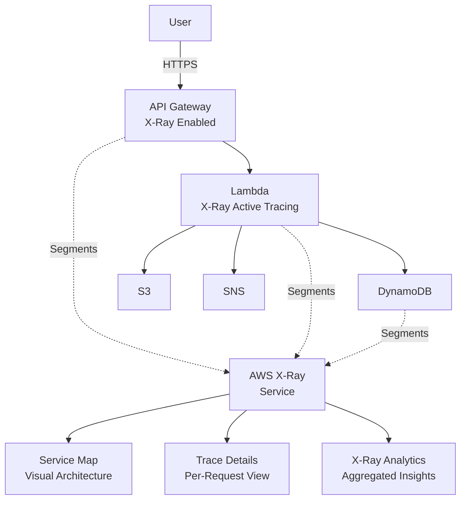
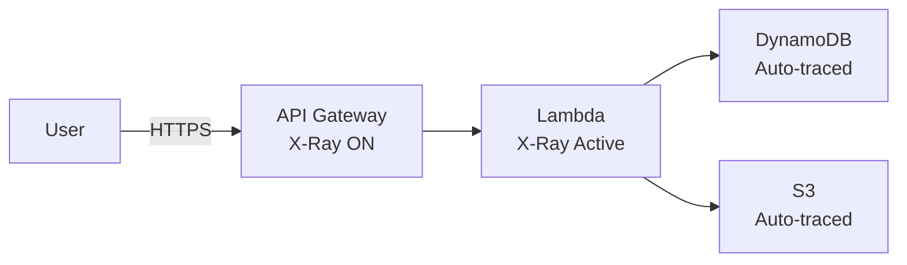
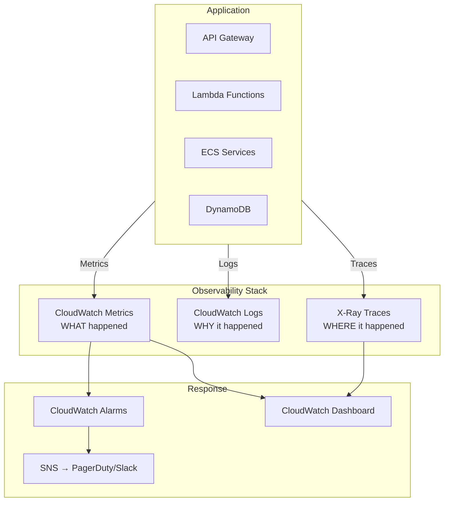

# Chapter 41 — AWS X-Ray

---

## Prerequisite Chapters
- Chapter 05 — Amazon CloudWatch (metrics, logs, observability fundamentals)
- Chapter 08 — AWS Lambda (serverless compute)
- Chapter 09 — Amazon API Gateway (REST APIs)
- Chapter 16 — Amazon ECS (container orchestration)

## Used In Production Practicals
- Practical 19 — API Gateway + Lambda + DynamoDB (tracing)
- Practical 34 — CloudWatch Monitoring (observability stack)
- Practical 15 — Flagship Production Architecture (end-to-end tracing)

---

## 1. Learning Objectives

By the end of this chapter, you will be able to:

1. **Explain** distributed tracing, why it matters, and how X-Ray fits into the observability stack.
2. **Instrument** Lambda functions, API Gateway, and ECS services with X-Ray.
3. **Analyze** service maps to identify latency bottlenecks and errors.
4. **Use** traces, segments, and subsegments to debug production issues.
5. **Configure** sampling rules to balance observability with cost.
6. **Integrate** X-Ray with CloudWatch for complete observability.
7. **Troubleshoot** slow API responses, timeout errors, and downstream failures.
8. **Answer** interview questions about distributed tracing and production observability.

---

## 2. What is AWS X-Ray?

AWS X-Ray is a distributed tracing service that helps you analyze and debug distributed applications. It traces requests as they travel through your application — from API Gateway to Lambda to DynamoDB (or any chain of services) — showing the exact path, timing, and errors for each request.

### The Three Pillars of Observability

```
Observability Stack:
├── Metrics    → CloudWatch Metrics  (WHAT happened — CPU, errors, latency)
├── Logs       → CloudWatch Logs     (WHY it happened — error details, stack traces)
└── Traces     → AWS X-Ray           (WHERE it happened — which service, which call)
```

### What X-Ray Shows You

```
User → API Gateway (12ms) → Lambda (145ms) → DynamoDB (23ms)
                                    ↓
                              S3 PutObject (89ms)
                                    ↓
                              SNS Publish (15ms) → FAILED (AccessDenied)
```

Without X-Ray, you'd see "API returned 500 in 300ms" and have to search through logs across multiple services. With X-Ray, you see the exact call chain, timing per hop, and where the failure occurred.

---

## 3. Why Do We Need It?

### The Distributed Systems Problem

```
Monolithic Application:
  One server, one log file, easy to debug
  
Distributed Application (Microservices):
  Request → API Gateway → Lambda-A → SQS → Lambda-B → DynamoDB → SNS
  
  Which service is slow?
  Where did the error occur?
  Why is this request taking 5 seconds?
  Which downstream dependency failed?
```

### Without X-Ray vs With X-Ray

| Scenario | Without X-Ray | With X-Ray |
|----------|--------------|------------|
| Slow API response | Search logs in 5 different services | Service map shows Lambda → DynamoDB call took 4.8s |
| Intermittent 500 errors | Correlate timestamps across CloudWatch log groups | Filter traces by status code 500, see exact failure point |
| New deployment causes latency | Compare CloudWatch metrics before/after | Compare trace latency distributions before/after |
| Third-party API timeout | Find the timeout in Lambda logs (maybe) | Subsegment shows external API call timed out at 29s |
| Root cause of cascade failure | Hours of log analysis | Service map shows red path through failing service |

---

## 4. Real-World Production Use Cases

### 1. Debugging Slow API Endpoints
A payment API takes 3 seconds instead of 200ms. X-Ray trace shows: Lambda → Secrets Manager (2.5s cold cache) → RDS (300ms) → SNS (50ms). Fix: cache the secret.

### 2. Error Rate Investigation
5% of requests fail with 500 errors. X-Ray filter: `http.status = 500`. Traces show DynamoDB `ProvisionedThroughputExceededException`. Fix: switch to on-demand capacity.

### 3. Microservice Dependency Mapping
New team member needs to understand the architecture. X-Ray service map automatically shows all service dependencies and their health status.

### 4. Performance Optimization
E-commerce checkout takes 4 seconds. X-Ray shows: Lambda (100ms) → DynamoDB (50ms) → Payment API (3.5s) → SNS (50ms). Bottleneck: external payment API. Fix: async payment processing with SQS.

### 5. Deployment Validation
After deploying a new Lambda version, compare X-Ray traces for the new version vs old version to ensure no latency regression.

---

## 5. Core Concepts

### Trace
A trace represents a single request as it travels through your entire application. Each trace has a unique **Trace ID** (e.g., `1-5f1d1a00-abcdef1234567890abcdef12`).

### Segment
A segment represents a unit of work done by a single service. Each service in the request path generates one segment.

```
Trace: 1-abc-123
├── Segment: API Gateway (12ms)
├── Segment: Lambda Function (145ms)
│   ├── Subsegment: DynamoDB GetItem (23ms)
│   ├── Subsegment: S3 PutObject (89ms)
│   └── Subsegment: SNS Publish (15ms) ← ERROR
└── Segment: DynamoDB (23ms)
```

### Subsegment
A subsegment represents a downstream call made within a segment. For example, a Lambda function making a DynamoDB call creates a subsegment for that call.

### Annotations
Key-value pairs **indexed** for search. Use for filtering traces.
```python
subsegment.put_annotation('customer_id', '12345')
subsegment.put_annotation('order_type', 'express')
# Now you can search: annotation.customer_id = "12345"
```

### Metadata
Key-value pairs **NOT indexed**. Use for additional debug data.
```python
subsegment.put_metadata('request_body', event['body'])
subsegment.put_metadata('response_payload', response)
```

### Service Map
A visual representation of your application architecture, automatically generated from traces. Shows services as nodes, connections as edges, latency, error rates, and throughput.

### Sampling
X-Ray doesn't trace every request (cost/performance). Sampling rules determine which requests to trace:
- **Default**: First request/second + 5% of additional requests
- **Custom**: Define rules based on service name, HTTP method, URL path

---

## 6. Architecture

### X-Ray in a Serverless Architecture



### How Traces Flow

```
1. API Gateway receives request, generates Trace ID
2. API Gateway sends segment to X-Ray daemon
3. API Gateway passes Trace ID to Lambda in header (X-Amzn-Trace-Id)
4. Lambda SDK picks up Trace ID, creates segment
5. Lambda makes DynamoDB call → SDK creates subsegment
6. Lambda makes S3 call → SDK creates subsegment
7. Lambda sends all segments/subsegments to X-Ray daemon
8. X-Ray assembles the complete trace
9. Service map and analytics updated
```

### Trace Header
```
X-Amzn-Trace-Id: Root=1-5f1d1a00-abcdef1234567890abcdef12;Parent=0123456789abcdef;Sampled=1

Root     = Trace ID (unique per request)
Parent   = Parent segment ID
Sampled  = 1 (trace this request) or 0 (don't trace)
```

---

## 7. Important Components

### 1. X-Ray SDK
Instrument your application code to create segments and subsegments:

```python
# Python - aws-xray-sdk
from aws_xray_sdk.core import xray_recorder
from aws_xray_sdk.core import patch_all

# Automatically trace all AWS SDK calls
patch_all()

@xray_recorder.capture('process_order')
def process_order(order_id):
    # This creates a subsegment named 'process_order'
    # All AWS SDK calls within are automatically traced
    dynamodb = boto3.resource('dynamodb')
    table = dynamodb.Table('Orders')
    response = table.get_item(Key={'order_id': order_id})
    return response
```

### 2. X-Ray Daemon
A background process that listens on UDP port 2000 and forwards traces to X-Ray API:

```
Application → (UDP 2000) → X-Ray Daemon → (HTTPS) → X-Ray API
```

- **Lambda**: Daemon runs automatically (no setup needed)
- **EC2**: Install and run the daemon as a service
- **ECS**: Run as a sidecar container

### 3. X-Ray API
- `PutTraceSegments` — upload trace data
- `GetTraceSummaries` — retrieve trace summaries
- `GetTraceGraph` — get service map data
- `GetServiceGraph` — get overall service map

### 4. Sampling Rules
Control which requests are traced:
```json
{
    "rule_name": "high-value-orders",
    "priority": 1,
    "fixed_rate": 1.0,
    "reservoir_size": 10,
    "service_name": "order-service",
    "http_method": "POST",
    "url_path": "/api/orders",
    "description": "Trace all order creation requests"
}
```

---

## 8. How It Works

### Instrumentation Methods

| Service | How to Enable X-Ray |
|---------|-------------------|
| **API Gateway** | Enable X-Ray tracing in stage settings |
| **Lambda** | Enable Active Tracing in function configuration |
| **EC2/ECS** | Install X-Ray SDK + daemon |
| **ECS Fargate** | Add X-Ray sidecar container |
| **SNS/SQS** | Automatically traced when called from instrumented services |
| **DynamoDB** | Automatically traced via AWS SDK patching |
| **S3** | Automatically traced via AWS SDK patching |
| **HTTP calls** | Patch requests/urllib with X-Ray SDK |

### Lambda Integration (Easiest)
```python
# Lambda function with X-Ray
import json
import boto3
from aws_xray_sdk.core import xray_recorder
from aws_xray_sdk.core import patch_all

# Patch all AWS SDK clients for automatic tracing
patch_all()

def lambda_handler(event, context):
    # This is automatically a segment
    
    # Add custom annotation for filtering
    xray_recorder.current_subsegment().put_annotation('user_id', event.get('user_id'))
    
    # DynamoDB call → automatic subsegment
    dynamodb = boto3.client('dynamodb')
    response = dynamodb.get_item(
        TableName='Users',
        Key={'user_id': {'S': event['user_id']}}
    )
    
    # Custom subsegment for business logic
    with xray_recorder.in_subsegment('process_user_data') as subsegment:
        user = response['Item']
        result = transform_user(user)
        subsegment.put_metadata('result', result)
    
    return {
        'statusCode': 200,
        'body': json.dumps(result)
    }
```

---

## 9. AWS Console Walkthrough

### Step 1 — Enable X-Ray on Lambda

1. Navigate to **Lambda Console** → select your function
2. **Configuration** → **Monitoring and operations tools**
3. Click **Edit**
4. Enable **Active tracing** under AWS X-Ray
5. Click **Save**
6. Ensure the Lambda execution role has `AWSXRayDaemonWriteAccess` policy

### Step 2 — Enable X-Ray on API Gateway

1. Navigate to **API Gateway Console** → select your API
2. Click **Stages** → select your stage (e.g., `prod`)
3. **Logs/Tracing** tab
4. Enable **X-Ray Tracing**
5. Click **Save Changes**
6. **Deploy API** to apply changes

### Step 3 — View Service Map

1. Navigate to **X-Ray Console** → **Service map**
2. Invoke your API a few times to generate traces
3. The service map shows:
   - Each service as a circle (API GW, Lambda, DynamoDB)
   - Lines showing request flow
   - Color coding: Green (healthy), Yellow (errors), Red (faults)
   - Latency and request count on hover

### Step 4 — Analyze a Trace

1. Navigate to **X-Ray Console** → **Traces**
2. Click on a trace ID
3. View the **trace timeline** showing each segment/subsegment with timing
4. Click individual segments to see:
   - Duration
   - HTTP status code
   - Error details
   - Annotations and metadata
   - Exceptions and stack traces

---

## 10. AWS CLI Commands

### Enable X-Ray on Lambda
```bash
aws lambda update-function-configuration \
    --function-name my-api-handler \
    --tracing-config Mode=Active
```

### Get Trace Summaries
```bash
aws xray get-trace-summaries \
    --start-time $(date -d '-1 hour' -u +%s) \
    --end-time $(date -u +%s) \
    --sampling \
    --query 'TraceSummaries[*].{Id:Id,Duration:Duration,Status:Http.HttpStatus}'
```

### Get Trace Details
```bash
aws xray batch-get-traces \
    --trace-ids "1-5f1d1a00-abcdef1234567890abcdef12"
```

### Get Service Graph
```bash
aws xray get-service-graph \
    --start-time $(date -d '-1 hour' -u +%s) \
    --end-time $(date -u +%s)
```

### Create Sampling Rule
```bash
aws xray create-sampling-rule \
    --sampling-rule '{
        "RuleName": "trace-all-errors",
        "Priority": 1,
        "FixedRate": 1.0,
        "ReservoirSize": 100,
        "ServiceName": "*",
        "ServiceType": "*",
        "Host": "*",
        "HTTPMethod": "*",
        "URLPath": "*",
        "ResourceARN": "*",
        "Version": 1
    }'
```

### Filter Traces by Error
```bash
# Get traces with 5xx errors
aws xray get-trace-summaries \
    --start-time $(date -d '-1 hour' -u +%s) \
    --end-time $(date -u +%s) \
    --filter-expression 'responsetime > 3 AND http.status = 500'
```

---

## 11. Hands-On Practical

### Practical: Tracing a Serverless API with X-Ray

#### Objective
Instrument a Lambda-backed API to trace requests end-to-end and identify performance bottlenecks.

#### Architecture


#### Step 1 — Create Lambda with X-Ray SDK
```python
# lambda_function.py
import json
import boto3
import time
from aws_xray_sdk.core import xray_recorder
from aws_xray_sdk.core import patch_all

patch_all()

dynamodb = boto3.resource('dynamodb')
s3 = boto3.client('s3')

def lambda_handler(event, context):
    order_id = event.get('queryStringParameters', {}).get('order_id', '123')
    
    # Annotate for searchability
    xray_recorder.current_subsegment().put_annotation('order_id', order_id)
    
    # DynamoDB read (auto-traced subsegment)
    table = dynamodb.Table('Orders')
    order = table.get_item(Key={'order_id': order_id})
    
    # Custom business logic subsegment
    with xray_recorder.in_subsegment('calculate_total') as subsegment:
        time.sleep(0.1)  # Simulate processing
        total = calculate_total(order.get('Item', {}))
        subsegment.put_metadata('total', total)
    
    # S3 write (auto-traced subsegment)
    s3.put_object(
        Bucket='order-receipts',
        Key=f'receipts/{order_id}.json',
        Body=json.dumps({'order_id': order_id, 'total': total})
    )
    
    return {
        'statusCode': 200,
        'body': json.dumps({'order_id': order_id, 'total': total})
    }

def calculate_total(order):
    return sum(item.get('price', 0) for item in order.get('items', []))
```

#### Step 2 — Deploy and Enable Tracing
```bash
# Enable X-Ray on Lambda
aws lambda update-function-configuration \
    --function-name order-api \
    --tracing-config Mode=Active

# Enable X-Ray on API Gateway stage
aws apigateway update-stage \
    --rest-api-id abc123 \
    --stage-name prod \
    --patch-operations op=replace,path=/tracingEnabled,value=true
```

#### Step 3 — Generate Traffic
```bash
# Send test requests
for i in $(seq 1 20); do
    curl "https://abc123.execute-api.ap-south-1.amazonaws.com/prod/orders?order_id=$i"
    sleep 1
done
```

#### Step 4 — Analyze in X-Ray Console
1. Open X-Ray Console → Service Map
2. Observe API Gateway → Lambda → DynamoDB → S3 flow
3. Click on Lambda node to see latency distribution
4. Click **View traces** to see individual request details
5. Filter: `annotation.order_id = "5"` to find a specific order

#### Validation
- Service map shows all 4 services connected
- Traces show timing breakdown for each hop
- Custom annotation `order_id` is searchable
- Custom subsegment `calculate_total` appears in trace timeline

---

## 12. Production Architecture

### Complete Observability Stack



### Production X-Ray Configuration
```
Sampling Strategy:
  - All errors (500s): 100% sampling
  - Health checks: 0% sampling (exclude noise)
  - High-value endpoints (payments): 100% sampling
  - General traffic: 5% sampling

Annotations (indexed, searchable):
  - customer_id
  - order_id  
  - environment
  - api_version

Metadata (not indexed, for debugging):
  - request_body
  - response_payload
  - processing_details
```

---

## 13. Security Best Practices

1. **Least-privilege IAM** — Lambda execution role needs only `xray:PutTraceSegments` and `xray:PutTelemetryRecords`
2. **Don't trace sensitive data** — avoid putting PII (passwords, credit cards) in annotations or metadata
3. **Use annotations wisely** — annotations are indexed and searchable, keep them clean
4. **Sampling rules** — don't trace 100% in production (cost + performance)
5. **Encrypt traces** — X-Ray encrypts trace data at rest with AWS-managed keys (or KMS CMK)
6. **IAM for trace access** — restrict who can view traces (may contain business data)
7. **VPC considerations** — X-Ray daemon on EC2/ECS needs outbound HTTPS access

---

## 14. High Availability

- X-Ray is a **fully managed AWS service** — no infrastructure to manage
- Traces are stored for **30 days** (configurable)
- No single point of failure — AWS manages availability
- X-Ray is **regional** — traces are stored in the region where they're generated
- For multi-region applications, view traces in each region's X-Ray console

---

## 15. Scalability

- X-Ray scales automatically with your application
- Default **sampling** prevents overwhelming the service at high traffic
- Custom sampling rules let you control trace volume
- No practical limit on number of services or traces
- X-Ray Groups allow organizing traces by application/environment

---

## 16. Monitoring & Observability

### X-Ray + CloudWatch Integration

```bash
# X-Ray publishes metrics to CloudWatch:
# - TraceSummaries
# - ResponseTime (p50, p90, p99)
# - ErrorRate
# - FaultRate

# Create CloudWatch alarm on X-Ray error rate
aws cloudwatch put-metric-alarm \
    --alarm-name "xray-high-error-rate" \
    --namespace "AWS/X-Ray" \
    --metric-name "FaultRate" \
    --statistic Average \
    --period 300 \
    --threshold 5 \
    --comparison-operator GreaterThanThreshold \
    --evaluation-periods 2 \
    --alarm-actions $SNS_ARN
```

### X-Ray Insights
Automated anomaly detection that identifies:
- Sudden latency spikes
- Error rate increases
- New error patterns

---

## 17. Cost Optimization

| Item | Cost |
|------|------|
| First 100,000 traces recorded/month | Free |
| Additional traces recorded | $5.00 per million |
| First 1,000,000 traces retrieved/month | Free |
| Additional traces retrieved | $0.50 per million |
| Traces scanned | $0.50 per million |

### Cost Tips
1. **Use sampling** — don't trace 100% of requests in production
2. **Exclude health checks** — create a sampling rule with 0% rate for `/health` endpoint
3. **Focus sampling on critical paths** — 100% for payments, 5% for reads
4. **Set appropriate trace retention** — default 30 days, consider if you need that long
5. **Use X-Ray Groups** — focus analysis on specific services, not everything

---

## 18. Disaster Recovery

- X-Ray traces are stored regionally — not replicated cross-region
- In a DR scenario, the DR region generates its own traces
- Historical traces in the failed region may be unavailable during outage
- X-Ray data is not considered critical DR data (it's diagnostic, not application data)
- Focus DR efforts on application data (RDS, DynamoDB, S3), not traces

---

## 19. Troubleshooting

### Problem 1: Traces Not Appearing in X-Ray Console

**Investigation**:
```bash
# 1. Check Lambda has active tracing enabled
aws lambda get-function-configuration \
    --function-name my-function \
    --query 'TracingConfig.Mode'

# 2. Check IAM role has X-Ray permissions
aws iam list-attached-role-policies \
    --role-name my-lambda-role

# 3. Check if API Gateway stage has tracing enabled
aws apigateway get-stage \
    --rest-api-id abc123 \
    --stage-name prod \
    --query 'tracingEnabled'
```

**Common Causes**:
- Active tracing not enabled on Lambda
- IAM role missing `AWSXRayDaemonWriteAccess`
- API Gateway tracing not enabled
- Sampling rule excluding your requests
- Looking in wrong region

### Problem 2: Incomplete Traces (Missing Segments)

**Cause**: Service not instrumented or trace context not propagated.

**Fix**:
- Ensure all services in the chain have X-Ray enabled
- Use `patch_all()` to trace all AWS SDK calls
- For HTTP calls, use the X-Ray patched HTTP client
- Check that `X-Amzn-Trace-Id` header is passed between services

### Problem 3: High X-Ray Costs

**Fix**: Adjust sampling rules:
```bash
# Create rule to sample only 1% of GET requests
aws xray create-sampling-rule \
    --sampling-rule '{
        "RuleName": "low-rate-gets",
        "Priority": 100,
        "FixedRate": 0.01,
        "ReservoirSize": 1,
        "ServiceName": "*",
        "HTTPMethod": "GET",
        "URLPath": "*",
        "Host": "*",
        "ServiceType": "*",
        "ResourceARN": "*",
        "Version": 1
    }'
```

---

## 20. Common Production Problems

| # | Problem | Root Cause | Prevention |
|---|---------|------------|------------|
| 1 | No traces appear | Tracing not enabled or IAM missing | Enable tracing + add IAM policy |
| 2 | Incomplete traces | Missing instrumentation in chain | patch_all() + enable on all services |
| 3 | High costs | Tracing 100% of traffic | Use sampling rules (5% default) |
| 4 | Sampling misses errors | Default sampling too low for errors | Create rule: 100% for status >= 500 |
| 5 | Can't search traces | Not using annotations | Add annotations for key identifiers |
| 6 | Trace data expires | 30-day retention | Export critical traces to S3 |
| 7 | Cold start noise | Lambda cold starts inflate latency | Filter out initialization segments |
| 8 | Performance overhead | Too much instrumentation | Instrument only critical paths |

---

## 21. Real-World Scenario

### Scenario: Debugging a Slow Checkout API

**Background**: Customers report that the checkout page takes 8 seconds to load. The team has no idea which service is slow.

**Architecture**: API Gateway → Lambda → DynamoDB + Stripe API + SNS + SQS

**X-Ray Investigation**:
1. Open X-Ray Console → Traces → Filter: `http.url CONTAINS "/checkout"`
2. Sort by duration → find a 8.2s trace
3. Click on the trace → timeline shows:
   ```
   API Gateway:     12ms
   Lambda:          8.1s
   ├── DynamoDB:    45ms   ✓ Fast
   ├── Stripe API:  7.8s   ← BOTTLENECK
   ├── SNS:         120ms  ✓ OK
   └── SQS:         35ms   ✓ Fast
   ```
4. Root cause: Stripe API taking 7.8s (usually 200ms)
5. Check Stripe status page → ongoing incident in their EU region

**Fix**: 
- Short-term: Increase Lambda timeout to 30s, add retry with exponential backoff
- Long-term: Make Stripe call async (SQS → separate Lambda), return to user immediately
- Result: Checkout drops from 8s to 300ms

---

## 22. Interview Questions

### Basic Questions (10)

**Q1: What is AWS X-Ray?**
A: X-Ray is a distributed tracing service that traces requests across multiple AWS services. It shows the request path, timing per service, and error locations, helping debug performance issues in microservice architectures.

**Q2: What is a trace in X-Ray?**
A: A trace represents a single end-to-end request as it travels through your application. It contains multiple segments (one per service) and subsegments (downstream calls within a service).

**Q3: What is the difference between a segment and a subsegment?**
A: A segment represents work done by a single service (e.g., Lambda function execution). A subsegment represents a downstream call made within that service (e.g., Lambda calling DynamoDB).

**Q4: What are annotations vs metadata?**
A: Annotations are indexed key-value pairs used for searching/filtering traces (e.g., `customer_id=123`). Metadata is non-indexed data attached for debugging (e.g., full request body). Use annotations for searchable fields.

**Q5: What is the X-Ray daemon?**
A: A background process that receives trace data from application SDKs (UDP port 2000) and forwards it to the X-Ray API (HTTPS). Lambda runs the daemon automatically. On EC2/ECS, you must install it.

**Q6: How do you enable X-Ray on Lambda?**
A: Enable Active Tracing in Lambda function configuration, and add `AWSXRayDaemonWriteAccess` policy to the execution role. Use `patch_all()` from the X-Ray SDK to trace AWS SDK calls.

**Q7: What is the X-Ray service map?**
A: An automatically generated visual diagram showing all services in your application, their connections, latency, error rates, and throughput. It provides a real-time architectural view.

**Q8: What is sampling in X-Ray?**
A: Sampling determines which requests are traced. Default: first request per second + 5% of additional requests. Custom rules can increase/decrease sampling based on service, URL, method, etc.

**Q9: How long are X-Ray traces retained?**
A: 30 days. After that, traces are automatically deleted. Export critical traces to S3 for longer retention.

**Q10: What are the three pillars of observability?**
A: Metrics (CloudWatch — what happened), Logs (CloudWatch Logs — why it happened), Traces (X-Ray — where it happened in the request flow).

### Intermediate Questions (10)

**Q11: How do you trace HTTP calls to external APIs?**
A: Use the X-Ray SDK to patch the HTTP library: `from aws_xray_sdk.ext.httplib import patch; patch()` or `patch_all()`. This creates subsegments for all outbound HTTP calls, showing URL, status code, and latency.

**Q12: How does X-Ray work with ECS?**
A: Run the X-Ray daemon as a sidecar container in the task definition. Configure the application container to send traces to the daemon container. Alternatively, use the OpenTelemetry collector.

**Q13: How do you trace requests across multiple Lambda functions connected by SQS?**
A: X-Ray automatically propagates the trace context through SQS messages. When Lambda-A sends to SQS and Lambda-B polls from SQS, both appear in the same trace. Ensure both Lambdas have Active Tracing enabled.

**Q14: What filter expressions can you use in X-Ray?**
A: `responsetime > 5` (slow requests), `http.status = 500` (errors), `service("payment-service")` (specific service), `annotation.customer_id = "123"` (custom annotation), `fault = true` (5xx errors).

**Q15: How do you handle X-Ray in a multi-account AWS setup?**
A: Configure cross-account X-Ray access using IAM roles. The central observability account assumes roles in application accounts to read traces. Alternatively, use CloudWatch cross-account observability.

**Q16: What is X-Ray Insights?**
A: An automated anomaly detection feature that identifies performance issues without manual investigation. It detects sudden latency increases, error rate spikes, and new error patterns, then notifies you.

**Q17: How do you create custom subsegments?**
A: Use `xray_recorder.in_subsegment('name')` context manager or `xray_recorder.begin_subsegment('name')` / `end_subsegment()`. Useful for tracing business logic, external API calls, or computational steps.

**Q18: What is the performance impact of X-Ray?**
A: Minimal. The SDK adds microseconds of overhead per segment. The daemon uses ~1% CPU and 32MB memory. Sampling ensures only a fraction of requests are fully traced. In production, the overhead is negligible.

**Q19: How do you trace Lambda cold starts vs warm starts?**
A: X-Ray shows Lambda initialization time as a separate "Initialization" subsegment in the trace. Cold starts include this initialization. Warm starts skip it. You can filter traces by initialization time to analyze cold start frequency.

**Q20: Can X-Ray replace CloudWatch Logs?**
A: No. They're complementary. X-Ray shows the request flow and timing but not detailed log messages. CloudWatch Logs show detailed error messages and stack traces. Use X-Ray to find the failing service, then CloudWatch Logs for the error details.

### Advanced Questions (10)

**Q21: Design an observability strategy for a 20-microservice application.**
A: Use X-Ray for distributed tracing across all services. CloudWatch Metrics for dashboards and alarms. CloudWatch Logs for structured logging with correlation IDs. Custom X-Ray sampling: 100% for errors, 10% for normal traffic. Annotations on customer_id and request_id for trace correlation. X-Ray Insights for automated anomaly detection. CloudWatch dashboards combining metrics + X-Ray service map.

**Q22: Your X-Ray traces show high latency but CloudWatch Lambda duration is normal. Why?**
A: The latency is in API Gateway (cold start, authorization, throttling) or network (CloudFront, WAF). X-Ray shows the full request path including non-Lambda services. CloudWatch Lambda duration only measures function execution. Check API Gateway segment for integration latency.

**Q23: How do you implement end-to-end tracing for a hybrid cloud application?**
A: Propagate the `X-Amzn-Trace-Id` header between AWS and on-premises services. On-premises services use the X-Ray SDK (available for Java, Python, Node, .NET, Go, Ruby) and run the X-Ray daemon locally. The daemon sends traces to X-Ray via HTTPS. Alternatively, use OpenTelemetry with X-Ray exporter.

**Q24: Your service map shows a "Client" node you don't recognize. What is it?**
A: The "Client" node represents the requestor that initiated the trace. If X-Ray can't identify the upstream service, it shows "Client". This could be a browser, mobile app, or an un-instrumented service. Instrument the upstream service to see its identity.

**Q25: How do you correlate X-Ray traces with CloudWatch Logs?**
A: Include the X-Ray Trace ID in log messages: `logger.info(f"Processing order", extra={'trace_id': xray_recorder.current_segment().trace_id})`. In CloudWatch Logs Insights, query: `filter @message like /TRACE_ID/`. X-Ray console also links to CloudWatch Logs for Lambda functions.

**Q26: Design sampling rules for a payment processing system.**
A: Rule 1 (Priority 1): All POST /payments → 100% sampling (critical path). Rule 2 (Priority 2): All 4xx/5xx responses → 100% sampling (errors). Rule 3 (Priority 10): GET /health → 0% sampling (noise). Rule 4 (Priority 100): All other traffic → 5% sampling (baseline visibility).

**Q27: How does X-Ray handle asynchronous architectures (EventBridge → Lambda)?**
A: X-Ray propagates trace context through EventBridge events. When Lambda publishes to EventBridge and another Lambda consumes the event, both appear in the same trace. This enables tracing event-driven architectures end-to-end.

**Q28: Your X-Ray shows Lambda → DynamoDB latency of 500ms, but DynamoDB metrics show 5ms average. Why?**
A: X-Ray measures end-to-end call time including network, serialization, and SDK overhead. DynamoDB metrics measure server-side processing only. The difference is network latency between Lambda and DynamoDB. If Lambda is in a VPC, check NAT Gateway routing. If not in VPC, this is unusual — check for retries.

**Q29: How would you detect and alert on a new type of error using X-Ray?**
A: Enable X-Ray Insights with notifications. It automatically detects new error patterns. Alternatively, create a CloudWatch Logs Insights query on X-Ray data that alerts when a new error message appears. Use EventBridge rules to trigger alerts for X-Ray Insight notifications.

**Q30: Your traces show intermittent 10-second spikes in Lambda execution. What could cause this?**
A: 1) Lambda cold starts (initialization + dependency loading). 2) VPC-attached Lambda ENI creation (less common now). 3) External API timeouts (check subsegments). 4) DynamoDB throttling with retries (check DynamoDB subsegment). 5) Large payload processing. Check the trace timeline to see which subsegment is slow during the spike.

### Scenario-Based Questions (10)

**Q31: API latency increased from 200ms to 2s after a deployment. How do you investigate?**
A: Compare X-Ray traces before and after deployment. Filter by deployment timestamp. Check if a new subsegment appeared (new downstream call). Check if an existing subsegment's latency increased. Common cause: new DynamoDB query without proper indexes.

**Q32: 2% of requests fail with "Timeout". How do you find the root cause?**
A: Filter X-Ray traces: `fault = true AND responsetime > 29`. View traces to see which subsegment timed out. Check if it's always the same downstream service. Common cause: Lambda timeout (29s for API GW proxy), external API timeout, or DynamoDB capacity issues.

**Q33: Your service map shows a service with a yellow ring. What does it mean?**
A: Yellow indicates errors (4xx HTTP responses). Red indicates faults (5xx responses). Green is healthy. Click the yellow service to see error traces and identify the cause — often authorization failures, validation errors, or client-side issues.

**Q34: How do you troubleshoot a "cold start" problem?**
A: Filter traces by Lambda initialization time > 0. Analyze the initialization subsegment. Common causes: large deployment package, many imports, VPC attachment (less common now). Solutions: Provisioned Concurrency, smaller packages, lazy imports, Graviton2 (faster init).

**Q35: Your traces show Lambda→SQS→Lambda but the second Lambda isn't in the trace. Why?**
A: The second Lambda may not have Active Tracing enabled. Or, the SQS message might have lost the trace header (e.g., if a non-instrumented service re-publishes). Enable tracing on the consumer Lambda and ensure trace context propagation.

**Q36: How do you use X-Ray to validate a canary deployment?**
A: Create an X-Ray Group filtering by the canary function version/alias. Compare latency distributions between canary and stable. Check error rates. If canary shows higher latency or errors, roll back. Automate with CloudWatch alarms on X-Ray metrics.

**Q37: Customer reports "Order #12345 failed". How do you find the trace?**
A: Search traces with annotation filter: `annotation.order_id = "12345"`. This requires your code to have added `xray_recorder.put_annotation('order_id', '12345')`. View the trace to see exactly where in the chain the failure occurred.

**Q38: Your X-Ray costs jumped from $50 to $500 this month. Why?**
A: Traffic increased or sampling rate is too high. Check trace volume. Review sampling rules — ensure health check endpoints are excluded. Reduce general traffic sampling from default to 1-2%. Keep 100% sampling only for errors and critical paths.

**Q39: How do you trace a request from CloudFront to Lambda to DynamoDB?**
A: CloudFront doesn't natively integrate with X-Ray. Enable X-Ray on API Gateway (receives request from CloudFront). X-Ray traces from API Gateway → Lambda → DynamoDB. For CloudFront latency, use CloudFront access logs and CloudWatch metrics.

**Q40: Your team is adopting OpenTelemetry. Can it work with X-Ray?**
A: Yes. AWS Distro for OpenTelemetry (ADOT) is an AWS-supported OpenTelemetry distribution that exports traces to X-Ray. Use the ADOT Lambda layer or ECS sidecar. This provides vendor-neutral instrumentation while using X-Ray as the backend.

---

## 23. Scenario-Based Interview Questions

*(Covered in section 22 above — Q31 through Q40)*

---

## 24. Common Mistakes

1. **Not enabling tracing on all services** — incomplete traces are useless for debugging
2. **Not using annotations** — without annotations, you can't search for specific requests
3. **Putting PII in annotations/metadata** — traces may be accessed by multiple team members
4. **100% sampling in production** — unnecessary cost and slight performance overhead
5. **Ignoring the service map** — it's the most powerful X-Ray feature for architecture understanding
6. **Not correlating with logs** — X-Ray tells you WHERE, logs tell you WHY
7. **Forgetting IAM permissions** — Lambda needs `AWSXRayDaemonWriteAccess`
8. **Not patching AWS SDK** — forgetting `patch_all()` means no automatic subsegments
9. **Tracing health checks** — adds noise and cost without value
10. **Not using X-Ray Groups** — organize traces by environment/application for clarity

---

## 25. Production Checklist

- [ ] X-Ray enabled on API Gateway stages
- [ ] Lambda Active Tracing enabled
- [ ] Lambda execution role has `AWSXRayDaemonWriteAccess`
- [ ] X-Ray SDK installed and `patch_all()` called in application code
- [ ] Custom annotations added for key business identifiers (order_id, user_id)
- [ ] Sampling rules configured (100% errors, 5% normal traffic)
- [ ] Health check endpoints excluded from sampling
- [ ] X-Ray Insights enabled for anomaly detection
- [ ] ECS sidecar daemon configured (if using ECS)
- [ ] CloudWatch dashboard includes X-Ray service map widget
- [ ] Trace-to-log correlation implemented
- [ ] X-Ray Group created per environment (prod, staging)
- [ ] Team trained on using service map and trace analysis
- [ ] Cost monitoring for X-Ray usage

---

## 26. Chapter Summary

AWS X-Ray completes the observability stack alongside CloudWatch Metrics and Logs. Key takeaways:

1. **Three pillars**: Metrics (WHAT), Logs (WHY), Traces (WHERE) — you need all three
2. **Service map is your architecture diagram** — auto-generated, always current, shows health
3. **Annotations are your search index** — add them for customer_id, order_id, environment
4. **Sampling controls cost** — 100% for errors, 5% for normal traffic
5. **patch_all() is essential** — without it, AWS SDK calls aren't traced
6. **Lambda integration is the easiest** — just enable Active Tracing + IAM
7. **X-Ray finds the bottleneck** — in a 5-service chain, it shows which service is slow
8. **Correlate with CloudWatch Logs** — X-Ray shows WHERE, Logs show the error details
9. **Use for deployment validation** — compare traces before and after to catch regressions
10. **Production debugging is impossible without tracing** — invest in instrumentation early

X-Ray transforms production debugging from "searching through logs for hours" to "clicking on the slow segment in 30 seconds."

---
---

# 🔬 Practical Lab 28 — X-Ray Distributed Tracing

## Lab Overview
| Item | Detail |
|------|--------|
| **Difficulty** | Intermediate |
| **Duration** | 30 minutes |
| **Cost** | Free tier: 100K traces/month |
| **Prerequisites** | Practical 34 (API Gateway + Lambda) |
| **Lab Environment** | Environment 7 — Storage & Security |

## Business Scenario
> Your serverless API (API Gateway → Lambda → DynamoDB) is experiencing intermittent latency. You need to trace requests end-to-end to identify the bottleneck.

### Step 1 — Enable X-Ray on API Gateway
1. API Gateway → **Stages** → Select stage → **Logs/Tracing** → ✅ Enable X-Ray

📸 **Screenshot 01** — X-Ray Enabled on API Gateway

### Step 2 — Enable X-Ray on Lambda
1. Lambda → **Configuration** → **Monitoring** → ✅ Active tracing

📸 **Screenshot 02** — X-Ray Active Tracing on Lambda

### Step 3 — Generate Traffic and View Traces
```bash
for i in {1..20}; do curl -s https://api-id.execute-api.ap-south-1.amazonaws.com/prod/items; done
```

1. **X-Ray Console** → **Service map** → See end-to-end flow

📸 **Screenshot 03** — X-Ray Service Map
> **What you should see**: Visual map: API Gateway → Lambda → DynamoDB with latency for each hop

📸 **Screenshot 04** — Individual Trace Detail
> **What you should see**: Trace showing each segment's duration, status, and any errors

🎯 **Interview Insight**: "How do you debug latency in a serverless application?"
> **Strong answer**: "Enable X-Ray on API Gateway and Lambda. X-Ray traces each request through the entire call chain, showing latency per service. Look for: cold starts (Lambda initialization), DynamoDB throttling, timeout configurations. Service map gives the visual overview."
