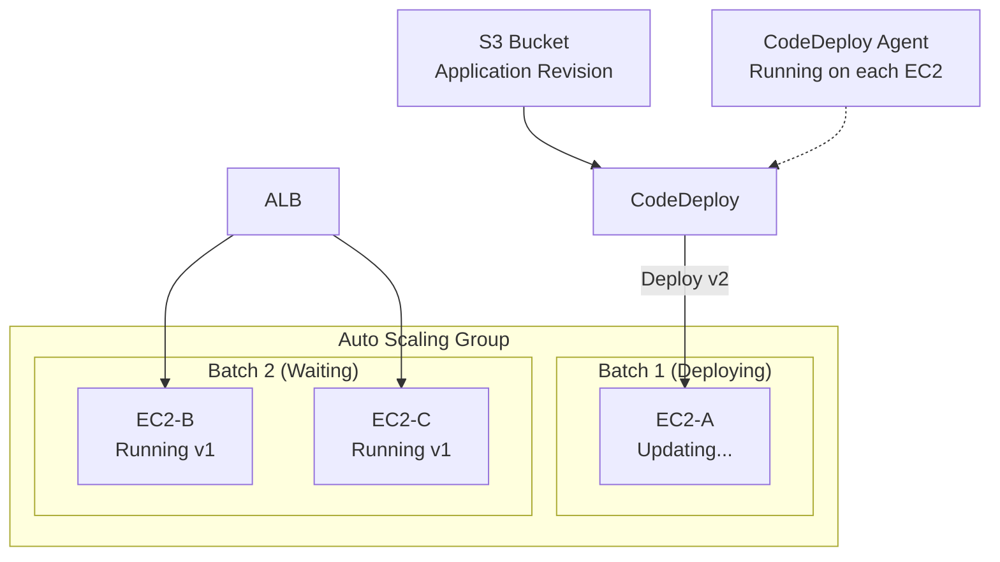
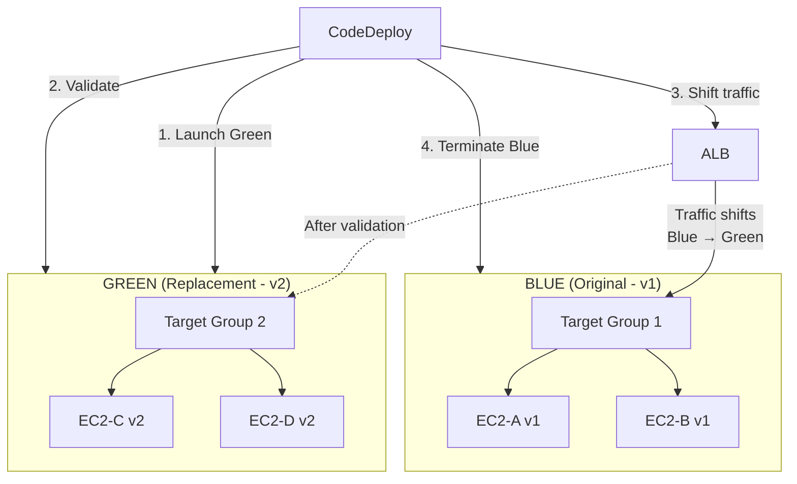
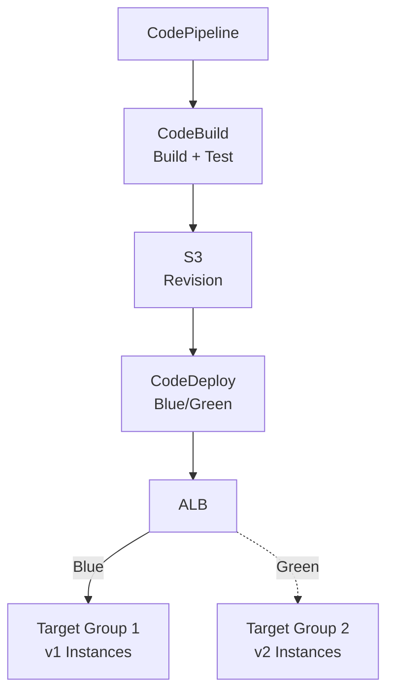
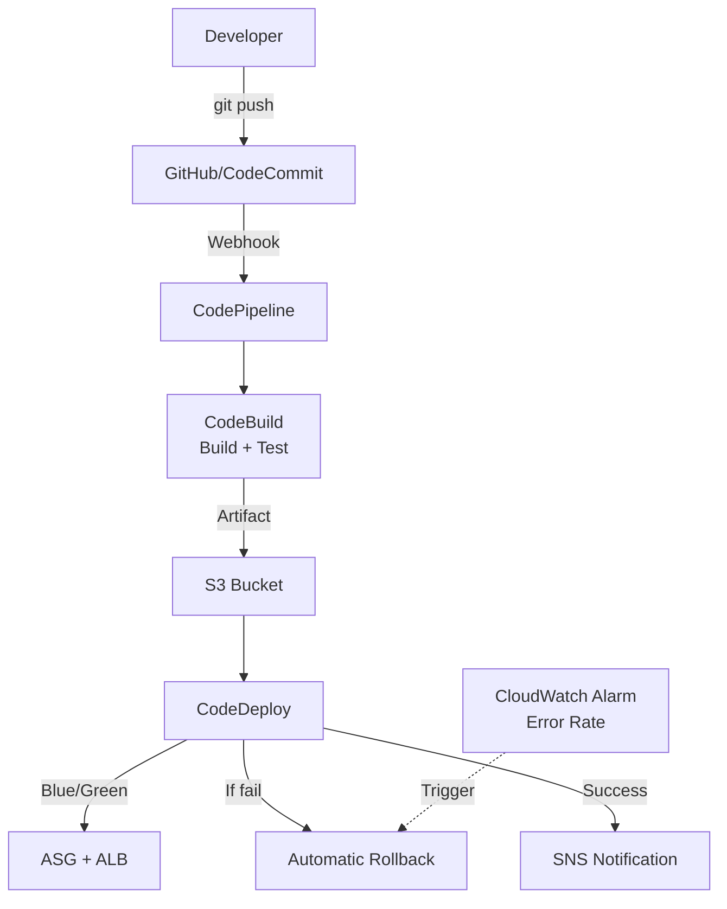

# Chapter 42 — AWS CodeDeploy

---

## Prerequisite Chapters
- Chapter 01 — AWS IAM (roles, policies, service roles)
- Chapter 03 — Amazon EC2 (instances, AMIs, user data)
- Chapter 16 — Amazon ECS (container services)
- Chapter 18 — Elastic Load Balancing (ALB, target groups)
- Chapter 19 — AWS CodeBuild (build automation)
- Chapter 20 — AWS CodePipeline (pipeline orchestration)
- Chapter 39 — Amazon EC2 Auto Scaling (ASGs)

## Used In Production Practicals
- Practical 31 — CodeBuild CI
- Practical 32 — CodePipeline CI/CD
- Practical 33 — Container CI/CD

---

## 1. Learning Objectives

By the end of this chapter, you will be able to:

1. **Explain** what CodeDeploy is and how it fits into the CI/CD pipeline.
2. **Configure** applications, deployment groups, and deployment configurations.
3. **Write** AppSpec files for EC2 and ECS deployments.
4. **Implement** in-place and blue/green deployment strategies.
5. **Integrate** CodeDeploy with CodePipeline, ALB, and Auto Scaling Groups.
6. **Configure** automatic rollback on deployment failure.
7. **Troubleshoot** failed deployments, stuck instances, and lifecycle hook errors.
8. **Answer** interview questions about deployment strategies and CI/CD.

---

## 2. What is AWS CodeDeploy?

AWS CodeDeploy is a fully managed deployment service that automates application deployments to EC2 instances, ECS services, Lambda functions, and on-premises servers. It eliminates manual deployment steps, reduces downtime, and enables consistent, repeatable deployments.

### Where CodeDeploy Fits in CI/CD

```
Source (Git)
    ↓
CodePipeline (Orchestration)
    ↓
CodeBuild (Build + Test)
    ↓
CodeDeploy (Deploy)     ← This chapter
    ↓
EC2 / ECS / Lambda
```

### Deployment Targets

| Target | Strategy | How |
|--------|----------|-----|
| **EC2 instances** | In-place or Blue/Green | CodeDeploy agent on instances |
| **ECS (Fargate/EC2)** | Blue/Green only | Task definition update |
| **Lambda** | Traffic shifting | Alias routing |
| **On-premises** | In-place | CodeDeploy agent on servers |

---

## 3. Why Do We Need It?

### Without CodeDeploy
```
1. SSH into each server
2. Stop the application
3. Download new code
4. Install dependencies
5. Run database migrations
6. Start the application
7. Verify health
8. Repeat for every server
9. If something fails → manual rollback (risky)
```

### With CodeDeploy
```
1. Push code → CodePipeline triggers
2. CodeBuild builds artifact
3. CodeDeploy deploys to all instances automatically
4. Lifecycle hooks run custom scripts at each stage
5. Health checks validate each instance
6. If failure → automatic rollback
7. Zero SSH, zero manual steps
```

### Deployment Strategies Comparison

| Strategy | Downtime | Risk | Speed | Use Case |
|----------|----------|------|-------|----------|
| **In-Place** | Brief (per instance) | Medium | Fast | Dev/staging |
| **Blue/Green** | Zero | Low | Medium | Production |
| **Rolling** | Zero | Medium | Medium | Production (cost-sensitive) |
| **Canary** | Zero | Lowest | Slow | Critical production |

---

## 4. Real-World Production Use Cases

### 1. Web Application Deployment
Deploy a new version of a Node.js/Python/Java application to an ASG of EC2 instances behind an ALB with zero downtime using blue/green deployment.

### 2. Container Deployment
Update an ECS service with a new Docker image. CodeDeploy performs blue/green deployment by shifting traffic between target groups.

### 3. Microservice Updates
Deploy updates to individual microservices without affecting other services. Each microservice has its own deployment group and AppSpec.

### 4. Database Migration with Deployment
Use lifecycle hooks to run database migrations before the new application version starts serving traffic.

### 5. Multi-Region Deployment
Deploy the same application version across multiple regions sequentially, validating each region before proceeding.

---

## 5. Core Concepts

### Application
A logical grouping that identifies what you're deploying. Example: `my-web-app`.

### Deployment Group
Defines WHERE to deploy — a set of EC2 instances (by tags or ASG), ECS service, or Lambda function.

### Deployment Configuration
Defines HOW to deploy — how many instances to update at once:

| Configuration | Description |
|--------------|-------------|
| `CodeDeployDefault.OneAtATime` | Deploy to one instance at a time |
| `CodeDeployDefault.HalfAtATime` | Deploy to half the instances at a time |
| `CodeDeployDefault.AllAtOnce` | Deploy to all instances simultaneously |
| Custom | Define min healthy instances percentage |

### Revision
The application content to deploy — code, scripts, and AppSpec file stored in S3 or GitHub.

### AppSpec File
The deployment blueprint that tells CodeDeploy what to do at each stage:

```yaml
# appspec.yml (EC2/On-Premises)
version: 0.0
os: linux
files:
  - source: /
    destination: /var/www/myapp
hooks:
  BeforeInstall:
    - location: scripts/stop_server.sh
      timeout: 300
  AfterInstall:
    - location: scripts/install_dependencies.sh
      timeout: 300
  ApplicationStart:
    - location: scripts/start_server.sh
      timeout: 300
  ValidateService:
    - location: scripts/health_check.sh
      timeout: 300
```

### Lifecycle Hooks (EC2 In-Place)
```
ApplicationStop
    ↓ Stop the running application
DownloadBundle
    ↓ Download revision from S3/GitHub
BeforeInstall
    ↓ Pre-installation tasks (backup, decrypt)
Install
    ↓ Copy files to destination
AfterInstall
    ↓ Post-installation tasks (permissions, config)
ApplicationStart
    ↓ Start the application
ValidateService
    ↓ Run health checks
```

### Blue/Green Lifecycle (EC2)
```
BeforeBlockTraffic
    ↓ Pre-deregistration tasks on ORIGINAL instances
BlockTraffic
    ↓ Deregister ORIGINAL instances from ALB
AfterBlockTraffic
    ↓ Post-deregistration tasks on ORIGINAL instances
    
BeforeInstall
    ↓ Pre-installation on REPLACEMENT instances
Install
    ↓ Copy files on REPLACEMENT instances
AfterInstall
    ↓ Post-installation on REPLACEMENT instances
ApplicationStart
    ↓ Start app on REPLACEMENT instances
ValidateService
    ↓ Health check on REPLACEMENT instances
    
BeforeAllowTraffic
    ↓ Pre-registration tasks on REPLACEMENT instances
AllowTraffic
    ↓ Register REPLACEMENT instances with ALB
AfterAllowTraffic
    ↓ Post-registration validation
```

---

## 6. Architecture

### In-Place Deployment Architecture



### Blue/Green Deployment Architecture



---

## 7. Important Components

### 1. CodeDeploy Agent
A background service running on EC2 instances that communicates with CodeDeploy:
```bash
# Install CodeDeploy agent (Amazon Linux 2023)
sudo yum install -y ruby wget
wget https://aws-codedeploy-ap-south-1.s3.ap-south-1.amazonaws.com/latest/install
chmod +x ./install
sudo ./install auto

# Verify agent status
sudo service codedeploy-agent status
```

### 2. Service Role (CodeDeploy)
IAM role that CodeDeploy assumes to manage deployments:
```json
{
    "Version": "2012-10-17",
    "Statement": [{
        "Effect": "Allow",
        "Principal": {"Service": "codedeploy.amazonaws.com"},
        "Action": "sts:AssumeRole"
    }]
}
```
Attach policy: `AWSCodeDeployRole`

### 3. EC2 Instance Profile
IAM role for EC2 instances to pull revisions from S3:
```json
{
    "Version": "2012-10-17",
    "Statement": [{
        "Effect": "Allow",
        "Action": ["s3:GetObject", "s3:GetObjectVersion", "s3:ListBucket"],
        "Resource": [
            "arn:aws:s3:::my-deployment-bucket/*",
            "arn:aws:s3:::aws-codedeploy-ap-south-1/*"
        ]
    }]
}
```

### 4. Deployment Scripts
```bash
# scripts/stop_server.sh
#!/bin/bash
systemctl stop nginx || true

# scripts/install_dependencies.sh
#!/bin/bash
cd /var/www/myapp
npm install --production

# scripts/start_server.sh
#!/bin/bash
systemctl start nginx

# scripts/health_check.sh
#!/bin/bash
for i in $(seq 1 10); do
    HTTP_CODE=$(curl -s -o /dev/null -w "%{http_code}" http://localhost:80/health)
    if [ "$HTTP_CODE" = "200" ]; then
        echo "Health check passed"
        exit 0
    fi
    sleep 5
done
echo "Health check failed"
exit 1
```

---

## 8. How It Works

### EC2 In-Place Deployment Flow
```
1. Developer pushes code → CodePipeline triggers
2. CodeBuild builds and packages revision → uploads to S3
3. CodePipeline triggers CodeDeploy deployment
4. CodeDeploy identifies target instances (by tags or ASG)
5. CodeDeploy agent on each instance downloads the revision
6. Agent executes lifecycle hooks in order:
   a. ApplicationStop → stop current app
   b. BeforeInstall → backup, pre-tasks
   c. Install → copy files
   d. AfterInstall → permissions, config
   e. ApplicationStart → start new app
   f. ValidateService → health check
7. If ValidateService succeeds → instance marked "Succeeded"
8. If any hook fails → instance marked "Failed" → rollback triggered
9. Process repeats for next batch of instances
```

### EC2 Blue/Green Deployment Flow
```
1. CodeDeploy creates new ASG (Green) from Launch Template
2. Green instances boot and run lifecycle hooks
3. CodeDeploy validates Green instances are healthy
4. CodeDeploy shifts ALB traffic from Blue target group to Green
5. Blue instances serve remaining connections (drain)
6. After wait period, Blue instances are terminated (or kept)
7. If any step fails → traffic shifts back to Blue (rollback)
```

---

## 9. AWS Console Walkthrough

### Step 1 — Create Application
1. Navigate to **CodeDeploy Console** → **Applications** → **Create application**
2. Configure:
   - **Name**: `my-web-app`
   - **Compute platform**: EC2/On-premises
3. Click **Create application**

### Step 2 — Create Deployment Group
1. In your application → **Create deployment group**
2. Configure:
   - **Name**: `prod-deployment-group`
   - **Service role**: Select CodeDeploy service role
   - **Deployment type**: Blue/green
   - **Environment**: Amazon EC2 Auto Scaling groups → Select your ASG
   - **Load balancer**: Select your ALB target group
   - **Deployment settings**: `CodeDeployDefault.AllAtOnce`
   - **Rollback**: Enable automatic rollback on deployment failure
3. Click **Create deployment group**

### Step 3 — Create Deployment
1. In your deployment group → **Create deployment**
2. Configure:
   - **Revision type**: S3
   - **Revision location**: `s3://my-bucket/my-app-v2.zip`
   - **File type**: .zip
3. Click **Create deployment**
4. Monitor deployment progress in the console

---

## 10. AWS CLI Commands

### Create Application
```bash
aws deploy create-application \
    --application-name my-web-app \
    --compute-platform Server
```

### Create Deployment Group
```bash
aws deploy create-deployment-group \
    --application-name my-web-app \
    --deployment-group-name prod-deployment-group \
    --service-role-arn arn:aws:iam::123456789012:role/CodeDeployServiceRole \
    --deployment-config-name CodeDeployDefault.OneAtATime \
    --auto-scaling-groups prod-web-app-asg \
    --load-balancer-info '{
        "targetGroupInfoList": [{
            "name": "prod-target-group"
        }]
    }' \
    --auto-rollback-configuration '{
        "enabled": true,
        "events": ["DEPLOYMENT_FAILURE", "DEPLOYMENT_STOP_ON_ALARM"]
    }' \
    --alarm-configuration '{
        "enabled": true,
        "alarms": [{"name": "prod-high-error-rate"}]
    }'
```

### Push Revision to S3
```bash
aws deploy push \
    --application-name my-web-app \
    --s3-location s3://my-deployment-bucket/my-web-app-v2.zip \
    --source ./build/
```

### Create Deployment
```bash
aws deploy create-deployment \
    --application-name my-web-app \
    --deployment-group-name prod-deployment-group \
    --s3-location bucket=my-deployment-bucket,key=my-web-app-v2.zip,bundleType=zip \
    --description "Deploy version 2.0 with bug fix"
```

### Monitor Deployment
```bash
aws deploy get-deployment \
    --deployment-id d-ABC123456 \
    --query 'deploymentInfo.{Status:status,ErrorInfo:errorInformation}'
```

### List Deployment Instances
```bash
aws deploy list-deployment-instances \
    --deployment-id d-ABC123456 \
    --instance-status-filter Succeeded Failed InProgress
```

### Stop Deployment
```bash
aws deploy stop-deployment \
    --deployment-id d-ABC123456 \
    --auto-rollback-enabled
```

---

## 11. Hands-On Practical

### Practical: Blue/Green Deployment with ALB

#### Objective
Deploy a web application update using blue/green strategy with automatic rollback and zero downtime.

#### Architecture


#### Step 1 — Prepare Application Bundle
```
my-app/
├── appspec.yml
├── scripts/
│   ├── install_dependencies.sh
│   ├── start_server.sh
│   ├── stop_server.sh
│   └── validate_service.sh
├── index.html
├── app.js
└── package.json
```

#### Step 2 — Write AppSpec
```yaml
# appspec.yml
version: 0.0
os: linux
files:
  - source: /
    destination: /var/www/myapp
hooks:
  BeforeInstall:
    - location: scripts/stop_server.sh
      timeout: 120
      runas: root
  AfterInstall:
    - location: scripts/install_dependencies.sh
      timeout: 300
      runas: root
  ApplicationStart:
    - location: scripts/start_server.sh
      timeout: 120
      runas: root
  ValidateService:
    - location: scripts/validate_service.sh
      timeout: 120
      runas: root
```

#### Step 3 — Deploy
```bash
# Package and push
zip -r my-app-v2.zip . -x ".git/*"
aws s3 cp my-app-v2.zip s3://my-deployment-bucket/

# Deploy
DEPLOYMENT_ID=$(aws deploy create-deployment \
    --application-name my-web-app \
    --deployment-group-name prod-blue-green \
    --s3-location bucket=my-deployment-bucket,key=my-app-v2.zip,bundleType=zip \
    --query 'deploymentId' --output text)

echo "Deployment ID: $DEPLOYMENT_ID"
```

#### Step 4 — Monitor
```bash
# Watch deployment status
watch -n 5 "aws deploy get-deployment --deployment-id $DEPLOYMENT_ID \
    --query 'deploymentInfo.{Status:status,Created:createTime}'"
```

#### Validation
```bash
# After deployment succeeds, test the application
curl -I https://myapp.example.com
# Should return 200 with new version

# Check deployment details
aws deploy get-deployment --deployment-id $DEPLOYMENT_ID
```

#### Expected Result
- Green instances launch with v2
- CodeDeploy validates health checks pass
- ALB shifts traffic from Blue (v1) to Green (v2)
- Blue instances terminate after wait period
- Zero downtime during the entire process

---

## 12. Production Architecture

### Full CI/CD Pipeline with CodeDeploy



### Production CodeDeploy Configuration
```
Application: my-web-app
Deployment Group: prod-blue-green
  - Compute: Auto Scaling Group (prod-asg)
  - Load Balancer: ALB Target Group
  - Strategy: Blue/Green
  - Traffic Rerouting: Reroute immediately
  - Original Instances: Terminate after 1 hour
  - Rollback: Automatic on failure + CloudWatch alarm
  - Alarm: prod-high-5xx-rate (> 5% for 5 minutes)
```

---

## 13. Security Best Practices

1. **Least-privilege IAM** — CodeDeploy service role should only have necessary permissions
2. **S3 bucket encryption** — encrypt deployment artifacts at rest
3. **Revision integrity** — use S3 versioning to track deployment artifacts
4. **Audit deployments** — CloudTrail logs all CodeDeploy API calls
5. **Approve production deployments** — add manual approval stage in CodePipeline
6. **Restrict deployment access** — IAM policies to control who can create deployments
7. **Secure lifecycle scripts** — don't hardcode secrets in deployment scripts
8. **Use Secrets Manager** — fetch secrets during deployment via lifecycle hooks
9. **Agent security** — keep CodeDeploy agent updated
10. **VPC endpoints** — use CodeDeploy VPC endpoint for private deployments

---

## 14. High Availability

- **Blue/Green deployment** — zero-downtime deployments by running two environments
- **ALB health checks** — CodeDeploy waits for instances to pass health checks
- **Automatic rollback** — failed deployments automatically revert to the previous version
- **Multi-AZ ASG** — CodeDeploy works with ASGs spanning multiple AZs
- **Deployment configuration** — `OneAtATime` ensures at least N-1 instances serve traffic

---

## 15. Scalability

- CodeDeploy scales with your fleet — deploy to 1 or 1,000 instances
- ASG integration — new instances launched by ASG automatically get the latest deployment
- Concurrent deployments — deploy to multiple deployment groups simultaneously
- Regional service — deploy in each region independently

---

## 16. Monitoring & Observability

### Deployment Monitoring
```bash
# Check deployment status
aws deploy get-deployment --deployment-id $DEPLOYMENT_ID

# List deployment events
aws deploy list-deployment-targets --deployment-id $DEPLOYMENT_ID

# Get instance deployment details
aws deploy get-deployment-target \
    --deployment-id $DEPLOYMENT_ID \
    --target-id i-0123456789abcdef0
```

### CloudWatch Integration
```bash
# Create alarm that triggers rollback on high error rate
aws cloudwatch put-metric-alarm \
    --alarm-name prod-deployment-error-alarm \
    --namespace AWS/ApplicationELB \
    --metric-name HTTPCode_Target_5XX_Count \
    --statistic Sum \
    --period 60 \
    --threshold 50 \
    --comparison-operator GreaterThanThreshold \
    --evaluation-periods 2 \
    --alarm-actions $SNS_ARN
```

### SNS Notifications
```bash
# Configure deployment notifications
aws deploy update-deployment-group \
    --application-name my-web-app \
    --deployment-group-name prod-blue-green \
    --trigger-configurations '[{
        "triggerName": "deployment-notifications",
        "triggerTargetArn": "'$SNS_ARN'",
        "triggerEvents": [
            "DeploymentStart",
            "DeploymentSuccess",
            "DeploymentFailure",
            "DeploymentRollback"
        ]
    }]'
```

---

## 17. Cost Optimization

| Item | Cost |
|------|------|
| CodeDeploy to EC2/Lambda | **Free** |
| CodeDeploy to ECS | **Free** |
| CodeDeploy to on-premises | $0.02 per on-premises instance update |

### Cost Considerations
- CodeDeploy itself is free for EC2 deployments
- **Blue/Green cost**: temporarily running 2x instances during deployment
- Minimize Blue instance termination delay (reduce from default to 15-60 minutes)
- Use smaller instances in staging deployment groups for testing

---

## 18. Disaster Recovery

### Deployment Rollback Strategy
```
Automatic Rollback Triggers:
  1. Deployment failure (any lifecycle hook fails)
  2. CloudWatch alarm (error rate exceeds threshold)
  3. Manual stop (operator stops deployment)

Rollback Process (Blue/Green):
  1. Traffic shifted back to Blue (original) instances
  2. Green (failed) instances terminated
  3. Application restored to previous version
  4. No data loss (Blue instances never modified)
```

### DR Deployment
```bash
# Deploy to DR region (same artifact, different deployment group)
aws deploy create-deployment \
    --application-name my-web-app \
    --deployment-group-name dr-deployment-group \
    --s3-location bucket=my-dr-bucket,key=my-app-v2.zip,bundleType=zip \
    --region us-west-2
```

---

## 19. Troubleshooting

### Problem 1: Deployment Stuck on "ApplicationStop"

**Investigation**:
```bash
# Check CodeDeploy agent logs
sudo tail -100 /var/log/aws/codedeploy-agent/codedeploy-agent.log

# Check if previous application is running
sudo systemctl status myapp

# Check the stop script
cat /opt/codedeploy-agent/deployment-root/deployment-group-id/deployment-id/deployment-archive/scripts/stop_server.sh
```

**Common Causes**:
- Previous deployment's application is still running and can't be stopped
- Stop script has an error or infinite loop
- Stop script doesn't have execute permission

**Fix**:
```bash
# Make scripts executable
chmod +x scripts/*.sh

# Ensure stop script handles "not running" gracefully
# Use: systemctl stop myapp || true
```

### Problem 2: "AllowTraffic" Step Fails

**Cause**: ALB health check fails for new instances.

**Investigation**:
```bash
# Check target group health
aws elbv2 describe-target-health --target-group-arn $TG_ARN

# Check application is listening on the right port
sudo ss -tlnp | grep :80

# Check security group
aws ec2 describe-security-groups --group-ids $EC2_SG
```

### Problem 3: CodeDeploy Agent Not Running

```bash
# Check agent status
sudo service codedeploy-agent status

# Restart agent
sudo service codedeploy-agent restart

# Check agent logs
sudo tail -50 /var/log/aws/codedeploy-agent/codedeploy-agent.log

# Verify instance IAM role has S3 access
curl http://169.254.169.254/latest/meta-data/iam/security-credentials/
```

### Problem 4: Deployment Fails Immediately

**Common Causes**:
- AppSpec file missing or invalid YAML
- CodeDeploy agent not installed/running
- IAM role missing permissions
- S3 revision not accessible

---

## 20. Common Production Problems

| # | Problem | Root Cause | Prevention |
|---|---------|------------|------------|
| 1 | Deployment stuck | Script timeout or infinite loop | Set appropriate timeouts in AppSpec |
| 2 | Health check fails | App not started or wrong port | Test health check path before deployment |
| 3 | Agent not running | Agent crashed or not installed | Include agent install in AMI/user data |
| 4 | Rollback triggered unnecessarily | CloudWatch alarm too sensitive | Tune alarm thresholds |
| 5 | Blue instances terminated too early | Short termination wait | Increase wait time to 1 hour |
| 6 | Scripts fail on different OS | Script assumes specific OS | Test scripts on target AMI |
| 7 | S3 access denied | Missing IAM permissions | Verify EC2 instance profile |
| 8 | New ASG instances missing app | ASG launched without deployment | Enable auto-deployment for ASG |

---

## 21. Real-World Scenario

### Scenario: Zero-Downtime Deployment for Banking App

**Background**: A banking application serves 50,000 concurrent users. Any downtime during deployment costs $10,000/minute in lost transactions.

**Requirements**: Zero downtime, automatic rollback if error rate > 1%, deployment in 30 minutes.

**Solution**:
```
Strategy: Blue/Green with ALB
ASG: Min=10, Max=20
Deployment Config: AllAtOnce (for Green fleet)

Process:
1. CodeDeploy launches Green ASG with 10 instances (v2)
2. CodeDeploy runs lifecycle hooks:
   - Install dependencies
   - Start application
   - Validate health check (/api/health returns 200)
3. CodeDeploy shifts ALB traffic: Blue → Green
4. CloudWatch monitors error rate
5. If error rate > 1% within 10 minutes → auto rollback to Blue
6. If healthy after 10 minutes → terminate Blue instances
7. Total time: ~25 minutes, zero downtime
```

---

## 22. Interview Questions

### Basic Questions (10)

**Q1: What is AWS CodeDeploy?**
A: CodeDeploy is a managed deployment service that automates application deployments to EC2, ECS, Lambda, and on-premises servers. It handles rolling updates, blue/green deployments, and automatic rollback.

**Q2: What is the AppSpec file?**
A: The AppSpec file (`appspec.yml`) is the deployment blueprint. It defines which files to copy, where to copy them, and what scripts to run at each deployment lifecycle hook. It's required for every deployment.

**Q3: What is the difference between in-place and blue/green deployment?**
A: In-place: updates existing instances one at a time (brief downtime per instance). Blue/green: launches new instances (Green) with the new version, shifts traffic from old (Blue) to new (Green), then terminates old instances (zero downtime).

**Q4: What is the CodeDeploy agent?**
A: A background service running on EC2 instances that communicates with the CodeDeploy service. It downloads revisions, executes lifecycle hooks, and reports status. Required for EC2/on-premises deployments.

**Q5: What are deployment lifecycle hooks?**
A: Hooks are stages in the deployment process where you can run custom scripts. Examples: ApplicationStop (stop old app), BeforeInstall (backup), AfterInstall (configure), ApplicationStart (start new app), ValidateService (health check).

**Q6: How does automatic rollback work?**
A: When enabled, CodeDeploy reverts to the previous version if: a lifecycle hook fails, the deployment times out, or a CloudWatch alarm triggers. For blue/green, traffic shifts back to Blue. For in-place, the previous revision is redeployed.

**Q7: What deployment configurations are available?**
A: OneAtATime (safest, slowest), HalfAtATime (balanced), AllAtOnce (fastest, riskiest). Custom configurations can specify min healthy percentage.

**Q8: How does CodeDeploy work with Auto Scaling?**
A: CodeDeploy integrates with ASG. When ASG launches new instances, CodeDeploy automatically deploys the latest revision. For blue/green, CodeDeploy creates a new ASG for Green instances.

**Q9: Where are deployment artifacts stored?**
A: In an S3 bucket or GitHub repository. CodeDeploy agents download the artifact (zip/tar) from S3 during deployment.

**Q10: Does CodeDeploy cost money?**
A: CodeDeploy is free for EC2 and Lambda deployments. On-premises deployments cost $0.02 per instance update.

### Intermediate Questions (10)

**Q11: How do you handle database migrations during deployment?**
A: Use the `BeforeInstall` or `AfterInstall` lifecycle hook to run database migration scripts. Ensure migrations are backward-compatible (both old and new app versions work with the new schema). For destructive migrations, use a separate deployment step.

**Q12: How does CodeDeploy integrate with CodePipeline?**
A: CodeDeploy is a deployment provider in CodePipeline. After CodeBuild produces an artifact and uploads to S3, CodePipeline triggers CodeDeploy to deploy that artifact to the specified deployment group. This creates a complete CI/CD pipeline.

**Q13: What happens if a lifecycle hook script fails?**
A: The deployment for that instance is marked as failed. Depending on configuration: if min healthy instances are maintained, the deployment continues for other instances; if not, the entire deployment fails and triggers rollback.

**Q14: How do you deploy to ECS with CodeDeploy?**
A: Create an ECS deployment group with the ECS service and ALB. Use an ECS-specific AppSpec that references the new task definition. CodeDeploy creates a new task set (Green), validates health, shifts traffic, and removes old tasks (Blue).

**Q15: What is a deployment group?**
A: A deployment group defines the target instances for deployment. It can target instances by EC2 tags, Auto Scaling Group, or ECS service. It also defines the deployment configuration, rollback settings, and alarms.

**Q16: How do you test a deployment before production?**
A: Create a staging deployment group with the same AppSpec and scripts. Deploy to staging first. If successful, promote to production deployment group. Use CodePipeline stages for automated promotion with manual approval.

**Q17: What is the difference between CodeDeploy and Instance Refresh?**
A: Instance Refresh (ASG feature) replaces instances with a new Launch Template (full instance replacement). CodeDeploy updates the application on existing instances (or creates new ones for blue/green). CodeDeploy is more granular — it runs custom scripts, validates health, and supports rollback at the application level.

**Q18: How do you handle secrets during deployment?**
A: Never hardcode secrets in deployment scripts. Use AWS Secrets Manager or SSM Parameter Store. In lifecycle hooks, fetch secrets at runtime: `aws secretsmanager get-secret-value --secret-id myapp/db-password`.

**Q19: What is a custom deployment configuration?**
A: You define the minimum healthy host percentage. For example, `minimumHealthyHostsPercentage: 75` means at least 75% of instances must be healthy during deployment. CodeDeploy deploys to 25% of instances at a time.

**Q20: How do you deploy to multiple regions?**
A: Create CodeDeploy applications and deployment groups in each region. Upload the same artifact to S3 in each region. Trigger deployments sequentially (deploy to Region A, validate, then deploy to Region B). Use CodePipeline with cross-region actions.

### Advanced Questions (10)

**Q21: Design a deployment strategy for a critical financial application with 99.99% SLA.**
A: Blue/Green with canary. Deploy Green fleet. Route 1% traffic to Green (canary). Monitor for 30 minutes. If error rate < 0.01%, increase to 10%, then 50%, then 100%. CloudWatch alarm triggers immediate rollback if any threshold exceeded. Include database migration safety with backward-compatible schemas.

**Q22: Your deployment succeeds but the application starts returning errors 30 minutes later. How do you handle this?**
A: This is a "time-delayed failure." Configure CloudWatch alarms to monitor post-deployment metrics (error rate, latency) for at least 1 hour. Set auto-rollback on alarm. Keep Blue instances alive for 2 hours instead of immediate termination. Implement canary deployment to catch issues earlier.

**Q23: How do you handle a deployment to 500 instances that takes too long?**
A: Increase deployment parallelism. Use `AllAtOnce` for non-critical apps. For production, use a custom config with 50% or higher parallelism. Pre-bake the AMI to reduce lifecycle hook execution time. Use Blue/Green (all Green instances deploy simultaneously).

**Q24: How do you implement canary deployments with CodeDeploy?**
A: For Lambda: use traffic shifting (Linear10PercentEvery5Minutes). For EC2: create two target groups with ALB weighted routing. Deploy to canary target group first, monitor, then shift remaining traffic. For ECS: CodeDeploy supports canary via deployment configuration.

**Q25: A deployment fails at ValidateService on 3 out of 10 instances. What do you investigate?**
A: 1) Check if those 3 instances are in the same AZ (AZ-specific issue). 2) Check the health check script on failed instances: `cat /opt/codedeploy-agent/.../scripts/validate_service.sh`. 3) Check if the application started: `systemctl status myapp`. 4) Check instance resource usage (CPU, memory, disk). 5) Check security group and NACL differences.

**Q26: How do you roll back a database migration that was run during deployment?**
A: This is the hardest part of deployment rollback. Strategies: 1) Only use additive migrations (add columns, never remove). 2) Use versioned migrations with rollback scripts. 3) Run migration in a separate step before application deployment. 4) For destructive migrations, take RDS snapshot before migration.

**Q27: Design a multi-account deployment pipeline using CodeDeploy.**
A: Central CI account runs CodePipeline + CodeBuild. Build artifact pushed to S3. CodePipeline cross-account action triggers CodeDeploy in dev, staging, production accounts. Each account has its own CodeDeploy application and deployment groups. Manual approval gate between staging and production.

**Q28: How do you handle long-running requests during blue/green traffic shifting?**
A: ALB deregistration delay (connection draining) allows in-flight requests to complete before Blue instances stop receiving traffic. Set deregistration delay to match your longest expected request (e.g., 300 seconds for file uploads). Blue instances continue processing until all connections drain.

**Q29: Your CodeDeploy agent keeps crashing. How do you investigate?**
A: Check agent logs: `/var/log/aws/codedeploy-agent/codedeploy-agent.log`. Common causes: 1) Ruby version mismatch. 2) Disk full. 3) IAM role expired/missing. 4) Incorrect agent version for the OS. 5) Agent process killed by OOM. Fix: update agent, ensure disk space, verify IAM.

**Q30: How do you implement feature flags with CodeDeploy?**
A: CodeDeploy deploys the code containing the feature. Feature flags are managed separately via SSM Parameter Store or a feature flag service. During deployment, the feature is deployed but disabled. After validation, enable the feature flag independently. This decouples deployment from release.

### Scenario-Based Questions (10)

**Q31: Mid-deployment, 50% of instances have v2 and 50% have v1. A critical bug is found. What do you do?**
A: Stop the deployment immediately: `aws deploy stop-deployment --deployment-id $ID --auto-rollback-enabled`. CodeDeploy will roll back the already-deployed instances. For blue/green, traffic shifts back to Blue. Investigate the bug, fix, and redeploy.

**Q32: Your blue/green deployment completed but customers report missing data. What happened?**
A: Likely, Green instances connect to a different database or cache than Blue. Check environment variables and connection strings in the new deployment. For in-memory data (ElastiCache sessions), it's expected — sessions are reset. For database data, verify both environments use the same RDS endpoint.

**Q33: Auto Scaling launched a new instance during deployment. It has v1, not v2. Why?**
A: If the deployment is in-place and the new instance was launched from the original Launch Template (v1 AMI), it starts with v1. CodeDeploy should auto-deploy the latest revision to new ASG instances. Verify the deployment group has ASG auto-deployment enabled.

**Q34: Deployment succeeds in staging but fails in production. Same AppSpec, same scripts. Why?**
A: Environment differences: 1) Different AMI/OS version. 2) Different IAM permissions. 3) Different network configuration (VPC, security groups). 4) Different environment variables. 5) Production has more instances (concurrency issues). 6) Different S3 bucket access.

**Q35: How do you handle a deployment to 3 regions sequentially?**
A: Use CodePipeline with sequential stages: Stage 1 → Deploy to Region A + validate → Manual approval → Stage 2 → Deploy to Region B + validate → Manual approval → Stage 3 → Deploy to Region C. Each stage uses a CodeDeploy action in the respective region.

**Q36: Your deployment takes 45 minutes. Business wants it under 15 minutes. How?**
A: 1) Pre-bake AMI (install dependencies in AMI, not deployment scripts). 2) Increase deployment parallelism (HalfAtATime or AllAtOnce). 3) Reduce lifecycle hook script execution time. 4) Use blue/green (Green deploys in parallel). 5) Reduce health check stabilization time.

**Q37: After successful blue/green deployment, you need to roll back 2 hours later. Blue instances are terminated. What do you do?**
A: You can't roll back via CodeDeploy (Blue is gone). Options: 1) Create a new deployment with the v1 artifact. 2) If you have the v1 AMI, launch instances from it. 3) Extend Blue instance termination delay in future deployments (set to several hours). Prevention: keep Blue instances alive longer for critical deployments.

**Q38: Your CodeDeploy deployment fails with "The CodeDeploy agent did not find an AppSpec file." What's wrong?**
A: The `appspec.yml` file must be at the root of the deployment archive (ZIP). Check: 1) File is named exactly `appspec.yml` (case-sensitive). 2) File is at the root, not in a subdirectory. 3) ZIP was created correctly: `cd myapp && zip -r ../deploy.zip .` (not `zip -r deploy.zip myapp/`).

**Q39: You want to deploy only to instances tagged "patch-group=web". How?**
A: Create a deployment group with EC2 tag filters: `Key=patch-group, Value=web`. CodeDeploy will only deploy to instances matching this tag. This allows targeting specific instance groups for different deployment schedules.

**Q40: How do you implement a deployment approval workflow?**
A: Add a manual approval stage in CodePipeline between Build and Deploy stages. Configure SNS notification to alert the approver. The approver reviews the build artifacts and test results, then approves or rejects. Only approved deployments proceed to CodeDeploy.

---

## 23. Scenario-Based Interview Questions

*(Covered in section 22 above — Q31 through Q40)*

---

## 24. Common Mistakes

1. **Missing AppSpec at root** — file must be at ZIP root, not in a subdirectory
2. **Scripts without execute permission** — `chmod +x scripts/*.sh` before packaging
3. **No error handling in scripts** — use `set -e` and graceful failure handling
4. **Hardcoded secrets in scripts** — use Secrets Manager or Parameter Store
5. **Not testing scripts locally** — test on a standalone EC2 before deployment
6. **AllAtOnce in production** — use OneAtATime or Blue/Green for safety
7. **No rollback configuration** — always enable automatic rollback
8. **Short Blue termination delay** — keep Blue alive for at least 1 hour
9. **Not monitoring post-deployment** — set CloudWatch alarms for error rate
10. **Ignoring agent updates** — keep CodeDeploy agent updated for latest features

---

## 25. Production Checklist

- [ ] CodeDeploy application and deployment group created
- [ ] Service role has `AWSCodeDeployRole` policy
- [ ] EC2 instances have CodeDeploy agent installed and running
- [ ] EC2 instance profile has S3 read access for artifacts
- [ ] AppSpec file at root of deployment bundle
- [ ] Lifecycle hook scripts tested on target OS
- [ ] Scripts have execute permissions
- [ ] Health check script validates application is serving traffic
- [ ] Blue/Green deployment strategy selected for production
- [ ] Automatic rollback enabled on failure and alarm
- [ ] CloudWatch alarm configured for post-deployment monitoring
- [ ] SNS notifications for deployment events
- [ ] Blue instance termination delay set to 1+ hour
- [ ] ASG auto-deployment enabled for new instances
- [ ] Deployment tested in staging environment first
- [ ] Manual approval stage in CodePipeline before production

---

## 26. Chapter Summary

AWS CodeDeploy automates the deployment process with safety and reliability. Key takeaways:

1. **Blue/Green for production** — zero downtime, instant rollback by shifting traffic
2. **In-Place for dev/staging** — simpler, faster, acceptable for non-production
3. **AppSpec is the blueprint** — defines files to copy and scripts to run at each stage
4. **Lifecycle hooks are powerful** — run custom scripts for install, configure, validate
5. **Automatic rollback is essential** — enable on deployment failure AND CloudWatch alarms
6. **CodeDeploy agent must be running** — install in AMI or user data
7. **Free for EC2/Lambda/ECS** — no cost for the service itself
8. **Integrates with CodePipeline** — forms the "Deploy" stage of CI/CD
9. **Test in staging first** — same AppSpec, same scripts, different deployment group
10. **Keep Blue alive** — don't terminate original instances immediately after deployment

CodeDeploy completes the CI/CD pipeline: CodePipeline orchestrates → CodeBuild builds → CodeDeploy deploys → your application runs.

---
---

# 🔬 Practical Lab 46 — CodeDeploy (Blue/Green)

## Lab Overview
| Item | Detail |
|------|--------|
| **Difficulty** | Advanced |
| **Duration** | 35 minutes |
| **Cost** | Free (CodeDeploy is free for EC2) |
| **Prerequisites** | Practical 45 (CodePipeline) |
| **Lab Environment** | Environment 10 — CI/CD |

### Step 1 — Create appspec.yml
```yaml
version: 0.0
os: linux
files:
  - source: /
    destination: /var/www/html
hooks:
  BeforeInstall:
    - location: scripts/stop_server.sh
  AfterInstall:
    - location: scripts/start_server.sh
  ValidateService:
    - location: scripts/health_check.sh
      timeout: 60
```

📸 **Screenshot 01** — appspec.yml in Repository

### Step 2 — Create Deployment Group (Blue/Green)
1. **CodeDeploy** → **Applications** → **Deployment groups**
   - **Type**: Blue/Green
   - **ALB**: `prod-web-alb`
   - **Traffic rerouting**: Reroute immediately
   - **Termination**: Wait 1 hour

📸 **Screenshot 02** — Blue/Green Deployment Group

### Step 3 — Deploy
1. **Create deployment** → Watch blue/green switch

📸 **Screenshot 03** — Blue/Green Deployment in Progress
> **What you should see**: New (green) instances launching, old (blue) instances receiving traffic

📸 **Screenshot 04** — Traffic Shifted to Green
> **Verify**: All traffic on new instances, old instances waiting for termination

### Step 4 — Rollback
1. If issues detected → **Stop and roll back deployment** → Traffic returns to blue

📸 **Screenshot 05** — Rollback Completed
> **Verify**: Traffic back on original instances

🎯 **Interview Insight**: "Blue/Green vs In-Place deployment?"
> **Strong answer**: "Blue/Green: zero downtime, instant rollback, but double infrastructure cost during deployment. In-Place: updates instances one at a time, brief downtime possible, cheaper. Use Blue/Green for production, In-Place for dev/staging."
