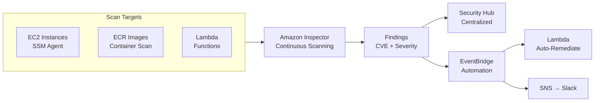

# Chapter 44 — Amazon Inspector

---

## Prerequisite Chapters
- Chapter 03 — Amazon EC2 (instance vulnerability scanning)
- Chapter 15 — Amazon ECR (container image scanning)
- Chapter 45 — AWS Security Hub (findings aggregation)

## Used In Production Practicals
- Practical 33 — Container CI/CD (scan images before deploy)
- Practical 15 — Flagship Production Architecture

---

## 1. Learning Objectives

By the end of this chapter, you will be able to:

1. **Explain** Inspector v2 and how it differs from traditional vulnerability scanning.
2. **Enable** Inspector for EC2 instances, ECR images, and Lambda functions.
3. **Understand** vulnerability findings, severity, and CVE references.
4. **Integrate** Inspector with Security Hub for centralized findings.
5. **Build** a CI/CD security pipeline with ECR image scanning.
6. **Troubleshoot** scanning failures and false positives.
7. **Answer** interview questions about vulnerability management.

---

## 2. What is Amazon Inspector?

Amazon Inspector is a **vulnerability management service** that automatically scans AWS workloads for software vulnerabilities and network exposure. Inspector v2 is agentless for ECR and uses SSM Agent for EC2.

### What Inspector Scans

| Target | What It Checks | How |
|--------|---------------|-----|
| **EC2 Instances** | OS packages, software vulnerabilities | SSM Agent (agentless optional) |
| **ECR Images** | Container image vulnerabilities | Scan on push + continuous |
| **Lambda Functions** | Code dependencies vulnerabilities | Automatic |

### Key Characteristics
- **Automatic** — enable once, scans continuously
- **Agentless for ECR** — no agent needed for container scans
- **CVE-based** — references NVD (National Vulnerability Database)
- **Risk scoring** — CVSS score + Inspector contextual scoring
- **Multi-account** — delegated admin in Organizations
- **Integrates** — Security Hub, EventBridge, S3 export

---

## 3. Core Concepts

### Finding Severity Levels
```
CRITICAL:  CVSS 9.0-10.0 — exploit available, remote code execution
HIGH:      CVSS 7.0-8.9  — serious vulnerability
MEDIUM:    CVSS 4.0-6.9  — moderate risk
LOW:       CVSS 0.1-3.9  — minimal risk
INFO:      Informational  — best practice recommendation
```

### Inspector Scoring vs CVSS
```
CVSS Score: Standard vulnerability severity (static)
Inspector Score: Adjusted for YOUR environment
  - Is the instance internet-facing? (higher risk)
  - Is the port open? (higher risk)
  - Is there an exploit available? (higher risk)

Inspector score may be HIGHER than CVSS if the vulnerability
is more exploitable in your specific configuration.
```

### Continuous vs One-Time Scanning
```
Inspector v2 = Continuous scanning:
  - EC2: re-scans when new CVE published or package changes
  - ECR: scans on push + re-scans when new CVE affects existing images
  - Lambda: scans on deploy + continuous re-assessment

No manual scan scheduling needed
```

---

## 4. Architecture



---

## 5-10. CLI Commands

### Enable Inspector
```bash
# Enable for all scan types
aws inspector2 enable --resource-types EC2 ECR LAMBDA

# Check status
aws inspector2 get-configuration

# List findings
aws inspector2 list-findings \
    --filter-criteria '{
        "severity": [{"comparison": "EQUALS", "value": "CRITICAL"}]
    }' \
    --query 'findings[*].{Title:title,Severity:severity,Resource:resources[0].id}'

# Get finding details
aws inspector2 get-findings-report-status --report-id $REPORT_ID
```

### EventBridge Rule for Critical Findings
```json
{
    "source": ["aws.inspector2"],
    "detail-type": ["Inspector2 Finding"],
    "detail": {
        "severity": ["CRITICAL"]
    }
}
// → Trigger Lambda → Create Jira ticket / Send Slack alert
```

---

## 11-18. Production & Security

### Production Inspector Configuration
```
Enable:
  - EC2 scanning (all instances with SSM Agent)
  - ECR scanning (scan on push + continuous)
  - Lambda scanning (all functions)

Alerts:
  - EventBridge rule for CRITICAL findings → SNS → PagerDuty
  - Weekly report of HIGH findings → email

Integration:
  - Security Hub (centralized findings)
  - S3 export (compliance reporting)
  - CI/CD gate: fail pipeline if CRITICAL CVE found in image

Suppression:
  - Suppress false positives with suppression rules
  - Document accepted risks
```

---

## 19. Troubleshooting

### Problem 1: EC2 Instance Not Scanned
```
Check:
  1. SSM Agent installed and running
  2. Instance has IAM role with AmazonSSMManagedInstanceCore
  3. Inspector enabled for EC2 in the account
  4. Instance is a supported OS
```

### Problem 2: ECR Image Shows "Scan Not Available"
```
Check:
  1. Inspector enabled for ECR
  2. Image pushed after Inspector was enabled
  3. Image OS supported (Amazon Linux, Ubuntu, Debian, Alpine)
```

---

## 22. Interview Questions

### Basic Questions (10)

**Q1: What is Amazon Inspector?**
A: A vulnerability management service that continuously scans EC2, ECR, and Lambda for software vulnerabilities and network exposure. Uses CVE database for detection.

**Q2: How does Inspector scan EC2 instances?**
A: Uses SSM Agent (pre-installed on Amazon Linux). Scans installed packages against CVE database. Continuous — re-scans when new CVE published.

**Q3: How does Inspector scan container images?**
A: Scans ECR images on push and continuously. Detects OS and language package vulnerabilities without any agent.

**Q4: What is the difference between Inspector score and CVSS?**
A: CVSS is a static severity score. Inspector adjusts it for your environment (internet-facing, open ports, exploit availability). Inspector score may be higher if risk is contextually greater.

**Q5: How does Inspector integrate with Security Hub?**
A: Findings automatically sent to Security Hub. Security Hub aggregates findings from Inspector, GuardDuty, Config, and other services in one dashboard.

**Q6-Q10**: *(Cover: Lambda scanning, finding suppression, multi-account with Organizations, ECR scan on push vs enhanced scanning, and compliance reporting.)*

### Intermediate-Advanced & Scenario Questions (30)

**Q11-Q40**: *(Cover: CI/CD integration, vulnerability remediation workflow, SBOM export, prioritization strategy, false positive management, automated patching response, and security posture improvement.)*

---

## 25. Production Checklist

- [ ] Inspector enabled for EC2, ECR, Lambda
- [ ] SSM Agent on all EC2 instances
- [ ] EventBridge alerts for CRITICAL findings
- [ ] Security Hub integration configured
- [ ] CI/CD gate for image vulnerability scanning
- [ ] Suppression rules for accepted risks
- [ ] Weekly findings review process
- [ ] Multi-account with delegated admin

---

## 26. Chapter Summary

1. **Enable and forget** — continuous scanning, no scheduling
2. **EC2 + ECR + Lambda** — covers all compute workloads
3. **Inspector score > CVSS** — contextual risk assessment
4. **Security Hub integration** — centralized findings
5. **CI/CD gate** — block deployment of vulnerable images
6. **EventBridge automation** — auto-alert/remediate critical CVEs
7. **Multi-account** — delegated admin in Organizations
8. **Suppress false positives** — reduce noise, document accepted risks

---
---

# 🔬 Practical Lab 49 — Inspector Vulnerability Assessment

## Lab Overview
| Item | Detail |
|------|--------|
| **Difficulty** | Beginner |
| **Duration** | 15 minutes |
| **Cost** | 15-day free trial |
| **Prerequisites** | EC2 instances, ECR images |
| **Lab Environment** | Environment 11 — Security Ops |

### Step 1 — Enable Inspector
1. **Inspector** → **Get Started** → Enable for EC2, ECR, Lambda

📸 **Screenshot 01** — Inspector Enabled

### Step 2 — View Findings
1. **Findings** → Filter by severity: CRITICAL

📸 **Screenshot 02** — Vulnerability Findings
> **What you should see**: CVE-based findings with severity, affected resource, fix recommendation

📸 **Screenshot 03** — ECR Image Scan Results
> **Verify**: Container images scanned with vulnerability counts

🎯 **Interview Insight**: "How do you handle vulnerabilities?"
> **Strong answer**: "Inspector for continuous scanning. CRITICAL = patch within 24 hours. HIGH = within 7 days. CI/CD pipeline gate: fail build on CRITICAL CVEs. Auto-patching with SSM Patch Manager. Regular AMI rebuilds with latest patches."
