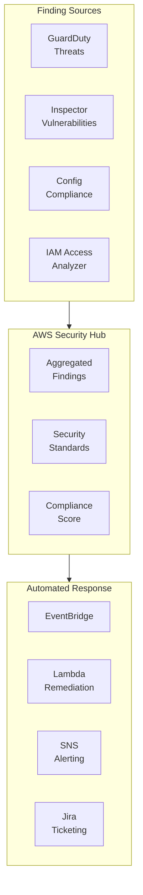

# Chapter 45 — AWS Security Hub

---

## Prerequisite Chapters
- Chapter 01 — AWS IAM (security policies)
- Chapter 43 — Amazon GuardDuty (threat detection findings)
- Chapter 44 — Amazon Inspector (vulnerability findings)
- Chapter 27 — AWS Config (compliance findings)

## Used In Production Practicals
- Practical 15 — Flagship Production Architecture (security posture)
- Practical 39 — Enterprise Multi-Account AWS

---

## 1. Learning Objectives

By the end of this chapter, you will be able to:

1. **Explain** Security Hub's role as the central security dashboard.
2. **Enable** Security Hub and configure security standards.
3. **Aggregate** findings from GuardDuty, Inspector, Config, and third-party tools.
4. **Automate** responses to security findings using EventBridge.
5. **Implement** multi-account security with Organizations.
6. **Troubleshoot** findings, compliance gaps, and integration issues.
7. **Answer** interview questions about security operations.

---

## 2. What is AWS Security Hub?

Security Hub provides a **centralized dashboard** for security findings across your AWS accounts. It aggregates findings from GuardDuty, Inspector, Config, Firewall Manager, and third-party tools into a single pane of glass.

### Key Characteristics
- **Centralized findings** — all security findings in one place
- **Security standards** — automated compliance checks (CIS, PCI DSS, AWS FSBP)
- **Cross-account** — aggregate findings from all accounts in Organization
- **Automated response** — EventBridge rules trigger remediation
- **ASFF format** — AWS Security Finding Format (standardized)

---

## 3. Core Concepts

### Finding Sources
```
AWS Services → Security Hub:
  - GuardDuty: Threat detection (malicious IPs, compromised credentials)
  - Inspector: Vulnerability management (CVEs, misconfigurations)
  - Config: Compliance rules (S3 public access, unencrypted resources)
  - Firewall Manager: WAF/SG compliance
  - IAM Access Analyzer: External access findings
  - Macie: S3 sensitive data exposure

Third-Party → Security Hub:
  - Palo Alto, CrowdStrike, Splunk, etc.
```

### Security Standards
```
AWS Foundational Security Best Practices (FSBP):
  - 200+ automated checks
  - IAM password policy, S3 encryption, RDS encryption
  - Most comprehensive AWS-specific standard

CIS AWS Foundations Benchmark:
  - 49 checks based on CIS benchmark
  - IAM, logging, networking, monitoring

PCI DSS:
  - Payment Card Industry compliance
  - 30+ automated checks
```

### Finding Severity
```
CRITICAL:  Immediate action required (public S3 bucket with sensitive data)
HIGH:      Urgent remediation needed (root account without MFA)
MEDIUM:    Should be addressed (security group with 0.0.0.0/0 SSH)
LOW:       Best practice improvement
INFORMATIONAL: For awareness
```

### Compliance Score
```
Security Hub calculates compliance score per standard:
  FSBP: 87% (174/200 checks passing)
  CIS:  92% (45/49 checks passing)

Overall security score: weighted average across all standards
```

---

## 4. Architecture



---

## 5-10. CLI Commands

### Enable Security Hub
```bash
# Enable with all standards
aws securityhub enable-security-hub \
    --enable-default-standards

# Enable specific standard
aws securityhub batch-enable-standards \
    --standards-subscription-requests '[{
        "StandardsArn": "arn:aws:securityhub:::ruleset/cis-aws-foundations-benchmark/v/1.4.0"
    }]'

# Get findings
aws securityhub get-findings \
    --filters '{
        "SeverityLabel": [{"Value": "CRITICAL", "Comparison": "EQUALS"}],
        "WorkflowStatus": [{"Value": "NEW", "Comparison": "EQUALS"}]
    }' \
    --query 'Findings[*].{Title:Title,Severity:Severity.Label,Resource:Resources[0].Id}'

# Get compliance status
aws securityhub get-enabled-standards

# Update finding workflow
aws securityhub batch-update-findings \
    --finding-identifiers '[{"Id": "FINDING_ID", "ProductArn": "PRODUCT_ARN"}]' \
    --workflow '{"Status": "RESOLVED"}'
```

### EventBridge Automation
```json
{
    "source": ["aws.securityhub"],
    "detail-type": ["Security Hub Findings - Imported"],
    "detail": {
        "findings": {
            "Severity": {"Label": ["CRITICAL"]},
            "Workflow": {"Status": ["NEW"]}
        }
    }
}
// → Lambda auto-remediates (e.g., disable public S3 access)
```

---

## 11-18. Production & Multi-Account

### Production Security Hub Configuration
```
Standards Enabled:
  - AWS Foundational Security Best Practices ✅
  - CIS AWS Foundations Benchmark ✅
  - PCI DSS (if processing payments) ✅

Integrations:
  - GuardDuty → Security Hub (automatic)
  - Inspector → Security Hub (automatic)
  - Config → Security Hub (automatic)
  - IAM Access Analyzer → Security Hub (automatic)

Automation:
  - CRITICAL findings → SNS → PagerDuty (immediate)
  - HIGH findings → Lambda → Jira ticket (next business day)
  - S3 public access → Lambda → block public access (auto-remediate)
  - SG with 0.0.0.0/0 SSH → Lambda → remove rule (auto-remediate)

Multi-Account:
  - Delegated admin in security account
  - All member accounts send findings
  - Cross-region aggregation
```

---

## 19. Troubleshooting

### Problem 1: Findings Not Appearing
```
Check:
  1. Security Hub enabled in the account/region
  2. Source service enabled (GuardDuty, Inspector, Config)
  3. Integration enabled in Security Hub settings
  4. Cross-account: member account linked
```

### Problem 2: Low Compliance Score
```
Investigation:
  1. View failed checks per standard
  2. Filter by severity (CRITICAL first)
  3. Common failures: unencrypted resources, public access, missing MFA
  4. Remediate programmatically (EventBridge + Lambda)
```

---

## 22. Interview Questions

### Basic Questions (10)

**Q1: What is AWS Security Hub?**
A: A centralized security dashboard that aggregates findings from GuardDuty, Inspector, Config, and third-party tools. Provides compliance scoring against security standards.

**Q2: What security standards does Security Hub check?**
A: AWS Foundational Security Best Practices (FSBP), CIS AWS Foundations Benchmark, PCI DSS. Each runs automated compliance checks against your resources.

**Q3: How does Security Hub differ from GuardDuty?**
A: GuardDuty: threat detection (detects active threats). Security Hub: findings aggregation (collects findings from multiple services including GuardDuty, provides compliance scoring).

**Q4: What is ASFF?**
A: AWS Security Finding Format — standardized JSON format for security findings. All services and third-party tools use this format when sending to Security Hub.

**Q5: How do you automate remediation?**
A: Security Hub → EventBridge rule (filter by severity/type) → Lambda (remediate) or SNS (alert). Example: auto-block public S3 buckets.

**Q6-Q10**: *(Cover: multi-account setup, compliance score, custom actions, cross-region aggregation, and finding workflow states.)*

### Intermediate-Advanced & Scenario Questions (30)

**Q11-Q40**: *(Cover: delegated admin, custom insights, third-party integrations, auto-remediation patterns, compliance reporting, finding suppression, and security operations workflow.)*

---

## 25. Production Checklist

- [ ] Security Hub enabled in all accounts and regions
- [ ] AWS FSBP and CIS standards enabled
- [ ] GuardDuty, Inspector, Config integrated
- [ ] EventBridge rules for CRITICAL findings
- [ ] Auto-remediation Lambda for common issues
- [ ] Delegated admin in security account
- [ ] Cross-region aggregation configured
- [ ] Weekly compliance review process
- [ ] Finding workflow (NEW → NOTIFIED → RESOLVED)

---

## 26. Chapter Summary

1. **Single pane of glass** — all security findings in one dashboard
2. **Compliance scoring** — FSBP, CIS, PCI DSS standards
3. **Aggregates from** — GuardDuty, Inspector, Config, third-party
4. **Auto-remediation** — EventBridge + Lambda for CRITICAL findings
5. **Multi-account** — delegated admin aggregates all accounts
6. **ASFF format** — standardized findings across all tools
7. **Compliance first** — focus on CRITICAL/HIGH findings
8. **Track progress** — compliance score improves over time

---
---

# 🔬 Practical Lab 50 — Security Hub Centralized Security

## Lab Overview
| Item | Detail |
|------|--------|
| **Difficulty** | Intermediate |
| **Duration** | 20 minutes |
| **Cost** | 30-day free trial |
| **Prerequisites** | Practical 48, 49 (GuardDuty, Inspector) |
| **Lab Environment** | Environment 11 — Security Ops |

### Step 1 — Enable Security Hub
1. **Security Hub** → **Go to Security Hub** → **Enable**
   - ✅ AWS Foundational Security Best Practices
   - ✅ CIS AWS Foundations Benchmark

📸 **Screenshot 01** — Security Hub Enabled with Standards

### Step 2 — View Compliance Score
1. **Security standards** → View compliance percentage

📸 **Screenshot 02** — Compliance Dashboard
> **What you should see**: Compliance score per standard (e.g., FSBP: 85%, CIS: 90%)

### Step 3 — View Aggregated Findings
1. **Findings** → See GuardDuty + Inspector + Config findings in one place

📸 **Screenshot 03** — Centralized Findings from Multiple Services
> **Verify**: Findings from different services aggregated in one dashboard

🎯 **Interview Insight**: "How do you manage security across multiple accounts?"
> **Strong answer**: "Security Hub as the central dashboard. GuardDuty for threat detection, Inspector for vulnerabilities, Config for compliance. All findings flow to Security Hub. EventBridge rules auto-remediate critical findings. Delegated admin in the security account aggregates all member accounts."
