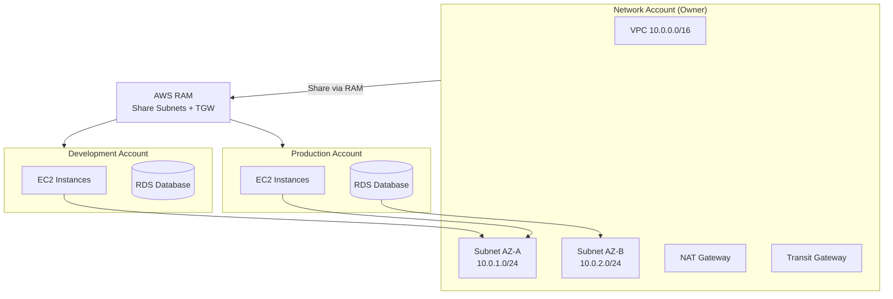

# Chapter 46 — AWS Resource Access Manager (RAM)

---

## Prerequisite Chapters
- Chapter 01 — AWS IAM (cross-account access)
- Chapter 04 — Amazon VPC (subnet sharing)
- Chapter 31 — AWS Organizations & Control Tower (multi-account)

## Used In Production Practicals
- Practical 39 — Enterprise Multi-Account AWS
- Practical 07 — Multi-AZ Network (shared subnets)

---

## 1. Learning Objectives

By the end of this chapter, you will be able to:

1. **Explain** RAM and why resource sharing matters in multi-account architectures.
2. **Share** VPC subnets, Transit Gateways, and other resources across accounts.
3. **Configure** sharing within AWS Organizations.
4. **Manage** permissions and ownership of shared resources.
5. **Troubleshoot** sharing failures and access issues.
6. **Answer** interview questions about multi-account resource sharing.

---

## 2. What is AWS Resource Access Manager?

RAM enables you to **share AWS resources** across accounts or within your Organization without creating duplicates. The most common use case is sharing VPC subnets.

### The Problem RAM Solves
```
Without RAM (duplicate resources):
  Account A: VPC-A, Subnets, NAT Gateway, Route Tables → Cost: $X
  Account B: VPC-B, Subnets, NAT Gateway, Route Tables → Cost: $X
  Account C: VPC-C, Subnets, NAT Gateway, Route Tables → Cost: $X
  
  3 NAT Gateways × $32/month = $96/month
  3 separate VPCs = complex peering/connectivity

With RAM (shared subnets):
  Network Account: VPC, Subnets, NAT Gateway, Route Tables → Cost: $X
  Account A: Launch EC2 in shared subnet → $0 extra network cost
  Account B: Launch RDS in shared subnet → $0 extra network cost
  Account C: Launch ECS in shared subnet → $0 extra network cost
  
  1 NAT Gateway = $32/month (shared)
  Centralized network management
```

---

## 3. Core Concepts

### Shareable Resources

| Resource | Owner Creates | Consumer Uses |
|----------|-------------|--------------|
| **VPC Subnets** | Network team creates VPC + subnets | Workload accounts launch EC2/RDS/ECS in shared subnet |
| **Transit Gateway** | Network team creates TGW | Workload accounts attach their VPCs |
| **Route 53 Resolver Rules** | DNS team creates rules | All accounts use centralized DNS |
| **License Manager** | Central team manages licenses | Workload accounts use shared licenses |
| **CodeBuild Projects** | DevOps team creates projects | Developer accounts run builds |

### Ownership Model
```
Owner Account (Network):
  - Creates and manages VPC, subnets, route tables, NAT, IGW
  - Controls network architecture
  - Shares subnets via RAM

Consumer Account (Workload):
  - Launches EC2, RDS, ECS in shared subnets
  - Creates own security groups
  - Manages own resources (instances, databases)
  - CANNOT modify subnet, route table, NACL (owner controls)

Result:
  Network team controls the network
  Workload teams control their applications
  Clean separation of responsibilities
```

### Sharing Within Organizations
```
If sharing within an Organization:
  - No invitation/acceptance needed (auto-approved)
  - Share with specific accounts or entire OU
  - Centralized control

If sharing outside Organization:
  - Invitation sent → consumer must accept
  - Manual process
```

---

## 4. Architecture



---

## 5-10. CLI Commands

### Share Subnets
```bash
# Create resource share
aws ram create-resource-share \
    --name "shared-network-subnets" \
    --resource-arns \
        arn:aws:ec2:ap-south-1:111111111111:subnet/subnet-priv-a \
        arn:aws:ec2:ap-south-1:111111111111:subnet/subnet-priv-b \
    --principals "arn:aws:organizations::111111111111:ou/o-abc/ou-xyz" \
    --allow-external-principals false

# List shares
aws ram get-resource-shares --resource-owner SELF

# List shared resources
aws ram list-resources --resource-owner SELF

# Accept invitation (if outside Organization)
aws ram accept-resource-share-invitation --resource-share-invitation-arn $INVITATION_ARN
```

### Consumer Account: Launch in Shared Subnet
```bash
# Consumer sees shared subnets in their account
aws ec2 describe-subnets --query 'Subnets[?OwnerId!=`CONSUMER_ACCOUNT_ID`]'

# Launch EC2 in shared subnet
aws ec2 run-instances \
    --image-id ami-abc123 \
    --instance-type t3.medium \
    --subnet-id subnet-shared-priv-a \
    --security-group-ids sg-consumer-app
```

---

## 11-18. Production & Multi-Account

### Production RAM Architecture
```
Network Account:
  - Owns VPC, subnets, NAT Gateways, Transit Gateway
  - Shares subnets via RAM to workload OUs
  - Centralizes network management and cost

Workload Accounts:
  - Launch resources in shared subnets
  - Own their security groups (can't modify NACL)
  - Independent resource management

Benefits:
  - Centralized IP address management (no CIDR conflicts)
  - Single NAT Gateway per AZ (shared cost)
  - Consistent network policies (route tables, NACLs)
  - Reduced VPC peering complexity
```

---

## 19. Troubleshooting

### Problem 1: Shared Subnet Not Visible in Consumer Account
```
Check:
  1. Resource share is active (not pending)
  2. Consumer account is in the correct OU/accepted invitation
  3. RAM sharing enabled in Organizations settings
  4. Correct region (RAM is regional)
```

### Problem 2: Can't Launch Instance in Shared Subnet
```
Check:
  1. Subnet has available IP addresses
  2. Consumer created their own security group in the shared VPC
  3. IAM permissions allow ec2:RunInstances in the subnet
```

---

## 22. Interview Questions

### Basic Questions (10)

**Q1: What is AWS RAM?**
A: Resource Access Manager enables sharing AWS resources across accounts without duplicating them. Most commonly used for sharing VPC subnets and Transit Gateways.

**Q2: Why share VPC subnets?**
A: Centralized network management, single NAT Gateway (cost savings), consistent policies, no VPC peering needed. Network team controls network, workload teams control applications.

**Q3: What is the ownership model?**
A: Owner creates and manages the resource (subnet, TGW). Consumer uses it (launches EC2, RDS). Consumer can't modify the shared resource (route tables, NACLs stay with owner).

**Q4: How does RAM work with Organizations?**
A: Sharing within Organizations is auto-approved (no invitation). Share with specific accounts or entire OUs. Enable RAM sharing in Organizations settings.

**Q5: What resources can be shared?**
A: VPC subnets, Transit Gateways, Route 53 Resolver rules, License Manager configurations, CodeBuild projects, and more.

**Q6-Q10**: *(Cover: cross-region sharing, security groups in shared VPCs, cost implications, invitation process, and removing shares.)*

### Intermediate-Advanced & Scenario Questions (30)

**Q11-Q40**: *(Cover: shared VPC architecture design, Transit Gateway sharing, IP address management, network segmentation with shared subnets, compliance considerations, and migration to shared VPC model.)*

---

## 25. Production Checklist

- [ ] Network account owns all VPCs and subnets
- [ ] Subnets shared via RAM to workload OUs
- [ ] Transit Gateway shared for inter-VPC connectivity
- [ ] Organizations RAM sharing enabled
- [ ] Consumer accounts creating own security groups
- [ ] IP address management centralized
- [ ] Network policies (NACLs, route tables) managed by network team

---

## 26. Chapter Summary

1. **Share, don't duplicate** — one VPC, many accounts
2. **VPC subnet sharing** — most common RAM use case
3. **Owner controls network** — route tables, NACLs, NAT Gateways
4. **Consumer controls workloads** — EC2, RDS, security groups
5. **Cost savings** — shared NAT Gateways, no VPC peering
6. **Organizations integration** — auto-approved sharing
7. **Centralized IP management** — no CIDR conflicts
8. **Transit Gateway sharing** — hub-and-spoke for all accounts

---
---

# 🔬 Practical Lab 54 — RAM Multi-Account Resource Sharing

## Lab Overview
| Item | Detail |
|------|--------|
| **Difficulty** | Intermediate |
| **Duration** | 20 minutes |
| **Cost** | Free |
| **Prerequisites** | Practical 04 (Organizations), Practical 06 (VPC) |
| **Lab Environment** | Environment 12 — Advanced |

### Step 1 — Share VPC Subnets via RAM
1. **RAM** → **Create resource share**
   - **Name**: `shared-network-subnets`
   - **Resources**: Private subnets from prod-vpc
   - **Principals**: Organization OU

📸 **Screenshot 01** — Resource Share Created

### Step 2 — Use Shared Subnet from Consumer Account
1. Switch to consumer account → Verify shared subnets visible
2. Launch EC2 in the shared subnet

📸 **Screenshot 02** — EC2 Running in Shared Subnet
> **Verify**: Instance running in subnet owned by network account

🎯 **Interview Insight**: "Why share VPC subnets?"
> **Strong answer**: "Centralized network management: network team controls VPC/subnets/NAT/routes, workload teams deploy into shared subnets. One NAT Gateway shared = cost savings. No VPC peering needed. Consistent network policies across accounts."
