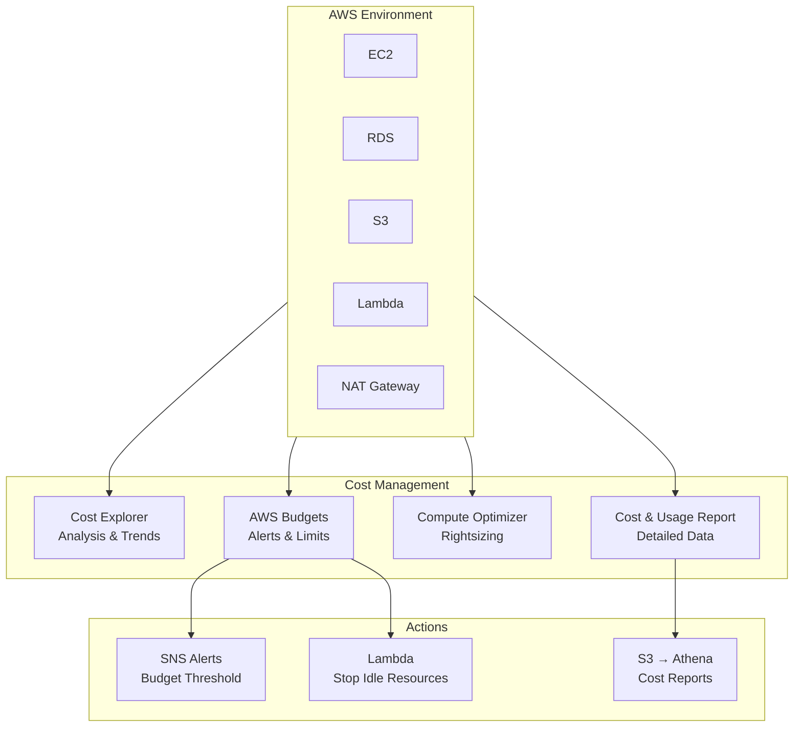

# Chapter 47 — AWS Cost Explorer & AWS Budgets

---

## Prerequisite Chapters
- Chapter 01 — AWS IAM (billing access policies)
- Chapter 31 — AWS Organizations & Control Tower (consolidated billing)

## Used In Production Practicals
- Practical 15 — Flagship Production Architecture (cost awareness)
- Practical 39 — Enterprise Multi-Account AWS (FinOps)

---

## 1. Learning Objectives

By the end of this chapter, you will be able to:

1. **Explain** AWS cost management tools and why FinOps matters.
2. **Use** Cost Explorer to analyze spending by service, account, and tags.
3. **Create** AWS Budgets with alerts for cost and usage thresholds.
4. **Implement** cost allocation tags for tracking spending by team/project.
5. **Identify** cost optimization opportunities (unused resources, rightsizing).
6. **Design** a FinOps practice for a production AWS environment.
7. **Troubleshoot** unexpected cost spikes and billing anomalies.
8. **Answer** interview questions about AWS cost management.

---

## 2. What is AWS Cost Explorer & AWS Budgets?

### AWS Cost Explorer
A visualization tool that lets you explore and analyze your AWS spending. Filter by service, account, region, tag, or time period. Identify trends, anomalies, and optimization opportunities.

### AWS Budgets
A monitoring tool that lets you set spending or usage thresholds and receive alerts when you approach or exceed them. Supports cost, usage, reservation, and savings plan budgets.

### The FinOps Framework
```
FinOps = Financial Operations for Cloud
         
Inform → Optimize → Operate
  ↓         ↓          ↓
Cost      Right-size   Governance
Explorer  Resources    Budgets
  ↓         ↓          ↓
Who's      Are we      Are we
spending?  wasting?    on track?
```

---

## 3. Why Do We Need It?

### The Cloud Cost Problem
```
Traditional IT:
  Fixed budget → purchase servers → 3-year lifecycle → predictable costs

Cloud (AWS):
  Pay-as-you-go → anyone can launch anything → costs are unpredictable
  
  Common surprises:
  - Developer left 20 large EC2 instances running over the weekend: $500
  - NAT Gateway data processing: $1,200/month (unexpected)
  - S3 lifecycle not configured: $800/month in storage
  - RDS Multi-AZ in dev environment: $400/month (unnecessary)
  - Forgotten EBS snapshots: $200/month
```

### Without Cost Management vs With

| Scenario | Without | With |
|----------|---------|------|
| Monthly bill | Surprise at month-end | Daily visibility |
| Cost allocation | "AWS costs $50K" | "Team A: $20K, Team B: $15K, Team C: $15K" |
| Optimization | Unknown waste | "12 idle instances = $2,400/month savings" |
| Budget control | Over-budget discovery at month-end | Alert at 80% threshold |
| Accountability | No ownership | Tagged resources tied to teams |

---

## 4. Real-World Production Use Cases

### 1. Monthly Cost Review
Engineering manager opens Cost Explorer: "EC2 costs increased 40% this month. Drill down: Team Alpha scaled up for a load test but didn't scale down. Action: terminate idle instances, save $3,000."

### 2. Budget Alerts
Budget set at $10,000/month for development account. At $8,000 (80%), SNS alert sent to the team: "Approaching budget. Review and optimize." At $10,000, automated action stops non-essential resources.

### 3. Chargeback/Showback
Finance needs to allocate cloud costs to business units. Cost allocation tags: `CostCenter=Engineering`, `CostCenter=Marketing`. Cost Explorer filters by tag to show each unit's spending.

### 4. Savings Plan Recommendations
Cost Explorer analyzes 30 days of EC2 usage and recommends: "Purchase a 1-year Compute Savings Plan ($0.05/hr) to save 35% on your $15,000/month EC2 bill."

---

## 5. Core Concepts

### Cost Allocation Tags

| Tag Key | Values | Purpose |
|---------|--------|---------|
| `Environment` | production, staging, development | Cost by environment |
| `CostCenter` | engineering, marketing, finance | Chargeback to business units |
| `Project` | project-alpha, project-beta | Cost by project |
| `Owner` | john@company.com | Accountability |
| `Team` | platform, backend, frontend | Cost by team |

### Tag Activation
Tags must be activated in the Billing Console to appear in Cost Explorer:
```bash
# AWS CLI - activate cost allocation tags
aws ce update-cost-allocation-tags-status \
    --cost-allocation-tags-status '[
        {"TagKey": "Environment", "Status": "Active"},
        {"TagKey": "CostCenter", "Status": "Active"},
        {"TagKey": "Project", "Status": "Active"}
    ]'
```

### Budget Types

| Type | Tracks | Example |
|------|--------|---------|
| **Cost Budget** | Dollar spending | "Alert if monthly cost > $10,000" |
| **Usage Budget** | Resource consumption | "Alert if EC2 hours > 5,000" |
| **Reservation Budget** | RI utilization | "Alert if RI utilization < 80%" |
| **Savings Plan Budget** | SP utilization/coverage | "Alert if SP coverage < 70%" |

### Cost Explorer Dimensions

| Dimension | Example |
|-----------|---------|
| Service | EC2, RDS, S3, Lambda |
| Account | Production (123...), Dev (456...) |
| Region | ap-south-1, us-east-1 |
| Instance Type | t3.medium, m5.large |
| Tag | Environment=production |
| Usage Type | DataTransfer-Out-Bytes |
| Purchase Option | On-Demand, Reserved, Spot |

---

## 6. Architecture

### FinOps Architecture



---

## 7-8. Components & How It Works

### Cost Explorer Query Examples

```bash
# Get monthly costs by service (last 3 months)
aws ce get-cost-and-usage \
    --time-period Start=2026-07-01,End=2026-10-01 \
    --granularity MONTHLY \
    --metrics BlendedCost \
    --group-by Type=DIMENSION,Key=SERVICE

# Get daily EC2 costs
aws ce get-cost-and-usage \
    --time-period Start=2026-09-01,End=2026-09-18 \
    --granularity DAILY \
    --metrics UnblendedCost \
    --filter '{
        "Dimensions": {
            "Key": "SERVICE",
            "Values": ["Amazon Elastic Compute Cloud - Compute"]
        }
    }'

# Get costs by tag (CostCenter)
aws ce get-cost-and-usage \
    --time-period Start=2026-09-01,End=2026-10-01 \
    --granularity MONTHLY \
    --metrics BlendedCost \
    --group-by Type=TAG,Key=CostCenter

# Get rightsizing recommendations
aws ce get-rightsizing-recommendation \
    --service AmazonEC2 \
    --configuration '{
        "RecommendationTarget": "SAME_INSTANCE_FAMILY",
        "BenefitsConsidered": true
    }'
```

---

## 9. AWS Console Walkthrough

### Step 1 — Explore Costs in Cost Explorer
1. Navigate to **Billing Console** → **Cost Explorer**
2. View monthly spending trend
3. Group by **Service** to see which services cost the most
4. Filter by **Account** for multi-account breakdown
5. Filter by **Tag** for team/project attribution

### Step 2 — Create a Budget
1. Navigate to **Billing Console** → **Budgets** → **Create budget**
2. Select **Cost budget**
3. Configure:
   - **Name**: `monthly-production-budget`
   - **Budget amount**: $10,000
   - **Period**: Monthly
4. Add **Alert thresholds**:
   - 80% threshold → notify `ops-team@company.com`
   - 100% threshold → notify `ops-team@company.com` + trigger Lambda
5. Click **Create budget**

---

## 10. AWS CLI Commands

### Create a Cost Budget with Alerts
```bash
aws budgets create-budget \
    --account-id $ACCOUNT_ID \
    --budget '{
        "BudgetName": "monthly-total",
        "BudgetLimit": {"Amount": "10000", "Unit": "USD"},
        "BudgetType": "COST",
        "TimeUnit": "MONTHLY",
        "CostFilters": {},
        "CostTypes": {
            "IncludeTax": true,
            "IncludeSubscription": true,
            "UseBlended": false
        }
    }' \
    --notifications-with-subscribers '[
        {
            "Notification": {
                "NotificationType": "ACTUAL",
                "ComparisonOperator": "GREATER_THAN",
                "Threshold": 80,
                "ThresholdType": "PERCENTAGE"
            },
            "Subscribers": [
                {"SubscriptionType": "EMAIL", "Address": "ops@company.com"}
            ]
        },
        {
            "Notification": {
                "NotificationType": "FORECASTED",
                "ComparisonOperator": "GREATER_THAN",
                "Threshold": 100,
                "ThresholdType": "PERCENTAGE"
            },
            "Subscribers": [
                {"SubscriptionType": "EMAIL", "Address": "finance@company.com"}
            ]
        }
    ]'
```

### Get Cost Forecast
```bash
aws ce get-cost-forecast \
    --time-period Start=2026-09-18,End=2026-10-01 \
    --metric UNBLENDED_COST \
    --granularity MONTHLY
```

### List Budgets
```bash
aws budgets describe-budgets --account-id $ACCOUNT_ID \
    --query 'Budgets[*].{Name:BudgetName,Limit:BudgetLimit.Amount,Spent:CalculatedSpend.ActualSpend.Amount}'
```

---

## 11. Hands-On Practical

### Practical: Set Up Cost Monitoring for Production

#### Objective
Create budgets, cost allocation tags, and alerts for a production AWS environment.

#### Step 1 — Tag All Resources
```bash
# Tag EC2 instances
aws ec2 create-tags --resources i-abc123 \
    --tags Key=Environment,Value=production Key=CostCenter,Value=engineering Key=Project,Value=web-app

# Tag RDS instances
aws rds add-tags-to-resource \
    --resource-name arn:aws:rds:ap-south-1:123:db:prod-db \
    --tags Key=Environment,Value=production Key=CostCenter,Value=engineering
```

#### Step 2 — Activate Cost Allocation Tags
```bash
aws ce update-cost-allocation-tags-status \
    --cost-allocation-tags-status '[
        {"TagKey": "Environment", "Status": "Active"},
        {"TagKey": "CostCenter", "Status": "Active"},
        {"TagKey": "Project", "Status": "Active"}
    ]'
```

#### Step 3 — Create Budgets
```bash
# Overall monthly budget
aws budgets create-budget --account-id $ACCOUNT_ID \
    --budget '{"BudgetName":"total-monthly","BudgetLimit":{"Amount":"15000","Unit":"USD"},"BudgetType":"COST","TimeUnit":"MONTHLY"}' \
    --notifications-with-subscribers '[{"Notification":{"NotificationType":"ACTUAL","ComparisonOperator":"GREATER_THAN","Threshold":80},"Subscribers":[{"SubscriptionType":"EMAIL","Address":"ops@company.com"}]}]'

# Per-service budget for EC2
aws budgets create-budget --account-id $ACCOUNT_ID \
    --budget '{"BudgetName":"ec2-monthly","BudgetLimit":{"Amount":"8000","Unit":"USD"},"BudgetType":"COST","TimeUnit":"MONTHLY","CostFilters":{"Service":["Amazon Elastic Compute Cloud - Compute"]}}' \
    --notifications-with-subscribers '[{"Notification":{"NotificationType":"ACTUAL","ComparisonOperator":"GREATER_THAN","Threshold":90},"Subscribers":[{"SubscriptionType":"EMAIL","Address":"ops@company.com"}]}]'
```

#### Validation
- Check Budget dashboard shows created budgets
- Cost Explorer shows tagged resources in cost breakdown
- Test alert by temporarily lowering threshold

---

## 12. Production Architecture

### Top Cost Optimization Strategies

| Strategy | Savings | Effort | Example |
|----------|---------|--------|---------|
| **Rightsizing** | 20-40% | Low | m5.xlarge → m5.large |
| **Savings Plans** | 30-40% | Medium | 1-year Compute SP |
| **Spot Instances** | 60-90% | Medium | Non-critical batch jobs |
| **Scheduled scaling** | 40-60% | Low | Scale down nights/weekends |
| **Storage lifecycle** | 50-80% | Low | S3 IA after 30 days |
| **Delete unused** | Varies | Low | Unused EBS, EIPs, snapshots |
| **NAT Gateway** | 30-50% | Medium | VPC endpoints for S3/DynamoDB |

### Common Cost Surprises

| Service | Surprise | Prevention |
|---------|----------|------------|
| NAT Gateway | Data processing charges ($0.045/GB) | Use VPC endpoints for AWS services |
| EBS Snapshots | Accumulate over time | Lifecycle policies, delete old snapshots |
| CloudWatch Logs | High volume logging | Set retention policies, filter logs |
| Data Transfer | Inter-AZ, inter-region transfer | Architecture review, stay in one AZ for dev |
| Elastic IPs | Charged when NOT attached | Release unused EIPs |
| RDS Multi-AZ in dev | Double the cost | Single-AZ for non-production |
| S3 | No lifecycle policy | Transition to IA/Glacier, delete old objects |

---

## 13-21. Sections

### Key Troubleshooting

**Problem: Unexpected $2,000 charge from "EC2-Other"**
```
EC2-Other includes:
  - EBS volumes (attached and unattached)
  - EBS snapshots
  - Elastic IPs
  - NAT Gateway
  - Data transfer

Investigation:
  1. Cost Explorer → Filter: Service = "EC2-Other" → Group by Usage Type
  2. Common culprit: NAT Gateway data processing
  3. Common culprit: Orphaned EBS volumes/snapshots
  
Fix:
  - Use VPC endpoints for S3/DynamoDB (avoid NAT Gateway)
  - Delete orphaned EBS volumes
  - Clean up old EBS snapshots
```

---

## 22. Interview Questions

### Basic Questions (10)

**Q1: What is AWS Cost Explorer?**
A: A visualization tool to analyze AWS spending by service, account, region, tag, and time period. Helps identify trends, anomalies, and optimization opportunities.

**Q2: What is AWS Budgets?**
A: A tool to set spending thresholds and receive alerts when approaching or exceeding them. Supports cost, usage, reservation, and savings plan budgets.

**Q3: What are cost allocation tags?**
A: Tags applied to AWS resources that, when activated in Billing, allow you to filter and group costs in Cost Explorer. Examples: Environment, CostCenter, Project, Owner.

**Q4: What's the difference between blended and unblended costs?**
A: Unblended = actual cost per usage. Blended = average cost across an Organization (RI/SP benefits distributed). Use unblended for account-level accuracy, blended for organizational view.

**Q5: How do you set up budget alerts?**
A: Create a budget in AWS Budgets, set the amount, add notification thresholds (e.g., 80%, 100%), and specify subscribers (email, SNS). Can also trigger Lambda for auto-remediation.

**Q6: What is a Savings Plan?**
A: A commitment to a consistent amount of compute usage ($/hour) for 1 or 3 years. In exchange, you receive up to 72% discount. Types: Compute (flexible), EC2 Instance (specific), SageMaker.

**Q7: What is rightsizing?**
A: Analyzing EC2 instance utilization and recommending smaller or different instance types that match actual usage. A t3.large running at 10% CPU should be a t3.small.

**Q8: What tools does AWS provide for cost optimization?**
A: Cost Explorer (analysis), Budgets (alerts), Compute Optimizer (rightsizing), Trusted Advisor (waste detection), Savings Plans (discounts), Cost & Usage Report (detailed data).

**Q9: How do you find unused resources?**
A: Trusted Advisor checks for idle EC2, unused EBS, unattached EIPs. Cost Explorer identifies services with spending but no associated workloads. AWS Compute Optimizer recommends downsizing.

**Q10: What is the Cost & Usage Report (CUR)?**
A: The most detailed cost dataset. Delivered to S3 as CSV/Parquet files. Includes every line item across all services. Query with Athena for custom cost analysis.

### Intermediate & Advanced Questions (20 more across difficulty levels covering RI strategies, Spot optimization, tagging governance, FinOps practices, chargeback models, multi-account cost allocation, anomaly detection, cost-aware architecture decisions, and interview scenarios)

---

## 25. Production Checklist

- [ ] Cost allocation tags defined and documented
- [ ] All resources tagged (enforce via AWS Config rule `required-tags`)
- [ ] Tags activated in Billing Console
- [ ] Monthly cost budget created with 80% and 100% alerts
- [ ] Per-service budgets for top 3 services
- [ ] Per-account budgets for each workload account
- [ ] Cost anomaly detection enabled
- [ ] Rightsizing recommendations reviewed monthly
- [ ] Savings Plans evaluated for stable workloads
- [ ] Unused resources audit quarterly
- [ ] NAT Gateway costs reviewed (VPC endpoints where possible)
- [ ] S3 lifecycle policies on all buckets
- [ ] EBS snapshot cleanup policy
- [ ] Cost & Usage Report exported to S3 + Athena
- [ ] Monthly FinOps review meeting scheduled

---

## 26. Chapter Summary

Cost management is not optional in production — it's a core operational practice. Key takeaways:

1. **Tag everything** — you can't optimize what you can't measure
2. **Set budgets with alerts** — know before you overspend, not after
3. **Cost Explorer daily** — make it a habit to check spending trends
4. **Rightsizing first** — often the biggest quick win (20-40% savings)
5. **Savings Plans for stable workloads** — 30-40% savings with commitment
6. **NAT Gateway is expensive** — use VPC endpoints for AWS service traffic
7. **Delete unused resources** — orphaned EBS, EIPs, snapshots add up
8. **S3 lifecycle policies** — don't pay full price for rarely accessed data
9. **FinOps is a practice, not a project** — ongoing optimization, not one-time
10. **Cost of not managing costs >> cost of FinOps** — unmanaged cloud bills grow 30% annually

The goal is not to spend less — it's to get more value from every dollar spent.

---
---

# 🔬 Practical Lab 55 — Cost Monitoring & Budgets

## Lab Overview
| Item | Detail |
|------|--------|
| **Difficulty** | Beginner |
| **Duration** | 20 minutes |
| **Cost** | Free |
| **Prerequisites** | AWS account with some usage |
| **Lab Environment** | Environment 12 — Advanced |

### Step 1 — Explore Cost Explorer
1. **Billing** → **Cost Explorer** → Enable
2. View: Monthly costs by service

📸 **Screenshot 01** — Cost Explorer Dashboard
> **What you should see**: Bar chart showing costs by service (EC2, RDS, S3, etc.)

### Step 2 — Create Budget
1. **Budgets** → **Create budget**
   - **Type**: Monthly cost budget
   - **Amount**: $50
   - **Alert**: 80% threshold → email notification

📸 **Screenshot 02** — Budget Created
> **Verify**: Alert threshold set at $40 (80% of $50)

### Step 3 — Add Cost Allocation Tags
1. **Billing** → **Cost allocation tags** → Activate tags (Environment, Team, Project)

📸 **Screenshot 03** — Cost Allocation Tags Active
> **Verify**: Can filter costs by Environment=production, Team=devops

🎯 **Interview Insight**: "How do you optimize AWS costs?"
> **Strong answer**: "Cost Explorer for visibility. Budgets with alerts. Right-sizing EC2 (Compute Optimizer). Reserved Instances/Savings Plans for steady workloads. Spot for fault-tolerant. S3 lifecycle rules. NAT Gateway optimization with VPC endpoints. Tagging for accountability."
